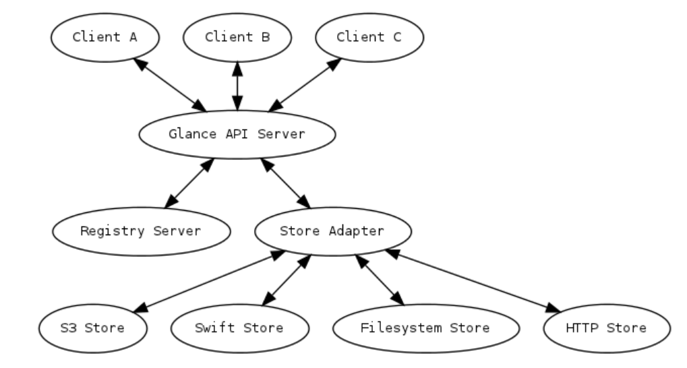
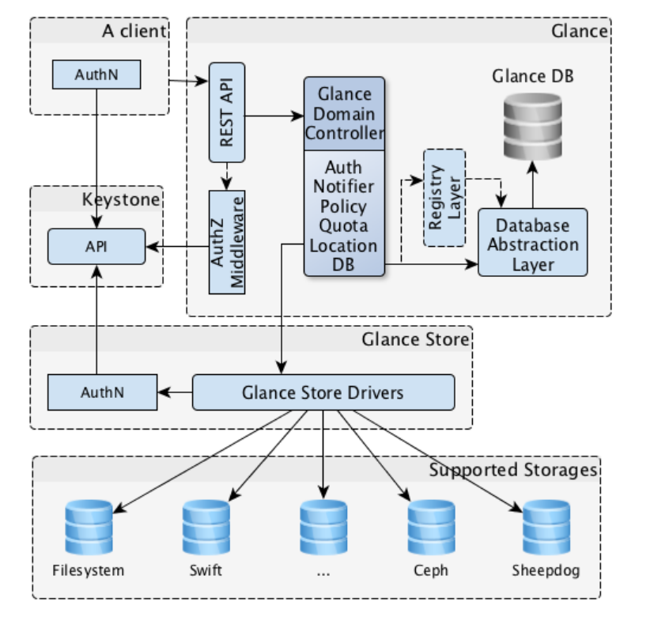

# Overview of OpenStack Image Service - Glance
## 1. Khái niệm
**Glance** là dịch vụ quản lý các hình ảnh (images) của máy ảo trong hệ sinh thái OpenStack. 

Openstack Image service là dịch vụ trung tâm trong kiến trúc IaaS. Hiểu đơn giản thì nó là trung tâm quản lý các image.

Nó chấp nhận các API request cho disk hoặc server image và metadata từ phía người dùng hoặc từ Compute service. Nó cũng hỗ trợ lưu trữ disk hoặc server image trên rất nhiều loại repository, bao gồm cả OPS Object Storage - Swift

Glance giống như một "thư viện" khổng lồ: nó không trực tiếp chạy máy ảo, nhưng nó lưu trữ, đăng ký và cung cấp các "bản thiết kế" (Disk Images) để các dịch vụ khác như Nova (Compute) có thể lấy ra và tạo nên các máy ảo (Instances).

Glance được thiết kế để trở thành dịch vụ độc lập, đáp ứng các vấn đề quản lý số lượng virtual disk images lớn, đáp ứng như cầu dịch vụ cloud.

**Vai trò chính**:
- Cho phép người dùng khám phá, đăng ký và lấy lại các disk images.
- Quản lý siêu dữ liệu (metadata) liên quan đến hình ảnh (như hệ điều hành, dung lượng, định dạng).
- Cung cấp các bản sao lưu (snapshots) của các máy ảo đang chạy để lưu trữ hoặc nhân bản.

## 2. Kiến trúc của Glance
Kiến trúc của Glance được thiết kế theo dạng client-server, cung cấp một REST API để người dùng hoặc các dịch vụ OpenStack khác thực hiện các yêu cầu.

**Các thành phần chính**:
- **Glance-api**: tiếp nhận lời gọi API để tìm kiếm, thu thập và lưu trữ image. Xác thực người dùng thông qua Keystone, kiểm tra tính hợp lệ của yêu cầu và điều phối các thao tác lưu trữ/truy xuất.
- **Glance-registry**: glance-registry service đã bị loại bỏ hoàn toàn (deprecated từ lâu, từ khoảng Queens/Pike và không còn tồn tại ở các phiên bản mới).
- **Database**: Cơ sở dữ liệu lưu trữ metadata của image như:
  - ID của image: Một chuỗi ký tự duy nhất.
  - Tên image: Ví dụ: "Ubuntu-22.04".
  - Định dạng: qcow2, raw, vhd...
  - Trạng thái: active, saving, queued...
  - Checksum: Mã băm để kiểm tra tính toàn vẹn của file.
  - Đường dẫn (Location): Đây là thông tin quan trọng nhất, nó lưu "địa chỉ" hoặc "con trỏ" trỏ tới nơi lưu file thực tế trong Backend.
- **Storage Repository (Backend)**: Đây mới là nơi lưu trữ các file nhị phân (binary files) khổng lồ của máy ảo (có thể từ vài trăm MB đến hàng chục GB). Nó hỗ trợ nhiều loại backend khác nhau để chứa file image thực tế như:
  - **File System**: Nó có thể là một thư mục trên ổ cứng (File System), một cụm lưu trữ phân tán (Ceph), hoặc Object Storage (Swift, S3).
  - Backend này không hề biết về các thông tin như "tên máy ảo là gì" hay "ai là chủ sở hữu", nó chỉ đơn thuần lưu trữ các khối dữ liệu.
  - **Ceph RBD**: Hệ thống lưu trữ do OpenStack Cinder cung cấp, lưu trữ các image dưới dạng khối.
  - **HTTP**: OpenStack Image Service có thể đọc các vitual machine service có sẵn trên internet sử dụng giao thức HTTP. Lưu trữ này chỉ có thể đọc.
  - **S3**: Amazon Simple Storage Service
- **Metadata definition service**: API cho nhà cung cấp, admin, service, user định nghĩa custom metadata.

Có 3 lý do chính để OpenStack tách rời hai phần này:
- Hiệu năng và Quy mô: Database (SQL) được tối ưu để tìm kiếm thông tin nhanh chóng. Nếu bạn nhét hàng Terabyte dữ liệu ảnh máy ảo vào Database, nó sẽ trở nên cực kỳ chậm chạp và dễ bị hỏng (corrupt).
- Tính linh hoạt: Việc tách rời cho phép Glance hỗ trợ nhiều loại Backend khác nhau. Bạn có thể lưu Metadata trong MariaDB, nhưng file ảnh thì lưu ở Amazon S3 hoặc Ceph tùy vào hạ tầng bạn có.
- Quản lý trạng thái: Khi bạn thực hiện lệnh `openstack image list`, Glance chỉ cần truy vấn Database (rất nhẹ) để trả về kết quả ngay lập tức, thay vì phải đi quét toàn bộ kho lưu trữ Backend (rất nặng).

## 3. Kiến trúc của Glance

- Glance có kiến trúc client-server cung cấp REST API cho user để thông qua đó gửi yêu cầu tới server.
- Glance Domain Controller quản lí các hoạt động bên trong. Các hoạt động được chia ra thành các tầng khác nhau. Mỗi tầng thực hiện một chức năng riêng biệt.
- Glane store là lớp giao tiếp giữa glane và storage backend ở ngoài glane hoặc local filesystem và nó cung cấp giao diện thống nhất để truy cập. Glance sử dụng SQL central Database để truy cập cho tất cả các thành phần trong hệ thống.
- Glance bao gồm một số thành phần sau:
  - Client: Bất kỳ ứng dụng nào sử dụng Glance server đều được gọi là client
  - REST API: dùng để gọi đến các chức năng của Glance thông qua REST.
  - Database Abstraction Layer(DAL): Một API để thống nhất giao tiếp giữa Glance và database
  - Glance Domain Controller: là middleware thực hiện các chức năng chính của Glance là: authorization, notificatiosn, policies, database connections.
  - Glance Store: Giao diện tích hợp giữa Glance và các data store.
  - Registry Layer: Layer không bắt buộc để tổ chức giao tiếp mang tính bảo mật giữa domain và DAL nhờ việc sử dụng một dịch vụ riêng biệt.

### 3.1 Workflow
- **Nova** (dịch vụ tính toán) gửi yêu cầu đến **Glance-api** để mượn một bản sao của Image cụ thể.
- **Glance-api** kiểm tra quyền hạn của người dùng qua Keystone.
- **Glance** truy vấn **Database** để biết image đó đang nằm ở đâu trong Backend lưu trữ.
- **Glance** lấy dữ liệu từ Backend và đẩy về cho Nova.
- Nova sử dụng dữ liệu đó để khởi chạy máy ảo trên các Compute Node.

## 4. Định dạng Image và Trạng thái (Lifecycle)

**Các định dạng đĩa (Disk Formats) phổ biến:**

Glance cực kỳ linh hoạt, nó hỗ trợ hầu hết các định dạng ảo hóa hiện nay:
- `Raw`: Định dạng thô, hiệu năng cao nhưng chiếm nhiều dung lượng.
- `QCOW2`: (QEMU Copy On Write) Hỗ trợ nén, snapshot, rất phổ biến trong KVM.
- `VHD/VHDX`: Định dạng của Microsoft Hyper-V.
- `VMDK`: Định dạng của VMware.
- `ISO`: Định dạng dành cho đĩa quang (cài đặt OS).

**Các trạng thái của Image**

Trong quá trình từ khi upload đến khi sẵn sàng, Image sẽ trải qua các trạng thái:
- **Queued**: Image đã được đăng ký nhưng dữ liệu chưa được tải lên
- **Saving**: Dữ liệu đang trong quá trình upload
- **Active**: Image đã sẵn sàng hoàn toàn để sử dụng
- **Killed**: Có lỗi xảy ra trong quá trình upload, image không thể dùng được.
- **Deleted**: Image đã bị đánh dấu xóa.

**Glance** cần thiết bởi:
- **Tính nhất quán**: Đảm bảo mọi máy ảo khởi tạo từ cùng một Image sẽ có cấu hình phần mềm giống hệt nhau.
- **Tốc độ**: Nhờ cơ chế caching và tích hợp sâu với Ceph (Copy-on-Write), việc khởi tạo máy ảo từ Glance diễn ra gần như tức thì.
- **Bảo mật**: Cho phép phân quyền ai có thể xem hoặc sử dụng các Image (Public, Private, Shared).

**Container Format**

Container Format mô tả cách đóng gói (wrapper) của image. Glance hỗ trợ các container format sau:

| Container Format | Mô tả |
|------------------|-------|
| **bare**         | Không có container wrapper hoặc metadata envelope (định dạng phổ biến nhất) |
| **ovf**          | Open Virtualization Format (OVF) |
| **ova**          | OVA tar archive file |
| **aki**          | Xác định lưu trữ trong Glance là Amazon Kernel Image |
| **ari**          | Xác định lưu trữ trong Glance là Amazon Ramdisk Image |
| **ami**          | Xác định lưu trữ trong Glance là Amazon Machine Image |
| **docker**       | Xác định lưu trữ trong Glance là Docker tar archive của container filesystem |
| **compressed**   | Xác định lưu trữ trong Glance là Image đã được nén (compressed) |

- Container format không còn quan trọng bằng trước đây. Hầu hết mọi người chỉ dùng bare (kể cả với QCOW2, RAW, ISO…).

- Glance không thực sự “parse” container format nhiều như trước. Nó chủ yếu dùng để ghi metadata.