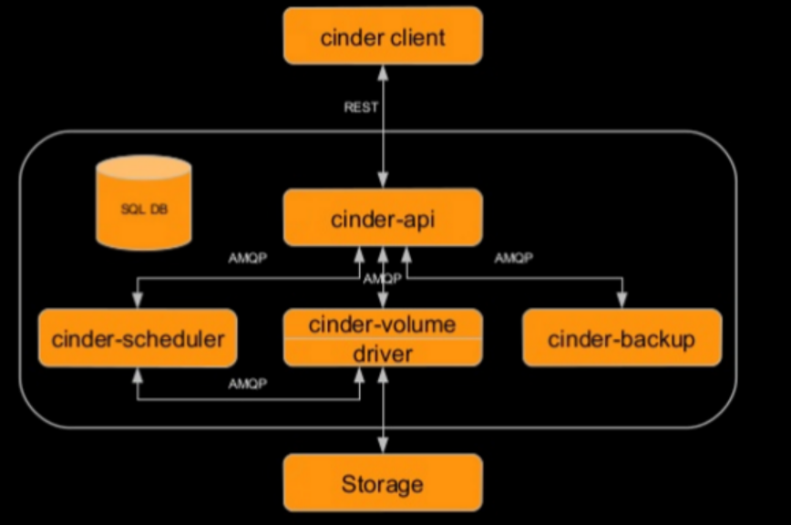
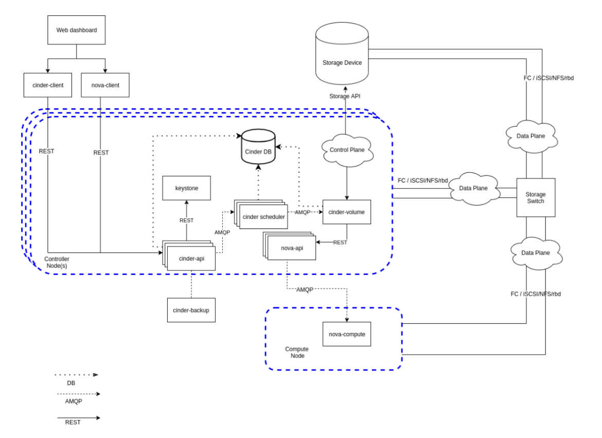
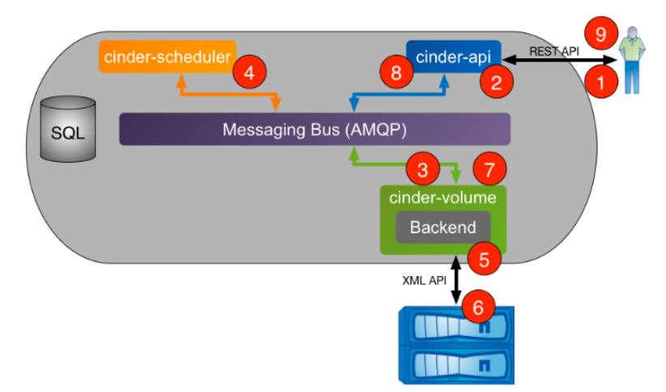
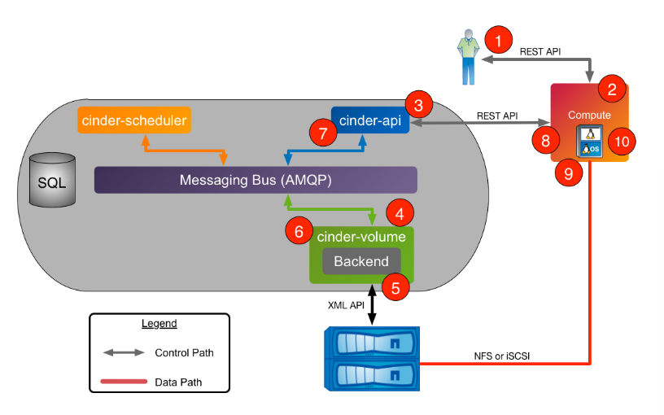
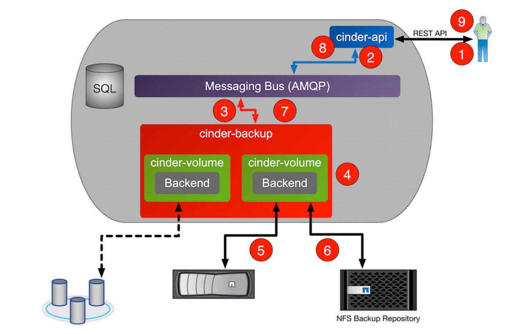
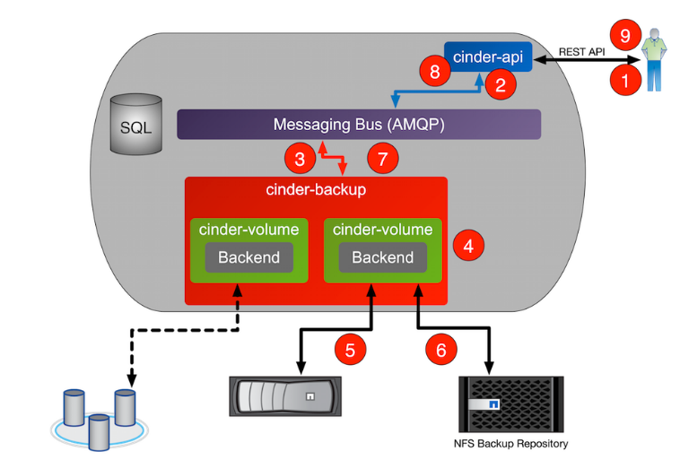

# Tổng quan về Cinder
## 1. Khái niệm
**Cinder** là dịch vụ quản lý lưu trữ khối (Block Storage) cho OpenStack. Nó cung cấp các ổ đĩa ảo (Volumes) mà bạn có thể gắn vào (Attach) hoặc tháo ra (Detach) khỏi các máy ảo.

**Đặc điểm**: 
- **Persistent(Bền vững)**: Khác với ổ đĩa mặc định của máy ảo(thường bị xóa khi xóa máy ảo), dữ liệu trên Cinder Volume vẫn tồn tại ngay cả khi máy ảo bị hủy. Bạn có thể gắn ổ đĩa đó sang một máy ảo khác.
- **Tính năng nâng cao**: Hỗ trợ tạo Snapshot (ảnh chụp tức thời), Clone (nhân bả
- Cinder là dịch vụ cung cấp ổ đĩa dạng block (giống như ổ cứng gắn ngoài).
- Nó thuộc OpenStack và chuyên lo phần lưu trữ dữ liệu lâu dài.
- OpenStack Nova là dịch vụ tạo máy ảo.
- Khi bạn tạo VM bằng Nova, bạn có thể:
  - Gắn thêm ổ đĩa từ Cinder vào VM
  - Dùng nó như ổ cứng thật (format, ghi dữ liệu, cài DB,...)
  - Cách nghĩ đơn giản: Nova = tạo máy ảo, Cinder = cấp ổ cứng cho máy đó.
- Cinder không tự tạo ổ cứng được mà nó dùng backend:
  - LVM (Logical Volume Manager) -> dùng ổ cứng local của server
  - Hoặc driver/plugin cho các hệ thống khác như:
    - SAN storage
    - Ceph
    - NetApp, v.v.
- Cinder chỉ đóng vai trò là lớp quản lý, dữ liệu thật nằm ở hệ thống lưu trữ phía dưới.
- Cinder gom nhiều hệ thống lưu trữ khác nhau thành 1 interface thống nhất, ảo hóa việc quản lý block storage.
- Người dùng chỉ cần gọi API:
  - tạo volume
  - xóa volume
  - attach vào VM
- Không cần biết: ổ cứng nằm ở đâu, dùng công nghệ gì phía dưới.
- Người dùng (dev,user cloud) có thể:
  - tự tạo ổ đĩa, tự gắn vào VM, tự snapshot, backup
  - Không cần admin can thiệp 
  - Self-service cloud

- Dễ hiểu nhất: **Cinder**: dịch vụ quản lý ổ cứng ảo
  - Cấp ổ đĩa cho VM của Nova
  - dùng backend như LVM, Ceph,..
  - che giấu độ phức tạp
  - cho user tự thao tác qua API.

## 2. Một số hình thức lưu trữ trong OPS

Trong hệ sinh thái OpenStack, có nhiều loại lưu trữ phục vụ các mục đích khác nhau:

| Đặc điểm | Ephemeral Storage (Tạm thời) | Block Storage (Cinder) | Object Storage (Swift / S3) | Shared File Systems (Manila) |
|----------|-----------------------------|------------------------|-----------------------------|------------------------------|
| **Dịch vụ quản lý** | Nova | Cinder | Swift (hoặc Ceph RGW) | Manila |
| **Mục đích chính** | Chạy OS, file tạm, swap | Database, dữ liệu quan trọng | Lưu image, backup, dữ liệu tĩnh | Chia sẻ file giữa nhiều VM |
| **Tính bền vững** | Mất khi xóa VM hoặc lỗi host | Bền vững, độc lập VM | Rất bền, hỗ trợ replication | Bền, nhiều VM truy cập |
| **Cách truy cập** | Đĩa cục bộ | Block device (/dev/vdb) | API (HTTP/REST) | NFS, SMB, CephFS |
| **Khả năng kết nối** | 1 VM | Chủ yếu 1-1 (có multi-attach) | Không giới hạn | Nhiều VM đồng thời |
| **Kích thước** | Cố định theo flavor | Linh hoạt | Scale-out gần như không giới hạn | Linh hoạt, có thể mở rộng |
| **Xu hướng hiện đại** | Ít dùng cho production, thay bằng boot from volume | Thường dùng với Ceph RBD | Dùng cho Glance, backup | Dùng cho hệ thống chia sẻ và container |

- Ephemeral storage là ổ đĩa cục bộ trên compute node, không phù hợp cho dữ liệu quan trọng.
- Block storage (Cinder) là lựa chọn phổ biến cho ứng dụng cần độ bền và linh hoạt.
- Object storage (Swift/S3) phù hợp cho dữ liệu lớn, truy cập qua API.
- Shared file system (Manila) phù hợp khi nhiều VM cần truy cập chung dữ liệu.

Xu hướng hiện nay:
- **Sự thống trị của Ceph (Unified Storage)**: Thay vì cài 4 hệ thống lưu trữ khác nhau, người ta cài 1 cụm Ceph duy nhất. Ceph cung cấp RBD cho Cinder/Nova, RadosGW cho Swift và CephFS cho Manila. Điều này giúp quản trị viên "nhàn" hơn rất nhiều.
- **Kỹ thuật "Boot from Volume" (BfV)**: Hiện nay, thay vì dùng Ephemeral Storage (Nova), người dùng chọn "Create New Volume" từ một Image khi khởi tạo máy ảo.
  - Tại sao? Vì nếu máy ảo (Instance) bị hỏng hoặc bị xóa nhầm, ổ đĩa hệ điều hành vẫn còn đó trong Cinder. Bạn chỉ cần gắn nó vào một máy ảo mới là xong. Dữ liệu cực kỳ an toàn.
- **Sự lu mờ của Swift trước S3 API**: Swift vẫn tồn tại, nhưng hầu hết mọi người hiện nay sử dụng các giải pháp Object Storage tương thích với S3 API (như Ceph RadosGW hoặc MinIO) vì hệ sinh thái phần mềm hỗ trợ S3 rộng lớn hơn nhiều.
- **Cinder Multi-attach**: Trước đây, 1 Volume chỉ gắn được vào 1 VM. Hiện nay, với các Driver hỗ trợ (như Ceph, NetApp), bạn có thể gắn 1 Volume vào nhiều VM cùng lúc. Điều này cực kỳ hữu ích cho các hệ thống cần tính sẵn sàng cao (High Availability Clusters).
- **Manila & Kubernetes (K8s)**: Với xu hướng chạy K8s trên OpenStack, Manila trở thành "ngôi sao" vì nó cung cấp tính năng ReadWriteMany (RWX) — cho phép nhiều Pod trong K8s cùng đọc/ghi vào một thư mục chung.

**Một số khái niệm**:
- **Share storage**: Là một nơi lưu trữ trung tâm mà nhiều máy hoặc nhiều người cùng truy cập.
  - Ví dụ:
    - nhiều VM cùng đọc/ghi file chung
    - server web đọc cùng source code
- **Scale Up**: Nâng cấp máy hiện tại
  - Ví dụ:
    - CPU 2 core -> 4 core
    - RAM 8GB -> 32 GB
- **Scale Out**: Thêm nhiều máy giống nhau để chia tải
  - Cần load balancing (cân bằng tải) - Ví dụ: 1 server -> 10 server chạy song song.
- **File Storage**: Dữ liệu được tổ chức dạng:
  - thư mục -> file (giống Windows/Linux)
  - Có thư mục(folder), có file, có đường dẫn (path)
  - Hệ thống lưu trữ hiểu luôn khái niệm file, nó quản lý tên file, thư mục, quyền truy cập.
  - thường dùng: NAS, hệ thống file chia sẻ
  - Phù hợp cho dữ liệu có cấu trúc rõ ràng, chia sẻ file giữa nhiều người.
- **Block Storage**: Dữ liệu bị chia thành các khối nhỏ(block) riêng biệt. Mỗi block có ID riêng và được lưu độc lập.
   - Hệ điều hành sẽ tự ghép các block lại thành file
   - Người dùng không thấy block, chỉ thấy ổ đĩa
   - Không phải là file mà là ổ đĩa thô (raw disk).
   - Ví dụ: ổ `/dev/vdb` trong VM, database storage
   - Ưu điểm: hiệu năng cao, linh hoạt, giống ổ cứng thật.
- **Object Storage**: Lưu trữ dạng object
  - Mỗi object gồm: data(dữ liệu), metadata(thông tin), ID(để truy cập).
  - Object storage = lưu dữ liệu thật + truy cập bằng API (link)
  - Truy cập qua API(http), không phải mount như ổ đĩa
  - Ví dụ: ảnh, video, backup
  - Phù hợp với dữ liệu lớn, ít thay đổi.

- File storage
  - Bạn mở folder → thấy file
- Block storage
  - Bạn có ổ cứng → tự tạo file
- Object storage
  - Bạn upload file lên server
  - Server giữ file thật
  - Bạn lấy lại bằng link/API

## 3. Kiến trúc và cơ chế Cinder
Kiến trúc của Cinder khá giống với Nova hay Glance, bao gồm các thành phần rời rạc giao tiếp qua Message Queue:

- `Cinder-api`: Điểm tiếp nhận mọi yêu cầu REST API từ người dùng hoặc các dịch vụ khác. Nó xác thực người dùng và định tuyến yêu cầu vào hàng đợi.
- `Cinder-scheduler`: "Người điều phối". Khi bạn muốn tạo 1 ổ đĩa 100GB, Scheduler sẽ quét qua các Storage Node để tìm xem node nào còn đủ chỗ và có tính năng phù hợp nhất để đặt ổ đĩa đó. Lên lịch và định tuyến các yêu cầu tới dịch vụ volume thích hợp. Tùy thuộc vào cách cấu hình, có thể chỉ là dùng round-robin để định ra việc sẽ dùng volume service nào, hoặc phức tạp hơn có thể sử dụng Filter Scheduler. Filter Scheduler là mặc định và bật các bộ lọc như Capacity(sức chứa), Avaibility Zone, Volume Type, và Capability(khả năng).
- `Cinder-volume`: Thành phần trực tiếp quản lý các phần mềm/phần cứng lưu trữ. Nó giao tiếp với các Backend (như LVM, Ceph, Dell EMC...) thông qua các Drivers.
- `Driver` : Chứa các mã back-end cụ thể để có thể liên lạc với các loại lưu trữ khác nhau.
- `Cinder-backup`: Dịch vụ hỗ trợ sao lưu Volume sang một kho lưu trữ khác (thường là OpenStack Swift hoặc Ceph). Cung cấp phương thức để backup một Block Storage volume tới Openstack Object Storage (Swift)
- `Messaging Queue (RabbitMQ)`: Cầu nối liên lạc giữa các thành phần.
- `Storage` : Các thiết bị lưu trữ từ các nhà cung cấp khác nhau.
- `Database`: Lưu trữ trạng thái của Volume (đang gắn vào máy nào, dung lượng bao nhiêu, trạng thái available hay in-use).

## 4 Workflow
### 4.1 Khởi tạo volume mới

Đây là quy trình diễn ra khi người dùng yêu cầu một không gian lưu trữ mới. Thứ tự điều phối đóng vai trò then chốt để đảm bảo tài nguyên được cấp phát đúng chỗ.

- **1. Gửi yêu cầu(Request)**: Client (CLI, Horizon, hoặc ứng dụng bên thứ ba) gửi một request REST API đến `cinder-api`. Request này chứa các thông số: dung lượng, tên, và quan trọng nhất là **Volume Type**.
- **Xác thực và Kiểm tra (Validation)**:
  - `cinder-api` gửi Token của người dùng sang **Keystone** để xác thực quyền hạn.
  - Nó kiểm tra **Quota**(hạn mức) của Project để xem người dùng còn đủ dung lượng để tạo Volume này hay không.
  - Kiểm tra **Microversion** để đảm bảo tính tương thích giữa Client và Server.
- **Ghi nhận Database**: `cinder-api` tạo một bản ghi mới trong **Cinder Database** với trạng thái ban đầu là `creating`.
- **Lập lịch(Scheduling)**: `cinder-api` gửi một message vào **Message Queue(RabbitMQ)** yêu cầu lập lịch:
  - `cinder-scheduler` lấy tin nhắn này. Nó thực hiện hai bộ lọc:
    - **Filtering**: Loại bỏ các Backend không thỏa mãn (ví dụ: Backend hết dung lượng, không đúng Volume Type yêu cầu, hoặc không nằm trong Availability Zone mong muốn).
    - **Weighing**: Chấm điểm các Backend còn lại để tìm nơi tối ưu nhất (ví dụ: nơi còn nhiều dung lượng nhất).
- **Chỉ định thực thi**: `cinder-scheduler` gửi một tin nhắn qua AMQP đến đích danh node `cinder-volume` đang quản lý Backend được chọn.
- **Tạo Volume vật lý**:
  - `cinder-volume` tiếp nhận yêu cầu và gọi **Cinder Driver** tương ứng (ví dụ: Ceph Driver, LVM Driver, NetApp Driver).
  - Driver này thực hiện các lệnh chuyên biệt xuống thiết bị lưu trữ vật lý hoặc cụm lưu trữ phân tán để cấp phát dung lượng.
- **Cập nhật kết quả**: 
  - Sau khi lưu trữ vật lý báo thành công, `cinder-volume` cập nhật lại Database chuyển trạng thái Volume sang `available`
  - Nó gửi phản hồi xác nhận Message Queue để báo cho `cinder-api`
- **Phản hồi Client**: `cinder-api` trả về thông tin chi tiết của Volume (ID, trạng thái, dung lượng) cho người dùng.

### 4.2 Attach Volume

Quy trình này đòi hỏi sự phối hợp chặt chẽ giữa dịch vụ tính toán (Nova) và dịch vụ lưu trữ (Cinder).

- Yêu cầu Attach: Người dùng gửi lệnh qua Nova API (ví dụ: `openstack server add volume <server> <volume>`).
- **Nova chuẩn bị**: `nova-api` xác thực yêu cầu, sau đó gửi một yêu cầu đến `cinder-api` để lấy thông tin kết nối (Connection Info).
- **Cinder cấp quyền**:
  - `cinder-api` gửi yêu cầu xuống `cinder-volume`
  - `cinder-volume` gọi Driver để khởi tạo kết nối ở phía Storage (ví dụ: tạo iSCSI target, export RBD image, hoặc thiết lập Fibre Channel zone).
  - Thông tin kết nối (`connection_info`) bao gồm: giao thức (iSCSI, RBD, NFS,...), địa chỉ IP, IQN, LUN ID hoặc các mã bị mật (secret keys).
- **Nova thực thi kết nối (Host-side)**: 
  - `nova-api` chuyển `connection_info` xuống node `nova-compute` nơi máy ảo đang chạy.
  - `nova-compute` sử dụng thư viện `os-brick`(thư viện quan trọng nhất ở bước này) để thực hiện các thao tác mức hệ điều hành: quét đĩa (rescan bus), đăng nhập iSCSI, hoặc ánh xạ thiết bị block device vào hệ thống.
- **Hot-plug vào Hypervisor**:
  - `nova-compute` tạo ra cấu hình XML cho thiết bị đĩa mới và đẩy vào Hypervisor(thường là Libvirt/KVM).
  - Hypervisor thực hiện gắn đĩa "nóng' vào máy ảo. Máy ảo sẽ nhìn thầy một thiết bị mới( ví dụ: `/dev/vnb`).
- **Xác nhận trạng thái**: Sau khi hoàn tất, Nova báo lại cho Cinder để cập nhật trạng thái Volume trong Database thành `in-use`.

### 4.3 Backup volume

Backup trong Cinder thường được thực hiện bởi một dịch vụ riêng biệt để đảm bảo an toàn dữ liệu.

- **Yêu cầu Backup**: Client gửi yêu cầu đến cinder-api.
- **Khởi tạo bản ghi**: `cinder-api` tạo một bản ghi backup trong Database với trạng thái `creating` và gửi tin nhắn đến `cinder-backup`.
- **Truy xuất dữ liệu**:
  - `cinder-backup` yêu cầu cinder-volume chuẩn bị dữ liệu.
  - Nếu Volume đang in-use, Cinder thường yêu cầu tạo một Snapshot tạm thời để đảm bảo tính nhất quán của dữ liệu (Consistency) mà không cần tắt máy ảo.
  - Một thiết bị lưu trữ tạm thời được gắn vào node chạy cinder-backup.
- Chuyển dữ liệu sang Kho lưu trữ (Repository):
  - `cinder-backup` đọc dữ liệu từ Volume (hoặc Snapshot) thông qua Driver.
  - Nó nén và mã hóa dữ liệu (nếu được cấu hình) rồi đẩy sang **Backup Repository** (thường là OpenStack Swift, Amazon S3, hoặc cụm Ceph khác).
  - **Cập nhật Metadata**: Các thông tin về bản backup (kích thước, định dạng, checksum) được lưu vào Database của Cinder.

- **Hoàn tất:** Sau khi dữ liệu được lưu an toàn, trạng thái backup chuyển thành `available`. Snapshot tạm thời (nếu có) sẽ bị xóa.

### 4.4 Restore Volume

- Yêu cầu Restore: Client gửi yêu cầu kèm theo ID của bản backup và (tùy chọn) ID của Volume đích.
- Chuẩn bị Volume đích:
  - Nếu người dùng yêu cầu restore vào một Volume mới, `cinder-api` sẽ gọi quy trình **4.1** để tạo một Volume trống có dung lượng tương đương hoặc lớn hơn bản backup.
- **Đổ dữ liệu (Data Injection):**
  - `cinder-backup` kết nối với Backup Repository để lấy dữ liệu.
  - Nó thực hiện gắn Volume đích vào node chạy `cinder-backup`.
  - Dữ liệu được giải nén/giải mã và ghi trực tiếp vào Volume đích.
  - Lưu ý: Nếu dùng Ceph cho cả Cinder và Backup, quá trình này có thể tối ưu bằng cách sử dụng `rbd import-diff` để tăng tốc độ vượt trội.
- **Cập nhật Database**: Trạng thái của Volume được chuyển về `available` và bản ghi restore được đánh dấu hoàn thành.

Những điểm cần lưu ý trong các phiên bản mới:
- **Tooz & Distributed Locks**: Trong tất cả các workflow trên, OpenStack sử dụng thư viện **Tooz** để thực hiện khóa (locking). Điều này ngăn chặn việc hai tiến trình cùng ghi vào một Volume một lúc, tránh hỏng dữ liệu.
- **Active-Active High Availability**: Hiện nay các dịch vụ Cinder có thể chạy nhiều bản sao cùng lúc (Active-Active) thay vì chỉ một node chính, giúp các workflow trên không bao giờ bị gián đoạn.
- **Cinder-Image-Cache**: Trong quy trình 4.1, nếu tạo Volume từ Image, Cinder sẽ kiểm tra trong kho Cache nội bộ của nó. Nếu đã có bản copy của Image đó, nó sẽ thực hiện Clone ngay trong Backend thay vì tải từ Glance, rút ngắn thời gian từ vài phút xuống vài giây.
- Workflow thực tế của Cinder cực kỳ chặt chẽ với sự tham gia của các thư viện như `os-brick` và `Tooz`, đảm bảo tính toàn vẹn dữ liệu ở mức cao nhất.

## 5. Các thành phần trong Cinder
### 5.1 Backend Storage Device 
- OpenStack Cinder không tự tạo ổ cứng
- Nó cần backend storage để lưu dữ liệu thật

**Mặc định**:
- Dùng LVM(Logical Volume Manager) trên server local
- volume group: `cinder-volumes`
- lấy ổ cứng thật của server → chia ra thành các volume cho VM
- Hiện nay LVM chỉ dùng cho Lab, demo. Production thường dùng Ceph RBD, SAN/ NetApp/ v.v.

### 5.2 User & Project 
- Đây là phần quản lý người dùng trong OpenStack
- User thuộc về Project (tenant)
- Mỗi User có: 
  - Username/password
  - role (quyền)
- Role-based access: Quyền được kiểm soát theo role
  - Ví dụ: admin, member
- Trong cấu hình mặc định, phần lớn các hành động không yêu cầu một role cụ thể, nhưng sysad có thể cấu hình trong file `policy.yaml` để quản lý các rule.
- Quota: hạn ngạch áp dụng theo project để tránh 1 user chiếm hết tài nguyên.

### 5.3 Volume, Snapshot, Backup
- Volume: ổ đĩa ảo (block device)
- có thể: attach vào VM, dùng làm root disk (boot)
- thường expose qua: iSCSI (truyền thống), hoặc RBD (Ceph)
- là các R/W bền vững, xóa VM -> volume vẫn còn.

- Snapshot là ảnh chụp tại 1 thời điểm của volume dùng để backup nhanh, tạo volume mới. Dùng để backup nhanh, tạo volume mới. Ví dụ snapshot DB lúc 10h, rollback nếu lỗi.
- Backup là bản sao lưu của volume ra storage khác. Thường lưu ở: OpenStack Swift hoặc Ceph

## 6. Không có Cinder vẫn có thể tọa được máy ảo
Trong OpenStack:
- OpenStack Nova **tự nó đã có khả năng tạo VM**
- Khi không có Cinder, VM sẽ dùng:
  - **ephemeral storage** (ổ đĩa tạm thời gắn trực tiếp vào compute node(local disk), mất VM = mất luôn dữ liệu, không thể detach ra VM khác, snapshot linh hoạt, dùng storage riêng biệt).
  - VM dùng volume riêng, có thể detach/ attach sang VM khác, snapshot, backup, lưu trữ dữ liệu lâu dài.