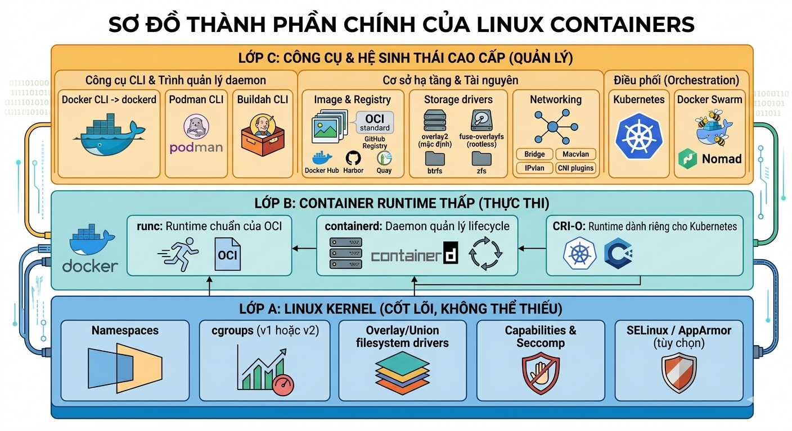

# Tổng quan về Linux Container (LXC)

## 1. Khái niệm

**Linux Containers (LXC)** là một công nghệ ảo hóa ở **cấp hệ điều hành (OS - level virtualization)**. Containers cho phép chạy nhiều môi trường cô lập(isolated envirmonets) trên cùng một nhân Linux (Linux Kernel), mà không cần phải tạo máy ảo riêng biệt.

Container là một đơn vị đóng gói (packaging) chứa toàn bộ môi trường cần thiết để chạy một ứng dụng (code, runtime, thư viện, biến môi trường, file cấu hình…). Nó chia sẻ kernel của hệ điều hành host, khác hoàn toàn với máy ảo (VM) phải có kernel riêng.

Mỗi container giống như một "máy tính nhỏ":
- có **file system riêng**
- có **process riêng**
- có **network interface riêng**
- Dùng chung **kernel** của hệ điều hành host.

```text
Nói cách khác: Containers chia sẻ kernel nhưng cô lập không gian người dùng (user space).
```

## 2. Cách container hoạt động (công nghệ nền tảng)

### 2.1 Namespaces (cô lập tài nguyên)

Namespace tạo ra "bản sao" của một loại tài nguyên, khiến container thấy một thế giới riêng biệt. Namespaces cung cấp sự cô lập (isolation) cho các tài nguyên hệ thống.

Mỗi container có thể thấy và dùng tài nguyên riêng của nó.

| Namespace | Công dụng chính | Ví dụ thực tế |
|-----------|-----------------|---------------|
| PID | Cô lập danh sách process | Container 1 thấy PID 1 là init của nó |
| Mount (mnt) | Cô lập hệ thống file (mount points)| Container có root filesystem riêng|
| Network (net)| Cô lập network stack (interface, IP, port…)| Mỗi container có IP riêng hoặc dùng bridge |
| UTS| Cô lập hostname và domain name| Container có hostname riêng|
| IPC| Cô lập cơ chế giao tiếp giữa process| Message queues, semaphores riêng|
| User| Cô lập user/group ID (UID/GID mapping)| Root trong container ≠ root trên host|
| Cgroup| Cô lập và giới hạn tài nguyên (cgroups v2)| (thường kết hợp với cgroup namespace) |
| Time| Cô lập đồng hồ (từ kernel 5.6) |Ít dùng|

Khi tạo container, kernel sẽ gán các namespace mới cho process đầu tiên (entrypoint) của container.

### 2.2 Control Groups (cgroups) - Giới hạn và kế toán tài nguyên
- cgroups v1 (cũ) và cgroups v2 (mặc định từ kernel 4.5+, được khuyến khích dùng).
- Cho phép giới hạn dùng tối đa bao nhiêu: CPU, Memory, I/O (blkio), Network bandwidth, số process, freeze/thaw…
- Theo dõi mức tiêu thụ tài nguyên
- Ngăn container chiếm dụng toàn bộ hệ thống
- Cgroup controller chính: cpu, memory, io, pids, devices, freezer…

### 2.3 Các cơ chế bổ trợ quan trọng
- **Capabilites**: Loại bỏ một số quyền root nguy hiểm (ví dụ: CAP_SYS_ADMIN, CAP_NET_ADMIN...).
- **Seccomp (Secure Computing)**: Bộ lọc syscall (chỉ cho phép một số system call nhất định).
- **SELinux/ AppArmor**: Mandatory Access Control (MAC) để giới hạn thêm.
- **Overlay filesystem/ Union filesystem**: (overlay2, aufs, btrfs…): cho phép nhiều layer chồng lên nhau -> image layer rất tiết kiệm dung lượng (layer chỉ chứa sự thay đổi).

## 3. Khác nhau giữa Container, Máy ảo (VM) và WSL-2
| Tiêu chí               | Linux Containers                              | Virtual Machine (VM)                                       | WSL2                                       |
| ---------------------- | --------------------------------------------- | ---------------------------------------------------------- | ------------------------------------------ |
| **Kiến trúc**          | OS-level virtualization (chia sẻ kernel host) | Hardware-level virtualization (hypervisor như KVM, VMware) | Lightweight VM dựa trên Hyper-V            |
| **Kernel**             | Dùng chung kernel Linux host                  | Mỗi VM có kernel riêng                                     | Kernel Linux riêng (Microsoft build)       |
| **Cô lập (Isolation)** | Trung bình (namespaces + cgroups)             | **Cao nhất** (tách biệt hoàn toàn)                         | Cao (gần VM) nhưng tích hợp Windows        |
| **Hiệu suất**          | **Gần native (~98-99%)**                      | Thấp hơn (overhead 5–20%)                                  | Gần native, thường tốt hơn VM truyền thống |
| **Khởi động**          | Rất nhanh (ms → vài giây)                     | Chậm (30s → vài phút)                                      | Nhanh (vài giây)                           |
| **Tài nguyên**         | Rất nhẹ, dùng chung                           | Nặng (RAM/CPU riêng)                                       | Thấp → trung bình (dynamic memory)         |
| **Kích thước**         | Nhỏ (MB → vài trăm MB)                        | Lớn (GB)                                                   | Trung bình                                 |
| **Portability**        | **Cao nhất** (image chạy mọi nơi)             | Trung bình                                                 | Thấp (gắn với Windows)                     |
| **OS hỗ trợ** ⚠️       | Chỉ Linux (native)                            | **Chạy mọi OS** (Linux, Windows, BSD…)                     | Chỉ Linux trên Windows                     |
| **Tích hợp Windows**   | Thấp                                          | Trung bình                                                 | **Rất cao (native)**                       |
| **Docker support**     | Native, tốt nhất                              | Có nhưng nặng                                              | **Rất tốt (Docker Desktop backend)**       |
| **Bảo mật**            | Trung bình (phụ thuộc kernel)                 | **Cao nhất**                                               | Cao (VM isolation)                         |
| **Networking**         | Linh hoạt (bridge, overlay, service mesh)     | Giống máy thật                                             | NAT + integration với Windows              |
| **Storage**            | Layered filesystem (overlayfs)                | Disk ảo (VMDK, QCOW2)                                      | File system tích hợp Windows               |
| **GUI / Desktop**      | Có nhưng cần config (X11/Wayland)             | Tốt                                                        | **Rất tốt (WSLg)**                         |
| **Use case chính**     | Microservices, CI/CD, Kubernetes              | Multi-OS, production isolation, lab                        | Dev trên Windows, chạy tool Linux          |

# II. Các thành phần chính của Linux Container



## Lớp A: Linux Kernel 
- Quản lý mọi tài nguyên phần cứng (CPU, RAM, Ổ đĩa, Mạng). Nếu không có Kernel, container không thể tồn tại.

- Container không có Kernel riêng. Chúng "dùng chung" Kernel với máy chủ (Host). Vì vậy, lớp A này chính là nơi Kernel "phân chia" chính nó để tạo ra các không gian riêng biệt cho mỗi container.

- Cung cấp "điều kiện cần" (cách ly, giới hạn) để container tồn tại.
### 1. Namespaces 
Namespaces thực hiện việc "che mắt" và "phân chia" hệ thống thành các không gian khác nhau. Đây là tính năng quan trọng nhất để tạo ra "ảo giác" cho container. Nó khiến container nghĩ rằng nó đang là một máy ảo độc lập, trong khi thực tế nó chỉ là một tiến trình (process) bình thường.
### 2. cgroups (Control Groups) - Quản lý tài nguyên
Nếu một container bị lỗi và chiếm toàn bộ CPU/RAM của máy chủ, tất cả các container khác sẽ bị "chết đứng". cgroups ra đời để ngăn chặn điều này. Nó cho phép bạn đặt giới hạn cứng:
- **CPU**: Container A chỉ được dùng tối đa 50% của 1 CPU.
- **RAM**: Container B chỉ được dùng tối đa 2GB RAM. Nếu dùng quá, nó sẽ bị Kernel "kill" (lỗi OOM - Out of Memory) để bảo vệ hệ thống.
- **I/O (Đĩa/Mạng)**: Giới hạn tốc độ đọc/ghi dữ liệu.

### 3. Overlay/Union Filesystem Drivers - Lưu trữ
Là công nghệ giúp Container Images trở nên siêu nhẹ và khởi động nhanh

Thay vì copy toàn bộ hệ điều hành cho mỗi container (như máy ảo), Union FS cho phép chồng nhiều thư mục lên nhau để tạo thành một hệ thống file duy nhất.
  - **Image Layer (Read-Only)**: Một Image (ví dụ: Ubuntu + Nginx) thực chất là nhiều lớp (layer) xếp chồng lên nhau và được đánh dấu là "Chỉ đọc". Các container khác nhau có thể chia sẻ các lớp này.
  - **Container Layer (Read-Write)**: Khi một container khởi động, Kernel sẽ đè lên trên cùng một lớp siêu mỏng có quyền "Đọc-Ghi". Mọi dữ liệu mới hoặc file bị sửa đổi sẽ chỉ được lưu ở lớp này.

### 4. Security (Capabilities, Seccomp, SELinux/AppArmor)
Container dùng chung Kernel, nên nếu một container bị chiếm quyền, Kernel là mục tiêu tấn công tiếp theo.
  - **Kernel Capabilities**: Mặc định, người dùng Root trong container không có đầy đủ quyền hạn như Root máy chủ. Kernel sẽ "tước bỏ" các quyền nguy hiểm (ví dụ: quyền thay đổi giờ hệ thống, quyền quản lý phần cứng trực tiếp).
  - **Seccomp (Secure Computing mode)**: Hạn chế các syscalls mà container có thể gửi tới kernel. Ví dụ, ngăn container gọi hàm "reboot" hệ thống.
  - **SELinux/AppArmor**: Đây là các hệ thống bảo mật nâng cao (MAC- Mandatory Access Control), tạo ra các quy tắc cực kỳ chi tiết về việc container nào được phép truy cập vào file hoặc cổng mạng nào.

## Lớp B: LOW-LEVEL RUNTIME 
- Nhiệm vụ nhận yêu cầu và giao tiếp với Kernel để tạo ra container.
- OCI (Open Container Initiative) đặt ra các chuẩn chung:
  - **Image Spec**: Định dạng chuẩn của một Image
  - **Runtime Spec**: Cách thức một container phải được chạy như thế nào.

Cung cấp "phương tiện" (runc) để thực hiện yêu cầu theo đúng chuẩn OCI.
### 1. Runc
runc chính là **implementation (sự triển khai)** mặc định và phổ biến nhất của OCI Runtime Spec.
  - **Nhiệm vụ**: Khi bạn bảo "chạy container", một công cụ cấp cao (như Docker) sẽ chuẩn bị mọi thứ (Image, cấu hình mạng), sau đó gọi `runc`. `runc` sẽ trực tiếp tương tác với các tính năng của Kernel (Namespaces, cgroups, UnionFS) để "đúc" ra một container. Sau khi tạo xong, `runc` sẽ thoát, nhường quyền quản lý lại cho Kernel.

  - **Đặc điểm**: Nó rất nhẹ, chỉ làm một việc và làm cực tốt. Nó được viết bằng Go.

### 2. Containerd 
- Quản lý toàn bộ vòng đời của một container. Là một daemon (tiến trình chạy ẩn):
  - Nhiệm vụ: Quản lý việc tải Image từ Registry về, quản lý lưu trữ, quản lý mạng (sơ bộ), và quan trọng nhất: Nó là kẻ đứng ra gọi `runc` để tạo container. Sau khi `runc` thoát, containerd vẫn tiếp tục theo dõi xem container đó còn sống hay đã chết.
  - ban đầu là một phần của Docker, sau đó được tách ra thành một dự án độc lập để Kubernetes có thể sử dụng mà không cần cài đặt toàn bộ Docker.

### 3. CRI-O
CRI (Container Runtime Interface) là chuẩn mà Kubernetes tạo ra để giao tiếp với các Container Runtime. `runc` không hiểu CRI, `containerd` thì hiểu (qua một lớp shim).

CRI-O là một daemon được tạo ra với mục đích duy nhất: Là một lớp đệm tối ưu giữa Kubernetes và `runc`. Nó không quan tâm đến Docker hay người dùng gõ lệnh, nó chỉ phục vụ các yêu cầu từ Kubernetes (kubelet).

## Lớp C: High level tools & ecosystem 
Đây là lớp mà bạn tương tác hàng ngày. Các công cụ này được thiết kế để con người có thể sử dụng dễ dàng. Cung cấp "giao diện" (Docker/Podman/K8s) để con người quản lý hàng loạt container một cách dễ dàng.

### 1. Docker 
Docker không chỉ là một công cụ chạy container, nó là cả một nền tảng.
  - **Docker CLI**: Lệnh `docker`
  - **Docker Daemon (dockerd)**: Một dịch vụ lớn quản lý mọi thứ
  - **Docker Build**: Công cụ tạo Image (`Dockerfile`)
  - **Docker Compose**: Công cụ chạy nhiều container cùng lúc.

Khi bạn gõ `docker run nginx`:
- Docker Cli gửi yêu cầu đến dockerd
- dockerd kiểm tra Image, nếu thiếu thì tải về
- dockerd gọi containerd để bắt đầu quản lý
- containerd gọi runc để Kernel tạo container.

### 2. Podman & Buildah 
**Podman**: Được tạo ra để thay thế Docker CLI nhưng với kiến trúc bảo mật hơn.
  - **Rootless**: Podman có thể chạy container mà không cần quyền Root (Docker mặc định cần Root).

  - **Daemonless**: Podman không cần một daemon lớn (dockerd) luôn chạy ngầm. Khi bạn gõ lệnh, Podman tạo trực tiếp con của nó làm container.

  - Nó "bắt chước" hoàn toàn các lệnh của Docker, nên bạn có thể `alias docker=podman`.

**Buildah**: Là một công cụ "anh em" với Podman, nhưng chỉ chuyên dụng cho một việc duy nhất: Xây dựng (build) Container Images. Nó không cần daemon và cực kỳ linh hoạt cho các quy trình CI/CD.

### 3. Hệ sinh thái (Ecosystem)
Đây là các thành phần bổ trợ để một container hoạt động trong môi trường thực tế:
- **Image & Registry**: Nơi lưu trữ và chia sẻ Image (như Docker Hub, GitHub Container Registry). Chúng phải tuân thủ OCI Image Spec.

- **Orchestration (Kubernetes, Docker Swarm)**: Khi bạn có hàng ngàn container chạy trên hàng trăm máy chủ, bạn không thể gõ docker run bằng tay. Bạn cần một "người chỉ huy" (Orchestrator).
  - **Kubernetes (K8s)**: "Hệ điều hành cho Datacenter". Nó quản lý việc container nào chạy ở máy chủ nào, tự động khôi phục khi container chết, tự động mở rộng (scale) khi quá tải. Nó không dùng Docker trực tiếp, mà dùng containerd hoặc CRI-O.

  - **Docker Swarm**: "Orchestrator tích hợp sẵn" của Docker. Đơn giản hơn K8s, phù hợp cho quy mô vừa và nhỏ.