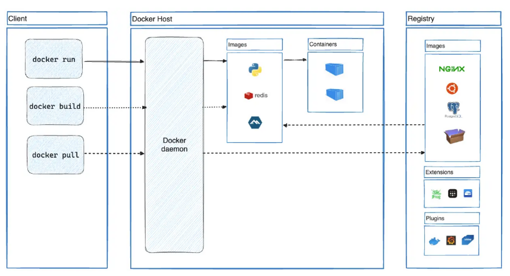

# Tổng quan về Docker

Khi nhắc đến "Docker", cần phân biệt rõ ba thực thể: **Docker, Inc.** (Công ty), **Docker Engine** (Công nghệ cốt lõi), và **Moby Project** (Dự án mã nguồn mở thượng nguồn của Docker Engine).

## 1. Docker, Inc.

- **Tiền thân**: Thành lập bởi Solomon Hykes với tên dotCloud (một nhà cung cấp PaaS), sau đó pivot thành Docker năm 2013.
- **Trọng tâm hiện tại**: Không còn tập trung vào việc duy trì toàn bộ hạ tầng container low-level mà chuyển sang cung cấp công cụ hỗ trợ Developer Experience (DX):
  - **Docker Desktop**: Công cụ GUI quản lý Docker trên Windows/macOS/Linux (lưu ý: có chính sách bản quyền cho doanh nghiệp lớn — >250 nhân viên hoặc >10M USD doanh thu/năm).
  - **Docker Hub**: Registry image lớn nhất thế giới.
  - **Docker Scout**: Công cụ phân tích bảo mật và supply chain (ra mắt 2023, tích hợp sâu vào CLI từ 2024).
  - **Docker Build Cloud**: Build farm cloud-based (2024+).

## 2. Khái niệm Docker

Docker là một nền tảng container hóa (Container Platform) cho phép phát triển (develop), đóng gói (package), phân phối (ship) và chạy (run) các ứng dụng trong các container.

Thay vì cài đặt trực tiếp ứng dụng và toàn bộ thư viện phụ thuộc lên hệ điều hành, Docker đóng gói tất cả thành một đơn vị độc lập gọi là Docker Image. Từ Image này, Docker tạo ra Container để chạy ứng dụng.

Mục tiêu của Docker là đảm bảo:
- Ứng dụng chạy giống nhau ở mọi môi trường.
- Triển khai nhanh chóng.
- Dễ mở rộng.
- Dễ quản lý.
- Tận dụng tài nguyên máy chủ tốt hơn máy ảo truyền thống.

Docker ra đời giải quyết vấn đề khác môi trường chạy trên 2 máy khác nhau bằng cách đóng gói toàn bộ môi trường của ứng dụng.

### 2.1 Docker Platform
Docker không chỉ là một chương trình chạy container.

Docker Platform là toàn bộ nền tảng gồm nhiều thành phần hỗ trợ vòng đời của ứng dụng.

Docker Platform bao gồm:
- Docker Engine
- Docker CLI
- Docker Image
- Docker Container
- Docker Registry
- Docker Compose
- Docker Network
- Docker Volume


## 3. Docker Architecture



Docker được xây dựng theo mô hình Client–Server Architecture, trong đó các thành phần của Docker được phân tách thành các mô-đun có nhiệm vụ riêng và giao tiếp với nhau thông qua REST API.

### 3.1 Docker Client 
Là thành phần mà người dùng sử dụng để tương tác với Docker. Docker Client đóng vai trò là giao diện điều khiển (Control Interface) giữa người dùng và Docker Engine. Chịu trách nhiệm:
  - nhận lệnh từ người dùng;
  - chuyển đổi lệnh thành yêu cầu REST API;
  - gửi yêu cầu đến Docker Daemon;
  - nhận kết quả và hiển thị lại cho người dùng.
### 3.2 Docker Daemon(dockerd)
Là tiến trình nền (background service) chịu trách nhiệm thực thi toàn bộ các hoạt động của Docker. Nó chịu trách nhiệm:
  - xây dựng Image (Build Image);
  - tạo Container;
  - khởi động và dừng Container;
  - quản lý Docker Network;
  - quản lý Docker Volume;
  - tải Image từ Registry;
  - đẩy Image lên Registry;
  - quản lý vòng đời (Lifecycle) của Container.
### 3.3 Vị trí linh hoạt 
Docker client và Docker daemon có thể cùng chạy trên một máy tính (ví dụ ngay trên laptop của bạn), hoặc bạn cũng có thể dùng Docker client từ máy của mình để điều khiển một Docker daemon nằm ở một máy chủ từ xa.
### 3.4 Cách thức giao tiếp 
Docker Client và Docker Daemon giao tiếp thông qua Docker REST API. REST API này có thể hoạt động trên hai loại giao tiếp:
  - UNIX socket (mặc định Ubuntu)
  - TCP socket
### 3.5 Docker Compose(Công cụ mở rộng) 
Bên cạnh client mặc định, còn có một công cụ khác tên là Docker Compose. Docker Compose cũng là một Docker Client. Khác với Docker CLI chỉ thao tác trên từng container, Docker Compose quản lý toàn bộ ứng dụng gồm nhiều container.
- Ví dụ: ta có file YAML
```YAML
    services:

    api:

    postgres:

    redis:

    nginx:
```
- Khi thực hiện `docker compose up`, Docker compose sẽ
  - Đọc và phân tích file `compose.yaml`
  - Xác định các service, network, volume và các cấu hình liên quan.
  - Chuyển các cấu hình đó thành nhiều yêu cầu REST API.
  - Gửi các yêu cầu REST API đến Docker Daemon.
### 3.6 Docker Registry
Docker Registry là nơi lưu trữ Docker Images. Docker Hub là một public registry mọi người đều có thể sử dụng. Docker nếu không cấu hình sẽ tự động mặc định tìm images ở trên Docker Hub. Một vài Docker registry khác
- Docker Hub
- Harbor
- GitHub Container Registry
- AWS ECR

Docker Daemon sẽ giao tiếp trực tiếp với Registry.

### 3.7 Docker Objects
Docker Daemon quản lý các Docker Objects.

#### 3.7.1 Docker Image
Image là mẫu chỉ đọc (read-only template) dùng để tạo Container.

Một Image có thể sinh ra nhiều Container.

Thông thường, một Image sẽ được xây dựng dựa trên một Image khác, kết hợp thêm một vài chỉnh sửa theo nhu cầu riêng
- Ví dụ: Bạn có thể tự xây dựng một Image dựa trên nền là Image hệ điều hành `Ubuntu`. Sau đó, bạn cài đặt thêm máy chủ web `Apache`, bỏ mã nguồn ứng dụng của bạn vào, và thiết lập các cấu hình chi tiết để ứng dụng của bạn có thể chạy được.

Có 2 cách tự tạo ra 1 Image:
- Tự tạo ra Image của riêng mình.
- Mượn/sử dụng những Image do người khác làm sẵn và đăng tải lên một trung tâm lưu trữ (gọi là Registry, ví dụ như Docker Hub).

Để tự xây dựng một Image cho riêng mình, bạn sẽ tạo ra một file văn bản gọi là Dockerfile. File này sử dụng một cú pháp rất đơn giản để liệt kê các bước cần thiết nhằm tạo ra Image và vận hành nó.

Mỗi một câu lệnh trong Dockerfile sẽ tạo ra một tầng dữ liệu (layer) bên trong Image. Khi bạn thay đổi nội dung trong Dockerfile và tiến hành build (biên dịch) lại Image, Docker sẽ chỉ build lại những layer nào có sự thay đổi. Những layer cũ không thay đổi sẽ được giữ nguyên và tái sử dụng hoàn toàn (gọi là dùng Cache).

#### 3.7.2 Docker Container
Container là thực thể đang chạy (runtime instance) của một Image.

Một Container có:
- filesystem riêng;
- process riêng;
- network riêng;
- hostname riêng.

#### 3.7.3 Docker Network
Network cho phép các Container giao tiếp với nhau.

Docker Daemon chịu trách nhiệm:
- tạo Bridge;
- gán IP;
- cấu hình DNS nội bộ;
- quản lý kết nối giữa các Container.

#### 3.7.4 Docker Volume
Volume lưu trữ dữ liệu ngoài vòng đời của Container.

Docker Daemon chịu trách nhiệm:

- tạo Volume;
- mount Volume;
- quản lý dữ liệu.

Còn nhiều objects khác như plugins,... 