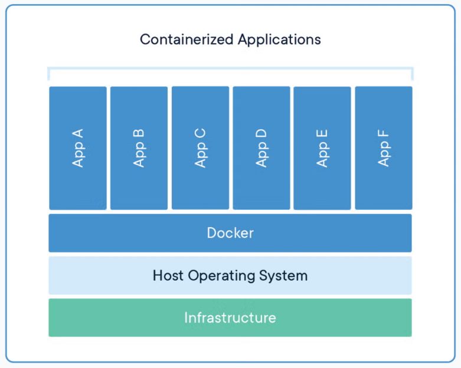
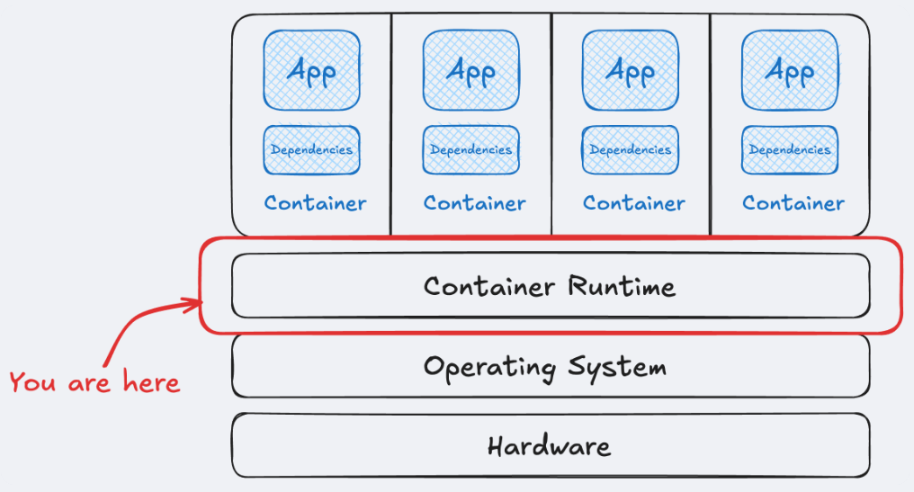

# Tổng quan về Docker

Khi nhắc đến "Docker", cần phân biệt rõ ba thực thể: **Docker, Inc.** (Công ty), **Docker Engine** (Công nghệ cốt lõi), và **Moby Project** (Dự án mã nguồn mở thượng nguồn của Docker Engine).

## 1. Docker, Inc.

- **Tiền thân**: Thành lập bởi Solomon Hykes với tên dotCloud (một nhà cung cấp PaaS), sau đó pivot thành Docker năm 2013.
- **Trọng tâm hiện tại**: Không còn tập trung vào việc duy trì toàn bộ hạ tầng container low-level mà chuyển sang cung cấp công cụ hỗ trợ Developer Experience (DX):
  - **Docker Desktop**: Công cụ GUI quản lý Docker trên Windows/macOS/Linux (lưu ý: có chính sách bản quyền cho doanh nghiệp lớn — >250 nhân viên hoặc >10M USD doanh thu/năm).
  - **Docker Hub**: Registry image lớn nhất thế giới.
  - **Docker Scout**: Công cụ phân tích bảo mật và supply chain (ra mắt 2023, tích hợp sâu vào CLI từ 2024).
  - **Docker Build Cloud**: Build farm cloud-based (2024+).

## 2. Khái niệm Docker

**Docker** là nền tảng containerization mã nguồn mở, cho phép đóng gói ứng dụng cùng toàn bộ phụ thuộc (thư viện, runtime, cấu hình) vào một đơn vị chuẩn hóa gọi là **container**. Container chạy độc lập, nhẹ và nhất quán trên mọi môi trường (dev, test, production).

Docker giúp nhà phát triển:
- Đóng gói toàn bộ ứng dụng cùng thư viện, công cụ, cấu hình vào một **Docker Image** nhỏ gọn.
- Chạy ứng dụng đó ở bất kỳ đâu mà không lo khác biệt môi trường (máy thật, server, cloud, v.v.).
- "Build once, run anywhere".



---

## 3. Kiến trúc Docker (The Docker Stack)

Công nghệ Docker hiện nay không còn là một khối duy nhất (monolithic) mà được chia thành nhiều thành phần chuyên biệt theo tiêu chuẩn mở **OCI (Open Container Initiative)**.

```
┌─────────────────────────────┐
│       Docker CLI            │  ← Người dùng tương tác
└──────────────┬──────────────┘
               │ REST API (Unix socket)
┌──────────────▼──────────────┐
│   dockerd (Docker Engine)   │  ← Daemon trung tâm
└──────────────┬──────────────┘
               │ gRPC
┌──────────────▼──────────────┐
│      containerd             │  ← Quản lý vòng đời container
└──────────────┬──────────────┘
               │
┌──────────────▼──────────────┐
│    containerd-shim          │  ← Giữ container sống độc lập
└──────────────┬──────────────┘
               │
┌──────────────▼──────────────┐
│         runc                │  ← Tạo container rồi exit
└──────────────┬──────────────┘
               │
┌──────────────▼──────────────┐
│   Container Process         │  ← Process Linux bị cô lập
│   (namespaces + cgroups)    │
└─────────────────────────────┘
```



### 3.1 Container Runtime (môi trường thực thi)

Docker dùng kiến trúc phân tầng để quản lý container hiệu quả và ổn định.

#### Low-level Runtime — runc
- Hiện thực hóa **OCI Runtime Spec**.
- Làm việc ở tầng thấp nhất, nhiệm vụ rất đơn giản: tạo container bằng tính năng của Linux kernel, sau đó **thoát ngay** (không duy trì trạng thái).
- Các bước runc làm:
  1. Tạo namespaces (PID, NET, MNT, UTS, IPC, USER)
  2. Tạo cgroup (giới hạn tài nguyên)
  3. Mount filesystem
  4. Start process (PID 1 của container)
  5. Exit

#### High-level Runtime — containerd
- Là **CNCF Graduated Project**.
- Quản lý điều phối toàn bộ vòng đời container: pull image, quản lý container, quản lý storage/network, start/stop container.
- Khi cần tạo container, containerd gọi `runc`.

#### containerd-shim
- Tiến trình "đứng giữa" containerd và container thực tế.
- Đảm bảo container vẫn hoạt động ngay cả khi `containerd` hoặc `dockerd` bị restart.
- Giữ stdin/stdout/stderr cho container.
- Báo cáo exit code khi container kết thúc.

> Về bản chất, container không phải là một máy ảo hoàn chỉnh mà chỉ là một **process được cô lập** trên Linux thông qua các cơ chế của kernel. Docker cung cấp lớp quản lý và tự động hóa giúp việc tạo, triển khai và vận hành các process này trở nên thuận tiện hơn.

### 3.2 Docker Daemon — dockerd

Tiến trình chạy nền trung tâm của Docker Engine. Nó:
- Lắng nghe API request từ Docker CLI qua Unix socket (`/var/run/docker.sock` trên Linux, named pipe trên Windows).
- Quản lý image, container, network, volume ở mức cao.
- Giao tiếp với `containerd` để thực thi container.
- Từ Docker Engine v23.0+, dùng **BuildKit** làm engine build mặc định.

### 3.3 Docker CLI

Giao diện dòng lệnh người dùng tương tác. CLI gửi lệnh đến `dockerd` qua Docker REST API. Bản thân CLI không thực thi container — nó chỉ là client.

```bash
docker version  # Xem version của Client và Engine (Server)
docker info     # Thông tin chi tiết hệ thống Docker
```

### 3.4 BuildKit (Build Engine mặc định từ v23.0)

BuildKit là engine build thế hệ mới, thay thế builder cũ. Điểm nổi bật:

| Tính năng | Mô tả |
|---|---|
| **Build song song** | Phân tích Dockerfile thành dependency graph, chạy các bước độc lập đồng thời |
| **Cache thông minh** | Hỗ trợ `--mount=type=cache` cho package manager (npm, pip, apt…) |
| **Bỏ qua stage không cần thiết** | Multi-stage build chỉ build stage mà target phụ thuộc |
| **Build đa nền tảng** | `docker buildx build --platform linux/amd64,linux/arm64` |
| **Secret an toàn** | `--mount=type=secret` không leak vào image layer |
| **SSH agent forwarding** | `--mount=type=ssh` để clone private repo trong build |

### 3.5 containerd image store (thay đổi lớn 2024+)

Từ **Docker Engine v25+**, có thể bật containerd image store (vẫn ở mức opt-in/experimental, đang dần trở thành mặc định). Đây là thay đổi kiến trúc lớn:

- **Trước**: Docker dùng image store riêng → Kubernetes dùng containerd store riêng → hai "thế giới" không thấy nhau.
- **Sau**: Dùng chung một image store → `docker images` và `crictl images` thấy cùng image → giảm lãng phí, nhất quán hơn, hỗ trợ multi-platform image tốt hơn.

Bật trong Docker Desktop: Settings → General → "Use containerd for pulling and storing images".

---

## 4. Các Khái niệm Cốt lõi

### 4.1 Image

- Là **template chỉ đọc (read-only)** dùng để tạo container.
- Được xây từ nhiều **layer** chồng lên nhau (Union Filesystem). Mỗi lệnh `RUN`, `COPY`, `ADD` trong Dockerfile tạo ra một layer mới.
- Layer được **cache và tái sử dụng** — nếu layer không thay đổi, Docker không build lại.
- Đặt tên theo format: `[registry/][user/]name[:tag][@digest]`
  - Ví dụ: `nginx:1.27-alpine`, `docker.io/library/ubuntu:24.04`, `ghcr.io/myorg/myapp:v1.2.3`
  - Digest: `nginx@sha256:abc123...` — bất biến, dùng cho production để pin chính xác.

```bash
docker pull nginx:1.27-alpine
docker images
docker image inspect nginx:1.27-alpine | head -30
```

### 4.2 Container

- Là **instance đang chạy** của một Image — giống quan hệ class (image) và object (container).
- Có thêm một **writable layer** trên cùng (chỉ tồn tại trong vòng đời container).
- Các container **độc lập** với nhau và với host nhờ Linux Namespaces (PID, NET, MNT, UTS, IPC, USER).
- Tài nguyên (CPU, RAM) bị giới hạn bởi **cgroups**.

```bash
docker run -d --name web nginx:1.27-alpine
docker ps
docker exec -it web sh
```

### 4.3 Volume

- Cơ chế lưu trữ **persistent** cho container (dữ liệu không mất khi container bị xóa).
- Được Docker quản lý, lưu tại `/var/lib/docker/volumes/` trên host.
- Ưu tiên dùng **named volume** thay vì bind mount cho production.

Chi tiết xem [07.Volume_storage.md](07.Volume_storage.md).

### 4.4 Network

Docker cung cấp nhiều loại network driver:

| Driver | Mô tả | Dùng khi |
|---|---|---|
| `bridge` | Mạng nội bộ, mặc định cho container đơn lẻ | Dev, test, ứng dụng single-host |
| `host` | Dùng thẳng network stack của host | Cần performance cao, không cần isolation network |
| `none` | Không có network | Container hoàn toàn cô lập |
| `overlay` | Kết nối nhiều Docker host | Docker Swarm / multi-host |
| `macvlan` | Container có MAC riêng, xuất hiện như thiết bị vật lý | Legacy apps cần IP riêng trên LAN |
| `ipvlan` | Tương tự macvlan nhưng dùng IP L3 | Khi switch không cho phép promiscuous mode |

> Các container trong cùng một **custom bridge network** có thể giao tiếp với nhau qua **tên container** (DNS tự động).

Chi tiết xem [08.Network.md](08.Network.md).

### 4.5 Registry

Kho lưu trữ và phân phối image. Mặc định là **Docker Hub** (`docker.io`). Ngoài ra:
- **GitHub Container Registry** (`ghcr.io`)
- **Google Artifact Registry** (`*.pkg.dev`)
- **Amazon ECR** (`*.dkr.ecr.*.amazonaws.com`)
- **Self-hosted**: Harbor, Nexus, Gitea, Docker Registry…

Chi tiết xem [09.Registry.md](09.Registry.md).

---

## 5. So sánh nhanh với VM

| Tiêu chí | Container | Virtual Machine |
|---|---|---|
| Mức ảo hóa | OS-level (chia sẻ kernel) | Hardware-level (kernel riêng) |
| Khởi động | Mili giây → vài giây | 30s → vài phút |
| Kích thước | MB → vài trăm MB | GB |
| Hiệu suất | Gần native (~98-99%) | Overhead 5-20% |
| Cô lập | Trung bình (namespaces) | Cao (hypervisor) |
| Bảo mật | Trung bình | Cao |
| Portability | Rất cao (image OCI) | Trung bình |

Chi tiết hơn xem [01.Linux_containers.md](01.Linux_containers.md).

---

## 6. Vòng đời cơ bản của một ứng dụng Docker

```
┌──────────────────┐
│ 1. Viết Dockerfile│ → Định nghĩa cách build image
└─────────┬────────┘
          ▼
┌──────────────────┐
│ 2. docker build  │ → Tạo image từ Dockerfile
└─────────┬────────┘
          ▼
┌──────────────────┐
│ 3. docker push   │ → Đẩy image lên registry (tùy chọn)
└─────────┬────────┘
          ▼
┌──────────────────┐
│ 4. docker pull   │ → Tải image về host khác (nếu cần)
└─────────┬────────┘
          ▼
┌──────────────────┐
│ 5. docker run    │ → Tạo và chạy container
└─────────┬────────┘
          ▼
┌──────────────────┐
│ 6. docker logs/  │ → Vận hành, monitor, debug
│   exec/inspect   │
└─────────┬────────┘
          ▼
┌──────────────────┐
│ 7. docker stop/rm│ → Dừng và dọn dẹp
└──────────────────┘
```

---

## 7. Bước tiếp theo

- Cài Docker: [03.Docker_install.md](03.Docker_install.md)
- Học các lệnh CLI: [04.Docker_CLI.md](04.Docker_CLI.md)
- Viết Dockerfile: [05.Dockerfile.md](05.Dockerfile.md)
- Thử lab cơ bản: [13.1.Lab_nginx_basic.md](13.1.Lab_nginx_basic.md)
