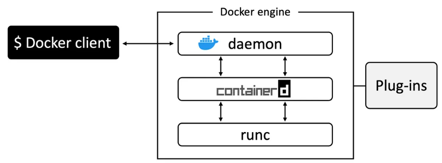
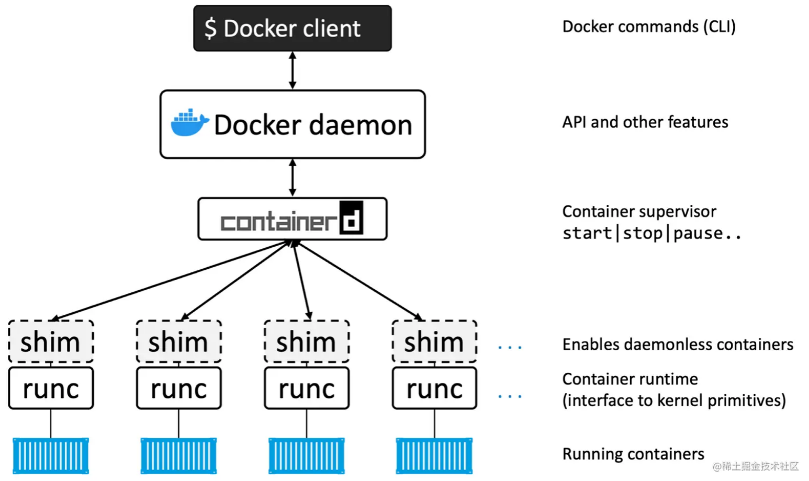
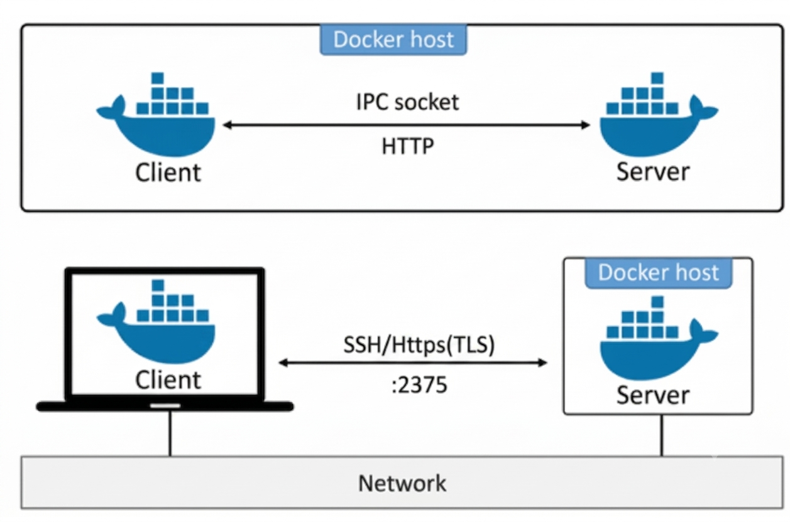
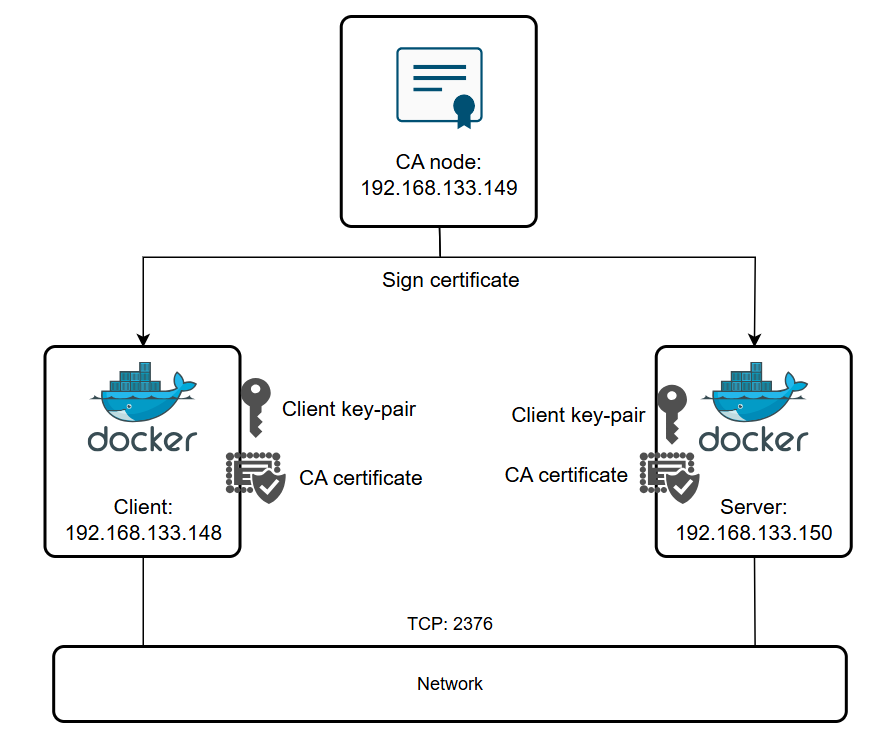

# The Docker Engine

## 1. Khái niệm
Docker Engine là phần mềm cốt lõi (core software) của Docker, chịu trách nhiệm tạo, chạy và quản lý container. Khi mọi người nói "Docker", trong hầu hết các trường hợp họ đang nhắc đến Docker Engine.

Nếu so sánh với công nghệ máy ảo:
- VMware ESXi là hypervisor dùng để tạo và quản lý máy ảo.
- Docker Engine là nền tảng dùng để tạo và quản lý container.

Docker Engine được thiết kế theo kiến trúc module (modular architecture).

Điều này có nghĩa là thay vì một chương trình khổng lồ thực hiện mọi việc, Docker chia hệ thống thành nhiều thành phần nhỏ gồm nhiều thành phần chuyên biệt, mỗi thành phần đảm nhiệm một chức năng riêng. Các thành phần này phối hợp với nhau theo các tiêu chuẩn của OCI để tạo ra môi trường container hiệu quả, linh hoạt và dễ mở rộng.

Thiết kế module mang lại nhiều lợi ích:

- Mỗi thành phần chỉ thực hiện một nhiệm vụ duy nhất (single responsibility).
- Có thể nâng cấp hoặc thay thế từng thành phần mà không ảnh hưởng đến toàn bộ hệ thống.
- Dễ bảo trì và phát triển.
- Cho phép Docker sử dụng các công nghệ mã nguồn mở tốt nhất cho từng chức năng.

Thành phần chính của Docker Engine:
- **Docker CLI**: Là giao diện dòng lệnh để người dùng tương tác với Docker.
- **Docker API**: Là giao diện lập trình ứng dụng mà CLI và các ứng dụng khác sử dụng để giao tiếp với Docker Daemon.
- **Docker Daemon**: Là tiến trình chính quản lý các đối tượng Docker như images, containers, networks, volumes, và thực hiện các thao tác xây dựng, chạy, phân phối container.
- **BuildKit**: Là hệ thống build hiện đại của Docker, dùng để xây dựng images.
containerd: Là container runtime quản lý vòng đời container, được Docker Engine sử dụng để thực thi các thao tác với container.
- **Plugin System**: Hệ thống mở rộng chức năng của Docker Engine thông qua các plugin ngoài tiến trình.
- **containerd-shim:** Là lớp trung gian giữa containerd và runc, giúp quản lý vòng đời process container.
- **runc**: Là runtime thực thi container thực tế, tạo và chạy process container dựa trên tiêu chuẩn OCI.
- **Linux Kernel Features**: Docker tận dụng các tính năng của nhân Linux như namespaces, cgroups,OverlayFS để cô lập và quản lý tài nguyên cho container.
- **Container Process**: Là process thực tế chạy bên trong container.



Docker dùng kiến trúc phân tầng để quản lý container hiệu quả và ổn định.

### 1.1 BuildKit
BuildKit là backend xây dựng (builder backend) được Docker sử dụng để thực thi các tác vụ build image. BuildKit mang lại nhiều cải tiến so với hệ thống builder cũ của Docker, bao gồm:

- Tăng hiệu suất build nhờ khả năng thực thi song song các bước build độc lập.
- Quản lý lưu trữ và cache tốt hơn, chỉ truyền và sử dụng các file cần thiết trong quá trình build.
- Hỗ trợ các tính năng nâng cao như build multi-stage, build cache, và các frontend Dockerfile mở rộng.
- Giảm thiểu tác động phụ lên hệ thống (ví dụ: không tạo image hoặc container trung gian không cần thiết).
- Có thể sử dụng với nhiều môi trường khác nhau, bao gồm cả builder chạy từ xa.

BuildKit là mặc định trên Docker Desktop và Docker Engine (trừ khi build Windows container thì vẫn dùng builder cũ). Bạn có thể tương tác với BuildKit thông qua Docker CLI, đặc biệt là với lệnh `docker buildx`.

### 1.2 Docker API
Docker API (hay Docker Engine API) là một API RESTful cho phép bạn tương tác với Docker daemon (dockerd). Thông qua Docker API, bạn có thể quản lý các đối tượng Docker như images, containers, networks, và volumes bằng cách gửi các yêu cầu HTTP từ các công cụ như `curl`, hoặc thông qua các SDK chính thức của Docker (Go, Python).

Docker API được sử dụng bởi:
- Docker CLI (dòng lệnh) để gửi lệnh đến Docker daemon.
- Các ứng dụng hoặc script tự động hóa, tích hợp với Docker.
- Các SDK để xây dựng và mở rộng ứng dụng dựa trên Docker.

Bạn có thể chỉ định phiên bản API khi sử dụng, và API này hỗ trợ nhiều thao tác quản lý Docker từ xa hoặc tự động hóa.



### 1.3 Containerd
Containerd là một container runtime cung cấp giao diện nhẹ, nhất quán để quản lý vòng đời container và image. Docker Engine sử dụng containerd để thực hiện các thao tác như tạo, khởi động và dừng container. Nói cách khác, containerd là thành phần trung gian giữa Docker Engine và các container runtime như runc, giúp quản lý toàn bộ vòng đời của container một cách hiệu quả.

### 1.4 Containerd-shim
Containerd-shim là một thành phần trung gian (shim) cho phép sử dụng các runtime thay thế mà không cần thay đổi cấu hình của Docker daemon. Shim này hoạt động như một lớp giữa containerd và runtime thực tế (ví dụ: runc, gVisor, Kata Containers). Khi bạn chạy container với một runtime cụ thể, containerd sẽ gọi containerd-shim tương ứng để thực thi container đó.

Containerd-shim giúp containerd giao tiếp với các runtime khác nhau, cho phép linh hoạt lựa chọn runtime cho từng container.

Khi `containerd` gọi `runc` để tạo container, `runc` chỉ thực hiện việc khởi tạo container rồi thoát. Sau đó, `containerd-shim` trở thành tiến trình cha (parent process) của container và tồn tại trong suốt vòng đời của nó. Shim có nhiệm vụ duy trì các luồng STDIN/STDOUT/STDERR, theo dõi trạng thái của container và báo cáo mã thoát (exit status) cho containerd. Nhờ có shim, container có thể tiếp tục chạy ngay cả khi containerd hoặc dockerd được khởi động lại, giúp tách vòng đời của container khỏi daemon Docker.

```bash
containerd
      │
 ├── shim
 │      └── nginx
 │
 ├── shim
 │      └── redis
 │
 ├── shim
 │      └── mysql
```
Mỗi container chỉ cần một `containerd-shim` nhẹ để duy trì kết nối và quản lý vòng đời. `runc` chỉ tồn tại trong vài mili giây hoặc vài giây để tạo container rồi thoát.

### 1.5 Runc
`Runc` là container runtime mặc định được sử dụng bởi containerd trong Docker Engine. `runc` chịu trách nhiệm thực thi và quản lý các container ở cấp độ thấp nhất, cụ thể là tạo và chạy các process container dựa trên tiêu chuẩn Open Container Initiative (OCI). Khi Docker Engine quản lý vòng đời container thông qua containerd, containerd sẽ sử dụng runc để thực sự khởi tạo và vận hành container.

Tóm lại, runc là thành phần thực thi container thực tế, còn containerd là lớp quản lý vòng đời container, và Docker Engine sử dụng cả hai để cung cấp trải nghiệm quản lý container hoàn chỉnh.

### 1.6 Plugin System
Plugin system trong Docker Engine là một hệ thống cho phép bạn mở rộng chức năng của Docker Engine bằng cách cài đặt, khởi động, dừng và gỡ bỏ các plugin. Plugin là các tiến trình (process) chạy bên ngoài Docker daemon, có thể chạy trên cùng hoặc khác host với Docker daemon, và đăng ký với Docker thông qua các file trong thư mục plugin nhất định.

Các plugin này có thể cung cấp thêm các tính năng như volume, network, hoặc authorization cho Docker. Bạn có thể quản lý plugin thông qua các lệnh như cài đặt, bật/tắt, hoặc gỡ bỏ plugin bằng Docker CLI.

Tóm lại, plugin system giúp Docker Engine linh hoạt hơn bằng cách cho phép tích hợp các thành phần mở rộng mà không cần thay đổi hoặc build lại Docker daemon.

### 1.7 Triển khai trên Linux
Trong Linux, các thành phần ta nói ở trên được triển khai ở:
- `/usr/bin/dockerd(Docker daemon)`
- `/usr/bin/containerd`
- `/usr/bin/containerd-shim-runc-v2`
- `/usr/bin/runc`

# Working with Docker Engine
## 1. Connecting and Managing Docker Engine
Docker Engine cung cấp một Docker Engine API (REST API) để các chương trình bên ngoài có thể điều khiển Docker thay vì phải dùng lệnh `docker`.

Ngoài Docker CLI, các IDE như VS Code, Docker Extension, Portainer hay các chương trình tự động hóa cũng có thể giao tiếp với Docker Engine thông qua API này.

Client có tên là docker (`docker.exe` trên Win) và daemon có tên là dockerd (`dockerd.exe` trên Win). Cài đặt mặc định sẽ đặt cả hai trên cùng một máy và cấu hình chúng giao tiếp qua socket IPC cục bộ:
- `/var/run/docker.sock` trên Linux
- `//./pipe/docker_engine` trên Windows

Ngoài ra, cũng có thể cấu hình chúng qua mạng. Theo mặc định, giao tiếp qua mạng sử dụng socket HTTP không bảo mật trên cổng `2375/tcp`



- Docker khuyến nghị 2 cách giao tiếp từ xa thông qua:
  - **SSH**(khuyến nghị)
  - **TLS(HTTPS)**(dành cho môi trường cần Remote API)

## 2. Sử dụng SSH để bảo vệ Docker daemon socket
**Lưu ý:**

Tài khoản (`USERNAME`) dùng để SSH phải có quyền truy cập Docker socket trên máy chủ từ xa (ví dụ thuộc nhóm `docker`).

### 2.1 Docker context
Tạo docker context: Docker Context giúp CLI biết sẽ kết nối tới Docker Engine nào.
```bash
docker context create \
    --docker host=ssh://docker-user@host1.example.com \
    --description="Remote engine" \
    my-remote-engine
```
Sau khi tạo thành công:
```bash
docker context use my-remote-engine
```
Từ thời điểm này:
```bash
docker info
```
sẽ hiển thị thông tin của Docker Engine trên máy từ xa, không phải máy hiện tại.

Muốn quay lại Docker Engine cục bộ:
```bash
docker context use default
```
### 2.2 Docker Host
Dùng biến môi trường DOCKER_HOST, Nếu không muốn tạo Context, có thể dùng:
```bash
export DOCKER_HOST=ssh://docker-user@host1.example.com
```
Sau đó:
```bash
docker info
```
CLI sẽ tạm thời kết nối tới Docker Engine trên máy từ xa.

**Tối ưu SSH**

Docker khuyến nghị cấu hình: `~/.ssh/config`, cấu hình trên máy SSH client (máy bạn dùng để chạy lệnh docker CLI kết nối tới máy chủ từ xa qua SSH)
```bash
ControlMaster auto
ControlPath ~/.ssh/control-%C
ControlPersist yes
```
Mục đích:
- tái sử dụng kết nối SSH
- tăng tốc các lệnh Docker
- giảm thời gian bắt tay SSH

## 3. Sử dụng TLS (HTTPS) để bảo vệ Docker daemon socket
Nếu Docker Engine cần mở qua mạng TCP thì không nên dùng HTTP thông thường.

Thay vào đó hãy bật:
- TLS
- HTTPS
- Xác thực bằng chứng chỉ (certificate)

Docker sử dụng mô hình PKI (Public Key Infrastructure).

## 4. Lab

Có ba thành phần:

| Node                 | IP                  | Vai trò                                           |
| -------------------- | ------------------- | ------------------------------------------------- |
| Docker Client        | **192.168.133.148** | Quản trị Docker từ xa                             |
| CA Server            | **192.168.133.149** | Quản lý PKI, phát hành Certificate                |
| Docker Daemon Server | **192.168.133.150** | Chạy Docker Engine và cung cấp Remote API qua TLS |



### 4.1 Tạo Certificate Authority (CA) CA Server (192.168.133.149)
```bash
sudo apt update
sudo apt install openssl -y

mkdir ~/ca && cd ~/ca

# Sinh private key của CA
openssl genrsa -aes256 -out ca-key.pem 4096

# Tạo self-signed certificate cho CA
openssl req -new -x509 \
    -days 365 \
    -key ca-key.pem \
    -sha256 \
    -out ca.pem
```
Trong quá trình tạo sẽ nhập:
- Country
- State
- City
- Organization
- Common Name

Trong đó:
```bash
Common Name = hostname của Docker Engine
```

### 4.2 Docker Server sinh Key và CSR — trên Docker Daemon Server (192.168.133.150)
```bash
mkdir ~/docker-tls && cd ~/docker-tls
```
- Sinh Server Key
```bash
openssl genrsa -out server-key.pem 4096
```
- Sinh CSR
```bash
openssl req \
-new \
-key server-key.pem \
-subj "/CN=192.168.133.150" \
-out server.csr
```
- Lúc này:
```bash
server-key.pem

server.csr
```
- Copy CSR sang CA
```bash
scp server.csr user@192.168.133.149:~/ca/
```

### 4.3 CA ký Server Certificate
Trên CA Server
```bash
cd ~/ca
```
- Khai báo SAN (Subject Alternative Name) — bắt buộc để client xác minh được host
```bash
echo "subjectAltName=IP:192.168.133.150" > extfile.cnf
```
- Thêm EKU
```bash
echo "extendedKeyUsage=serverAuth" >> extfile.cnf
```
- Ký
```bash
openssl x509 \
-req \
-days 365 \
-sha256 \
-in server.csr \
-CA ca.pem \
-CAkey ca-key.pem \
-CAcreateserial \
-out server-cert.pem \
-extfile extfile.cnf
```
Sau đó:
```bash
server-cert.pem
```
Copy về Docker Server
```bash
scp server-cert.pem user@192.168.133.150:~/docker-tls/

scp ca.pem user@192.168.133.150:~/docker-tls/
```
Docker server cuối cùng có:
```bash
server-key.pem

server-cert.pem

ca.pem
```
### 4.4 Client xin Certificate
```bash
mkdir ~/docker-tls && cd ~/docker-tls

openssl genrsa -out key.pem 4096

openssl req -new \
    -key key.pem \
    -subj "/CN=docker-client" \
    -out client.csr
```
- Copy:
```bash
scp client.csr user@192.168.133.149:~/ca/
```
### 4.5 CA ký Client Certificate
Trên CA Server
```bash
cd ~/ca

echo "extendedKeyUsage = clientAuth" > extfile-client.cnf

# Ký
openssl x509 -req \
    -days 365 \
    -sha256 \
    -in client.csr \
    -CA ca.pem \
    -CAkey ca-key.pem \
    -CAcreateserial \
    -out cert.pem \
    -extfile extfile-client.cnf
```
Copy về Client
```bash
scp cert.pem ca.pem user@192.168.133.148:~/docker-tls/
```

### 4.6 Dọn dẹp và bảo vệ file (thực hiện trên cả 3 máy nếu có)
```bash
# Xóa file trung gian không còn cần thiết
rm -v client.csr server.csr extfile.cnf extfile-client.cnf

# Giới hạn quyền truy cập private key — chỉ chủ sở hữu đọc được
chmod 0400 ca-key.pem key.pem server-key.pem

# Certificate có thể cho phép đọc công khai
chmod 0444 ca.pem server-cert.pem cert.pem
```

### 4.7 Cấu hình Docker Daemon
Trên Docker Server

Tạo thư mục:
```bash
sudo mkdir -p /etc/docker/pki
sudo cp server-key.pem server-cert.pem ca.pem /etc/docker/pki/
```

- Sửa daemon.json
```JSON
{
    "hosts": [
        "unix:///var/run/docker.sock",
        "tcp://0.0.0.0:2376"
    ],
    "tlsverify": true,
    "tlscacert": "/etc/docker/pki/ca.pem",
    "tlscert": "/etc/docker/pki/server-cert.pem",
    "tlskey": "/etc/docker/pki/server-key.pem"
}
```
Restart
```bash
sudo systemctl restart docker
```

Lưu ý: Trên Ubuntu/Debian, nếu Docker được khởi động qua `systemd` với `ExecStart` sẵn có tham số -H, daemon.json có thể bị xung đột (lỗi "unable to configure the Docker daemon with file"). Khi đó cần override service:
```bash
sudo systemctl edit docker.service
```
và xóa `-H fd://` khỏi `ExecStart` gốc, hoặc bỏ "hosts" khỏi daemon.json và cấu hình toàn bộ qua `ExecStart`.

```bash
sudo systemctl restart docker
```

Check
```bash
ss -lntp | grep 2376
```

### 4.8 Cấu hình docker client
```bash
mkdir -p ~/.docker
cp cert.pem key.pem ca.pem ~/.docker/

export DOCKER_HOST=tcp://192.168.133.150:2376
export DOCKER_TLS_VERIFY=1
```

```bash
docker version or docker info
```

Nếu muốn dùng thư mục chứng chỉ khác ~/.docker, dùng biến DOCKER_CERT_PATH:
```bash
export DOCKER_CERT_PATH=~/.docker/zone1/
```

### 4.9 Kiểm tra Docker API bằng curl (không cần Docker CLI)
```bash
curl https://192.168.133.150:2376/images/json \
    --cert ~/.docker/cert.pem \
    --key ~/.docker/key.pem \
    --cacert ~/.docker/ca.pem
```

### 4.10 Các chế độ TLS khác (tham khảo)
**Daemon:**

- `--tlsverify` `--tlscacert` `--tlscert` `--tlskey`: xác thực client (mutual TLS — khuyến nghị)
- `--tls` `--tlscert` `--tlskey`: không xác thực client

**Client:**

- `--tls`: chỉ xác thực server theo CA mặc định của hệ thống
- `--tlsverify` `--tlscacert`: xác thực server theo CA do bạn chỉ định
- `--tls` `--tlscert` `--tlskey`: gửi client cert, không xác thực server theo CA riêng
- `--tlsverify` `--tlscacert` `--tlscert` `--tlskey`: xác thực hai chiều — an toàn nhất

## 5. Giải thích một số khái niệm
### 4.1 Certificate Signing Request(CSR)
CSR giống như một tờ "Đơn xin cấp căn cước công dân" (hoặc hộ chiếu) mã hóa mà bạn gửi cho cơ quan  CA - Certificate Authority để họ làm cho bạn một cái chứng chỉ SSL/TLS.

Khi bạn muốn trang web của mình chạy HTTPS (có cái ổ khóa xanh bảo mật), bạn không thể tự phong cho mình là bảo mật được. Bạn phải chứng minh với cả thế giới (và các trình duyệt web như Chrome, Safari) rằng bạn đúng là chủ sở hữu của tên miền đó.

Thay vì đưa toàn bộ server cho bên cấp chứng chỉ (CA) cấu hình, bạn chỉ cần tạo ra một file CSR ngay trên server của mình rồi gửi file đó đi.

File CSR chứa:
- Thông tin định danh của bạn:
  - Common Name (CN): Tên miền của bạn (ví dụ: google.com, trungdev.io). Đây là cái quan trọng nhất.
  - Organization (O): Tên công ty/tổ chức của bạn.
  - Country (C), State, Locality: Quốc gia, thành phố nơi bạn ở.
  - Email liên hệ.
- Khóa công khai (Public Key) của bạn: Đây là điểm mấu chốt. Khi bạn tạo CSR, hệ thống trên máy bạn sẽ tự sinh ra một cặp bài trùng: Private Key (Khóa bí mật - bạn phải giấu kín trên server) và Public Key (Khóa công khai).
  - Bạn ném cái Public Key này vào trong file CSR để gửi cho bên CA.