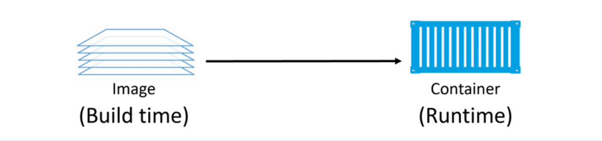
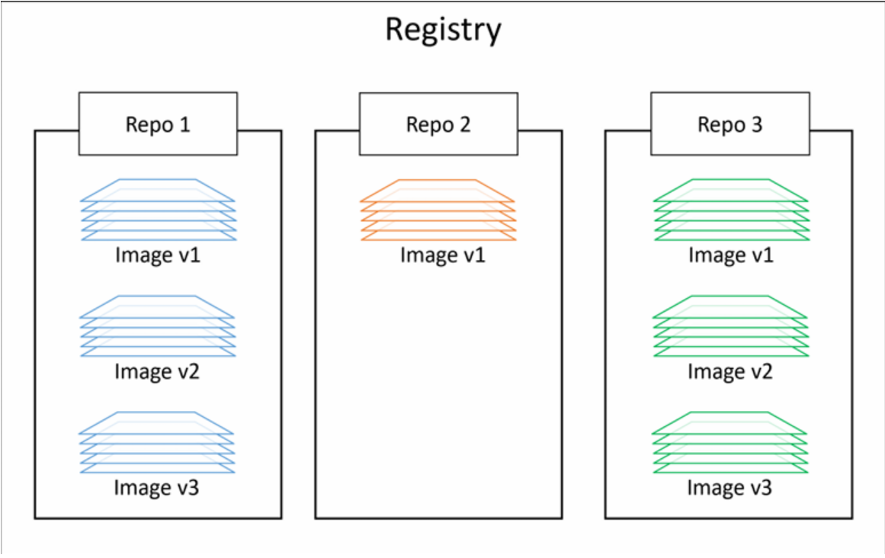
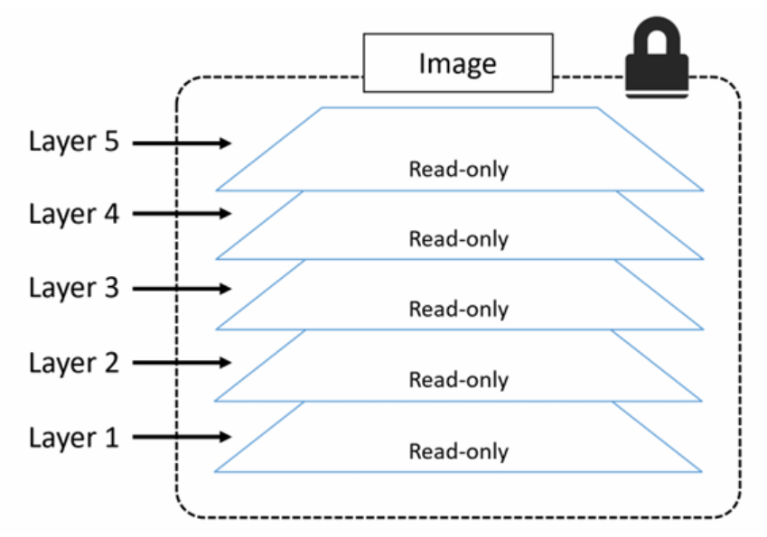
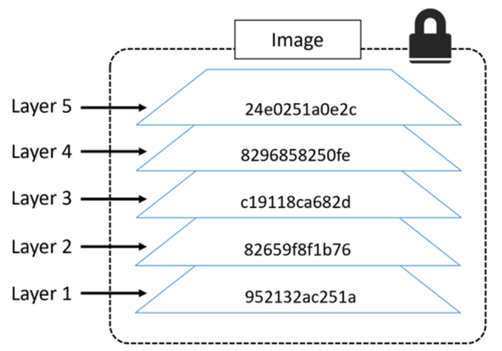

# Docker images
## 1. Khái niệm
Docker image là một bản mẫu read-only chứa toàn bộ những gì cần thiết để tạo và chạy một container. Nó giống như một snapshot của một môi trường ứng dụng.

Docker Image thường bao gồm:
- **Base OS** (Ubuntu, Alpine, Debian,...)
- **Runtime**
  - Python
  - Java
  - Node.js
  - .NET
- **Application**
- **Libraries/Dependencies**
- **Configuration**
- **Environment Variables (nếu có)**
- **Entrypoint/Command** để khởi động chương trình

Ta có thể xem `docker image` giống như là `VM template`
- VM template giống như 1 máy ảo đã tắt
- Docker Image giống như 1 container ở trạng thái chưa chạy

Ta có thể lấy Docker images bằng cách pull chúng từ một image registry - Docker Hub

Thao tác pull sẽ tải image về Docker host của bạn - nơi Docker có thể dùng để khởi chạy một hoặc nhiều container

Các image được tạo thành từ nhiều layer xếp chồng lên nhau và được biểu diễn như 1 đối tượng duy nhất

Bên trong image là một hệ điều hành được tinh gọn (cut-down OS) cùng với tất cả các file và dependencies cần thiết để chạy ứng dụng.

### Tóm tắt tổng kết:
- Docker Image là bản đóng gói bất biến (immutable package) chia ứng dụng dụng, runtime, thư viện, cấu hình phụ thuộc cần thiết để chạy.
- Image được tạo từ Dockerfile, bao gồm nhiều layer nhằm tối ưu lưu trữ và tái sử dụng.

## 2. Docker images
- Image giống như một container đang dừng. Ta có thể dừng 1 container và tạo ra 1 image mới từ chính nó
- Image được xem là các thành phần thuộc giai đoạn build, trong khi container là các thành phần thuộc giai đoạn chạy
- Image sau khi build sẽ không thay đổi. Nếu container chạy và sinh ra file nó chỉ tồn tại ở container nếu xóa container đi thì cũng sẽ mất file đó khi chạy lại Image.



### 2.1 Docker Images và Docker Container
Ta sử dụng các lệnh `docker container run `và `docker service create` để khởi chạy một hoặc nhiều container từ một image duy nhất

Khi bạn đã khởi chạy container từ một image, hai thành phần này sẽ trở nên phụ thuộc lẫn nhau và bạn không thể xóa image cho đến khi container cuối cùng sử dụng nó đã được dừng và xóa hoàn toàn.

- Image là bản mẫu chỉ đọc (read-only template).
- Container là một instance được tạo từ image.
- Một image có thể tạo nhiều container.
- Chừng nào còn ít nhất một container (đang chạy hoặc đã dừng) sử dụng image, Docker sẽ không cho phép xóa image.
- Muốn xóa image, bạn phải dừng (`docker stop`) và xóa (`docker rm`) tất cả các container đang tham chiếu đến image đó, sau đó mới dùng `docker rmi`. Điều này giúp tránh làm hỏng các container vẫn còn phụ thuộc vào các layer của image.

### 2.2 Dung lượng Images 
Mục đích chính của container là chạy một ứng dụng hoặc dịch vụ duy nhất. Điều này có nghĩa là nó chỉ cần mã nguồn và các phụ thuộc của ứng dụng/dịch vụ đó — không cần bất kỳ thứ gì khác. Kết quả là các image rất nhỏ, đã được loại bỏ tất cả những thành phần không cần thiết.

### 2.3 Pulling images
Khi bạn vừa cài Docker host sẽ không có bất kì image nào trong repository cục bộ của nó

Repository image cục bộ trên Docker host chạy Linux thường nằm tại đường dẫn:`/var/lib/docker/<storage-driver>`

Kiểm tra docker host có image nào trong repo cục bộ không bằng `docker image ls`

Quá trình đưa image về Docker host được gọi là pulling (kéo image):

### 2.4 Image registries
Chúng ta lưu trữ image tại các nới tập trung gọi là image registry. Điều này giúp việc chia sẻ và truy cập image trở nên dễ dàng hơn

Registry phổ biến nhất là Docker Hub

Cách lưu trữ trong `image registry`



### 2.5 Official and unofficial repositories
Docker hub có khái niệm official repositories (repository chính thức) và unofficial repositories (repository không chính thức)
- Official repositories đã được Docker kiểm tra quản lý
- Unofficial repositores không được quản lý bởi docker.

Một số repo chính thức:
```bash
nginx: https://hub.docker.com/_/nginx/
busybox: https://hub.docker.com/_/busybox/
redis: https://hub.docker.com/_/redis/
mongo: https://hub.docker.com/_/mongo/
```
Một số repo không chính thức
```bash
nigelpoulton/tu-demo — https://hub.docker.com/r/nigelpoulton/tu-demo/
nigelpoulton/pluralsight-docker-ci — https://hub.docker.com/r/nigelpoulton/pluralsight-docker-ci/
```
### 2.6 Image naming and tagging
Việc định danh image từ repository chính thức rất đơn giản: chỉ cần cung cấp tên repo và tag, phân cách bằng dấu `:`

Cú pháp:
```bash 
$ docker image pull <repository>:<tag>
```

**NOTE**:
- Nếu không chỉ định tag, mặc định sẽ là `latest` nếu image không có tag `latest` trên repository -> lỗi
- 1 image có tag `latest` không đảm bảo đó là phiên bản mới nhất 

Để thêm 1 image từ repo không chính thức, cũng giống như repo chính thức nhưng ta thêm tên của người dùng docker hub hoặc tên của tổ chức:
```bash
docker image pull nigelpoulton/tu-demo:v2
```
Nếu thêm image từ 1 bên thứ 3, ta phải thêm trước kho lưu trữ tên của bên thứ 3 đó.
```bash
docker image pull gcr.io/google-containers/git-sync:v3.1.5
```
### 2.7 Images with muliple tags
Để pull tất cả các image trong 1 repo, sử dụng option `-a` vào lệnh `docker image pull`

Ví dụ:
```bash
docker image pull -a mongo
```

### 2.8 Searching Docker Hub from the CLI
Ta có thể tìm kiếm image trên Docker Hub bằng lệnh: `docker search`

```bash
root@client:~# docker search alpine
NAME                DESCRIPTION                                     STARS     OFFICIAL
alpine              A minimal Docker image based on Alpine Linux…   11490     [OK]
alpine/git          A  simple git container running in alpine li…   252
alpine/socat        Run socat command in alpine container           115
alpine/curl                                                         12
alpine/helm         Auto-trigger docker build for kubernetes hel…   70
alpine/k8s          Kubernetes toolbox for EKS (kubectl, helm, i…   65
alpine/bombardier   Auto-trigger docker build for bombardier whe…   28
alpine/httpie       Auto-trigger docker build for `httpie` when …   22
alpine/terragrunt   Auto-trigger docker build for terragrunt whe…   18
alpine/openssl      openssl                                         8
alpine/kubectl      Kubernetes command-line tool for managing cl…   1
alpine/flake8       Auto-trigger docker build for fake8 via ci c…   2
alpine/psql         psql — The PostgreSQL Command-Line Client       4
alpine/ansible      run ansible and ansible-playbook in docker      37
alpine/jmeter       run jmeter in Docker                            9
alpine/openclaw     OpenClaw - Your own personal AI assistant. A…   109
alpine/java         Repo containing the build scripts to produce…   5
alpine/semver       Docker tool for semantic versioning             4
alpine/xml          several xml tools to work on xml file as jq …   2
alpine/mongosh      mongosh - MongoDB Command Line Database Tools   2
alpine/mysql        mysql client                                    7
alpine/cfn-nag      Auto-trigger docker build for cfn-nag when n…   0
alpine/gcloud       Auto-trigger docker build for gcloud (google…   0
alpine/crane                                                        0
alpine/bundle       This repository has been archived by the own…   1
root@client:~#
```
Ta thấy rằng một số repository là chính thức (official), và một số là không chính thức (unofficial), dùng tùy chọn `--filter "is-official=true"` để chỉ hiển thị các repository chính thức:
```bash
root@client:~# docker search alpine --filter "is-official=true"
NAME      DESCRIPTION                                     STARS     OFFICIAL
alpine    A minimal Docker image based on Alpine Linux…   11490     [OK]
root@client:~#
```

### 2.9 Layers
Một Docker image thực chất là tập hợp các layer read-only, liên kết với nhau, trong đó mỗi layer chứa một hoặc nhiêu file:



Docker sẽ chịu trách nhiệm xếp chồng (stack) các layer này lại và biểu diễn chúng như một đối tượng thống nhất duy nhất.

Có một vài cách để xem và kiểm tra các layer tạo nên một image. Thực tế, chúng ta đã thấy một cách trước đó khi pull image. Ví dụ sau xem chi tiết hơn quá trình pull một image:

```bash
$ docker image pull ubuntu:latest
...
952132ac251a: Pull complete
82659f8f1b76: Pull complete
c19118ca682d: Pull complete
8296858250fe: Pull complete
24e0251a0e2c: Pull complete
...
```
Mỗi dòng kết thúc bằng “Pull complete” đại diện cho một layer của image được tải về. Như vậy, image này có 5 layer



Một cách khác để xem các layer là dùng lệnh `docker image inspect`:
```bash
root@client:~# docker image inspect mongo:4.2.6
[
    {
        "Architecture": "amd64",
        "Author": "",
        "Comment": "",
        "Config": {
            "ArgsEscaped": true,
            "AttachStderr": false,
            "AttachStdin": false,
            "AttachStdout": false,
            "Cmd": [
                "mongod"
            ],
            "Domainname": "",
            "Entrypoint": [
                "docker-entrypoint.sh"
            ],
            "Env": [
                "PATH=/usr/local/sbin:/usr/local/bin:/usr/sbin:/usr/bin:/sbin:/bin",
                "GOSU_VERSION=1.12",
                "JSYAML_VERSION=3.13.1",
                "GPG_KEYS=E162F504A20CDF15827F718D4B7C549A058F8B6B",
                "MONGO_PACKAGE=mongodb-org",
                "MONGO_REPO=repo.mongodb.org",
                "MONGO_MAJOR=4.2",
                "MONGO_VERSION=4.2.6"
            ],
            "ExposedPorts": {
                "27017/tcp": {}
            },
            "Hostname": "",
            "Image": "",
            "Labels": null,
            "OnBuild": null,
            "OpenStdin": false,
            "StdinOnce": false,
            "Tty": false,
            "User": "",
            "Volumes": {
                "/data/configdb": {},
                "/data/db": {}
            },
            "WorkingDir": ""
        },
        "Created": "2020-04-24T22:00:49.344239461Z",
        "DockerVersion": "",
        "GraphDriver": {
            "Data": null,
            "Name": "overlayfs"
        },
        "Id": "sha256:c880f6b56f443bb4d01baa759883228cd84fa8d78fa1a36001d1c0a0712b5a07",
        "Metadata": {
            "LastTagTime": "2026-04-13T08:34:58.275852401Z"
        },
        "Os": "linux",
        "Parent": "",
        "RepoDigests": [
            "mongo@sha256:c880f6b56f443bb4d01baa759883228cd84fa8d78fa1a36001d1c0a0712b5a07"
        ],
        "RepoTags": [
            "mongo:4.2.6"
        ],
        "RootFS": {
            "Layers": [
                "sha256:b7f7d2967507ba709dbd1dd0426a5b0cdbe1ff936c131f8958c8d0f910eea19e",
                "sha256:a6ebef4a95c345c844c2bf43ffda8e36dd6e053887dd6e283ad616dcc2376be6",
                "sha256:838a37a24627f72df512926fc846dd97c93781cf145690516e23335cc0c27794",
                "sha256:28ba7458d04b8551ff45d2e17dc2abb768bf6ed1a46bb262f26a24d21d8d7233",
                "sha256:081e093b05409b036ea99b64c5a8ac46bce528e70178dad21970fbfdc2190c64",
                "sha256:63c5a29626008451402e344c77ea68deba319f105d083d719071796ed667232a",
                "sha256:814c60bd0a7beb6b36c5ad2d707e2a77548a3b879c0d01da0f7c280b7a77e337",
                "sha256:f42c31ea970ded96a424219f42f4b921fa52465b3f2b3d03d1dadec09b638b47",
                "sha256:ab5d47dfdcb864458ba539468058d28188840582fac981a1797150417596e5b9",
                "sha256:910e3db7778913724826b72318af53d92b273e5c5910a9d9b32cc3bece091094",
                "sha256:633f259f3a9f233af93e8afb11c59f054f383254f6f031fa6b75c9daf36a8d6a",
                "sha256:8189bff552513a43a62acd4213cc29266cb94a6d9719b1971737d2d057cddb2b",
                "sha256:23d91afd9b9345dc437e35e33f8d1d9997925cb1a3e025c6b8643d6b817b81e2"
            ],
            "Type": "layers"
        },
        "Size": 164663505
    }
]
root@client:~#
```
Docker sử dụng một storage driver để quản lý việc xếp chồng các layer và hiển thị chúng như một filesystem/image thống nhất.

Một số storage driver trên Linux:
- AUFS
- overlay2
- btrfs
- zfs

### 2.10 Sharing image layers
Nhiều image có thể chia sẻ layer, nó dẫn đến hiệu quả về không gian và hiệu suất.

Khi pull image, các dòng kết tục là Already exists tức là đã tồn tại.

```bash
2.8.0-rc4: Pulling from library/mongo
Image docker.io/library/mongo:2.8.0-rc4 uses outdated schema1 manifest format. Please upgrade to a schema2 image for better future compatibility. More information at https://docs.docker.com/registry/spec/deprecated-schema-v1/
a3ed95caeb02: Pull complete
ee48d0fb051e: Already exists
785429c6e4b2: Already exists
60f811ea05a5: Already exists
30eeb62267ea: Already exists
4a806b90a51b: Already exists
a91900b8023e: Pull complete
8aac0828f4dc: Pull complete
8a77cd9c2154: Pull complete
Digest: sha256:173da3f554052949ce3baec9740fae6e79eda91592029e46f7653aa956289376
```
### 2.11 Pulling images by digest
Sử dụng digests để xem thông tin chi tiết về image:
```bash
root@dockersrv:~# docker image ls --digests mongo
REPOSITORY          TAG                 DIGEST                                                                    IMAGE ID            CREATED             SIZE
mongo               4.2.6               sha256:c880f6b56f443bb4d01baa759883228cd84fa8d78fa1a36001d1c0a0712b5a07   3f3daf863757        10 months ago       388MB
mongo               3-stretch           sha256:0a1d6cd8790b49ed471ed2197f37b3a812c4226962768603b024703f8b74260d   27d820d7098b        23 months ago       373MB
mongo               3-jessie            sha256:c2f6293248cb617bad30db9d2d569ba670ff4c5f9d7ed4764e1db8436fce0673   b9406b8a16ec        2 years ago         368MB
mongo               2                   sha256:08e199598f4f874d14b4f90727dade0384b0fcfe8479355ed2cc5391c46e8ece   1999482cb0a5        4 years ago         391MB
mongo               2.6                 sha256:08e199598f4f874d14b4f90727dade0384b0fcfe8479355ed2cc5391c46e8ece   1999482cb0a5        4 years ago         391MB
mongo               2.6.12              sha256:08e199598f4f874d14b4f90727dade0384b0fcfe8479355ed2cc5391c46e8ece   1999482cb0a5        4 years ago         391MB
mongo               2.4                 sha256:cb40b710f355cfe68a9fecc021a4726b8f2eb61bb66978d1b1f9b5c4f9244350   2affaf1f84e0        4 years ago         342MB
mongo               2.4                 sha256:fa5f00c5e51e8dcd4070c2334cdbfc34904a802eef615dcac848def72189e7e6   2affaf1f84e0        4 years ago         342MB
mongo               2.4.14              sha256:cb40b710f355cfe68a9fecc021a4726b8f2eb61bb66978d1b1f9b5c4f9244350   2affaf1f84e0        4 years ago         342MB
mongo               2.4.14              sha256:fa5f00c5e51e8dcd4070c2334cdbfc34904a802eef615dcac848def72189e7e6   2affaf1f84e0        4 years ago         342MB
mongo               2.2                 sha256:1e164f0403ae362c4e4ffee84b9611df9c26aa28b397025597555a43a16d8ca9   8558fe135d54        4 years ago         237MB
mongo               2.2                 sha256:dceb786333aa702437e2ccdfc52301f410295f2d573906ac6b49c78041491f62   8558fe135d54        4 years ago         237MB
mongo               2.2.7               sha256:1e164f0403ae362c4e4ffee84b9611df9c26aa28b397025597555a43a16d8ca9   8558fe135d54        4 years ago         237MB
mongo               2.2.7               sha256:dceb786333aa702437e2ccdfc52301f410295f2d573906ac6b49c78041491f62   8558fe135d54        4 years ago         237MB
mongo               2.6.11              sha256:0565e39843b9f8afcffde02ad1ac5c2c257a87c07b2ba5903cbfee1ac852b79e   f36fb0070896        5 years ago         391MB
mongo               2.6.10              sha256:098e6222ce83aeb9e07d1e64c606362d9e9def69ea4f0b5f2f366acf5f967029   54fb6f9984dd        5 years ago         393MB
mongo               2.6.9               sha256:28278a53ec228afb4e8886f9c641b6ec48fa46a548dfd952d6c65b1a42ef2ff1   0eb5bcb2f408        5 years ago         392MB
mongo               2.4.13              sha256:32e516384aebdfbce721531a774e782137293ac222057cadbbe7f4113fa8031a   1bc8a1a8ad40        5 years ago         344MB
...
```
Ta có thể sử dụng giá trị digest để pull các image
```bash
root@dockersrv:~# docker image pull mongo@sha256:0a1d6cd8790b49ed471ed2197f37b3a812c4226962768603b024703f8b74260d
sha256:0a1d6cd8790b49ed471ed2197f37b3a812c4226962768603b024703f8b74260d: Pulling from library/mongo
27833a3ba0a5: Pull complete
179c807caa04: Pull complete
2b23ef1b0ab3: Pull complete
e3cf7dbbd547: Pull complete
dc233bb2f309: Pull complete
ef26a67bf04e: Pull complete
55ecb543777e: Pull complete
35f8c6ed1ba6: Pull complete
2a39da2ca07c: Pull complete
3fa5f1b76807: Pull complete
Digest: sha256:0a1d6cd8790b49ed471ed2197f37b3a812c4226962768603b024703f8b74260d
Status: Downloaded newer image for mongo@sha256:0a1d6cd8790b49ed471ed2197f37b3a812c4226962768603b024703f8b74260d
docker.io/library/mongo@sha256:0a1d6cd8790b49ed471ed2197f37b3a812c4226962768603b024703f8b74260d
```
### 2.12 Multi-architecture images
Image Docker có thể hỗ trợ nhiều kiến trúc, có nghĩa là 1 image có thể chứa nhiều biến thể cho các kiến trúc khác nhau và đôi khi cho các hệ điều hành khác nhau.

Khi chạy 1 image hỗ trợ multi-architecture, docker sẽ tự động chọn 1 biến thể image phù hợp với hệ điều hành và kiến trúc của máy. Hầu hết các image đều cung cấp nhiều loại kiến trúc khác nhau
### 2.13 Deleting Images
Khi không còn cần image trên docker của mình nữa, ta có thể xóa image sử dụng `docker image rm`.

Khi xóa nó sẽ xóa tất cả các image và các layer của nó. Tuy nhiên, nếu 1 layer của image chia sẻ cho nhiều image khác thì layer đó sẽ không bị xóa đến khi tất cả các image tham chiếu đến nó bị xóa hết.

VÍ dụ:
```bash
root@dockersrv:~# docker image rm mongo:3-stretch
Untagged: mongo:3-stretch
Untagged: mongo@sha256:0a1d6cd8790b49ed471ed2197f37b3a812c4226962768603b024703f8b74260d
Deleted: sha256:27d820d7098b15b0d6068602829923e6c4b41bcf0ade658ed0c1870c1de92cb8
Deleted: sha256:b1ee229e143880a1d73a1c0b7323d948561be5f61e1ef90375621dfc698f6c59
Deleted: sha256:8b4a1814b5345e4e9b8f2c83a278a2f50b3405f8a459199753b2dc3823d2b789
Deleted: sha256:6f7b7d4ee701d7bb8c98b197a6a04ad4d3fb3fe87e3073d6a3d60596b7961fb0
Deleted: sha256:f4aa99854347737a34b3a541a2a1362046b128dcd1168fb1b3cc789d55553d7b
Deleted: sha256:e373be77356629318055f4088676a04942a597ef66e5fa409d58b6d9216dbb93
Deleted: sha256:b9e28f8c7b5b375b831d835edbddcde369e184db1aa7c3d5e5245441e8b1a5de
Deleted: sha256:97a7562adc7a05b8689d822ff2e1d5cb191dd00c072a5798c81a3b533bc28678
Deleted: sha256:6fd508e0bc51dd486f70cf3d33523241c6c0fc9c2ae72e466f44e295f334b51a
Deleted: sha256:c22e25de1a389ee58fb7d89a4c3c4a5b3998ecefadcd464c51e338784577e0de
Deleted: sha256:5dacd731af1b0386ead06c8b1feff9f65d9e0bdfec032d2cd0bc03690698feda
```
Có thể xóa nhiều image như sau:
```bash
root@dockersrv:~# docker image rm d5e1e48cf932 27d820d7098b
Untagged: nigelpoulton/tu-demo:v2
Untagged: nigelpoulton/tu-demo@sha256:c9f8e1882275d9ccd82e9e067c965d1406e8e1307333020a07915d6cbb9a74cf
Deleted: sha256:d5e1e48cf932ef80c06376301372417655117499296d22c01ec033e16b91725a
Deleted: sha256:1382ba490d8828155a86a238d88ab271e3e69e2b94ebcafcab887ef58d65f809
Deleted: sha256:412fe2f6a42669f6c808845d658afc44a096a1bc70d2c26cf1fa50dfb01fb66b
Deleted: sha256:103e4d7a68004e8768cfe98cb81d382757137b5a07bc46f6af47e816c18f8979
Deleted: sha256:f09ab044209a7f7d4793f9e7b12b5cabf4de00429df383c44a1302fad78c831a
Deleted: sha256:0b03063a13c53a18dd2db3546822fd563736a1a01a6b50f2e5aaf92ac490e72d
Deleted: sha256:dbb407f74d84e0e2513b1bd63a7a216a2b084ccef72f634f31bbede3968ac6ba
Deleted: sha256:e0cf834dcac27a0e8b152807c73aad7098d8988be0f80e849db9c497718d75ac
Deleted: sha256:9e5f8d6d3f018d99738e898f4b5f22290e590c0801544b7975d445cfb9447655
Deleted: sha256:beee9f30bc1f711043e78d4a2be0668955d4b761d587d6f60c2c8dc081efb203
Untagged: mongo@sha256:0a1d6cd8790b49ed471ed2197f37b3a812c4226962768603b024703f8b74260d
Deleted: sha256:27d820d7098b15b0d6068602829923e6c4b41bcf0ade658ed0c1870c1de92cb8
Deleted: sha256:b1ee229e143880a1d73a1c0b7323d948561be5f61e1ef90375621dfc698f6c59
Deleted: sha256:8b4a1814b5345e4e9b8f2c83a278a2f50b3405f8a459199753b2dc3823d2b789
Deleted: sha256:6f7b7d4ee701d7bb8c98b197a6a04ad4d3fb3fe87e3073d6a3d60596b7961fb0
Deleted: sha256:f4aa99854347737a34b3a541a2a1362046b128dcd1168fb1b3cc789d55553d7b
Deleted: sha256:e373be77356629318055f4088676a04942a597ef66e5fa409d58b6d9216dbb93
Deleted: sha256:b9e28f8c7b5b375b831d835edbddcde369e184db1aa7c3d5e5245441e8b1a5de
Deleted: sha256:97a7562adc7a05b8689d822ff2e1d5cb191dd00c072a5798c81a3b533bc28678
Deleted: sha256:6fd508e0bc51dd486f70cf3d33523241c6c0fc9c2ae72e466f44e295f334b51a
Deleted: sha256:c22e25de1a389ee58fb7d89a4c3c4a5b3998ecefadcd464c51e338784577e0de
Deleted: sha256:5dacd731af1b0386ead06c8b1feff9f65d9e0bdfec032d2cd0bc03690698feda
```
Xóa tất cả image ta sử dụng lệnh sau:
```bash
docker image rm $(docker image ls -q) -f
```

Image không chứa layer theo kiểu sở hữu độc quyền mà Image chỉ à một tập các tham chiếu (references) đến các layer

## Images - The commands
- `docker image pull`: là lệnh dùng để tải image về. Chúng ta pull image từ các repository nằm trong các registry từ xa. Mặc định image sẽ được pull từ Docker Hub
- `docker image ls`: liệt kê tất cả các image được lưu trong bộ nhớ cache cục bộ của Docker host. Để xem digest SHA256 của image, thêm flag `--digests`.
- `docker image inspect`: cung cấp đầy đủ thông tin chi tiết của một image bao gồm dữ liệu về layer và metadata
- `docker manifest inspect`: cho phép bạn kiểm tra manifest list