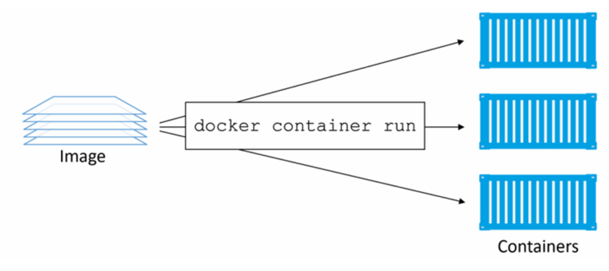

# Docker Containers
## 1. Khái niệm
Container là instance đang chạy (runtime instance) của một image. Một image có thể tạo ra nhiều container độc lập. Đây là mối quan hệ cốt lõi trong Docker: Image là khuôn mẫu, Container là đối tượng được tạo ra từ khuôn mẫu đó. Tương tự như việc bạn có thể khởi động một máy ảo từ một VM template, bạn có thể khởi chạy 1 hoặc nhiều container từ một image duy nhất



Cách đơn giản nhất để khởi chạy container là dùng lệnh `docker container run`

**Cú pháp**:
```bash
docker container run <image> <app>
```
Ví dụ sau sẽ khởi chạy một container Ubuntu chạy shell Bash:
```bash
$ docker container run -it ubuntu /bin/bash
```

## Docker containers - Cơ chế hoạt động và tiến trình
### Checking that Docker is running
Khi đăng nhập vào một Docker host ta nên kiểm tra lại trạng thái hoạt động của Docker:
```bash
$ docker version
Client: Docker Engine - Community
Version: 19.03.8
API version: 1.40
OS/Arch: darwin/amd64
Experimental: true
Server: Docker Engine - Community
Engine:
Version: 19.03.8
API version: 1.40 (minimum version 1.12)
OS/Arch: linux/amd64
Experimental: true
<Snip>
```
Nếu gặp lỗi ta có thể kiểm tra docker daemon:
- Linux không sử dụng systemd:
```bash
$ service docker status
docker start/running, process 29393
```
- Linux sử dụng systemd:
```bash
$ systemctl is-active docker
active
```

### Lệnh khởi chạy
- Khi bạn gõ lệnh chạy một container. Ví dụ:
```bash
docker container run -it ubuntu /bin/bash
```
  -  Docker client đóng gói lệnh gửi đến API server trên Docker Daemon.
  - Daemon kiểm tra xem Image đã có ở máy local
  - Nếu chưa có, nó sẽ tự động pull từ Docker Hub
  - Sau khi có image, Daemon gọi các thành phần khác như containerd, runc và tạo dựng, kích hoạt Container.

### Container Lifecycle
Vòng đời của một container trải qua các trạng thái: Tạo ra (Created) -> Hoạt động (Up) -> Tạm nghỉ (Stopped/Exited) -> Xóa bỏ (Deleted).

**Tính chất Immutable (Bất biến) & Dữ liệu**: Khi container ở trạng thái **Stopped**, nó giống như một máy ảo bị tắt nguồn. Mọi cấu hình và file bạn tạo ra bên trong nó (ví dụ trong thư mục `/tmp`) vẫn còn nguyên vẹn và có thể truy cập lại khi bạn `start` nó lên. Tuy nhiên, dữ liệu này nằm trên filesystem của Docker host, nếu host bị lỗi hoặc container bị xóa (`rm`), dữ liệu sẽ mất hoàn toàn.

**Cách tắt Container an toàn (Stopping Gracefully)**
- `docker container stop`: Gửi tín hiệu `SIGTERM` đến tiến trình PID 1 để thông áo Shutdown. Nếu sau 10 giây tiến trình không tự tắt, Docker mới ép buộc bằng `SIGKILL`.
- `docker container rm -f` (Bắt buộc/Ép xóa): Bỏ qua mọi thủ tục, gửi thẳng tín hiệu SIGKILL để triệt hạ tiến trình ngay lập tức. Ứng dụng không có cơ hội dọn dẹp hay lưu trữ công việc đang dang dở.

### Tính năng tự phục hồi
Docker cung cấp cơ chế tự sửa chữa (Self-healing) để tự động khởi động lại container khi có sự cố xảy ra thông qua 3 chính sách (Policy) chính:

| Tên Policy |	Hành vi của Docker|
|------------|--------------------|
| `always`	 | Luôn luôn khởi động lại container nếu nó bị dừng. Ngoại lệ duy nhất là khi chính bạn chủ động gõ lệnh docker container stop.| 
|`unless-stopped`	| Tương tự như always, nhưng nếu container đang ở trạng thái Dừng (Stopped) trước khi Docker Daemon bị restart, nó sẽ không tự chạy lại.|
| `on-failure`|	Chỉ khởi động lại container nếu ứng dụng bên trong bị crash hoặc thoát ra với một mã lỗi khác 0.|

### Chạy Container trong thực tế và Ứng dụng mặc định
Khi bạn triển khai một Container dịch vụ:

Ví dụ, khi bạn triển khai lệnh:
```bash
docker run \
  --name webserver \
  -d \
  -p 80:8080 \
  nigelpoulton/pluralsight-docker-ci
```
Docker sẽ làm 4 việc:
- Tạo một container
- Khởi động tiến trình bên trong container
- Tạo mạng riêng cho container
- Publish (mở) cổng từ host vào container.


- `-d`(**Detach mode**): Chạy ngầm dưới nền, Sau khi container chạy, Docker không giữ terminal của bạn nữa mà trả terminal lại ngay.
  - Không dùng `d`, bạn không gõ được lệnh khác vì Docker sẽ gắn terminal của bạn vào tiến trình nginx. Nếu bạn Ctrl+C thì container cũng mất.

- `-p 80:8080`(**Port mapping**): Ánh xạ cổng. Cổng `80` của máy Host bên ngoài sẽ kết nối trực tiếp vào cổng `8080` ở bên trong mạng lưới cô lập của Container. Người dùng truy cập vào IP máy host qua cổng 80 sẽ thấy trang web của container.

**Giải thích đọc thêm**:
- Chúng ta đều biết container có mạng riêng.
- Giả sử host của bạn có IP: `192.168.1.100`
- Docker tạo một container. Container KHÔNG dùng trực tiếp mạng của host. Nó có network namespace riêng. Ví dụ: 
```bash
Container

eth0

172.17.0.2
```
- Container có IP riêng, host có IP riêng.
- Giả sử image chạy Spring Boot cấu hình `server.port=8080`. Bên trong container: `0.0.0.0:8080` hay `Container:8080`

Gói tin nó sẽ đi như này:
```bash
Browser
      │
      ▼
192.168.1.100:80
      │
      ▼
Docker Port Mapping
      │
      ▼
172.17.0.2:8080
      │
      ▼
Spring Boot
```

#### Nếu có nhiều backend
- Sử dụng Reverse Proxy: Nginx hoặc Traefix:
```bash
Client
   │
example.com
   │
Host:80
   │
 Nginx
 ├── /users   -> user-api:8080
 ├── /orders  -> order-api:8080
 └── /product -> product-api:8080
```

### Inspecting containers
- Ta không cần chỉ định ứng dụng mà container vẫn biết đường chạy Web 

Đó là nhờ các chỉ thị `Cmd` hoặc `Entrypoint` đã được người viết cấu hình (nhúng sẵn) bên trong Docker Image khi họ build (xây dựng) nó. Bạn có thể kiểm tra ứng dụng mặc định này bằng lệnh `docker image inspect`.

- Lệnh này được lưu trong **metadata của Image**, không phải trong tên image hay lệnh docker run.
- Khi bạn chạy `docker run image_name`, Docker đọc metadata đó rồi khởi động đúng tiến trình (ví dụ `nginx`, `python app.py`, `java -jar app.jar`).
- Bạn có thể xem các cấu hình này bằng docker image inspect `<image>`, đặc biệt là các trường `Config.Cmd` và `Config.Entrypoint`.

- **Ví dụ**:
```dockerfile
ENTRYPOINT ["python"]
CMD ["app.py"]
```
- Nó sẽ thực thi chạy: python app.py

- **CMD**: là lệnh mặc định có thể ghi đè.
- **Entrypoint**: Chương trình bắt buộc phải chạy
### Tóm tắt bộ lệnh quản lý Container cần nhớ:
- `docker container run`: Khởi tạo và chạy một container mới từ image
- `docker container ls`: liệt kê các container đang chạy (`-a` để xem toàn bộ bao gồm cả container đã dừng).
- `docker container stop`/`start`: Tạm dừng, kích hoạt lại một container.
- `docker container exec`: Nhảy vào bên trong hoặc chạy thêm một lệnh mới bên trong một container đang hoạt động.
- `docker container inspect`: Xem toàn bộ lý lịch, thông số mạng, cấu hình runtime của container dưới dạng file JSON
- **Dọn dẹp nhanh**: `docker container rm $(docker container ls -aq) -f` (Lệnh xóa sạch sành sanh toàn bộ các container đang có trên Host).