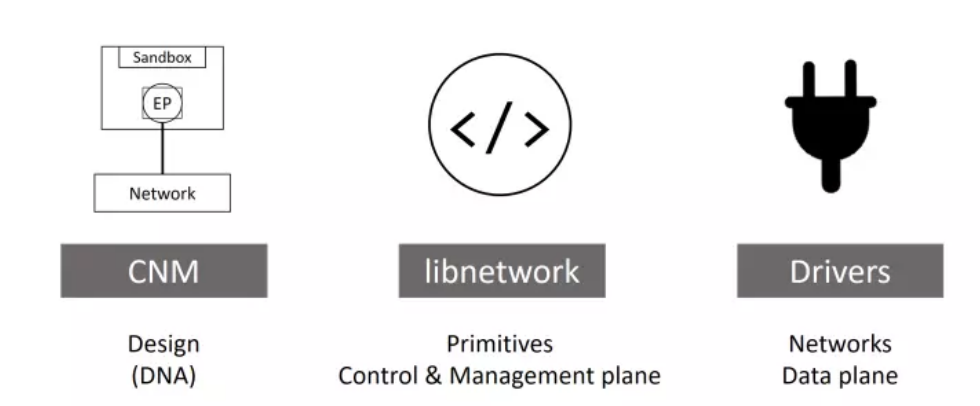
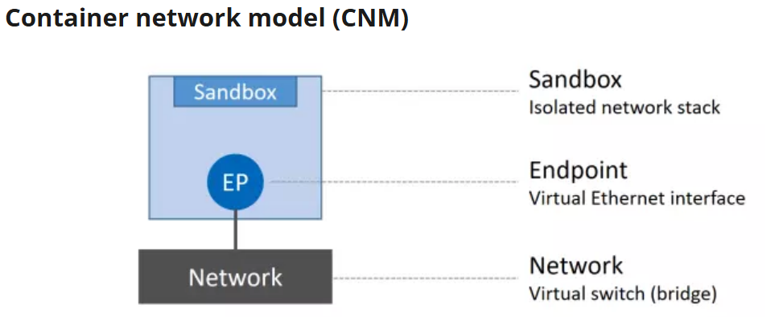
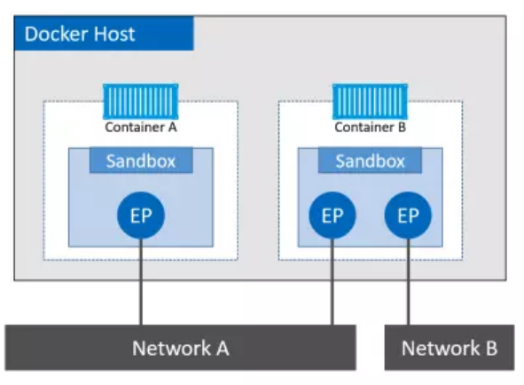
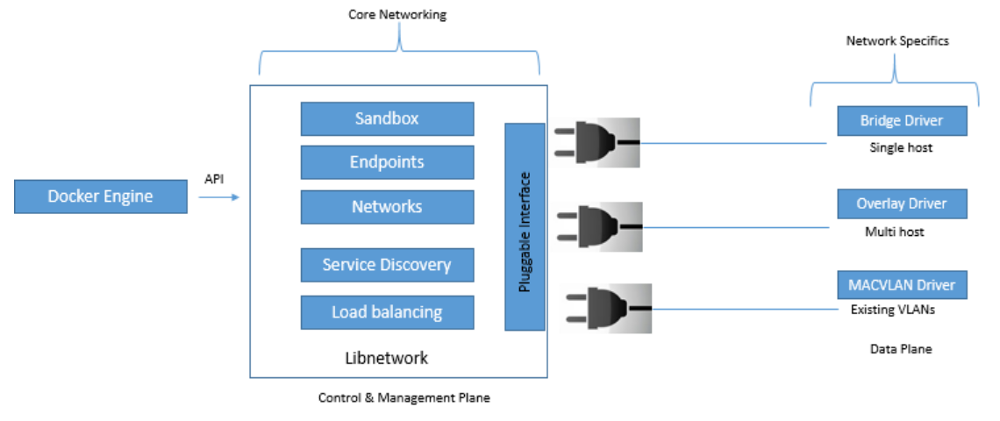
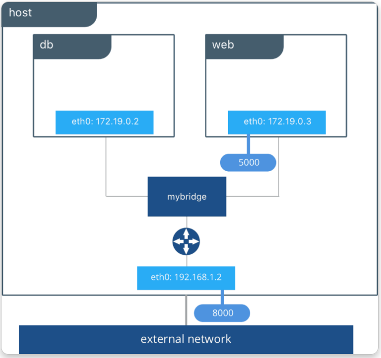
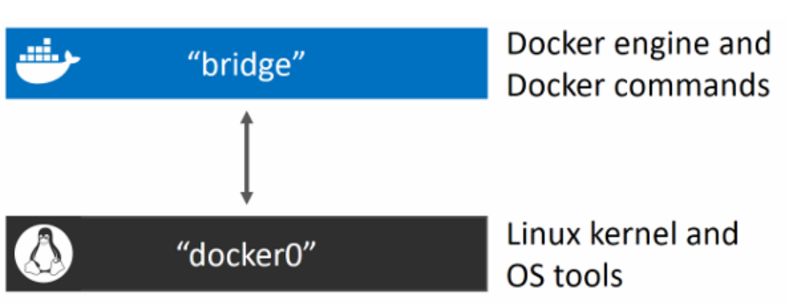
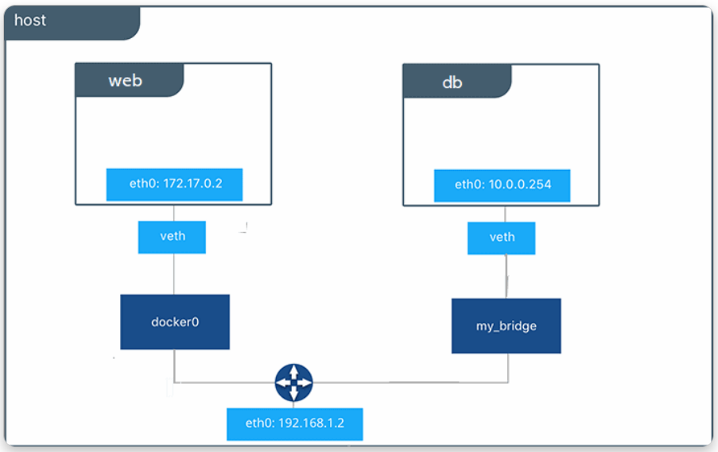
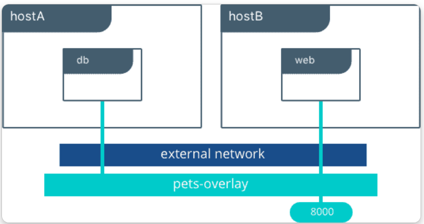
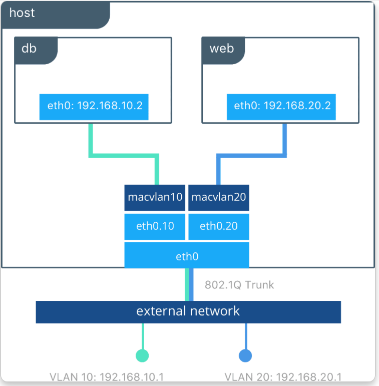

# Docker Network

## 1. Khái niệm

Docker networking bao gồm 3 thành phần chính:
- Container Network Model (CNM)
- libnetwork
- Drivers



CNM là bản thiết kế của Docker Networking. CNM không tạo ra mạng, cũng không phải phần mềm. Nó chỉ định nghĩa những block cơ bản cần thiết để cấu thành nên Docker network.

`libnetwork`: là một bản implementation của CNM, và được sử dụng bởi Docker, được viết bằng ngôn ngữ Go và implement đầy đủ những thành phần cốt lõi của CNM.

Các drivers: là các bản implement custom của mô hình CNM cho các mô hình mạng khác nhau, giúp chúng ta ứng dụng trong từng trường hợp sử dụng khác nhau.

### 1.1 CNM

CNM định nghĩa ba thành phần:
- Sandbox: là một stack network độc lập, nó bao gồm Ethernet interfaces, các bảng định tuyến (routing table), và DNS config.
- Endpoint: là một virtual network interface, cũng giống như các network interface hoạt động trên máy tính của chúng ta, nhiệm vụ của nó là tạo kết nối mạng. Trong thiết kế của CNM, nhiệm vụ của các endpoint là connect các sandbox đến network (block cuối trong CNM)
- Network: là một phần mềm implement tính năng của switch (hay còn được gọi là 802.1d bridge), nhiệm vụ của nó là gom nhóm và tách biệt một tập các endpoint cần giao tiếp với nhau.



Đơn vị nhỏ nhất trong môi trường Docker là container, vì thế ta có thể nói CNM cung cấp networking cho container

Ví dụ: 



- Container A có 1 interface (endpoint) và kết nối với Network A
- Container B có 2 interface (endpoint) và kết nối với cả Network A và B

Hai container có thể giao tiếp với nhau vì cùng nằm trong Network A. Tuy nhiên, 2 endpoints trong container B không thể giao tiếp trực tiếp với nhau nếu không có router layer 3 hỗ trợ.

**NOTE**: endpoint giống như card mạng bình thường - chỉ có thể kết nối đến 1 network duy nhất. Nếu muốn container kết nối nhiều network, nó phải có nhiều endpoint.

Mặc dù container A và container B chạy trên cùng 1 host, nhưng network stack của chúng vẫn hoàn toàn bị cô lập ở mức hệ điều hành nhờ vào sandbox.

### 1.2 Libnetwork
`libnetwork` là một bản implementation của CNM, nó là một open-source viết bằng Go, cross-platform và được sử dụng bởi Docker.

libnetwork triển khai đầy đủ cả ba thành phần được định nghĩa trong CNM

Nó còn có các chức năng khác như service discovery, ingress-base container load balancing (cơ chế load balancing trong docker swarm), network control plane, management plane (giúp quản lý network trên docker host).

### 1.3 Drivers



Driver chịu trách nhiệm tạo network, kết nối container, đảm bảo isolation

Docker đi kèm với 1 số driver tích hợp sẵn, được gọi là native drivers hoặc local drivers. Trên linux chúng là: bridge, overlay, macvlan

### 1.4 Single-host bridge networks
Loại mạng Docker đơn giản nhất là mạng bridge trên một host (single-host bridge network)
- Single-host: chỉ tồn tại trên 1 host duy nhất và chỉ có thể kết nối các container nằm trên host đó
- Bridge: sw layer 2

Docker tạo các mạng bridge single-host bằng driver bridge tích hợp sẵn


## 2. Các Network Driver

| Driver | Scope | Mô tả | Dùng khi |
|---|---|---|---|
| `bridge` | Single-host | Mạng nội bộ, mặc định | Dev, test, app single-host |
| `host` | Single-host | Dùng thẳng network stack host | Cần performance cao, không cần isolation |
| `none` | Single-host | Không có network | Container hoàn toàn cô lập |
| `overlay` | Multi-host | VXLAN giữa các Docker host | Docker Swarm |
| `macvlan` | Single-host | Container có MAC riêng, IP cùng LAN với host | Legacy app cần IP "thật" |
| `ipvlan` | Single-host | Tương tự macvlan nhưng dùng IP L3 | Switch không cho promiscuous mode |

```bash
docker network ls
# NETWORK ID     NAME      DRIVER    SCOPE
# 7b3c1f...      bridge    bridge    local
# 8a2e9d...      host      host      local
# 0d4f2a...      none      null      local
```

> Ba network `bridge`, `host`, `none` được tạo sẵn — không xóa được.

---

### 2.1 Bridge Network



Mỗi Docker host đều có một mạng bridge singel-host mặc định. Trên Linux là `bridge`.

Mỗi container mới chạy mà không chỉ định `--network` sẽ join vào bridge mặc định (`docker0` interface trên host).



Đặc điểm:
- mỗi container có IP riêng
- các container cùng Bridge giao tiếp được
- container bị cô lập khỏi Host
- muốn truy cập từ bên ngoài phải dùng Port Mapping (`-p`)

Bridge = mạng nội bộ cho container trên cùng một máy.

#### 2.1.1 Default bridge

```bash
root@client:~# docker network ls
NETWORK ID     NAME                      DRIVER    SCOPE
172d91a604f7   bridge                    bridge    local
cbf0877dd2d0   counter-app_counter-net   bridge    local
791a6832dcc4   host                      host      local
66bb744e0bbc   none                      null      local
root@client:~#
```

```bash
docker run -d --name web1 nginx
docker run -d --name web2 nginx

# Xem IP
docker inspect web1 -f '{{.NetworkSettings.IPAddress}}'
# 172.17.0.2
```

**Hạn chế của default bridge**:
-  Không có DNS theo tên container (phải dùng IP, hoặc `--link` đã deprecated).
-  Tất cả container đều ở chung mạng, không isolation.

#### 2.1.2 Custom bridge (KHUYẾN NGHỊ)

```bash
docker network create my-net

docker run -d --name web --network my-net nginx
docker run -d --name db  --network my-net postgres
```

**Ưu điểm**:
-  DNS tự động: `web` có thể ping `db` (Docker chạy DNS resolver nội bộ ở `127.0.0.11`).
-  Isolation: container ở các network khác nhau không thấy nhau.
-  Cấu hình được subnet, gateway, IP range.

#### 2.1.3 Tùy chọn khi tạo

```bash
docker network create \
  --driver bridge \
  --subnet=172.28.0.0/16 \
  --ip-range=172.28.5.0/24 \
  --gateway=172.28.0.1 \
  --opt "com.docker.network.bridge.name"="br-myapp" \
  my-net
```

### 2.2 Gắn IP cố định

```bash
docker run -d --name db \
  --network my-net \
  --ip 172.28.5.10 \
  postgres
```

### 2.3 Network alias

Cho container có nhiều tên DNS:
```bash
docker run -d --name db \
  --network my-net \
  --network-alias database \
  --network-alias postgres-primary \
  postgres

# Container khác có thể connect đến db / database / postgres-primary
```

---

### 2.4 Host Network



```bash
docker run -d --network host nginx
```

- Container không có mạng riêng
- Container dùng **trực tiếp** network stack của host (không có namespace network riêng).
- Port 80 trong container = port 80 trên host (không cần `-p`).
- Performance gần native (không có NAT, không có bridge).
-  **Không có isolation** — container có thể bind bất kỳ port nào của host.
-  Linux only (Docker Desktop trên Mac/Windows có hỗ trợ host mode partial từ 2024+).

Dùng cho: monitoring agent, performance-critical app, network tool (tcpdump, nmap…).

---

### 2.5 None Network

```bash
docker run -d --network none alpine sleep 3600
```

Container có namespace network riêng nhưng chỉ có `lo` (loopback). Không kết nối được bất cứ đâu. Dùng cho batch job xử lý hoàn toàn offline.

Container sẽ
- không có Internet
- không giao tiếp container khác
- không có interface mạng thông thường (ngoài loopback)

Thường dùng khi
- cần bảo mật cao
- hoặc muốn tự cấu hình networking
---

### 2.6 Overlay Network (Swarm)



Overlay tạo một mạng logic trải dài qua nhiều Docker Host.

Nhờ đó

container trên nhiều máy khác nhau vẫn có thể giao tiếp như đang ở cùng một mạng.

Overlay chủ yếu dùng trong Docker Swarm

Overlay = Một mạng trải dài qua nhiều Docker Host.

Kết nối container chạy trên nhiều Docker host khác nhau qua VXLAN.

```bash
# Trên manager node
docker swarm init
docker network create -d overlay --attachable my-overlay

# Service deploy lên swarm sẽ join network này
docker service create --name web --network my-overlay nginx
```

---

### 2.7 Macvlan / IPvlan



Docker sẽ cấp cho container
- MAC Address riêng
- IP riêng trên mạng LAN

Nghĩa là container xuất hiện như một máy tính thật trên mạng vật lý.

```bash
docker network create -d macvlan \
  --subnet=192.168.1.0/24 \
  --gateway=192.168.1.1 \
  -o parent=eth0 \
  pub-net

docker run -d --network pub-net --ip 192.168.1.100 nginx
```

- Container có MAC + IP riêng trên LAN — DHCP server thấy, máy khác trong LAN ping được.
-  Hầu hết switch enterprise **chặn promiscuous mode** → cần dùng `ipvlan l2` hoặc xin admin bật.
-  Host **không ping được** container trên macvlan (kernel limit) — cần workaround.

Ưu điểm
- không cần NAT
- không cần Port Mapping
- hiệu năng rất tốt

Nhược điểm
- cấu hình phức tạp hơn
- yêu cầu hạ tầng mạng hỗ trợ

Macvlan = Container trở thành một thiết bị thật trên mạng LAN.

Use case: legacy app yêu cầu IP riêng, IoT broker, network appliance.

---

## 3. Port Publishing

Khi dùng bridge network, container không trực tiếp truy cập được từ ngoài host. Phải **publish** port:

```bash
docker run -d -p 8080:80 nginx           # host:container, mọi interface
docker run -d -p 127.0.0.1:8080:80 nginx # Chỉ localhost
docker run -d -p 8080:80/tcp -p 53:53/udp nginx
docker run -d -p 8000-8005:8000-8005 myapp  # Range
docker run -d -P nginx                   # Tự động map tất cả EXPOSE ra port ngẫu nhiên

docker port web                          # Xem mapping
# 80/tcp -> 0.0.0.0:8080
```

### Cơ chế bên dưới

Docker tự tạo rule iptables ở chuỗi `DOCKER` để DNAT từ host port → container IP. Chính vì vậy:
- `ufw deny 8080` **KHÔNG chặn** được container expose 8080 — Docker bypass ufw qua rule iptables sớm hơn.
- Phải dùng chuỗi `DOCKER-USER` để chặn:

```bash
sudo iptables -I DOCKER-USER -p tcp --dport 8080 -j DROP
sudo iptables -I DOCKER-USER -p tcp -s 10.0.0.0/8 --dport 8080 -j ACCEPT
sudo iptables -I DOCKER-USER -p tcp --dport 8080 -j DROP
```

### Bind chỉ localhost (an toàn hơn)

```bash
docker run -d -p 127.0.0.1:5432:5432 postgres
```

Tránh expose DB ra internet vô tình.

---

## 4. DNS trong Docker

### 4.1 DNS resolver nội bộ

Container trong custom bridge dùng resolver `127.0.0.11`. Resolver này:
- Resolve tên container/service trong cùng network.
- Forward query khác lên DNS của host (hoặc DNS được cấu hình).

### 4.2 Custom DNS

```bash
docker run -d \
  --dns 1.1.1.1 --dns 8.8.8.8 \
  --dns-search corp.example.com \
  nginx
```

Hoặc cấu hình mặc định trong `/etc/docker/daemon.json`:
```json
{
  "dns": ["1.1.1.1", "8.8.8.8"]
}
```

### 8.3 `/etc/hosts` thủ công

```bash
docker run -d \
  --add-host db.local:192.168.1.10 \
  --add-host api.local:192.168.1.20 \
  nginx
```

---

## 5. Inspect & Debug

```bash
# Network info + container đang join
docker network inspect my-net

# IP container
docker inspect web -f '{{range .NetworkSettings.Networks}}{{.IPAddress}}{{end}}'

# Vào container debug
docker run --rm -it --network my-net nicolaka/netshoot

# Bên trong netshoot:
#   ping db
#   nslookup db
#   dig +short db
#   curl -v http://db:5432
#   traceroute web
#   tcpdump -i eth0
#   ss -tnp
```

> Image [`nicolaka/netshoot`](https://github.com/nicolaka/netshoot) là Swiss-army knife để debug network trong container — chứa sẵn `dig`, `nslookup`, `tcpdump`, `iperf`, `nmap`, `curl`, `mtr`…

---

## 6. Compose & Network

Compose tự tạo một network bridge cho project (mặc định tên `<project>_default`). Tất cả service join vào và resolve được nhau qua tên service.

```yaml
services:
  web:
    image: nginx
    networks:
      - frontend
      - backend

  api:
    image: myapi
    networks:
      - backend
      - db-net

  db:
    image: postgres
    networks:
      - db-net           # Chỉ api thấy db, web không

networks:
  frontend:
    driver: bridge
  backend:
    driver: bridge
  db-net:
    driver: bridge
    internal: true       # Không ra internet
```

### External network (chia sẻ giữa nhiều compose project)

```yaml
networks:
  shared:
    external: true
    name: existing-shared-net
```

```bash
docker network create existing-shared-net
docker compose up -d
```

---

## 11. Connect/Disconnect runtime

```bash
docker network connect my-net web                     # Thêm container vào network
docker network connect --ip 172.28.5.5 my-net web    # Với IP cố định
docker network disconnect my-net web                  # Bỏ
```

Một container có thể join nhiều network đồng thời.


## 7. Cheat sheet

```bash
# Tạo
docker network create my-net
docker network create -d overlay --attachable swarm-net
docker network create --subnet=172.28.0.0/16 my-net

# Gắn
docker run --network my-net ...
docker network connect my-net web

# Inspect
docker network ls
docker network inspect my-net
docker port web

# Debug từ trong container
docker run --rm -it --network my-net nicolaka/netshoot

# Dọn
docker network rm my-net
docker network prune
```
