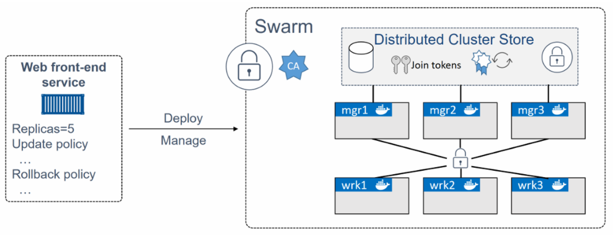

# Docker Swarm

Docker Swarm là công cụ orchestrator tích hợp sẵn trong Docker Engine, tạo ra một clustering Docker. Cho phép ta có thể kết nối các docker host với nhau tạo thành một cụm các máy, khi tạo được hệ thống Docker Swarm thì chúng ta có thể quản lý và chạy các dịch vụ trên hệ thống này một cách dẽ dàng. Giả sử ta có các hệ thống docker chạy trên các vps khác nhau thì ta có kể kết nối chúng tạo thành một cụm docker

Chúng ta cần dùng Docker Swarm khi project của bạn cần phát triển, quản lý, deploy trên nhiều nhiều host thì đó là lúc cần dùng đến Docker Swarm.

> **Khi nào dùng Swarm vs Kubernetes?**
> - **Swarm**: Cluster nhỏ-vừa (~10-50 nodes), team không có DevOps chuyên trách, ưu tiên đơn giản.
> - **Kubernetes**: Cluster lớn, đa team, ecosystem phong phú (operator, service mesh, CRD…).

Docker Swarm gồm 2 thành phần chính:
- Một cụm (cluster) các Docker host bảo mật ở cấp độ doanh nghiệp
- Một engine để điều phối các ứng dụng microservices

Ở khía cạnh clustering, Swarm nhóm một hoặc nhiều node Docker lại và cho phép bạn quản lý chúng như một cluster. Bạn thậm chí có thể thêm hoặc loại bỏ node mà không làm gián đoạn hệ thống

Ở khía cạnh orchestration, Swarm cung cấp một API mạnh mẽ cho phép bạn triển khai và quản lý các ứng dụng microservices phức tạp một cách dễ dàng

## Tính năng nổi bật
**Cluster management integrated with Docker Engine**: Sử dụng bộ Docker Engine CLI để tạo swarm một cách dễ dàng

**Decentralized design**: Docker Swarm được thiết kế dạng phân cấp. Thay vì xử lý sự khác biệt giữa các roles của node tại thời điểm triển khai, Docker xử lý bất kỳ tác vụ nào khi runtime. Ta có thể triển khai node managers và worker bằng Docker Engine.

**Declarative service model**: Docker Engine sử dụng phương thức khai báo để cho phép bạn define trạng thái mong muốn của các dịch vụ khác nhau trong stack ứng dụng của bạn

**Scaling**: với mỗi service có thể khai báo số lượng task mà ta muốn chạy, Scale up, down replicas của 1 service một cách dễ dàng

**Desired state reconciliation**: Swarm đảm bảo 1 service hoạt động ổn định bằng cách tự động thay 1 replicas crash bằng 1 replicas mới cho các worker đang run

**Multi-host networking**: Swarm manager có thể tự động gán IP cho mỗi service khi nó khởi tạo và cập nhật application.

**Service discovery**: Swarm manager node gán mỗi service trong swarm một DNS server riêng. Do đó bạn có thể truy xuất thông qua DNS này

**Load balancing**: Có thể expose các port cho các services tới load balance. tích hợp cân bằng tải sử dujgn thuật toán thuật toán Round-robin

**Secure by default**: Các service giao tiếp với nhau sử dụng giao thức bảo mật TLS

**Rolling updates**: Swarm giúp update image của service một cách hoàn toàn tự động. Swarm manager giúp bạn kiểm soát độ trễ giữa service deploy tới các node khác nhau và bạn có thể rolling back bất cứ lúc nào.
---

## 1. Kiến trúc Swarm

```
┌─────────────────────────────────────────────────────────┐
│                    Swarm Cluster                        │
│                                                         │
│  ┌──────────────┐    ┌──────────────┐  ┌──────────────┐ │
│  │   Manager 1  │    │   Manager 2  │  │  Manager 3   │ │
│  │   (Leader)   │◄──►│              │◄►│              │ │
│  │   Raft       │    │              │  │              │ │
│  └──────┬───────┘    └──────────────┘  └──────────────┘ │
│         │                                               │
│         │ Tasks                                         │
│         ▼                                               │
│  ┌─────────┐ ┌─────────┐ ┌─────────┐ ┌─────────┐        │
│  │Worker 1 │ │Worker 2 │ │Worker 3 │ │Worker 4 │        │
│  └─────────┘ └─────────┘ └─────────┘ └─────────┘        │
└─────────────────────────────────────────────────────────┘
```



### Khái niệm

| Thuật ngữ | Mô tả |
|---|---|
| **Node** | Một máy chạy Docker Engine, join vào swarm |
| **Manager** | Node điều phối cluster (đồng bộ qua Raft consensus). Số manager nên là **lẻ** (1, 3, 5) để bầu leader. Quorum = N/2+1. |
| **Leader** | 1 manager được bầu, xử lý mọi quyết định cluster |
| **Worker** | Node chỉ chạy task, không quản lý state |
| **Service** | Định nghĩa "tôi muốn N replica của image X chạy với config Y" |
| **Task** | Một replica cụ thể của service (= một container chạy ở đâu đó) |
| **Stack** | Tập hợp service được deploy từ một Compose file |

## Lab Docker Swarm

```text
                    Swarm Cluster

               +-------------------+
               |   Manager 1        |
               |   Leader           |
               +-------------------+
                 |       |       |
      -----------        |        -----------
      |                  |                  |
+-------------+   +-------------+   +-------------+
| Manager 2   |   | Manager 3   |   |             |
| Reachable   |   | Reachable   |   |             |
+-------------+   +-------------+   |             |
                                     |
      ----------------------------------------------
      |               |                 |
+-------------+ +-------------+ +-------------+
| Worker 1    | | Worker 2    | | Worker 3    |
+-------------+ +-------------+ +-------------+
```

## Chuẩn bị

Ubuntu Server 24.04, Docker Engine, 6 VM

| Hostname | IP             |
| -------- | -------------- |
| mgr1     | 192.168.70.100 |
| mgr2     | 192.168.70.101 |
| mgr3     | 192.168.70.102 |
| wrk1     | 192.168.70.91  |
| wrk2     | 192.168.70.92  |
| wrk3     | 192.168.70.93  |


## Lab 1 — Kiểm tra Docker

Trên tất cả node:

```bash
docker version
```

```bash
docker info
```

Xác nhận:

```
Swarm: inactive
```

Đây là chế độ Docker Engine thông thường.

---

## Lab 2 — Tạo Swarm

Trên mgr1:

```bash
docker swarm init \
--advertise-addr 192.168.70.100 \
--listen-addr 192.168.70.100:2377
```

Kiểm tra:

```bash
docker info
```

```
Swarm: active
```

---

## Lab 3 — Kiểm tra Manager

```bash
docker node ls
```

Kết quả:

```
mgr1

Leader
```

---

## Lab 4 — Join Worker

Lấy token:

```bash
docker swarm join-token worker
```

Sang wrk1:

```bash
docker swarm join --token SWMTKN-1-WORKER-TOKEN 192.168.1.10:2377
```

```bash
docker swarm join \
--token <worker-token> \
192.168.70.100:2377
```

Lặp lại với wrk2, wrk3.

---

## Lab 5 — Join Manager

Lấy token manager:

```bash
docker swarm join-token manager
```

Trên mgr2, mgr3, chạy:

```bash
docker swarm join \
--token <manager-token> \
192.168.70.100:2377
```

Kiểm tra:

```bash
docker node ls
```

Kết quả (ví dụ):

```
# ID         HOSTNAME    STATUS    AVAILABILITY    MANAGER STATUS    ENGINE VERSION
# abc * ...  mgr1        Ready     Active          Leader            27.x
# def ...    mgr2        Ready     Active          Reachable         27.x
# xyz ...    wkr1        Ready     Active                            27.x
```

```
Leader
Reachable
Reachable
Worker
Worker
Worker
```

---

## Lab 6 — Rời Swarm / Xóa node

```bash
docker swarm leave              # Worker
docker swarm leave --force      # Manager (cần force)
docker node rm <node-id>        # Trên manager: xóa node đã leave
```

---

## Lab 7 — Tạo Overlay Network

```bash
docker network create \
-d overlay \
app-net
```

```bash
docker network create --driver overlay --attachable my-overlay
```

Kiểm tra:

```bash
docker network ls
```

> **Overlay Network:** VXLAN tunnel giữa các node — container ở các host khác nhau thấy nhau như cùng LAN.

---

## Lab 8 — Deploy Web Service

```bash
docker service create \
--name web \
--network app-net \
--replicas 6 \
-p 8080:8080 \
nigelpoulton/pluralsight-docker-ci
```

Ví dụ tổng quát hơn (nhiều tuỳ chọn):

```bash
docker service create \
  --name web \
  --replicas 3 \
  --publish 8080:80 \
  --env NODE_ENV=production \
  nginx:1.27-alpine
```

Ví dụ dùng overlay network riêng cho service khác:

```bash
docker service create \
  --name api --network my-overlay \
  --replicas 3 myorg/api:1.0
```

Kiểm tra:

```bash
docker service ls
```

Kiểm tra Replica:

```bash
docker service ps web
```

Quan sát:

* Replica nằm trên nhiều node khác nhau.
* Docker Scheduler tự phân phối, tự pull image.

---

## Lab 9 — Routing Mesh

Từ máy thật:

```
http://192.168.70.91:8080
http://192.168.70.92:8080
http://192.168.70.100:8080
http://192.168.70.102:8080
```

Mặc dù replica không chạy trên node đó.

```bash
# Bạn gọi vào node Y (kể cả node không chạy replica nào), Swarm vẫn route đúng
curl http://node-Y:8080
```

Đây chính là **Ingress Routing Mesh**: khi publish port (`-p 8080:80`), Swarm tạo routing mesh — bất cứ node nào nhận request ở port 8080 đều forward về một replica đang chạy (load balance).

---

## Lab 10 — Scale

Scale lên:

```bash
docker service scale web=10
```

```bash
docker service scale web=5                 # Scale lên 5 replica
```

Kiểm tra:

```bash
docker service ls
```

Quan sát:

```
10/10
```

Scale xuống:

```bash
docker service scale web=3
```

---

## Lab 11 — Desired State

Giết một container:

```bash
docker ps
```

```bash
docker rm -f <container-id>
```

Đợi vài giây:

```bash
docker service ps web
```

Docker tạo container mới.

Đây là:

```
Desired State
     ↓
Reconciliation Loop
     ↓
Self Healing
```

---

## Lab 12 — Node Failure

Shutdown wrk2:

```bash
shutdown now
```

Quan sát:

```bash
docker node ls
```

```
Down
```

Kiểm tra:

```bash
docker service ps web
```

Replica sẽ được chuyển sang node khác.

---

## Lab 13 — Rolling Update

Deploy phiên bản mới:

```bash
docker service update \
--image nigelpoulton/tu-demo:v2 \
--update-parallelism 2 \
--update-delay 20s \
web
```

Quan sát:

```bash
docker service ps web
```

Sẽ thấy:

```
v1
 ↓
v2
```

từng nhóm 2 Replica.

Rolling update image trực tiếp (rút gọn):

```bash
docker service update --image nginx:1.28-alpine web    # Rolling update image
```

---

## Lab 14 — Update Strategy nâng cao

Cấu hình đầy đủ tham số update:

```bash
docker service update \
  --update-parallelism 2 \                 # Update 2 replica cùng lúc
  --update-delay 30s \                     # Cách 30s
  --update-order start-first \             # Tạo task mới rồi mới stop task cũ
  --update-failure-action rollback \       # Auto rollback nếu fail
  --image nginx:1.28-alpine \
  web
```

---

## Lab 15 — Rollback

```bash
docker service rollback web                # Quay về version trước
```

Kiểm tra:

```bash
docker service ps web
```

Replica quay về image cũ.

---

## Lab 16 — Placement Constraints / Node Labels

Đặt label cho node:

```bash
docker node update --label-add disk=ssd worker1
```

Chỉ chạy service trên node có label phù hợp:

```bash
docker service create \
  --name db \
  --constraint "node.labels.disk == ssd" \
  --constraint "node.role == worker" \
  postgres:16-alpine
```

---

## Lab 17 — Replicated vs Global mode

| Mode | Mô tả |
|---|---|
| `replicated` (mặc định) | N replica, swarm chọn node |
| `global` | 1 task trên MỖI node (như DaemonSet K8s) — dùng cho log agent, metrics exporter |

```bash
docker service create --mode global --name node-exporter prom/node-exporter
```

---

## Lab 18 — Drain Node

Cho worker bảo trì:

```bash
docker node update \
--availability drain \
wrk1
```

```bash
docker node update --availability drain worker1     # Migrate task sang node khác
# ... bảo trì worker1 ...
docker node update --availability active worker1    # Cho phép chạy lại
```

Kiểm tra:

```bash
docker node ls
```

Replica sẽ tự chuyển sang node khác.

Mở lại:

```bash
docker node update \
--availability active \
wrk1
```

Trạng thái node:

* `active`: nhận task.
* `pause`: giữ task hiện tại, không nhận mới.
* `drain`: migrate task sang node khác.

---

## Lab 19 — Manager HA

Kiểm tra Leader:

```bash
docker node ls
```

Shutdown node đang là Leader, sau đó quan sát:

```bash
docker node ls
```

Một manager khác trở thành **Leader** — đây là **Leader Election** sử dụng thuật toán **Raft**.

### Promote / Demote

```bash
docker node promote worker1     # Worker → Manager
docker node demote mgr2         # Manager → Worker
```

### Lock manager (an toàn cho Raft state)

```bash
docker swarm update --autolock=true
# Sau khi restart daemon, phải unlock:
docker swarm unlock
```

---

## Lab 20 — Service Logs

```bash
docker service logs web
```

Realtime:

```bash
docker service logs -f web                 # Aggregated log từ tất cả replica
docker service logs --tail 100 web
```

---

## Lab 21 — Inspect

```bash
docker service inspect web --pretty
```

```bash
docker network inspect app-net
```

```bash
docker node inspect mgr1
```

---

## Lab 22 — Service Discovery & Endpoint Mode

Mỗi service có VIP (Virtual IP) trong overlay network. Tên service = DNS name:

```bash
# Trong container `api`:
curl http://db:5432       # Resolve về VIP của service `db`, swarm load balance đến replica
```

Có 2 endpoint mode:

* `vip` (mặc định): DNS → VIP → IPVS load balance.
* `dnsrr`: DNS round-robin trả tất cả IP replica (dùng khi app tự load balance).

```bash
docker service create --endpoint-mode dnsrr --name db postgres
```

---

## Lab 23 — Secrets & Configs

### Secret (mã hóa)

```bash
# Tạo từ stdin
echo "MySecretPassword" | docker secret create db_password -
echo "super-secret" | docker secret create db_password -
echo "v" | docker secret create N -

# Tạo từ file
docker secret create tls.key /path/to/tls.key

# Liệt kê
docker secret ls

# Inspect (KHÔNG xem được value)
docker secret inspect db_password
```

Dùng trong service:

```bash
docker service create \
  --name db \
  --secret db_password \
  -e POSTGRES_PASSWORD_FILE=/run/secrets/db_password \
  postgres:16-alpine
```

Swarm mount secret thành `/run/secrets/<name>` (tmpfs trong container — chỉ trong RAM). Secret được mã hóa khi nghỉ trong Raft log (AES-256), mã hóa khi truyền giữa node (TLS), chỉ giải mã trong RAM trên node chạy task.

### Config (không mã hóa, cho file cấu hình)

```bash
docker config create nginx-conf ./nginx.conf
docker config create N file

docker service create \
  --name web \
  --config source=nginx-conf,target=/etc/nginx/nginx.conf \
  nginx
```

Khác secret: không mã hóa Raft, đọc được bằng `docker config inspect`.

---

## Lab 24 — Stack (Compose deploy)

Stack = nhiều service được deploy chung từ một Compose file.

### stack.yaml (đầy đủ)

```yaml
# stack.yaml
services:
  web:
    image: myorg/web:1.0
    ports:
      - "8080:80"
    networks:
      - app
    deploy:
      replicas: 3
      update_config:
        parallelism: 2
        delay: 10s
        order: start-first
        failure_action: rollback
      rollback_config:
        parallelism: 0           # All-at-once rollback
        order: stop-first
      restart_policy:
        condition: on-failure
        delay: 5s
        max_attempts: 3
      placement:
        constraints:
          - node.role == worker
        preferences:
          - spread: node.labels.zone
      resources:
        limits:
          cpus: "0.5"
          memory: 256M
        reservations:
          cpus: "0.25"
          memory: 128M

  db:
    image: postgres:16-alpine
    environment:
      POSTGRES_DB: mydb
      POSTGRES_PASSWORD_FILE: /run/secrets/db_password
    volumes:
      - db-data:/var/lib/postgresql/data
    networks:
      - app
    secrets:
      - db_password
    deploy:
      replicas: 1
      placement:
        constraints:
          - node.labels.disk == ssd

volumes:
  db-data:

networks:
  app:
    driver: overlay
    attachable: true

secrets:
  db_password:
    external: true
```

### stack.yaml (bản đơn giản cho lab nhanh)

```yaml
# stack.yaml
services:
  web:
    image: nginx:1.27-alpine
    ports:
      - "80:80"
    deploy:
      replicas: 6
      update_config:
        parallelism: 2
        delay: 5s

  viz:
    image: dockersamples/visualizer
    ports:
      - "8000:8080"
    volumes:
      - /var/run/docker.sock:/var/run/docker.sock
    deploy:
      placement:
        constraints: [node.role == manager]
```

### Deploy / Update / Remove

```bash
# Tạo secret trước
echo "super-secret" | docker secret create db_password -

# Deploy
docker stack deploy -c stack.yaml myapp
docker stack deploy -c stack.yaml demo

# Quản lý
docker stack ls
docker stack services myapp                # Service trong stack
docker stack ps myapp                      # Task của tất cả service
docker stack ps demo
docker service ls
docker stack rm myapp                      # Xóa stack
```

Test routing mesh và rolling update / scale trên stack:

```bash
# Test routing mesh: gọi từ bất kỳ node nào
curl http://wkr1
curl http://wkr2
curl http://mgr1

# Rolling update
docker service update --image nginx:1.28-alpine demo_web

# Scale
docker service scale demo_web=12

# Cleanup
docker stack rm demo
```

### Stack vs Compose

| | `docker compose` | `docker stack deploy` |
|---|---|---|
| Phạm vi | Single host | Swarm cluster |
| Build local | Có | X (image phải có sẵn ở registry) |
| `deploy:` block | Bỏ qua | Sử dụng |
| Volumes bind mount | Có | chỉ hoạt động nếu path tồn tại trên mọi node |

---

## Lab 25 — Visualizer & Monitoring

### Visualizer GUI

```bash
docker service create \
  --name viz \
  --publish 8000:8080/tcp \
  --constraint node.role==manager \
  --mount type=bind,src=/var/run/docker.sock,dst=/var/run/docker.sock \
  dockersamples/visualizer
```

Mở `http://manager:8000` — thấy sơ đồ node + task.

### Portainer

GUI mạnh, quản lý Swarm + standalone Docker:

```bash
docker service create \
  --name portainer \
  --publish 9443:9443 \
  --constraint 'node.role == manager' \
  --mount type=bind,src=/var/run/docker.sock,dst=/var/run/docker.sock \
  --mount type=volume,src=portainer_data,dst=/data \
  portainer/portainer-ce:latest
```

---

## Lab 26 — Remove Service

```bash
docker service rm web
```

Kiểm tra:

```bash
docker service ls
```

Không còn service.

---

## Lab 27 — Backup Swarm

Trên manager (không phải Leader, theo khuyến nghị):

```bash
systemctl stop docker
```

```bash
tar czvf swarm-backup.tar.gz \
/var/lib/docker/swarm
```

Cách viết đầy đủ hơn (đặt tên theo ngày):

```bash
# Stop daemon
sudo systemctl stop docker

# Backup
sudo tar czf swarm-backup-$(date +%F).tar.gz -C /var/lib/docker swarm

# Start
sudo systemctl start docker
```

```bash
systemctl start docker
```

State Raft nằm ở `/var/lib/docker/swarm/`.

---

## Lab 28 — Restore Swarm

```bash
systemctl stop docker
```

```bash
rm -rf /var/lib/docker/swarm
```

```bash
tar xzvf swarm-backup.tar.gz -C /
```

```bash
systemctl start docker
```

```bash
docker swarm init --force-new-cluster
```

---

### PHẦN II 

Dành cho ai muốn chạy nhanh toàn bộ vòng đời trên một cluster 3 node bằng multipass/Vagrant/3 VM.

### Setup

```bash
# Trên mgr1
docker swarm init --advertise-addr <mgr1-ip>
docker swarm join-token worker      # Lấy token

# Trên wkr1, wkr2
docker swarm join --token <token> <mgr1-ip>:2377

# Quay lại mgr1
docker node ls
```

### Deploy stack đơn giản

(Dùng `stack.yaml` bản đơn giản ở Lab 24.)

```bash
docker stack deploy -c stack.yaml demo

# Xem distribution
docker stack ps demo
docker service ls

# Test routing mesh: gọi từ bất kỳ node nào
curl http://wkr1
curl http://wkr2
curl http://mgr1

# Rolling update
docker service update --image nginx:1.28-alpine demo_web

# Scale
docker service scale demo_web=12

# Cleanup
docker stack rm demo
```

## Best Practices

| Nguyên tắc | Lý do |
|---|---|
| Số manager luôn lẻ (1/3/5/7) | Raft cần quorum để bầu leader |
| Manager đặt ở zone khác nhau | Chịu được mất 1 zone |
| Đừng chạy workload nặng trên manager | Manager cần ổn định cho Raft |
| Pin image bằng digest hoặc tag cụ thể | Rolling update an toàn |
| `update_order: start-first` cho stateless | Không gián đoạn |
| `update_order: stop-first` cho stateful (DB) | Tránh conflict volume |
| Bật `autolock` | Bảo vệ Raft state khi server bị steal |
| Volume `local` chỉ tồn tại trên 1 node | Dùng constraint pin service vào node đó, hoặc dùng NFS/CIFS volume |
| Backup `/var/lib/docker/swarm/` định kỳ | Restore state khi mất manager |
| Dùng secret cho password, config cho file cấu hình | Phân biệt rõ |
| Healthcheck phải có trong Dockerfile hoặc Compose | Swarm dựa vào để biết task có healthy không |

## Hạn chế của Swarm

* Không có **operator pattern** như K8s (CRD, controller).
* Không có HPA (autoscaling theo metric) — chỉ scale thủ công hoặc qua script.
* Hệ sinh thái nhỏ hơn nhiều so với K8s.
* Không có ingress controller phong phú (Traefik, Caddy có support Swarm nhưng giới hạn).
* Stateful workload phức tạp (volume across nodes) cần shared storage (NFS, Ceph, Longhorn…).

## Cheat sheet

```bash
# Cluster
docker swarm init --advertise-addr IP
docker swarm join --token TOKEN IP:2377
docker swarm leave [--force]
docker node ls
docker node update --availability drain NODE
docker node promote / demote NODE

# Service
docker service create --name N --replicas R IMAGE
docker service ls
docker service ps NAME
docker service logs -f NAME
docker service scale NAME=5
docker service update --image IMG:TAG NAME
docker service rollback NAME
docker service rm NAME

# Stack
docker stack deploy -c stack.yaml NAME
docker stack ls / services NAME / ps NAME
docker stack rm NAME

# Secret/Config
echo "v" | docker secret create N -
docker config create N file
```

## Nguồn tham khảo

* Docker Inc. – **Swarm mode overview**: https://docs.docker.com/engine/swarm/
* Docker Inc. – **Create a swarm**: https://docs.docker.com/engine/swarm/swarm-mode/
* Docker Inc. – **Manage swarm services**: https://docs.docker.com/engine/swarm/services/
* Docker Inc. – **Overlay networks**: https://docs.docker.com/engine/network/drivers/overlay/
* Docker Inc. – **Administer and maintain a swarm**: https://docs.docker.com/engine/swarm/admin_guide/
* Nigel Poulton – *Docker Deep Dive* (các chương về Docker Swarm)
