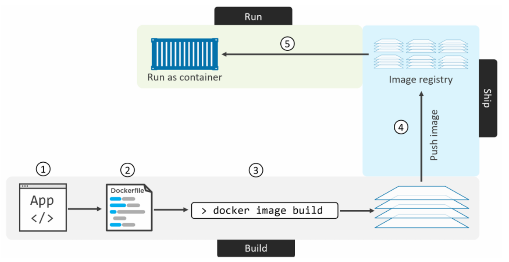
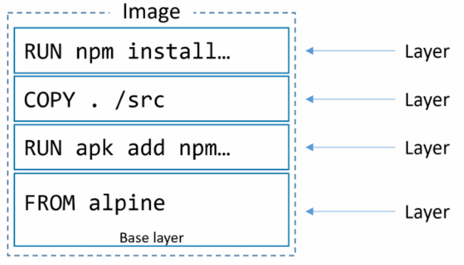

Ba giai đoạn của cùng một hành trình triển khai ứng dụng bằng Docker, theo đúng thứ tự độ phức tạp tăng dần:

| Giai đoạn | Chạy trên | Số container | Công cụ |
|---|---|---|---|
| **1. Containerize** | 1 container | 1 | `docker image build` / `docker container run` |
| **2. Compose** | 1 Docker host | Nhiều container, cùng máy | `docker compose` |
| **3. Stack** | Cluster nhiều node (Swarm) | Nhiều container, nhiều máy, có replica/HA | `docker stack` |

# GIAI ĐOẠN 1 — Containerizing an App
Quá trình đưa 1 ứng dụng chạy trong container có để được hiểu như sau:



- Đầu tiên ta bắt đầu với code app và các phụ thuộc của nó
- Tạo Dockerfile mô tả app, các phụ thuộc và cách run app
- Bulid Dockerfile thành image
- Push image mới build vào registry(option)
- Chạy container từ image

## Containerize a single-container app

Ví dụ dùng một ứng dụng web đơn giản viết bằng Node.js.

### Lấy mã nguồn ứng dụng

```bash
git clone https://github.com/nigelpoulton/psweb.git
cd psweb
```

```bash
root@client:~/psweb# ls -l
total 20
-rw-r--r-- 1 root root  324 Apr 17 10:23 Dockerfile
-rw-r--r-- 1 root root  378 Apr 17 10:23 README.md
-rw-r--r-- 1 root root  341 Apr 17 10:23 app.js
-rw-r--r-- 1 root root  309 Apr 17 10:23 package.json
drwxr-xr-x 2 root root 4096 Apr 17 10:23 views
```

### Inspecting the Dockerfile

Dockerfile là điểm khởi đầu để build image. Thư mục chứa ứng dụng + các phụ thuộc gọi là **build context** — nên đặt Dockerfile ở đó.

```bash
cat Dockerfile
```

```dockerfile
FROM alpine
LABEL maintainer="nigelpoulton@hotmail.com"
RUN apk add --update nodejs npm curl
COPY . /src
WORKDIR /src
RUN  npm install
EXPOSE 8080
ENTRYPOINT ["node", "./app.js"]
```

Tóm tắt: base image `alpine` → cài `nodejs`/`npm` → copy mã nguồn vào `/src` → set workdir → `npm install` → khai báo port 8080 → `app.js` là entrypoint.



### Build image

```bash
docker image build -t web:latest .
```

```
Step 1/8 : FROM alpine
Step 2/8 : LABEL maintainer="nigelpoulton@hotmail.com"
Step 3/8 : RUN apk add --update nodejs npm curl
...
Step 4/8 : COPY . /src
Step 5/8 : WORKDIR /src
Step 6/8 : RUN  npm install
Step 7/8 : EXPOSE 8080
Step 8/8 : ENTRYPOINT ["node", "./app.js"]
Successfully built c2fa68a888a4
Successfully tagged web:latest
```

Kiểm tra:

```bash
docker image ls
```

```
REPOSITORY   TAG      IMAGE ID       CREATED          SIZE
web          latest   c2fa68a888a4   58 seconds ago   115MB
```

### Push image lên registry

Đăng nhập Docker Hub:

```bash
docker login -u <docker-id>
```

Docker cần 3 thông tin để push: **registry / repository / tag**. Mặc định push lên Docker Hub, dưới namespace của chính bạn — nên phải gắn lại tag kèm Docker ID:

```bash
docker image tag web:latest <docker-id>/web:latest
docker image push <docker-id>/web:latest
```

```
The push refers to repository [docker.io/<docker-id>/web]
399e12ef6276: Pushed
d8f81fa981ef: Pushed
5f7530e11b4a: Pushed
989e799e6349: Mounted from library/alpine
latest: digest: sha256:2d4f5b17... size: 1160
```

Sau khi push, image có thể pull từ bất kỳ đâu có internet; có thể cấp quyền cho người khác pull/push.

### Chạy và test ứng dụng

```bash
docker container run -d --name c1 -p 80:8080 web:latest
```

`-d`: chạy nền · `-p 80:8080`: ánh xạ port host → container.

```bash
docker container ls
```

```
CONTAINER ID   IMAGE        COMMAND           STATUS         PORTS                     NAMES
6dcd0f8e49d6   web:latest   "node ./app.js"   Up 2 seconds   0.0.0.0:80->8080/tcp      c1
```

Truy cập `http://<docker-host>` để kiểm tra ứng dụng chạy đúng.

### Xem lại các layer đã build

```bash
docker image history web:latest
```

```
IMAGE          CREATED BY                                      SIZE
c2fa68a888a4   ENTRYPOINT ["node" "./app…                       0B
087b44c66301   EXPOSE 8080                                      0B
2580ce992966   npm install                                      21.5MB
73c4aa23550f   WORKDIR /src                                     0B
e63e9c309981   COPY dir:19ae45728f2608c48…                      49.7kB
372026881456   apk add --update nodejs npm curl                 85MB
a0067276bf11   LABEL maintainer=nigelpou…                       0B
a40c03cbb81c   CMD ["/bin/sh"]                                  0B
```

Chỉ 4 dòng có SIZE khác 0 → chỉ 4 layer thực sự được tạo (`FROM`, `RUN` x2, `COPY`); còn lại là metadata.

```bash
docker image inspect web:latest
```

## Moving to production với Multi-stage Builds

Image production nên nhỏ, chỉ chứa những gì cần để **chạy** ứng dụng — không chứa compiler/build tool. Cách viết Dockerfile ảnh hưởng lớn tới kích thước image (gộp `RUN`, dọn dẹp sau khi cài, v.v — xem mục 6–7 trong `Dockerfile-reference.md`).

**Giải pháp:** Multi-stage build — một Dockerfile duy nhất, nhiều instruction `FROM`, mỗi `FROM` là một giai đoạn build riêng, có thể `COPY --from=<stage>` giữa các stage. Cú pháp và ví dụ đầy đủ (Node.js, Go, và ví dụ 3-stage AtSea Shop) → xem **mục 3 trong `Dockerfile-reference.md`**.

Ví dụ chạy thử nhanh với ví dụ AtSea Shop:

```bash
git clone https://github.com/nigelpoulton/atsea-sample-shop-app.git
cd atsea-sample-shop-app/app
docker image build -t multi:stage .
docker image ls
```

```
REPOSITORY   TAG      IMAGE ID       CREATED          SIZE
multi        stage    aa23fd32d597   31 seconds ago   259MB
<none>       <none>   c9ecf5684413   ...              677MB
```

`multi:stage` nhỏ hơn nhiều so với các image trung gian — vì stage cuối chỉ giữ lại các file cần cho production, dựa trên base image nhỏ (`java:8-jdk-alpine`), không mang theo `node:latest` (~900MB) hay `maven:latest` (~500MB) dùng ở các stage build.

# GIAI ĐOẠN 2 — Deploying Apps with Docker Compose

## TLDR

Ứng dụng hiện đại thường gồm nhiều service nhỏ (microservices) phối hợp với nhau — web frontend, ordering, catalog, database, logging, auth... Triển khai/quản lý thủ công từng container sẽ rất khó khăn. **Docker Compose** giải quyết việc này: định nghĩa toàn bộ ứng dụng nhiều container trong 1 file YAML, và chỉ với 1 lệnh là build + start toàn bộ.

## Compose background

Compose đọc một file YAML mô tả ứng dụng nhiều container, rồi triển khai thông qua Docker API.

Kiểm tra:

```bash
docker compose version
```

## Compose files

Tên mặc định: `docker-compose.yml`. Ví dụ một ứng dụng Flask nhỏ 2 service (`web-fe` + `redis`) — gọi là `counter-app`:

```yaml
version: "3.8"
services:
  web-fe:
    build: .
    command: python app.py
    ports:
      - target: 5000
        published: 5000
    networks:
      - counter-net
    volumes:
      - type: volume
        source: counter-vol
        target: /code

  redis:
    image: "redis:alpine"
    networks:
      - counter-net

networks:
  counter-net:

volumes:
  counter-vol:
```

> Với Compose V2 hiện đại, key `version:` không còn bắt buộc (đã deprecated về mặt khuyến nghị, nhưng Compose V2 vẫn hiểu nếu bạn để lại — không gây lỗi).

4 key cấp cao nhất: `version`, `services`, `networks`, `volumes` (còn có thể có `secrets`, `configs`).

- `services`: nơi định nghĩa các service — **mỗi service = 1 (hoặc nhiều) container**.
- `networks`: Docker tạo network mới — mặc định kiểu **bridge** (single-host, chỉ nối container trên cùng Docker host).

### Đọc chi tiết file counter-app

Ứng dụng: web server đếm lượt truy cập, lưu giá trị vào Redis.

- `web-fe`: build image từ Dockerfile (`build .`), chạy `python app.py`, map port `5000:5000`, nối `counter-net`, mount volume vào `/code`.
- `redis`: dùng image có sẵn `redis:alpine`, nối cùng `counter-net`.

2 service giao tiếp qua **tên service** vì cùng network (`web-fe` gọi Redis qua hostname `redis`).

Vai trò của Compose: tự động build image, tạo container, tạo network, gán volume — tất cả trong 1 lệnh.

## Deploying an app with Compose

```bash
git clone https://github.com/nigelpoulton/counter-app.git
cd counter-app
```

```bash
ls -l
```

```
-rw-r--r-- 1 root root 110 Apr 17 16:01 Dockerfile
-rw-r--r-- 1 root root 187 Apr 17 16:01 README.md
-rw-r--r-- 1 root root 599 Apr 17 16:01 app.py
-rw-r--r-- 1 root root 367 Apr 17 16:01 docker-compose.yml
-rw-r--r-- 1 root root  11 Apr 17 16:01 requirements.txt
```

Chạy toàn bộ ứng dụng (tất cả lệnh sau chạy trong thư mục `counter-app`):

```bash
docker compose up -d
```

- Mặc định đọc `docker-compose.yml`; dùng file khác thì thêm `-f`:
  ```bash
  docker compose -f prod-equus-bass.yml up
  ```
- `-d`: chạy nền.
- `docker compose up` sẽ build/pull mọi image cần thiết, tạo network/volume cần thiết, khởi động mọi container cần thiết.

Kiểm tra image đã tạo/pull:

```bash
docker image ls
```

- `counter-app_web-fe:latest`: tạo bởi `build: .`.
- `python:3.6-alpine`: base image trong Dockerfile.
- `redis:alpine`: pull từ Docker Hub theo `image:` của service `redis`.

Kiểm tra container:

```bash
docker container ls
```

```
CONTAINER ID   IMAGE                COMMAND                  STATUS         PORTS                        NAMES
6d8fb5087948   counter-app_web-fe   "python app.py"          Up 6 minutes   0.0.0.0:5000->5000/tcp      counter-app_web-fe_1
2a2c3302bda6   redis:alpine         "docker-entrypoint.s…"   Up 6 minutes   6379/tcp                     counter-app_redis_1
```

Kiểm tra network/volume:

```bash
docker network ls
docker volume ls
```

```
NETWORK ID     NAME                      DRIVER    SCOPE
063f6fc222dd   counter-app_counter-net   bridge    local
```

```
DRIVER    VOLUME NAME
local     counter-app_counter-vol
```

Truy cập `http://<docker-host>:5000` để kiểm tra ứng dụng.

## Managing an app with Compose

Dừng ứng dụng:

```bash
docker compose down
```

```
Stopping counter-app_web-fe_1 ... done
Stopping counter-app_redis_1  ... done
Removing counter-app_web-fe_1 ... done
Removing counter-app_redis_1  ... done
Removing network counter-app_counter-net
```

Volume `counter-vol` **không** bị xóa — volume được thiết kế để lưu dữ liệu lâu dài:

```bash
docker volume ls
```

```
DRIVER    VOLUME NAME
local     counter-app_counter-vol
```

Khởi động lại (nền):

```bash
docker compose up -d
```

Xem trạng thái:

```bash
docker compose ps
```

```
        Name                      Command               State                    Ports
counter-app_redis_1    docker-entrypoint.sh redis ...   Up      6379/tcp
counter-app_web-fe_1   python app.py                    Up      0.0.0.0:5000->5000/tcp
```

Liệt kê tiến trình bên trong từng service:

```bash
docker compose top
```

```
counter-app_redis_1
UID    PID    PPID    C   STIME   TTY     TIME             CMD
lxd   48817   48790   0   16:44   ?     00:00:00   redis-server *:6379

counter-app_web-fe_1
UID     PID    PPID    C   STIME   TTY     TIME                    CMD
root   48847   48824   0   16:44   ?     00:00:00   python app.py
```

> PID trả về là PID nhìn từ Docker host, không phải bên trong container.

Dừng mà không xóa tài nguyên:

```bash
docker compose stop
```

```bash
docker compose ps
```

```
        Name                      Command               State
counter-app_redis_1    docker-entrypoint.sh redis ...   Exit 0
counter-app_web-fe_1   python app.py                    Exit 0
```

`stop` chỉ dừng container, không xóa khỏi hệ thống:

```bash
docker container ls -a
```

```
CONTAINER ID   IMAGE                 STATUS                          NAMES
9e8a3da42a3f   counter-app_web-fe    Exited (0) About a minute ago   counter-app_web-fe_1
84c5771ff5b3   redis:alpine          Exited (0) About a minute ago   counter-app_redis_1
```

Xóa app đã dừng (xóa container + network, **không** xóa volume/image/mã nguồn):

```bash
docker compose rm
```

Khởi động lại:

```bash
docker compose restart
```

Dừng + xóa trong 1 lệnh:

```bash
docker compose down
```
# GIAI ĐOẠN 3 — Deploying Apps with Docker Stacks

## TLDR

Triển khai và quản lý ứng dụng microservices **ở quy mô cluster** (nhiều node) là bài toán khó hơn hẳn 1 host. **Docker Stacks** giải quyết bằng cách cung cấp: desired state, rolling updates, scale, health checks — tất cả trong một mô hình khai báo, xây dựng trên nền **Docker Swarm**.

Quy trình: định nghĩa trạng thái mong muốn trong 1 file Compose (stack file) → triển khai/quản lý bằng `docker stack`. Vì dựa trên Swarm, bạn có toàn bộ tính năng bảo mật và nâng cao của Swarm.

Về kiến trúc: **Stack → Service → Container**, tầng cao nhất trong hệ phân cấp ứng dụng Docker.

## Ứng dụng mẫu: AtSea Shop

```bash
git clone https://github.com/dockersamples/atsea-sample-shop-app.git
```

Ứng dụng gồm: **5 services · 3 networks · 4 secrets · 3 port mapping**.

> Ở đây "service" là service object của Docker — một/nhiều container giống nhau, quản lý như 1 thực thể trên cụm Swarm.

File định nghĩa: `docker-stack.yml`

```yaml
version: "3.2"

services:
  reverse_proxy:
    image: dockersamples/atseasampleshopapp_reverse_proxy
    ports:
      - "80:80"
      - "443:443"
    secrets:
      - source: revprox_cert
        target: revprox_cert
      - source: revprox_key
        target: revprox_key
    networks:
      - front-tier

  database:
    image: dockersamples/atsea_db
    environment:
      POSTGRES_USER: gordonuser
      POSTGRES_DB_PASSWORD_FILE: /run/secrets/postgres_password
      POSTGRES_DB: atsea
    networks:
      - back-tier
    secrets:
      - postgres_password
    deploy:
      placement:
        constraints:
          - 'node.role == worker'

  appserver:
    image: dockersamples/atsea_app
    networks:
      - front-tier
      - back-tier
      - payment
    deploy:
      replicas: 2
      update_config:
        parallelism: 2
        failure_action: rollback
      placement:
        constraints:
          - 'node.role == worker'
      restart_policy:
        condition: on-failure
        delay: 5s
        max_attempts: 3
        window: 120s
    secrets:
      - postgres_password

  visualizer:
    image: dockersamples/visualizer:stable
    ports:
      - "8001:8080"
    stop_grace_period: 1m30s
    volumes:
      - "/var/run/docker.sock:/var/run/docker.sock"
    deploy:
      update_config:
        failure_action: rollback
      placement:
        constraints:
          - 'node.role == manager'

  payment_gateway:
    image: dockersamples/atseasampleshopapp_payment_gateway
    secrets:
      - source: staging_token
        target: payment_token
    networks:
      - payment
    deploy:
      update_config:
        failure_action: rollback
      placement:
        constraints:
          - 'node.role == worker'
          - 'node.labels.pcidss == yes'

networks:
  front-tier:
  back-tier:
  payment:
    driver: overlay
    driver_opts:
      encrypted: 'yes'

secrets:
  postgres_password:
    external: true
  staging_token:
    external: true
  revprox_key:
    external: true
  revprox_cert:
    external: true
```

4 key chính: `version` (**phải ≥ 3.0** để dùng được với stacks), `services`, `networks`, `secrets`.

- 5 services: `reverse_proxy`, `database`, `appserver`, `visualizer`, `payment_gateway`.
- 3 networks: `front-tier`, `back-tier`, `payment`.
- 4 secrets: `postgres_password`, `staging_token`, `revprox_key`, `revprox_cert`.

## Đọc chi tiết stack file

### Networks

```yaml
networks:
  front-tier:
  back-tier:
  payment:
    driver: overlay
    driver_opts:
      encrypted: 'yes'
```

Docker tạo network **trước** khi tạo service (vì service cần gắn vào network). Mặc định tất cả tạo dưới dạng **overlay** network. Riêng `payment` yêu cầu mã hóa data-plane.

### Secrets

```yaml
secrets:
  postgres_password:
    external: true
  staging_token:
    external: true
  revprox_key:
    external: true
  revprox_cert:
    external: true
```

Cả 4 đều `external: true` → phải **tồn tại sẵn** trước khi deploy stack.

### Service `reverse_proxy`

```yaml
reverse_proxy:
  image: dockersamples/atseasampleshopapp_reverse_proxy
  ports:
    - "80:80"
    - "443:443"
  secrets:
    - source: revprox_cert
      target: revprox_cert
    - source: revprox_key
      target: revprox_key
  networks:
    - front-tier
```

`image` là khóa bắt buộc duy nhất — xác định image dùng cho các replica. **Stacks không hỗ trợ `build:`** (khác Compose) — mọi image phải build sẵn trước khi deploy.

`ports` mặc định dùng **ingress mode** — truy cập được từ **mọi** node trong swarm, không riêng node chạy replica (routing mesh). `host mode` cũng dùng được nhưng cú pháp dài hơn.

`secrets` sẽ mount thành file tại `/run/secrets/<name>`.

### Service `database`

```yaml
database:
  image: dockersamples/atsea_db
  environment:
    POSTGRES_USER: gordonuser
    POSTGRES_DB_PASSWORD_FILE: /run/secrets/postgres_password
    POSTGRES_DB: atsea
  networks:
    - back-tier
  secrets:
    - postgres_password
  deploy:
    placement:
      constraints:
        - 'node.role == worker'
```

`environment` truyền biến môi trường lúc runtime. Nên dùng secret cho các giá trị nhạy cảm thay vì plaintext.

`placement` giới hạn service chỉ chạy trên node đáp ứng điều kiện. Swarm hỗ trợ nhiều loại: `node.id`, `node.hostname`, `node.role`, engine labels, custom node labels.

### Service `appserver`

```yaml
appserver:
  image: dockersamples/atsea_app
  networks: [front-tier, back-tier, payment]
  deploy:
    replicas: 2
    update_config:
      parallelism: 2
      failure_action: rollback
    placement:
      constraints:
        - 'node.role == worker'
    restart_policy:
      condition: on-failure
      delay: 5s
      max_attempts: 3
      window: 120s
  secrets:
    - postgres_password
```

- `deploy.replicas: 2`: số replica mong muốn. Muốn đổi sau khi deploy → sửa giá trị này trong stack file rồi deploy lại (phương pháp **khai báo**, không dùng `docker service scale` trực tiếp).
- `deploy.update_config`: cách xử lý khi update — ở đây cập nhật 2 replica cùng lúc, rollback nếu lỗi. Mặc định `failure_action` là `pause` (dừng cập nhật tiếp); còn có option `continue`.
- `deploy.restart_policy`: cách Swarm khởi động lại replica khi lỗi.

### Service `visualizer`

```yaml
visualizer:
  image: dockersamples/visualizer:stable
  ports:
    - "8001:8080"
  stop_grace_period: 1m30s
  volumes:
    - "/var/run/docker.sock:/var/run/docker.sock"
  deploy:
    update_config:
      failure_action: rollback
    placement:
      constraints:
        - 'node.role == manager'
```

`stop_grace_period`: thời gian chờ trước khi force-kill container.

`volumes` mount `/var/run/docker.sock` từ host vào container — socket IPC mà Docker daemon expose API. Visualizer cần cái này để truy vấn Docker daemon và vẽ sơ đồ trực quan các service đang chạy. **Lưu ý bảo mật:** mount docker.sock cho phép container gửi lệnh trực tiếp tới daemon — không khuyến khích trong môi trường production thực tế trừ khi thật sự cần.

### Service `payment_gateway`

```yaml
payment_gateway:
  image: dockersamples/atseasampleshopapp_payment_gateway
  secrets:
    - source: staging_token
      target: payment_token
  networks:
    - payment
  deploy:
    update_config:
      failure_action: rollback
    placement:
      constraints:
        - 'node.role == worker'
        - 'node.labels.pcidss == yes'
```

Dùng **node label tùy chỉnh** trong placement constraint (gán bằng `docker node update`). Ở đây yêu cầu chạy trên node đạt chuẩn PCI DSS — có 2 constraint nên replica chỉ chạy trên node **vừa là worker vừa có label** `pcidss=yes`.

## Deploying the app

Điều kiện: đang ở **Swarm mode**, có **node label** phù hợp, và **secrets** đã được tạo trước.

### Bước 1 — Tạo Swarm mới

Trên node manager:

```bash
docker swarm init
```

```
Swarm initialized: current node (1enddmkmsnxmft7txczf60cem) is now a manager.

To add a worker to this swarm, run the following command:

    docker swarm join --token SWMTKN-1-3l35crcqn09xm1skuvzmt2ylu0ppej4fyp042pqt5b3aaakniz-7682nrzzpgshn4wzi5mero5yz 192.168.70.91:2377
```

Trên các node worker:

```bash
docker swarm join --token SWMTKN-1-3l35crcqn09xm1skuvzmt2ylu0ppej4fyp042pqt5b3aaakniz-7682nrzzpgshn4wzi5mero5yz 192.168.70.91:2377
```

Kiểm tra:

```bash
docker node ls
```

```
ID                            HOSTNAME   STATUS    AVAILABILITY   MANAGER STATUS   ENGINE VERSION
1enddmkmsnxmft7txczf60cem *   mgr1       Ready     Active         Leader           27.5.1
wxeb1kkzxohamirao8t4epjxe     wrk1       Ready     Active                          27.5.1
eeq481viyo4idwrnkaa9p1ssb     wrk2       Ready     Active                          27.5.1
```

### Bước 2 — Thêm node label

`payment_gateway` chỉ chạy trên worker có label `pcidss=yes` — gán vào `wrk1`:

```bash
docker node update --label-add pcidss=yes wrk1
```

Node label chỉ có hiệu lực trong swarm. Xác minh:

```bash
docker node inspect wrk1
```

### Bước 3 — Tạo các secret

Trên node manager:

```bash
# Tạo cặp khóa mật mã dùng cho revprox_cert / revprox_key
openssl req -newkey rsa:4096 -nodes -sha256 \
  -keyout domain.key -x509 -days 365 -out domain.crt

docker secret create revprox_cert domain.crt
docker secret create revprox_key domain.key
docker secret create postgress_password domain.key

echo staging | docker secret create staging_token -
```

Liệt kê:

```bash
docker secret ls
```

```
ID                          NAME                 DRIVER    CREATED
j0w14kp3h13vl3p0qoz2tcria   postgress_password             17 minutes ago
oo2re2up9m6tja3vslrb9egvd   revprox_cert                   18 minutes ago
khrp79vjvkqv635txrdinm549   revprox_key                    17 minutes ago
k33itylgvrezvnf5ndwdj24aq   staging_token                  16 minutes ago
```

### Bước 4 — Deploy stack

```bash
docker stack deploy -c docker-stack.yml seastack
```

```
Creating network seastack_front-tier
Creating network seastack_back-tier
Creating network seastack_default
Creating network seastack_payment
Creating service seastack_appserver
Creating service seastack_visualizer
Creating service seastack_payment_gateway
Creating service seastack_reverse_proxy
Creating service seastack_database
```

Ghi chú về output:

- **Network được tạo trước service** — vì service cần gắn vào network sẵn có.
- Docker thêm **tiền tố tên stack** vào mọi tài nguyên tạo ra (`seastack_payment`, `seastack_back-tier`...).
- Service `visualizer` không khai `networks:` nào trong stack file → Docker tự tạo network mặc định `seastack_default` để gắn vào.

Kiểm tra:

```bash
docker network ls
docker service ls
```

```
ID             NAME                       MODE         REPLICAS   IMAGE                                                     PORTS
pz6z0pzqg99a   seastack_appserver         replicated   2/2        dockersamples/atsea_app:latest
yk1uysdae67g   seastack_database          replicated   1/1        dockersamples/atsea_db:latest
drlezpjqevtf   seastack_payment_gateway   replicated   1/1        dockersamples/atseasampleshopapp_payment_gateway:latest
ui8603jahpm2   seastack_reverse_proxy     replicated   1/1        dockersamples/atseasampleshopapp_reverse_proxy:latest     *:80->80/tcp, *:443->443/tcp
f4g3avaffjlf   seastack_visualizer        replicated   1/1        dockersamples/visualizer:stable                           *:8001->8080/tcp
```

Liệt kê stack và chi tiết task:

```bash
docker stack ls
```

```
NAME       SERVICES
seastack   5
```

```bash
docker stack ps seastack
```

Cho thấy cả **desired state** và **current state** của từng task — kể cả các lần restart/fail trước khi ổn định.

Xem log của một service (nhận tên/ID service hoặc ID replica — truyền tên/ID service thì trả log của **mọi** replica):

```bash
docker service logs seastack_appserver
```

## Managing the app

Stack được xây từ các tài nguyên Docker thông thường (network, volume, secret, service) → kiểm tra bằng đúng lệnh tương ứng: `docker network`, `docker volume`, `docker secret`, `docker service`.

Có thể dùng `docker service scale` để tăng replica trực tiếp, nhưng **không khuyến nghị**. Cách khuyến nghị là **khai báo**: sửa `deploy.replicas` trong stack file → deploy lại bằng `docker stack deploy` để áp dụng.

Xóa toàn bộ stack:

```bash
docker stack rm seastack
```