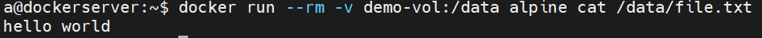
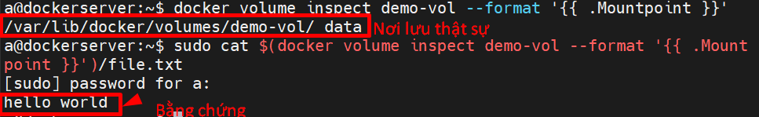
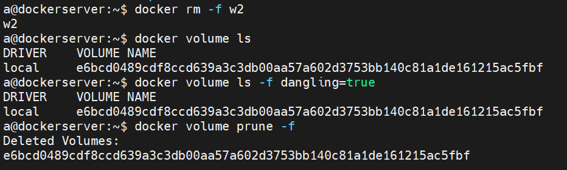
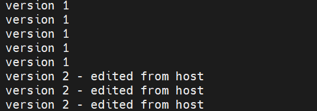
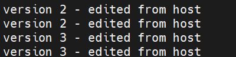

# Lab Docker Volume
---

## 0. Yêu cầu

```bash
docker version
mkdir -p ~/mount-lab && cd ~/mount-lab
```

Tất cả lab dùng image `alpine` (nhẹ, có sẵn `sh`) và `nginx` (cho lab bind mount đè file).

---

## Lab 1 — Named Volume: dữ liệu sống sót qua vòng đời container

Mục tiêu: chứng minh **volume độc lập với container** — xoá container, dữ liệu vẫn còn.

```bash
docker volume create demo-vol

docker run -d --name w1 -v demo-vol:/data alpine \
  sh -c "echo 'hello world' > /data/file.txt; sleep 3600"

docker exec w1 cat /data/file.txt
```
- `-c` sau sh có nghĩa là command không phải cpu share, `sh -c`: Hãy mở trình dịch mã Shell lên, chạy ngay chuỗi câu lệnh nằm trong dấu ngoặc kép này, rồi thoát.
```
hello from w1
```

Xoá hẳn container:

```bash
docker rm -f w1
docker volume ls
```

```
DRIVER    VOLUME NAME
local     demo-vol
```

→ Volume **vẫn còn** dù container đã bị xoá. Gắn volume này vào một container hoàn toàn mới để xác nhận dữ liệu còn nguyên:

```bash
docker run --rm -v demo-vol:/data alpine cat /data/file.txt
```

Anonymous Volume (Volume ẩn danh/vô danh): Là loại ổ đĩa ảo tự động sinh ra khi Docker Image yêu cầu lưu trữ nhưng bạn không đặt tên cho nó lúc chạy (hoặc chỉ khai báo đường dẫn trong container dạng -v /data mà không có phần tên ở trước dấu hai chấm).

- Nếu không dùng `--rm`, những volume vô danh này sẽ bị bỏ hoang trong ổ cứng (gọi là "dangling volumes") gây đầy bộ nhớ máy.
- Khi có `--rm`, Docker hiểu là "Container này chỉ dùng một lần rồi bỏ" nên nó sẽ xóa sạch luôn các volume vô danh này đi kèm.



Xem dữ liệu thật nằm ở đâu trên host (cần quyền root):

```bash
docker volume inspect demo-vol --format '{{ .Mountpoint }}'
sudo cat $(docker volume inspect demo-vol --format '{{ .Mountpoint }}')/file.txt
```



**Kết luận quan sát được:** Named volume tách rời hoàn toàn khỏi vòng đời container — đúng lý do vì sao DB luôn dùng loại này.

---

## Lab 2 — Anonymous Volume: khi nào bị xoá, khi nào không

Mục tiêu: phân biệt rõ ràng hành vi khác nhau giữa `docker rm` thường và `docker run --rm`.

### 2.1 Tạo container với anonymous volume (không đặt tên)

```bash
docker run -d --name w2 -v /data alpine \
  sh -c "echo anon > /data/file.txt; sleep 3600"

docker inspect w2 --format '{{json .Mounts}}'
```

Sẽ thấy một `Name` dạng chuỗi hash ngẫu nhiên — đó là anonymous volume Docker tự tạo.

```bash
docker volume ls
```

```
DRIVER    VOLUME NAME
local     a8f3b1c9d2e4...
```

### 2.2 Xoá container KHÔNG kèm `-v`

```bash
docker rm -f w2
docker volume ls
```

→ Volume **vẫn còn tồn tại**, giờ ở trạng thái "mồ côi" (dangling — không còn container nào tham chiếu):

```bash
docker volume ls -f dangling=true
```

Dọn các volume mồ côi này:

```bash
docker volume prune -f
```



### 2.3 So sánh với `docker run --rm`

```bash
docker run --rm -v /data alpine sh -c "echo test > /data/file.txt"
docker volume ls -f dangling=true
```

→ Không có gì xuất hiện — vì `--rm` sẽ tự dọn luôn anonymous volume gắn với container đó khi container dừng.

**Kết luận quan sát được:** `docker rm` (không `-v`) để lại rác anonymous volume; `docker rm -v` hoặc `docker run --rm` mới dọn sạch.

---

## Lab 3 — Bind Mount: đồng bộ 2 chiều real-time

Mục tiêu: thấy thay đổi ở host phản ánh ngay vào container, và ngược lại — không có "copy" nào cả, chỉ là cùng trỏ vào 1 nơi trên đĩa.

```bash
mkdir -p ~/mount-lab/bind-demo
cd ~/mount-lab/bind-demo
echo "version 1" > file.txt

docker run -d --name w3 -v $(pwd):/data alpine \
  sh -c "while true; do cat /data/file.txt; sleep 2; done"

# in theo dõi follow logs w3 theo thời gian thực
docker logs -f w3
```

Bạn sẽ thấy `version 1` lặp lại mỗi 2 giây. **Mở một terminal khác**, sửa file từ host:

```bash
cd ~/mount-lab/bind-demo
echo "version 2 - edited from host" > file.txt
```

Quay lại terminal đang `docker logs -f w3` — dòng log đổi ngay sang `version 2` mà **không cần restart container**.



Bây giờ sửa từ trong container:

```bash
docker exec w3 sh -c "echo 'version 3 - edited from container' > /data/file.txt"
cat ~/mount-lab/bind-demo/file.txt
```

```
version 3 - edited from container
```

→ Host thấy thay đổi ngay lập tức. Dừng lab này:



```bash
docker rm -f w3
```

**Kết luận quan sát được:** Bind mount không "đồng bộ" theo nghĩa copy — nó là **cùng một inode trên đĩa**, container và host chỉ là 2 cách nhìn vào cùng dữ liệu.

---

## Lab 4 — Bind mount ĐÈ (không merge) nội dung có sẵn trong image

Đây là điểm dễ gây bug nhất khi mới dùng bind mount: mount một thư mục sẽ **thay thế toàn bộ** nội dung thư mục đó trong image, không phải "chèn thêm vào".

### 4.1 Xem nội dung mặc định của image nginx

```bash
docker run --rm nginx sh -c "ls /usr/share/nginx/html"
```

```
50x.html
index.html
```

### 4.2 Mount đè thư mục đó bằng 1 thư mục host chỉ có 1 file

```bash
mkdir -p ~/mount-lab/html
echo "<h1>My custom page</h1>" > ~/mount-lab/html/index.html

docker run -d --name w4 -p 8081:80 \
  -v ~/mount-lab/html:/usr/share/nginx/html \
  nginx

docker exec w4 ls /usr/share/nginx/html
```

```
index.html
```

→ `50x.html` **biến mất** — không phải bị xoá trong image, mà vì bind mount đã **thay thế hoàn toàn** nội dung thư mục đó bằng nội dung thư mục host (chỉ có đúng 1 file).

Test bằng curl:

```bash
curl http://localhost:8081
```

```
<h1>My custom page</h1>
```

Dọn dẹp:

```bash
docker rm -f w4
```

**Kết luận quan sát được:** Bind mount vào một thư mục = ghi đè toàn bộ, không merge. Muốn giữ file gốc của image, chỉ nên mount **từng file cụ thể** (ví dụ chỉ `nginx.conf`), không mount đè cả thư mục cha nếu không chắc.

---

## Lab 5 — tmpfs: sống trong RAM, mất khi container restart

Mục tiêu: chứng minh tmpfs **không đụng tới ổ cứng**, và dữ liệu **mất khi container restart** (khác hẳn 2 loại trên).

```bash
docker run -d --name w5 --tmpfs /tmp:size=64M alpine \
  sh -c "echo secret-data > /tmp/note.txt; sleep 3600"

docker exec w5 cat /tmp/note.txt
```

```
secret-data
```

Xác nhận đây thực sự là tmpfs (mount type RAM):

```bash
docker exec w5 mount | grep /tmp
```

```
tmpfs on /tmp type tmpfs (rw,size=65536k,...)
```

### Restart container — dữ liệu biến mất

```bash
docker restart w5
docker exec w5 cat /tmp/note.txt
```

```
cat: can't open '/tmp/note.txt': No such file or directory
```

→ Khác hẳn Lab 1 (named volume) và Lab 3 (bind mount) — nơi dữ liệu **sống sót** qua restart/xoá container. tmpfs bị xoá sạch **mỗi khi container restart**, vì nó chỉ tồn tại trong bộ nhớ của tiến trình container đó.

Xác nhận không có gì ghi ra đĩa (không tìm thấy trong `/var/lib/docker/`):

```bash
docker inspect w5 --format '{{json .Mounts}}'
```

Sẽ thấy `"Type": "tmpfs"` — không có `Source` trỏ tới đường dẫn thật trên host như named volume/bind mount.

Dọn dẹp:

```bash
docker rm -f w5
```

---

## Lab 6 — Thí nghiệm so sánh trực tiếp 3 loại trong 1 lượt

Chạy 3 container, mỗi container ghi 1 file bằng 1 loại mount khác nhau, rồi xoá cả 3, sau đó thử đọc lại — quan sát cái nào còn, cái nào mất.

```bash
docker volume create cmp-vol
mkdir -p ~/mount-lab/cmp-bind

# Ghi dữ liệu bằng 3 loại mount, container tự xoá ngay sau khi chạy (--rm)
docker run --rm -v cmp-vol:/data alpine \
  sh -c "echo vol-data > /data/f.txt"

docker run --rm -v ~/mount-lab/cmp-bind:/data alpine \
  sh -c "echo bind-data > /data/f.txt"

docker run --rm --tmpfs /data alpine \
  sh -c "echo tmpfs-data > /data/f.txt; cat /data/f.txt"
```

Dòng cuối (tmpfs) sẽ **in ra `tmpfs-data` ngay lúc đó** — vì `cat` chạy trong cùng container trước khi nó bị xoá.

Bây giờ, dùng 3 container **mới toanh**, thử đọc lại từng loại:

```bash
echo "--- named volume ---"
docker run --rm -v cmp-vol:/data alpine cat /data/f.txt

echo "--- bind mount ---"
docker run --rm -v ~/mount-lab/cmp-bind:/data alpine cat /data/f.txt

echo "--- tmpfs (mount mới, RAM riêng) ---"
docker run --rm --tmpfs /data alpine cat /data/f.txt
```

Kết quả điển hình:

```
--- named volume ---
vol-data

--- bind mount ---
bind-data

--- tmpfs (mount mới, RAM riêng) ---
cat: can't open '/data/f.txt': No such file or directory
```

**Bảng tổng kết từ chính thí nghiệm vừa chạy:**

| Loại mount | Dữ liệu còn sau khi container bị xoá? | Vì sao |
|---|---|---|
| Named volume (`cmp-vol`) | ✅ Còn | Docker lưu vật lý ở `/var/lib/docker/volumes/...`, tách khỏi vòng đời container |
| Bind mount (`~/mount-lab/cmp-bind`) | ✅ Còn | Là thư mục thật trên host, container chỉ "nhìn vào" |
| tmpfs | ❌ Mất | Sống trong RAM của chính container đó — container mới = vùng RAM mới, trắng tinh |

---

## Lab 7 — Permission mismatch (UID/GID) và cách sửa

Mục tiêu: tái hiện lỗi `Permission denied` kinh điển khi bind mount, rồi sửa bằng 3 cách khác nhau.

### 7.1 Tái hiện lỗi

```bash
mkdir -p ~/mount-lab/perm-test

# Container mặc định chạy bằng root -> file tạo ra thuộc root:root
docker run --rm -v ~/mount-lab/perm-test:/data alpine \
  sh -c "id; touch /data/created-by-root.txt"

ls -ln ~/mount-lab/perm-test
```

```
-rw-r--r-- 1 0 0 ... created-by-root.txt
```

→ File thuộc UID `0` (root). Nếu user thường trên host (UID 1000 chẳng hạn) cố sửa file này mà thư mục/file không cho quyền ghi cho "others", sẽ dính `Permission denied`.

Thử với user host bình thường (không phải root) cố ghi file mới vào chính thư mục đó qua container chạy quyền khác:

```bash
docker run --rm --user 1000:1000 -v ~/mount-lab/perm-test:/data alpine \
  sh -c "touch /data/created-by-1000.txt" 2>&1 || echo "❌ LỖI: không có quyền ghi"
```

Nếu thư mục `perm-test` do root sở hữu và không có quyền ghi cho user khác, lệnh trên sẽ báo `Permission denied`.

### 7.2 Cách sửa 1 — chạy container bằng đúng UID/GID của user host

```bash
docker run --rm --user $(id -u):$(id -g) -v ~/mount-lab/perm-test:/data alpine \
  sh -c "id; touch /data/created-by-hostuser.txt"

ls -ln ~/mount-lab/perm-test
```

→ File mới sẽ có UID/GID trùng với user hiện tại trên host — sửa/xoá bình thường, không cần `sudo`.

### 7.3 Cách sửa 2 — đổi owner thư mục trên host cho khớp UID container

```bash
sudo chown -R 1000:1000 ~/mount-lab/perm-test
```

### 7.4 Cách sửa 3 — kiểm tra UID mà một image cụ thể chạy mặc định

```bash
docker run --rm nginx:alpine id
```

```
uid=101(nginx) gid=101(nginx) groups=101(nginx)
```

→ Biết trước UID này để `chown -R 101:101` thư mục host tương ứng **trước khi** mount, tránh lỗi permission ngay từ đầu.

---

## Lab 8 — Backup & Restore Named Volume (thực hành đầy đủ vòng đời)

Mục tiêu: không chỉ đọc lý thuyết mà **thực sự xoá volume gốc** rồi phục hồi từ file backup, xác nhận dữ liệu khớp 100%.

### 8.1 Tạo dữ liệu gốc

```bash
docker volume create backup-demo

docker run --rm -v backup-demo:/data alpine \
  sh -c "echo 'important data - $(date)' > /data/critical.txt"

docker run --rm -v backup-demo:/data alpine cat /data/critical.txt
```

### 8.2 Backup ra file tar.gz trên host

```bash
cd ~/mount-lab
docker run --rm \
  -v backup-demo:/source:ro \
  -v $(pwd):/backup \
  alpine \
  tar czf /backup/backup-demo-$(date +%F).tar.gz -C /source .

ls -lh ~/mount-lab/*.tar.gz
```

### 8.3 XOÁ HẲN volume gốc (mô phỏng sự cố mất dữ liệu)

```bash
docker volume rm backup-demo
docker volume ls | grep backup-demo   # không còn kết quả nào
```

### 8.4 Restore từ file backup vào volume mới

```bash
docker volume create backup-demo

docker run --rm \
  -v backup-demo:/target \
  -v $(pwd):/backup \
  alpine \
  sh -c "cd /target && tar xzf /backup/backup-demo-$(date +%F).tar.gz"

docker run --rm -v backup-demo:/data alpine cat /data/critical.txt
```

→ Nội dung khớp y hệt bước 8.1 — xác nhận backup/restore hoạt động đúng, ngay cả khi volume gốc đã bị xoá hoàn toàn.

---

## Lab 9 — Named Volume trong Compose: tên volume thật sự là gì?

Mục tiêu: hiểu vì sao `docker volume ls` sau khi chạy Compose lại thấy tên volume có tiền tố lạ, và `down` vs `down -v` khác nhau thế nào.

```bash
mkdir -p ~/mount-lab/compose-vol-lab && cd ~/mount-lab/compose-vol-lab

cat > docker-compose.yml <<'EOF'
services:
  app:
    image: alpine
    command: sh -c "echo hi from compose > /data/f.txt; sleep 3600"
    volumes:
      - appdata:/data

volumes:
  appdata:
EOF

docker compose up -d
docker volume ls
```

```
DRIVER    VOLUME NAME
local     compose-vol-lab_appdata
```

→ Compose tự thêm tiền tố **tên thư mục dự án** vào trước tên volume khai báo (`appdata` → `compose-vol-lab_appdata`) để tránh đụng tên giữa nhiều project.

```bash
docker compose down
docker volume ls
```

→ Volume **vẫn còn** — `down` (không `-v`) chỉ xoá container/network, giữ nguyên volume, đúng logic bảo vệ dữ liệu.

```bash
docker compose down -v
docker volume ls
```

→ Giờ volume mới thực sự bị xoá.

---

## 10. Dọn dẹp toàn bộ lab

```bash
docker rm -f w1 w2 w3 w4 w5 2>/dev/null
docker volume rm demo-vol cmp-vol backup-demo 2>/dev/null
docker volume prune -f
rm -rf ~/mount-lab
```

---

## 11. Bảng tổng kết hành vi (rút ra từ toàn bộ lab đã chạy)

| Câu hỏi | Named Volume | Bind Mount | tmpfs |
|---|---|---|---|
| Sống sót khi `docker rm` container? | ✅ (Lab 1) | ✅ (Lab 6) | — (không áp dụng, container restart cũng đủ mất) |
| Sống sót khi `docker restart`? | ✅ | ✅ | ❌ (Lab 5) |
| Ai quản lý vị trí lưu trữ thật? | Docker (`/var/lib/docker/volumes/...`) | Người dùng tự chọn path | Kernel (RAM) |
| Sửa từ host thấy ngay trong container? | Phải qua đường dẫn `/var/lib/docker/...` (khó) | ✅ tức thời (Lab 3) | Không áp dụng |
| Mount đè có xoá file gốc trong image không? | Không liên quan (thường mount thư mục rỗng/riêng) | ✅ Có — đè toàn bộ (Lab 4) | Không áp dụng |
| Dễ dính lỗi permission? | Ít (Docker quản lý) | ✅ Rất dễ (Lab 7) | Không (RAM, không có UID filesystem thật) |
| Dùng cho gì | Database, dữ liệu production | Dev/hot-reload, config file | Cache/secret tạm, session |

---

## 12. Cheat sheet

```bash
# Named volume
docker volume create <name>
docker run -v <name>:/path image
docker volume inspect <name> --format '{{ .Mountpoint }}'
docker volume rm <name>

# Anonymous volume
docker run -v /path image           # tạo volume tên random
docker run --rm -v /path image      # tự dọn khi container dừng
docker volume ls -f dangling=true
docker volume prune -f

# Bind mount
docker run -v $(pwd)/src:/app/src image
docker run -v $(pwd)/config:/config:ro image
docker run --mount type=bind,source=$(pwd)/src,target=/app/src,readonly image

# tmpfs
docker run --tmpfs /tmp:size=64M image
docker exec <c> mount | grep tmpfs

# Permission
docker run --user $(id -u):$(id -g) -v $(pwd):/app image
sudo chown -R <uid>:<gid> /path/on/host

# Backup / Restore
docker run --rm -v <vol>:/src:ro -v $(pwd):/bk alpine tar czf /bk/backup.tar.gz -C /src .
docker run --rm -v <vol>:/dst -v $(pwd):/bk alpine sh -c "cd /dst && tar xzf /bk/backup.tar.gz"

# Compose
docker compose up -d
docker compose down       # giữ volume
docker compose down -v    # xoá cả volume
```
