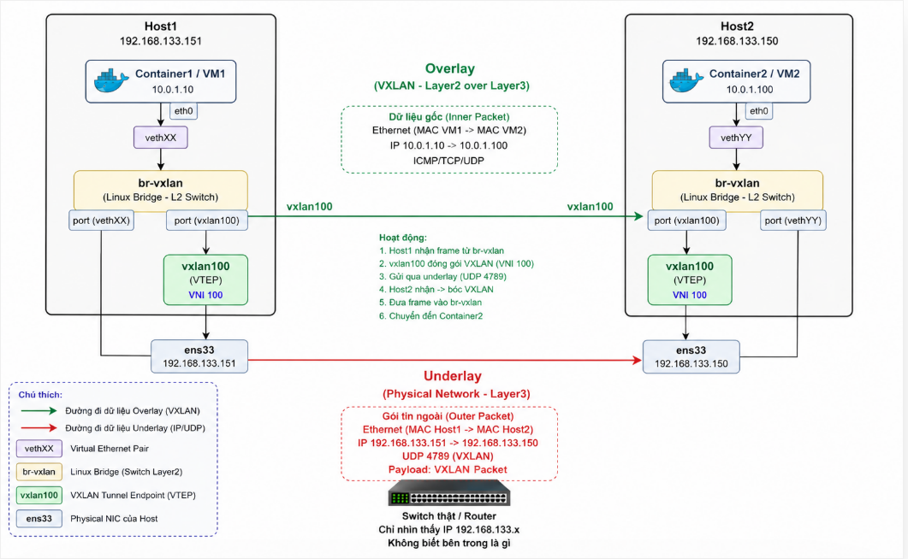
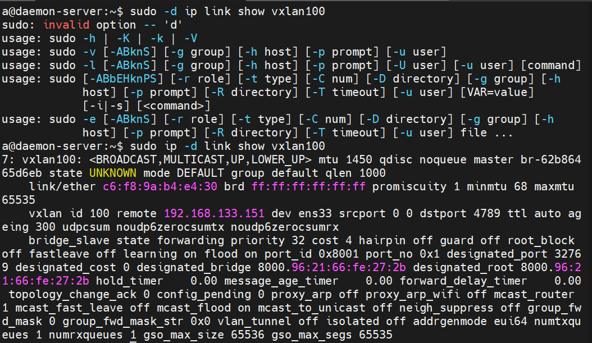
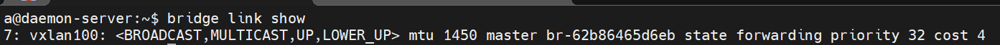
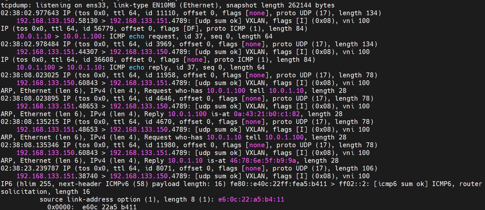
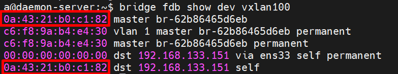

# Lab: Multi-host Docker Networking bằng VXLAN thủ công (không Swarm, không tool auto)

Mục tiêu: container ở **Host A** ping thẳng được container ở **Host B** — hai host khác máy vật lý/VM, không cùng LAN layer 2 — bằng cách tự tay dựng một đường hầm **VXLAN** nối 2 Docker bridge lại thành 1 miền L2 logic.

Không dùng: `docker swarm`, `docker network create -d overlay`, pipework, flannel, weave... Toàn bộ dùng `ip link` (iproute2) + `docker network create -d bridge` thuần.

---

## 0. Khái niệm cần nắm trước khi làm

| Thuật ngữ | Ý nghĩa |
|---|---|
| **Underlay network** | Mạng vật lý/IP thật giữa 2 host (ví dụ `192.168.70.0/24`) — nơi gói VXLAN đã đóng gói đi qua. |
| **Overlay network** | Mạng ảo bên trong VXLAN mà container nhìn thấy (ví dụ `10.0.1.0/24`) — độc lập với underlay. |
| **VNI (VXLAN Network Identifier)** | Giống VLAN ID nhưng 24-bit (16 triệu segment thay vì 4094). Định danh cho 1 "đường hầm" logic. |
| **VTEP (VXLAN Tunnel Endpoint)** | Điểm đóng gói/mở gói VXLAN — chính là interface `vxlan100` ta sẽ tạo trên mỗi host. |
| **Encapsulation** | Frame Ethernet gốc của container → được VTEP bọc thêm header VXLAN + UDP + IP → gửi qua underlay tới VTEP bên kia → VTEP bên kia bóc ra, đẩy vào bridge nội bộ. |
| **Cổng UDP 4789** | Cổng chuẩn (IANA) mà VXLAN dùng để gửi gói đã đóng gói. |


Về bản chất gói tin vẫn là đi theo kiểu vm1 -> host1 -> host2 -> vm2.
- Trong OSI thông thường: L2 bọc L3.
- Trong VXLAN: một Ethernet frame (L2) được coi là payload và được bọc bởi một IP packet khác.
- Underlay = mạng vận chuyển của tunnel.
- Overlay = mạng logic của VM
- VM encapsulate để tạo Ethernet frame thông thường.
- VTEP encapsulate lần nữa để đưa Ethernet frame đó đi qua mạng IP.
- Outer IP = IP của host.
- Inner IP = IP của VM hoặc container.
- veth: Viết tắt của Virtual Ethernet (Ethernet ảo). Trong Linux, veth không bao giờ đứng một mình mà luôn được tạo ra theo cặp, gọi là veth pair (cặp veth).
  - Nhờ "sợi cáp ảo" veth này, container đã có một đường truyền dẫn vật lý ảo để gửi nhận dữ liệu trực tiếp với thế giới bên ngoài.
---


## 1. Chuẩn bị

* 2 máy/VM Linux (Ubuntu 24.04), gọi là **Host A** và **Host B**, đã cài Docker Engine, **không** ở chế độ Swarm (`docker info` phải báo `Swarm: inactive`).
* 2 host phải ping được nhau ở tầng IP thường (underlay) và mở được UDP port 4789 giữa nhau.

| Host | IP underlay | Interface vật lý |
|---|---|---|
| Host A | 192.168.133.150 | ens33 |
| Host B | 192.168.133.151 | ens33 |

> Kiểm tra tên interface thật của bạn bằng `ip addr` — có thể là `ens33`, `enp0s3`... thay `eth0` trong toàn bộ lab bằng tên đúng.

Kiểm tra kết nối underlay trước khi làm gì khác:

```bash
# Trên Host A
ping -c 3 192.168.70.102

# Trên Host B
ping -c 3 192.168.70.101
```

Nếu có firewall (ufw/iptables) chặn UDP, mở port cho VXLAN:

```bash
# Chạy trên cả 2 host
sudo ufw allow 4789/udp
```



---

## 2. Bước 1 — Tạo Docker bridge network riêng (không dùng bridge mặc định `docker0`)

Ta không đụng vào `docker0` (network mặc định, có NAT ra internet) — tạo hẳn 1 bridge network mới, đặt tên Linux bridge tường minh để lát nữa gắn VXLAN vào.

**Trên cả Host A và Host B**, chạy **giống hệt nhau** (cùng subnet — vì đây sẽ là 1 miền L2 phẳng dùng chung):

```bash
docker network create \
  --driver bridge \
  --subnet 10.0.1.0/24 \
  --gateway 10.0.1.1 \
  -o com.docker.network.bridge.name=br-vxlan \
  vxlan-net
```

Kiểm tra bridge Linux thật sự đã được Docker tạo:

```bash
ip addr show br-vxlan
```

```
4: br-vxlan: <NO-CARRIER,BROADCAST,MULTICAST,UP> mtu 1500 ...
    inet 10.0.1.1/24 brd 10.0.1.255 scope global br-vxlan
```

> Vì 2 host dùng **cùng 1 subnet** `10.0.1.0/24` nhưng Docker IPAM trên mỗi host hoạt động **độc lập** (không có control-plane chia sẻ như Swarm), bạn phải **tự chia range IP thủ công** để tránh 2 container ở 2 host bị trùng IP:
>
> * Host A: dùng IP từ `10.0.1.10` → `10.0.1.99`
> * Host B: dùng IP từ `10.0.1.100` → `10.0.1.199`

---

## 3. Bước 2 — Tạo interface VXLAN thủ công (VTEP)

Đây là phần lõi của lab: dùng `ip link add type vxlan` để tạo VTEP, trỏ `remote` thẳng vào IP underlay của host bên kia (unicast point-to-point — phù hợp cho lab 2 node).

**Trên Host A:**

```bash
ip link add vxlan100 type vxlan \
  id 100 \
  remote 192.168.70.102 \
  dstport 4789 \
  dev eth0

ip link set vxlan100 up
ip link set vxlan100 master br-vxlan
```

**Trên Host B (đối xứng, `remote` trỏ ngược lại về A):**

```bash
ip link add vxlan100 type vxlan \
  id 100 \
  remote 192.168.70.101 \
  dstport 4789 \
  dev eth0

ip link set vxlan100 up
ip link set vxlan100 master br-vxlan
```

Giải thích tham số:

* `id 100`: VNI — phải **giống nhau** trên cả 2 host để cùng 1 đường hầm.
* `remote <ip>`: IP underlay của host đối diện — nơi gửi gói đã đóng gói tới.
* `dstport 4789`: cổng UDP chuẩn VXLAN.
* `dev eth0`: interface underlay dùng để gửi gói đi.
* `master br-vxlan`: gắn VTEP làm 1 "cổng" (port) của bridge Docker vừa tạo — từ đây, mọi frame broadcast/L2 trên `br-vxlan` sẽ được VTEP tự động đóng gói VXLAN gửi sang host kia, và ngược lại.

---

## 4. Bước 3 — Kiểm tra cấu hình

```bash
ip -d link show vxlan100
```



Kiểm tra VTEP đã là thành viên của bridge:

```bash
bridge link show
```



Xem bảng FDB (forwarding database) của VXLAN — nơi lưu MAC nào đi qua tunnel nào:

```bash
bridge fdb show dev vxlan100
```

Ban đầu sẽ chỉ thấy 1 entry mặc định `00:00:00:00:00:00` trỏ tới `remote` — đây là "catch-all" cho unicast mode, các entry MAC cụ thể sẽ tự học thêm khi có traffic thật đi qua.

---

## 5. Bước 4 — Chạy container, gán IP thủ công

**Trên Host A:**

```bash
docker run -dit --name c1 --network vxlan-net --ip 10.0.1.10 alpine sh
```

**Trên Host B:**

```bash
docker run -dit --name c2 --network vxlan-net --ip 10.0.1.100 alpine sh
```

- `--ip` bắt buộc chỉ định thủ công ở đây — nếu để Docker tự cấp phát, 2 host sẽ dễ cấp trùng IP vì không biết gì về nhau.
- `-i` và `-t` là cặp bài trùng. Đi chung với nhau (`-it`), chúng tạo ra một trải nghiệm hoàn hảo: vừa cho phép bạn gõ lệnh vào (`-i`), vừa hiển thị giao diện phản hồi đẹp đẽ, chuẩn chỉnh (`-t`) giống như bạn đang SSH trực tiếp vào một chiếc máy tính khác vậy.
- `alpine` (đây là một hệ điều hành Linux siêu nhẹ, rất phổ biến trong giới công nghệ).
- `sh` (ARG ở đây đóng vai trò là Lệnh thực thi bên trong container): ra lệnh cho container Alpine sau khi khởi động lên thì phải chạy ngay chương trình.
---

## 6. Bước 5 — Test kết nối xuyên host

Từ Host A, ping vào container ở Host B:

```bash
docker exec -it c1 ping -c 4 10.0.1.100
```



Ping thành công tức là: frame từ `c1` → veth → `br-vxlan` (Host A) → `vxlan100` đóng gói VXLAN → gửi UDP/4789 qua underlay `ens33` → tới `vxlan100` (Host B) → bóc gói → đẩy vào `br-vxlan` (Host B) → veth → `c2`.

Kiểm tra bảng FDB đã học được MAC thật của container bên kia:

```bash
bridge fdb show dev vxlan100
```

Giờ sẽ thấy thêm entry với MAC address cụ thể của `c2`, trỏ `dst 192.168.133.151`.



---

## 7. Bước 6 — Debug / quan sát gói tin thật

Bật `tcpdump` trên interface underlay để **thấy tận mắt** gói VXLAN đang chạy qua:

```bash
sudo tcpdump -i ens33 udp port 4789 -n -vv
```

Mở terminal khác, ping lại (bước 6) — sẽ thấy các dòng dạng:

```
IP 192.168.70.101.xxxxx > 192.168.70.102.4789: VXLAN, flags [I] (0x08), vni 100
IP 10.0.1.10 > 10.0.1.100: ICMP echo request ...
```

→ Dòng ngoài cùng là gói **underlay** (IP thật 2 host, UDP 4789), dòng bên trong là gói **overlay** (IP ảo container) — đúng bản chất encapsulation.

---

## 8. MTU

VXLAN thêm khoảng **50 bytes overhead** (header VXLAN + UDP + IP ngoài + Ethernet ngoài) vào mỗi gói. Nếu underlay MTU là 1500 (chuẩn) và container cũng gửi gói full 1500, gói sau khi đóng gói VXLAN sẽ vượt 1500 → bị phân mảnh (fragmentation) hoặc rớt nếu có thiết bị chặn fragment.

Cách xử lý an toàn: hạ MTU của container/bridge xuống để chừa chỗ cho overhead.

```bash
# Đặt MTU cho chính interface VXLAN
ip link set vxlan100 mtu 1450

# Đặt MTU cho bridge tương ứng
ip link set br-vxlan mtu 1450
```

Nếu muốn container tự nhận đúng MTU này ngay khi tạo network, khai báo lúc `docker network create`:

```bash
docker network create \
  --driver bridge \
  --subnet 10.0.1.0/24 \
  --gateway 10.0.1.1 \
  -o com.docker.network.bridge.name=br-vxlan \
  -o com.docker.network.driver.mtu=1450 \
  vxlan-net
```

> Chạy lại lệnh này (xoá network cũ trước) nếu bạn đã tạo `vxlan-net` ở bước 2 mà chưa có option MTU.

---

## 9. Dọn dẹp

**Trên mỗi host:**

```bash
docker rm -f c1        # hoặc c2 tuỳ host
docker network rm vxlan-net
ip link delete vxlan100
```

---

## 10. Mở rộng (đọc thêm, không bắt buộc làm)

* **Hơn 2 host**: cách làm `remote <ip>` cố định ở trên chỉ hợp với **unicast point-to-point** (2 node). Với N host, thủ công có 2 hướng:
  1. Multicast: `ip link add vxlan100 type vxlan id 100 group 239.1.1.1 dev eth0` — cần mạng underlay hỗ trợ IGMP/multicast.
  2. Unicast nhiều peer: dùng `bridge fdb append 00:00:00:00:00:00 dev vxlan100 dst <remote-ip>` cho từng host còn lại (không cần `remote` cố định lúc tạo interface).
* **So với Swarm overlay**: `docker network create -d overlay` (trong bài Swarm trước) dùng **chính công nghệ VXLAN này**, nhưng Swarm tự động: tự chọn VNI, tự đồng bộ bảng FDB qua gossip protocol (serf) giữa các manager, tự cấp IP không trùng nhờ IPAM tập trung. Bài lab này bạn vừa làm bằng tay chính là "phần lõi" mà Swarm ẩn đi.
* **Bảo mật**: VXLAN thuần (không mã hoá) — dữ liệu overlay đi qua underlay ở dạng cleartext trong header VXLAN. Nếu underlay không tin cậy, cần thêm IPsec (giống Swarm encrypted overlay dùng `--opt encrypted`) hoặc WireGuard giữa 2 host.

---

## 11. Cheat sheet

```bash
# Underlay check
ping -c 3 <peer-ip>
ufw allow 4789/udp

# Docker bridge network
docker network create --driver bridge --subnet <cidr> --gateway <gw> \
  -o com.docker.network.bridge.name=<br-name> [-o com.docker.network.driver.mtu=1450] <net-name>

# VXLAN interface (VTEP)
ip link add <vxlan-if> type vxlan id <vni> remote <peer-underlay-ip> dstport 4789 dev <underlay-if>
ip link set <vxlan-if> up
ip link set <vxlan-if> master <br-name>

# Kiểm tra
ip -d link show <vxlan-if>
bridge link show
bridge fdb show dev <vxlan-if>
tcpdump -i <underlay-if> udp port 4789 -n

# Container
docker run -dit --name <c> --network <net-name> --ip <manual-ip> alpine sh
docker exec -it <c> ping -c 4 <ip-container-khac-host>

# Dọn dẹp
docker rm -f <container>
docker network rm <net-name>
ip link delete <vxlan-if>
```
