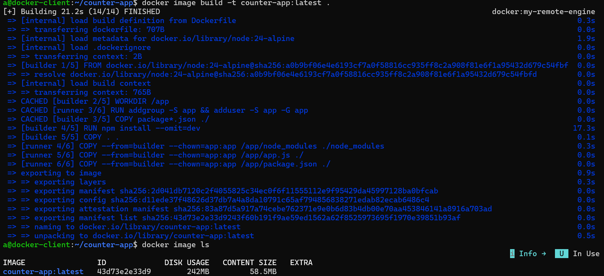
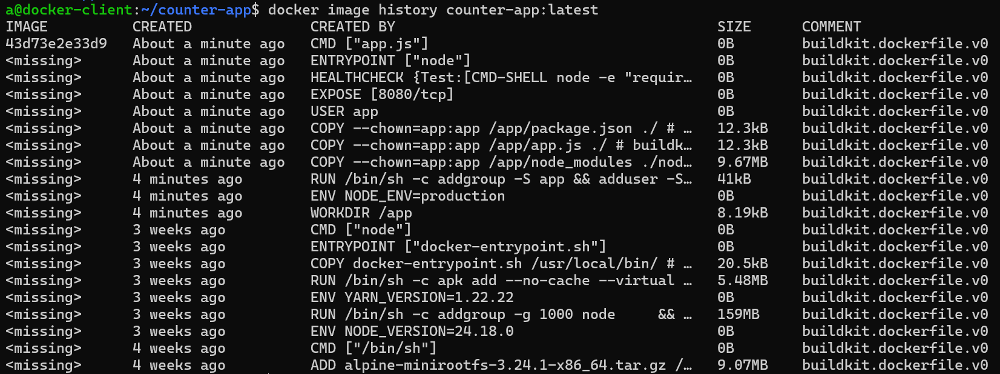
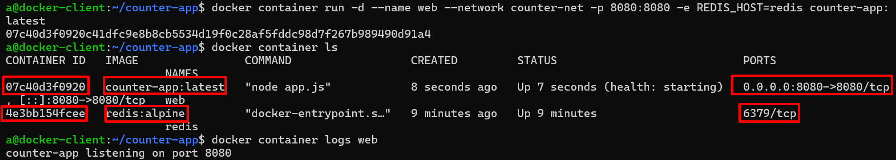
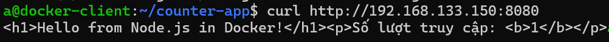
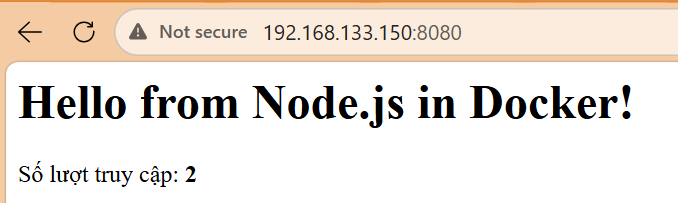

# Lab: Containerize & Deploy 
## 0. Check

```bash
docker version
docker compose version
```

---

## 1. Tạo thư mục dự án

```bash
mkdir counter-app && cd counter-app
```

Cấu trúc cuối cùng sẽ là:

```
counter-app/
├── app.js
├── package.json
├── Dockerfile
├── .dockerignore
└── docker-compose.yml
```

---

## 2. Mã nguồn ứng dụng

### 2.1 `package.json`

```json
{
  "name": "counter-app",
  "version": "1.0.0",
  "description": "Simple visit counter using Express + Redis",
  "main": "app.js",
  "scripts": {
    "start": "node app.js"
  },
  "dependencies": {
    "express": "^4.19.2",
    "redis": "^4.6.13"
  }
}
```

### 2.2 `app.js`

```javascript
const express = require('express');
const redis = require('redis');

const app = express();
const port = 8080;

// REDIS_HOST được truyền qua biến môi trường, mặc định là "redis"
// (đúng bằng tên service redis trong docker-compose.yml / docker-stack.yml)
const redisHost = process.env.REDIS_HOST || 'redis';

const client = redis.createClient({ url: `redis://${redisHost}:6379` });

client.on('error', (err) => console.error('Redis Client Error', err));

async function start() {
  await client.connect();

  app.get('/', async (req, res) => {
    try {
      const visits = await client.incr('visits');
      res.send(
        `<h1>Hello from Node.js in Docker!</h1><p>Số lượt truy cập: <b>${visits}</b></p>`
      );
    } catch (err) {
      res.status(500).send('Redis connection error: ' + err.message);
    }
  });

  // Endpoint dùng cho HEALTHCHECK
  app.get('/health', (req, res) => res.status(200).send('OK'));

  app.listen(port, '0.0.0.0', () => {
    console.log(`counter-app listening on port ${port}`);
  });
}

start();
```

> Ứng dụng này **không cần code sửa gì thêm** để chạy container hoá — không hardcode host Redis, đọc từ `process.env`, đúng nguyên tắc "config qua biến môi trường" khi containerize.

---

## 3. Viết Dockerfile (multi-stage, chuẩn production)

### 3.1 `.dockerignore`

Luôn tạo file này **trước** khi build, để không copy rác/secret vào build context:

```gitignore
node_modules
npm-debug.log
.git
.gitignore
Dockerfile
.dockerignore
docker-compose.yml
docker-stack.yml
*.md
```

### 3.2 `Dockerfile`

```dockerfile
# syntax=docker/dockerfile:1.7
# ----- Stage 1: builder - cài dependency -----
FROM node:22-alpine AS builder
WORKDIR /app

# Copy package.json trước để tận dụng cache layer (chỉ rebuild khi deps đổi)
COPY package*.json ./
RUN npm ci --omit=dev

COPY . .

# ----- Stage 2: runner - image production, nhỏ gọn -----
FROM node:22-alpine AS runner
WORKDIR /app
ENV NODE_ENV=production

# Tạo user không phải root
RUN addgroup -S app && adduser -S app -G app

# Chỉ copy những gì cần cho runtime, không copy build tool
COPY --from=builder --chown=app:app /app/node_modules ./node_modules
COPY --from=builder --chown=app:app /app/app.js ./
COPY --from=builder --chown=app:app /app/package.json ./

USER app
EXPOSE 8080

HEALTHCHECK --interval=30s --timeout=3s --start-period=5s --retries=3 \
  CMD node -e "require('http').get('http://localhost:8080/health', r => process.exit(r.statusCode===200?0:1)).on('error', ()=>process.exit(1))"

ENTRYPOINT ["node"]
CMD ["app.js"]
```

Giải thích nhanh (đúng theo tài liệu tham khảo Dockerfile):

* `FROM node:22-alpine AS builder` / `AS runner`: 2 stage — stage đầu cài `npm ci`, stage sau chỉ copy kết quả sang, không mang theo cache npm hay dev-dependencies → image nhỏ hơn nhiều.
* `COPY package*.json ./`: Nó sẽ khớp và copy cả hai file: `package.json` và `package-lock.json` (nếu có).

Đây là điểm mấu chốt của Docker Layer Caching (bộ nhớ đệm). Docker build theo từng bước (layer). Nếu file `package.json` không có gì thay đổi so với lần build trước, Docker sẽ dùng lại "bản lưu" (cache) của bước cài đặt thư viện tiếp theo mà không cần tải lại từ đầu. Việc này giúp bạn tiết kiệm hàng phút trời mỗi lần build lại code.

- `npm ci` (Clean Install): Khi build image, chúng ta dùng npm ci. Lệnh này nhanh hơn npm install rất nhiều vì nó không cố gắng tự động cập nhật thư viện. Nó hoạt động cực kỳ nghiêm ngặt: xóa thư mục node_modules cũ (nếu có) và cài đặt chính xác 100% các phiên bản được ghi trong file `package-lock.json`. Điều này đảm bảo app chạy trong Docker hoàn toàn giống hệt app chạy ở máy bạn, tránh lỗi
- `--omit=dev`: Tham số này yêu cầu npm bỏ qua không cài đặt các thư viện phục vụ cho việc phát triển (`devDependencies` như: các công cụ kiểm tra code, chạy test, nodemon, typescript compiler...). Nhờ vậy, thư mục node_modules trong Docker image của bạn sẽ nhẹ hơn rất nhiều, giúp image gọn gàng và chạy mượt mà hơn.

- `FROM node:20 AS builder`: Từ khóa `AS builder` ở đây dùng để đặt tên cho giai đoạn build (stage) này là `builder`.
  - Bình thường: Lệnh COPY sẽ lấy file từ máy của bạn (máy host) để bỏ vào Docker image.
  - Khi có `--from=builder`: Lệnh `COPY` sẽ không lấy file từ máy của bạn nữa. Thay vào đó, nó nhảy vào bên trong kết quả của giai đoạn `builder` trước đó để copy thư mục `/app/node_modules` ra ngoài.
  - Mục đích là để giảm dung lượng tối đa cho Image cuối cùng: Giai đoạn 1 (builder): Bạn tải về đầy đủ các công cụ build, trình biên dịch, chạy lệnh npm install để cài đặt cả thư viện phát triển (devDependencies) và các file rác. Giai đoạn này image sẽ rất nặng (có thể lên tới 1GB).
  - Giai đoạn 2 (Production): Bạn tạo một stage mới tinh, siêu nhẹ. Sau đó bạn chỉ dùng `--from=builder` để nhặt đúng thư mục node_modules đã được build xong từ stage trước bỏ qua stage này. Toàn bộ các công cụ build cồng kềnh ở stage 1 sẽ bị vứt bỏ, không bị mang vào image cuối cùng khi deploy lên server.
---

## 4. Build image

```bash
docker image build -t counter-app:latest .
```

Kiểm tra:

```bash
docker image ls
```



Xem các layer đã tạo (đối chiếu với Dockerfile):

```bash
docker image history counter-app:latest
```


- **Lưu ý**:
  - `docker image history` chỉ hiển thị quá trình tạo image. Image hiển thị ID là image cuối cùng.
  - Xem layer thật bằng `docker image inspect` 
---


## 5. Chạy thử container đơn lẻ (không dùng Compose)

Vì app cần Redis, ta tạo network riêng rồi chạy 2 container thủ công — bước này giúp hiểu rõ **vì sao Compose ra đời** (bước 6 sẽ thay thế toàn bộ phần này bằng 1 lệnh).

```bash
# Tạo network để 2 container thấy nhau qua DNS tên container
docker network create counter-net

# Chạy Redis
docker container run -d --name redis --network counter-net redis:alpine

# Chạy app, trỏ REDIS_HOST vào tên container redis, map cổng ra ngoài
docker container run -d --name web \
  --network counter-net \
  -p 8080:8080 \
  -e REDIS_HOST=redis \
  counter-app:latest
```



Kiểm tra:

```bash
docker container ls
docker container logs web
```

### Test ứng dụng

```bash
curl http://localhost:8080
curl http://localhost:8080/health
```




Gọi lại nhiều lần, số lượt truy cập sẽ tăng dần — chứng tỏ Redis đã lưu state thành công.

Dọn dẹp bước thử nghiệm này trước khi sang bước Compose:


```bash
docker container rm -f web redis
docker network rm counter-net
```

---

## 6. (Tuỳ chọn) Push image lên Docker Hub

```bash
docker login -u <docker-id>

docker image tag counter-app:latest <docker-id>/counter-app:latest
docker image push <docker-id>/counter-app:latest
```

---

## 7. Đóng gói bằng Docker Compose

### 7.1 `docker-compose.yml`

```yaml
services:
  web:
    build: .
    image: counter-app:latest
    ports:
      - "8080:8080"
    environment:
      - REDIS_HOST=redis
    networks:
      - counter-net
    depends_on:
      redis:
        condition: service_started
    healthcheck:
      test: ["CMD", "node", "-e", "require('http').get('http://localhost:8080/health', r => process.exit(r.statusCode===200?0:1)).on('error', ()=>process.exit(1))"]
      interval: 10s
      timeout: 3s
      retries: 3

  redis:
    image: redis:alpine
    networks:
      - counter-net
    volumes:
      - redis-data:/data

networks:
  counter-net:

volumes:
  redis-data:
```

> Lưu ý: file này bỏ key `version:` — Compose V2 không cần nữa (key này đã deprecated, Compose tự nhận diện qua schema).

### 7.2 Triển khai với Compose

```bash
docker compose up -d --build
```

Kiểm tra:

```bash
docker compose ps
docker compose logs -f web
```


Test:

```bash
curl http://localhost:8080
```

### 7.3 Quản lý vòng đời

```bash
docker compose stop        # dừng container, giữ lại để chạy tiếp
docker compose start       # chạy lại
docker compose restart     # khởi động lại (không áp dụng thay đổi code mới)
docker compose down        # dừng + xoá container, network (KHÔNG xoá volume redis-data)
docker compose down -v     # xoá luôn cả volume — mất toàn bộ dữ liệu Redis
```

Nếu sửa `app.js` hoặc `Dockerfile`, phải build lại rồi mới lên:

```bash
docker compose up -d --build
```

---

## 8. (Mở rộng) Triển khai lên Docker Swarm bằng Stack

Nếu muốn đi xa hơn — chạy nhiều replica, rolling update, scale trên cluster — dùng lại gần như nguyên file Compose, chỉ thêm khối `deploy:`.

### 8.1 Khởi tạo Swarm (nếu chưa có)

```bash
docker swarm init
```

### 8.2 `docker-stack.yml`

```yaml
services:
  web:
    image: counter-app:latest
    ports:
      - "8080:8080"
    environment:
      - REDIS_HOST=redis
    networks:
      - counter-net
    deploy:
      replicas: 3
      update_config:
        parallelism: 1
        delay: 10s
        order: start-first
        failure_action: rollback
      restart_policy:
        condition: on-failure
        delay: 5s
        max_attempts: 3

  redis:
    image: redis:alpine
    networks:
      - counter-net
    volumes:
      - redis-data:/data
    deploy:
      placement:
        constraints:
          - node.role == manager

networks:
  counter-net:
    driver: overlay

volumes:
  redis-data:
```

> Stack **không hỗ trợ `build:`** — image phải được build và (nếu multi-node) push lên registry trước, vì Swarm không build image tại chỗ.

### 8.3 Deploy stack

```bash
docker stack deploy -c docker-stack.yml counterstack
```

Kiểm tra:

```bash
docker stack ls
docker stack services counterstack
docker stack ps counterstack
```

Scale (khai báo lại trong file rồi deploy lại — cách khuyến nghị):

```bash
# Sửa replicas: 3 -> 5 trong docker-stack.yml rồi:
docker stack deploy -c docker-stack.yml counterstack
```

Rolling update image mới:

```bash
docker service update --image counter-app:v2 counterstack_web
```

Xoá stack:

```bash
docker stack rm counterstack
```

---

## 9. Cheat sheet tổng hợp

```bash
# Build & run đơn lẻ
docker image build -t counter-app:latest .
docker image history counter-app:latest
docker network create counter-net
docker container run -d --name redis --network counter-net redis:alpine
docker container run -d --name web --network counter-net -p 8080:8080 -e REDIS_HOST=redis counter-app:latest

# Compose
docker compose up -d --build
docker compose ps
docker compose logs -f web
docker compose stop / start / restart
docker compose down [-v]

# Stack (Swarm)
docker swarm init
docker stack deploy -c docker-stack.yml counterstack
docker stack services counterstack
docker stack ps counterstack
docker service update --image counter-app:v2 counterstack_web
docker stack rm counterstack
```

