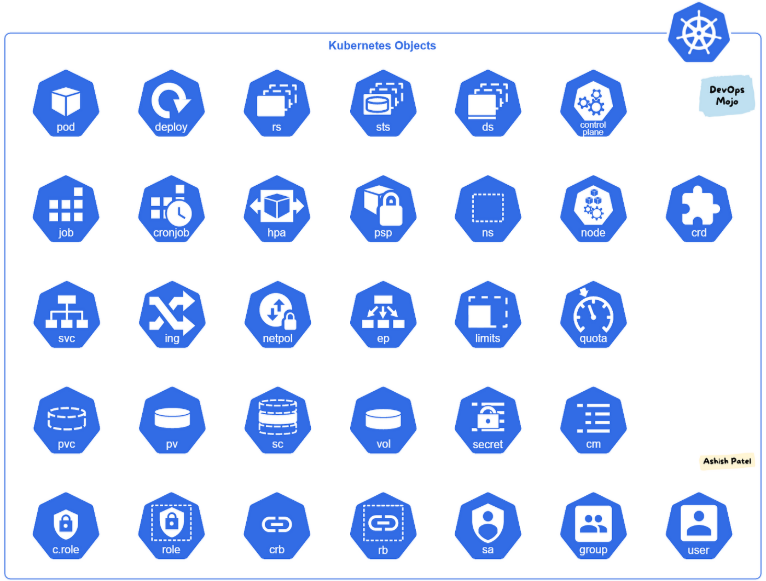

# Kubernetes Object
## 1. Khái niệm
Kubernetes Object là các thực thể tồn tại lâu dài (persistent entities) trong hệ thống Kubernetes dùng để đại diện cho trạng thái của cluster.

Cụ thể chúng mô tả:
- Những ứng dụng container nào đang chạy (và đang chạy trên Node nào).
- Các tài nguyên (RAM, CPU...) được phân bổ cho các ứng dụng đó.
- Các chính sách quản lý hành vi ứng dụng (chính sách khởi động lại, nâng cấp, chịu lỗi...).



### 1* Record of intent
Khi bạn tạo một object, Kubernetes sẽ liên tục làm việc để đảm bảo object đó luôn tồn tại đúng như bạn mô tả.

Bạn không "ra lệnh" từng bước cho Kubernetes làm gì, mà bạn khai báo "tôi muốn trạng thái cuối cùng như thế này", rồi Kubernetes tự tìm cách đạt được và duy trì trạng thái đó mãi mãi (declarative, không phải imperative).

Để tạo/sửa/xoá object, bạn phải thông qua Kubernetes API — dù bạn gõ kubectl hay dùng client library, thực chất phía sau đều là gọi API.

### 1.2 Ví dụ
Bạn tạo 1 Deployment với `spec.replicas: 3` → nghĩa là bạn muốn có 3 bản sao ứng dụng chạy song song.
- Kubernetes đọc spec → khởi động 3 instance → cập nhật `status` phản ánh đúng 3 cái đang chạy.
- Nếu 1 instance bị chết (status đổi thành 2) → Kubernetes phát hiện status ≠ spec → tự động tạo lại 1 instance mới để bù vào, cho đến khi status khớp lại spec (3 cái).
- Đây chính là cơ chế reconciliation loop (vòng lặp đối chiếu) — "trái tim" của toàn bộ Kubernetes: liên tục so sánh **spec** (muốn gì) với **status** (đang có gì) và tự sửa cho khớp.

## 2. Object Describing
- Khi tạo object, bạn viết 1 file gọi là manifest, thường ở định dạng YAML/JSON (YAML là quy ước phổ biến).
```yaml
apiVersion: apps/v1
kind: Deployment
metadata:
  name: nginx-deployment
spec:
  selector:
    matchLabels:
      app: nginx
  replicas: 2 # tells deployment to run 2 pods matching the template
  template:
    metadata:
      labels:
        app: nginx
    spec:
      containers:
      - name: nginx
        image: nginx:1.14.2
        ports:
        - containerPort: 80
```
- Tạo bằng lệnh:
```bash
kubectl apply -f deployment.yaml
```
- `kubectl` sẽ tự chuyển file YAML thành JSON và gửi request đến `kube-apiserver`.

4 trường bắt buộc phải có trong mọi manifest

|Trường | Ý nghĩa |
|-------|---------|
|**apiVersion**| Dùng phiên bản API nào để tạo object(VD: `apps/v1`)|
| **kind**| Loại object là gì (VD: `Deployment`,`Pod`,`Service`...)|
| **metadata**| Thông tin định danh: `name`, `UID`, `namespace`...|
| **spec** | Trạng thái mong muốn - định dạng riêng từng loại object |

> **Lưu ý**: cấu trúc bên trong `spec` khác nhau hoàn toàn tùy loại object
- `Pod.spec`: Mô tả container nào, image gì...
- `StatefulSet.spec`: bên trong còn có 1 template Pod nữa (để StatefulSet controller dùng tạo Pod theo khuôn mẫu đó).

Muốn biết `spec` của object nào có những field gì, phải tra Kubernetes API Reference

## 3. Server Side Field Validation (từ Kubernetes v1.25+)
Đây là tính năng giúp phát hiện lỗi trong manifest ngay tại API server, ví dụ: field không tồn tại, field bị khai trùng lặp.

Điều khiển qua flag `--validate` khi dùng `kubectl`:

| **Giá trị** | **Hành vi**|
|-------------|------------|
|`strict`(hoặc `true`) | Lỗi -> từ chối request luôn (mặc định) |
| `warn` | Lỗi -> chỉ cảnh báo, vẫn cho request đi qua |
| `ignore`(hoặc `false`)| Không kiểm tra gì cả |

- Nếu `kubectl` không kết nối được API server hỗ trợ tính năng này → tự động fallback về client-side validation (kiểm tra ngay trên máy bạn, trước khi gửi đi).
- Từ Kubernetes 1.27 trở đi, tính năng này luôn có sẵn; bản cũ hơn thì cần kiểm tra tài liệu riêng.


## 4. Object Management (3 cách quản lý)

| Cách | Thao tác trên | Môi trường |
|---|---|---|
| **Imperative commands** | Object đang sống (live) | Dev / thử nghiệm |
| **Imperative object configuration** | Từng file cấu hình | Production | 
| **Declarative object configuration** | Thư mục chứa nhiều file | Production |

> **Quy tắc quan trọng**: chỉ dùng **1 kỹ thuật duy nhất** cho 1 object — trộn lẫn sẽ gây hành vi khó lường.

- **Imperative commands**: 
  - Đây là cách ra lệnh trực tiếp: `kubectl create deployment nginx --image nginx`
  - Nhanh, gọn, nhưng **không có lịch sử cấu hình**, Yaml, Git, không audit trail, không template.

- **Imperative object configuration**: `kubectl create -f nginx.yaml`, `kubectl replace -f nginx.yaml`
  - Bạn viết ra 1 file mô tả bạn muốn gì, rồi bảo kubectl: "làm y như cái file này đi" (`kubectl create -f file.yaml`). 
  - Có thể lưu Git, review trước khi push. **Lưu ý**: `replace` sẽ **ghi đè toàn bộ**, mất các thay đổi không có trong file (VD: field `externalIPs` của LoadBalancer Service do cluster tự set).
  - Vấn đề là nếu dùng lệnh replace, nó sẽ xoá sạch những gì không có trong file rồi ghi đè — nên dễ mất dữ liệu nếu không cẩn thận. Hiểu đơn giản là replace sẽ xóa toàn bộ object cũ ghi đè object mới và không quan tâm object cũ có gì.

- **Declarative object configuration**: `kubectl diff -f configs/`, `kubectl apply -f configs/`
  - Đây là cách Kubernetes khuyến khích dùng.
  - kubectl **tự phát hiện** cần create/patch/delete cho từng object.
  - Dùng **patch** (chỉ ghi phần khác biệt) thay vì **replace** (ghi đè toàn bộ) → giữ được thay đổi từ bên ngoài không merge lại vào file.
  - Nhược điểm: khó debug khi kết quả không như mong đợi.

## 2. Object Names và UIDs

- **Name**: chuỗi do client đặt, dùng trong URL API (VD: `/api/v1/pods/my-pod`).
  - Chỉ **duy nhất trong cùng 1 loại resource + cùng namespace** tại 1 thời điểm.
  - Có thể **trùng tên khác loại**: 1 Pod và 1 Deployment cùng tên `myapp-1234`.
  - Định danh duy nhất = **API group + Resource type + Namespace + Name** (KHÔNG tính version API).
  - Xoá object rồi có thể tạo lại object mới **cùng tên**.
  - `generateNames`: server tự sinh hậu tố ngẫu nhiên thay vì bạn đặt tên cố định (có thể vẫn đụng tên → lỗi 409, nhưng từ v1.31 thử tối đa 8 lần).

- **UID**: chuỗi **hệ thống tự sinh** (UUID), **duy nhất trên toàn cluster suốt vòng đời**, dùng để phân biệt các lần tạo/xoá khác nhau của "cùng 1 cái tên".
Lúc này bạn có file YAML.

## 3. Labels & Selectors

Label là cặp `key: value` bạn dán lên object để sau này dễ tìm, dễ lọc. Ví dụ bạn dán `environment: production` lên 100 cái Pod, thì sau này chỉ cần gõ 1 lệnh là lọc ra đúng 100 cái đó ngay.
- Mỗi object có thể có nhiều label, nhưng **key phải duy nhất trong cùng 1 object**.
- Có thể gắn lúc tạo hoặc sửa/thêm bất kỳ lúc nào.

**Cú pháp key**: `[prefix/]name` Ví dụ: `company.com/app: nginx` (`company.com` là prefix)
- `name`: bắt buộc, ≤63 ký tự, bắt đầu/kết thúc bằng chữ+số.
- `prefix`: tuỳ chọn, dạng DNS subdomain, ≤253 ký tự.
- Không có prefix → coi như **private của user**.
- Component hệ thống (kube-scheduler, kubectl...) khi tự thêm label **bắt buộc phải có prefix**.
- `kubernetes.io/` và `k8s.io/` → **dành riêng cho Kubernetes core**.
- Bạn không nên tự tạo những label thuộc các prefix dành riêng như kubernetes.io/ hoặc k8s.io/ vì chúng được Kubernetes sử dụng cho các mục đích hệ thống.

Selector là điều kiện tìm kiếm

**Label Selector — 2 loại**:
1. **Equality-based**: `=`, `==`, `!=`
   - VD: `environment=production,tier!=frontend`
2. **Set-based**: `in`, `notin`, `exists`
   - VD: `environment in (production, qa)`, `tier notin (frontend, backend)`, `partition`, `!partition`

Nghĩa là `environment=production` AND `tier != frontend` Cả hai điều kiện đều phải đúng.

Không được lọc theo kiểu OR chỉ có AND

**Set-based dùng trong YAML** (Deployment, Job, ReplicaSet, DaemonSet...):
```yaml
selector:
  matchLabels:
    component: redis
  matchExpressions:
    - { key: tier, operator: In, values: [cache] }
```
- `matchLabels` + `matchExpressions` → **AND với nhau** (tất cả phải đúng).
- Toán tử hợp lệ: `In`, `NotIn`, `Exists`, `DoesNotExist`.

**Service/ReplicationController** → chỉ hỗ trợ **equality-based** selector (map đơn giản, không có `matchExpressions`).

**Lệnh thực tế**:
```bash
kubectl get pods -l environment=production,tier=frontend
kubectl get pods -l 'environment in (production, qa)'
kubectl label pods -l app=nginx tier=fe     # gắn thêm label
```

## 4. Namespaces

- Cơ chế **cô lập nhóm resource** trong 1 cluster. Tên resource **chỉ cần duy nhất trong 1 namespace**, không cần duy nhất toàn cluster.
- Chỉ áp dụng cho **namespaced object** (Deployment, Service...) — KHÔNG áp dụng cho **cluster-wide object** (Node, PersistentVolume, StorageClass...).
- **Không nested** được (không namespace trong namespace).
- Dùng khi: nhiều team/nhiều user dùng chung 1 cluster → cluster nhỏ (vài chục user) thường **không cần** namespace.
- Phân biệt version phần mềm khác nhau → nên dùng **label**, không cần tạo namespace riêng.

**4 namespace mặc định khi khởi tạo cluster**:
| Namespace | Vai trò |
|---|---|
| `default` | Namespace mặc định khi chưa khai báo |
| `kube-node-lease` | Chứa Lease object cho từng node (heartbeat) |
| `kube-public` | Đọc được bởi mọi client, kể cả chưa authenticate |
| `kube-system` | Chứa object do chính hệ thống Kubernetes tạo |

 Tránh tự tạo namespace bắt đầu bằng `kube-` (dành riêng cho hệ thống).

**Lệnh hay dùng**:
```bash
# 1. List namespace
kubectl get ns

# 2. Create namespace
kubectl create ns dev

# 3. Delete namespace
kubectl delete ns dev

# 4. Describe namespace
kubectl describe ns dev

# 5. Get Pod trong namespace
kubectl get pods -n dev

# 6. Get tất cả resource trong namespace
kubectl get all -n dev

# 7. Get resource ở tất cả namespace
kubectl get pods -A

# 8. Tạo resource trong namespace
kubectl create deployment nginx --image=nginx -n dev

# 9. Đổi namespace mặc định
kubectl config set-context --current --namespace=dev

# 10. Kiểm tra namespace mặc định hiện tại
kubectl config get-contexts
```

**DNS theo namespace**: Service có DNS dạng `<service-name>.<namespace-name>.svc.cluster.local`.
- Cùng namespace → chỉ cần gọi `<service-name>`.
- Khác namespace → phải dùng FQDN đầy đủ.

## 5. Annotations

- Cặp key/value gắn **metadata phi định danh** (non-identifying) — KHÔNG dùng để select/filter object (đó là việc của label).
- Value **không giới hạn ký tự** (khác Label) — có thể chứa JSON, YAML, khoảng trắng, ký tự đặc biệt.
- Tổng kích thước toàn bộ annotation trên 1 object ≤ **256 KiB**.
- Cú pháp key giống Label: `[prefix/]name`.
- Dùng để lưu: thông tin build/release, con trỏ tới log/monitoring, thông tin công cụ quản lý (VD: Helm), số điện thoại người phụ trách, v.v.

## 6. Field Selectors

- Lọc object theo **giá trị field**, không phải label.
- VD: `metadata.name=my-service`, `status.phase=Pending`
```bash
kubectl get pods --field-selector status.phase=Running
```
- **Mọi loại resource** đều hỗ trợ `metadata.name` và `metadata.namespace`.
- Field khác được hỗ trợ → **tuỳ loại resource** (VD: Pod có `spec.nodeName`, `status.podIP`...).
- Toán tử hỗ trợ: `=`, `==`, `!=` — **KHÔNG hỗ trợ** `in`, `notin`, `exists` (khác Label Selector).
- Chain nhiều field selector bằng dấu phẩy (AND):
```bash
kubectl get pods --field-selector=status.phase!=Running,spec.restartPolicy=Always
```

---

## 7. Finalizers

- Là **key namespaced**, báo Kubernetes "**chờ** đến khi đủ điều kiện mới xoá thật sự" object.
- Khi xoá object có finalizer:
  1. API set `metadata.deletionTimestamp` → trả về **202 Accepted**
  2. Object vào trạng thái **Terminating**
  3. Controller thực hiện dọn dẹp (cleanup) → xoá dần từng finalizer trong `metadata.finalizers`
  4. Khi `finalizers` rỗng → object **mới thực sự bị xoá**
- **Không thể** thêm finalizer mới sau khi đã yêu cầu xoá (chỉ được xoá bớt).
- **Không thể** sửa `deletionTimestamp` sau khi đã set.
- Không thể "hồi sinh" object đã bị đánh dấu xoá — chỉ có thể xoá hẳn rồi tạo mới.
- VD điển hình: `kubernetes.io/pv-protection` — ngăn xoá nhầm PersistentVolume đang được Pod sử dụng.
- Custom finalizer **bắt buộc có prefix dạng domain**: VD `example.com/finalizer-name`.

---

## 8. Owners & Dependents (Owner References)

- 1 object có thể là **owner** của object khác → object bị sở hữu gọi là **dependent**.
- VD: ReplicaSet là owner của các Pod nó tạo ra.
- Khác với **Label/Selector** (dùng để controller theo dõi nhóm object) — **Owner Reference** dùng để xác định object nào cần dọn dẹp khi owner bị xoá.
- Field: `metadata.ownerReferences` (chứa tên + UID của owner, cùng namespace).
- `ownerReferences.blockOwnerDeletion`: boolean, quyết định dependent có **chặn việc xoá owner** hay không (mặc định `true` nếu do controller set).
-  **Không cho phép** owner reference **xuyên namespace** (cross-namespace).
- Liên hệ với Finalizer:
  - **Foreground deletion**: thêm foreground finalizer → phải xoá hết dependent (có `blockOwnerDeletion=true`) trước khi xoá owner.
  - **Orphan deletion**: thêm orphan finalizer → xoá owner nhưng **giữ lại** dependent (không xoá theo).

---

## 9. Recommended Labels (`app.kubernetes.io/*`)

Bộ label chuẩn giúp các tool (không chỉ kubectl) hiểu và thao tác nhất quán trên object.

| Label | Ý nghĩa | Ví dụ |
|---|---|---|
| `app.kubernetes.io/name` | Tên ứng dụng | `mysql` |
| `app.kubernetes.io/instance` | Tên định danh **duy nhất** cho 1 lần cài đặt | `mysql-abcxyz` |
| `app.kubernetes.io/version` | Version ứng dụng | `5.7.21` |
| `app.kubernetes.io/component` | Thành phần trong kiến trúc | `database` |
| `app.kubernetes.io/part-of` | Tên ứng dụng lớn hơn mà nó thuộc về | `wordpress` |
| `app.kubernetes.io/managed-by` | Công cụ dùng để quản lý | `Helm` |

- **`name`** = tên ứng dụng (chung), **`instance`** = tên riêng của **1 lần cài đặt cụ thể** — 1 app có thể cài nhiều lần (nhiều instance) trong cùng cluster/namespace.
- Ứng dụng nhiều tầng (VD: WordPress + MySQL) → mỗi tầng có `name`/`instance` riêng, nhưng **cùng chung `part-of: wordpress`**.

---

## 10. Storage Versions (nâng cao — dành cho admin)

- Object được **serialize** theo 1 version cụ thể khi lưu vào etcd → gọi là **storage version**.
- API hỗ trợ **tự động convert** giữa các version (VD: `v1` ↔ `v2` của HPA) → client không cần biết version thật sự lưu là gì.
- Tại 1 thời điểm, **1 resource type chỉ có 1 storage version đang active**; **1 object cụ thể chỉ lưu ở 1 storage version tại 1 thời điểm** (nhưng các object khác nhau của cùng resource có thể đang ở storage version khác nhau, nếu storage version từng bị đổi).
- **Read**: tự convert từ storage version → version bạn yêu cầu.
- **Write/Update**: sẽ **ghi lại** object theo storage version **hiện tại** (mới nhất).
- **Custom Resource (CRD)**: phải khai báo rõ version nào là storage version (`storage: true`), chỉ được **đúng 1 version** làm storage tại 1 thời điểm.
- Liên quan đến **encryption at rest**: đổi encryption key → cả key cũ và mới phải giữ song song cho đến khi chắc chắn mọi object đã được ghi lại ít nhất 1 lần với storage version/key mới.

---
## 11. Organizing resource configurations
Quản lý nhiều resources trong cùng 1 file (được chia tách bởi dấu --- trong file YAML)
- Ví dụ:
```yaml
apiVersion: v1
kind: Service
metadata:
  name: my-nginx-svc
  labels:
    app: nginx
spec:
  type: LoadBalancer
  ports:
  - port: 80
  selector:
    app: nginx
---
apiVersion: apps/v1
kind: Deployment
metadata:
  name: my-nginx
  labels:
    app: nginx
spec:
  replicas: 3
  selector:
    matchLabels:
      app: nginx
  template:
    metadata:
      labels:
        app: nginx
    spec:
      containers:
      - name: nginx
        image: nginx:1.14.2
        ports:
        - containerPort: 80
```