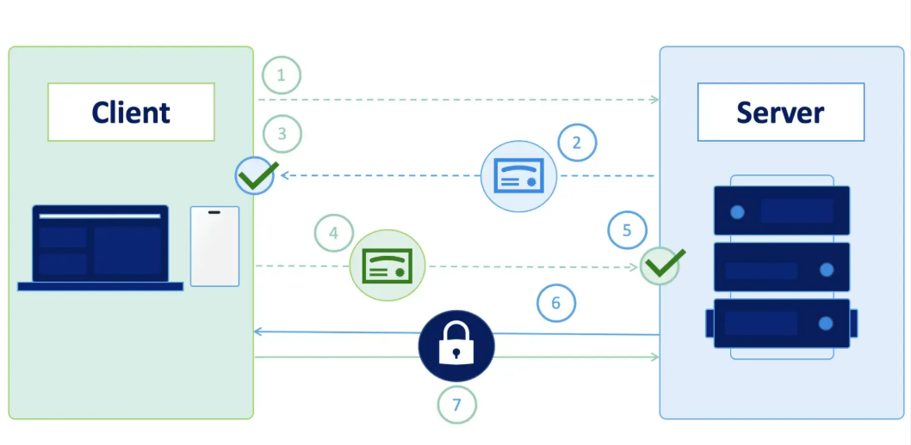

# mTLS 



## Bước 1: Xin cert
**1. Server**
```bash
server.csr 

server.key
```
**2. Client**
```bash
client.csr

client.key
```
**3. CA Trust**
```bash
ca.crt

ca.key
```
- Cả Server và Client gửi CSR lên để CA trust. Như đã nói từ trước trong file csr đều đã có chứa public key và chữ ký số bằng private key của private Server và Client lần lượt nên có bị lộ cũng không sao cả.

- Sau khi xin cấp xong các thành phần : Server sẽ sở hữu `server.crt` và Client có `client.crt`

### Bước 2: Sinh 1 cặp khóa tạm thời
- Cả 2 bên sinh 1 cặp khóa tạm thời gọi là Ephemeral Key:

**Server**
```bash
Ephemeral public Key A
Ephemeral private Key A
```
**Client**
```bash
Ephemeral public key B
Ephemeral private key B
```

### Bước 3: TLS Handshake
- 2 bên trao đổi public key cho nhau tin nhắn sẽ được mã hóa bởi crt của từng bên. Ví dụ khi server gửi ephemeral public key của nó cho client nó sẽ được mã hóa, ký bởi cert của server, client thấy cert đã được trust bởi CA -> Client tin tưởng và chấp nhập Public key này.

- Đây là 1 trong những phát minh vĩ đãi của Diffie-Hellman năm 1976:
  - Hai bên không cần biết Private Key của nhau.
  - Chỉ cần:
    - Private của mình.
    - Public của đối phương.
  - Là sẽ tính ra cùng một Shared Secret.

2 bên sinh ra 1 Session Key chung và dùng session Key này cho phiên làm việc hiện tại.