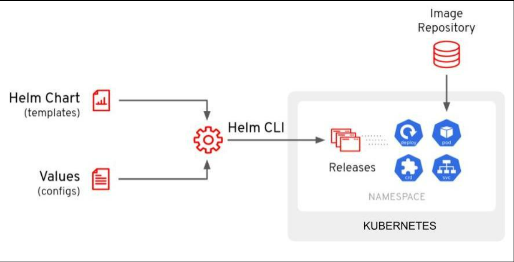
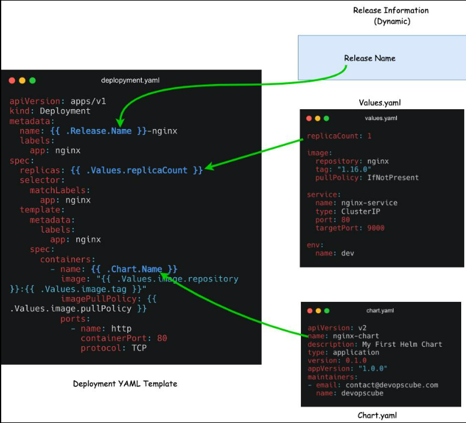

# Helm
## 1. Vấn đề
- Trong Kubernetes bình thường, nếu deploy thủ công, bạn phải viết:

```
deployment.yaml
service.yaml
configmap.yaml
```
- Vấn đề là bạn có nhiều môi trường:
```
DEV
replicas: 1
image: flasky:1.0

PROD
replicas: 5
image: flasky:2.0
```
- Bạn phải chia ra làm nhiều file YAML như:
```
dev-deployment.yaml
prod-deployment.yaml
```
## 2. Khái niệm Helm
Helm xuất hiện để giải quyết vấn đề trên



- User chỉ phải viết file YAML 1 lần, chỗ nào cần thay đổi thì biến nó thành variables.
- Lấy ví dụ 1 Deployment bình thường:
```yaml
apiVersion: apps/v1
kind: Deployment

spec:
  replicas: 3
```
Helm thay đổi:
```yaml
apiVersion: apps/v1
kind: Deployment

spec:
  replicas: {{ .Values.replicaCount }}
```
Trong Helm template có:
```yaml
# values.yaml

replicaCount: 3
```
Helm sẽ lấy: `{{ .Values.replicaCount }}` và thay bằng `3`
- Hay như file:
```yaml
deployment.yaml

replicas: {{ .Values.replicaCount }}
image: {{ .Values.image }}
```
- Đây là ý tưởng của Helm



## 3. Chart
- Chart đơn giản là một folder chứa template + values + thông tin của application.
- Ví dụ như:
```bash
flasky/
├── Chart.yaml
├── values.yaml
└── templates/
      ├── deployment.yaml
      ├── service.yaml
      └── configmap.yaml
```