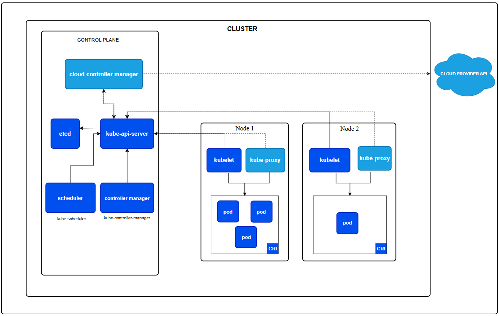
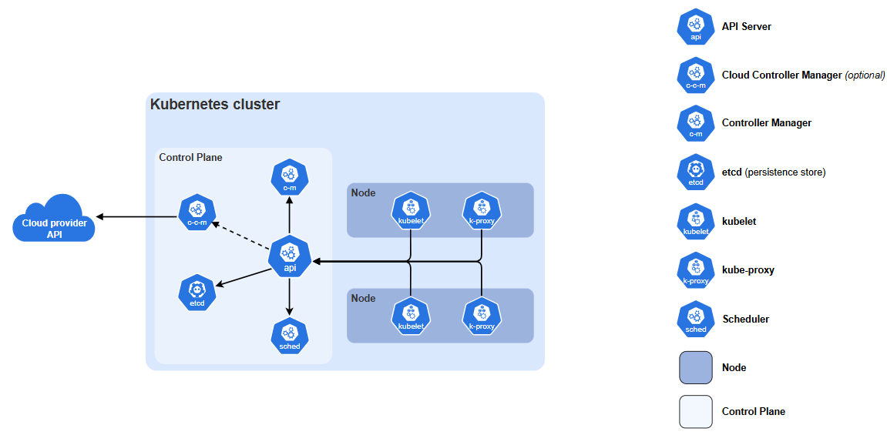

# Giới thiệu Kubernetes (K8s)
## 1. Khái niệm
**Kubernetes** là một nền tảng Container Orchestration( điều phối container), một nền tảng mã nguồn mở, linh hoạt và có thể mở rộng, dùng để quản lý các ứng dụng và dịch vụ được đóng gói dưới dạng container, giúp đơn giản hóa cả việc cấu hình khai báo(trạng thái mong muốn bằng file `YAML/JSON` để K8s tự đưa hệ thống về trạng thái đó) lẫn tự động hóa. Nền tảng này sở hữu một hệ sinh thái lớn và phát triển nhanh chóng. Các dịch vụ, công cụ hỗ trợ và giải pháp đi kèm với Kubernetes hiện rất phong phú và phổ biến.
- Docker là công nghệ tạo và đóng gói ứng dụng vào container
- K8s là người điều hành cả hàng hàng nghìn container đó.

| **Đặc điểm** | Docker| Kubernetes (K8s)|
|---------------|---------|--------------|
| Bản chất| Nền tảng đóng gói & chạy container (Container Runtime / Engine).| Hệ thống điều hành & quản lý nhiều container (Container Orchestrator).|
| Phạm vi| Hoạt động chủ yếu trên 1 máy (single node).| Quản lý trên cả một cụm nhiều máy (cluster).|
| Đơn vị quản lý| Từng Container riêng lẻ.| Các Pod (chứa một hoặc nhiều container).|
| Tính năng chính| "Đóng gói môi trường, tạo image, chạy container nhanh chóng."| "Self-healing, Auto-scaling, Load balancing, Rolling updates."|

## 2. Tại sao người ta lại cần K8s khi đã có Docker
Khi bạn mới bắt đầu dự án hoặc làm việc dưới local: Docker là đủ. Tuy nhiên, khi đưa ứng dụng lên môi trường thực tế (Production) phục vụ hàng triệu người dùng, Docker đơn lẻ lộ ra rất nhiều giới hạn:

- **Bài toán "Sập nguồn & Lỗi ứng dụng" (High Availability)**
  - **Nếu chỉ dùng Docker**: Nếu máy chủ vật lý chứa container bị sập, hoặc container bị tràn bộ nhớ rồi crash, ứng dụng của bạn sẽ dừng hoạt động hoàn toàn cho đến khi có người vào bật lại thủ công.
  - **K8s giải quyết**: K8s liên tục kiểm tra sức khỏe (Health Check). Nếu container chết, nó tự khởi động lại. Nếu một máy chủ bị hỏng, K8s tự chuyển container sang máy chủ khác đang sống trong vòng vài giây.

- **Bài toán "Bão truy cập" (Scaling)**
  - **Nếu chỉ dùng Docker**: Khi lượng truy cập tăng gấp 10 lần (ví dụ ngày săn sale), bạn phải SSH vào từng server, gõ lệnh chạy thêm container, cấu hình lại load balancer thủ công.
  - **K8s giải quyết**: K8s có tính năng Auto-scaling. Tùy vào mức độ ngốn CPU/RAM hoặc số lượng request, K8s sẽ tự động nhân bản từ 3 container lên 50 container, và khi hết giờ cao điểm lại tự động giảm xuống để tiết kiệm chi phí.

- **Bài toán "Cập nhật ứng dụng không gián đoạn" (Zero-Downtime Deployment)**
  - Nếu chỉ dùng Docker: Muốn ra mắt phiên bản mới, bạn phải tắt container cũ rồi bật container mới. Trong khoảng thời gian vài chục giây đó, người dùng truy cập sẽ nhận lỗi 502/503.
  - K8s giải quyết: K8s hỗ trợ Rolling Update. Nó sẽ bật từng container mới lên, kiểm tra xem đã chạy tốt chưa rồi mới tắt dần từng container cũ. Người dùng hoàn toàn không nhận ra hệ thống vừa nâng cấp.

- **Bài toán "Quản lý mạng & Lưu trữ phức tạp"**
  - Trong hệ thống Microservices, hàng chục dịch vụ cần nói chuyện với nhau, phân chia tài nguyên mạng, quản lý thông tin mật (Secret, API key). Docker Swarm hay Docker thuần có khả năng hỗ trợ các việc này khá hạn chế, trong khi K8s có hệ sinh thái cực kỳ mạnh mẽ để quản lý traffic và cấu hình tập trung.

> **Lưu ý**: Bạn không chọn giữa Docker hay Kubernetes. Trong thực tế, bạn sẽ dùng Docker để đóng gói ứng dụng, sau đó dùng Kubernetes để quản lý và vận hành các đóng gói đó ở quy mô lớn.

## 3. Kubernetes Cluster Architecture

### 3.1 Control Plane
- Đây là phần quan trọng nhất, Nó không chạy ứng dụng mà chỉ quản lý, giám sát và ra quyết định(ví dụ: pod nào chạy ở đâu) và phản ứng lại các sự kiện xảy ra (ví dụ: pod chết thì tạo lại pod mới).
#### 3.1.1 `kube-apiserver`
- Là cổng giao tiếp chính của toàn bộ Kubernetes, mọi lệnh `kubectl`, mọi thành phần khác đều phải nói chuyện thông qua đây.
- Có thể chạy nhiều bản sao song song (scale horizontally) và cân bằng tải giữa chúng để tăng khả năng chịu tải.
#### 3.1.2 `etcd`
- Là cơ sở dữ liệu key-value, database của Kubernetes, lưu trữ toàn bộ trạng thái của cluster(cấu hình, thông tin pod, node, v.v).
- Nếu mất dữ liệu `etcd`, gần như mất luôn dữ liệu của cả cluster, nên cần có kế hoạch backup.
- `etcd` là kho lưu trữ key-value có tính nhất quán cao và độ sẵn sàng cao cho toàn bộ dữ liệu của cluster, cần có kế hoạch sao lưu.
#### 3.1.3 `kube-scheduler`
- Theo dõi các Pod mới tạo nhưng chưa được gán vào node nào, rồi chọn ra node phù hợp nhất để chạy Pod đó.
- Giả sử bạn tạo: `replicas=3`
  - Scheduler sẽ xem xét CPU, RAM, Node nào phù hợp, Afinity, Anti-afinity, chính sách, dữ liệu ,v.v.
  - Rồi chọn Worker Node phù hợp.
- Nó không tạo Pod, chỉ quyết định Pod sẽ chạy ở đâu.
#### 3.1.4 `kube-controller-manager`
- Chạy nhiều controller (quy trình giám sát & tự động điều chỉnh trạng thái cluster), nhưng được đóng gói chung vào 1 file nhị phân, chạy trong 1 process để giảm độ phức tạp.
- Hiểu đơn giản: đây là "đội quản lý" — luôn theo dõi và tự sửa nếu trạng thái thực tế không khớp với trạng thái mong muốn.
- Controller có nhiệm vụ: so sánh trạng thái mong muốn(Desired State) với trạng thái thực tế (Actual State), rồi hành động để hai trạng thái khớp nhau. 
- Ví dụ:
  - bạn khai báo: `replicas=3` -> đó là Desired State
  - Nhưng hiện tại chỉ có 2 Pods, Controller phát hiện 3 khác 2. Nó tự tạo thêm 1 Pod đến khi 3=3
- Một số controller:
  - Node Controller (theo dõi node bị lỗi)
  - Job Controller (tạo Pods cho jobs)
  - EndpointSlice Controller (liên kết Services và Pods)
  - ServiceAccount Controller
#### 3.1.5 `Cloud-controller-manager`
- Thành phần kết nối cluster với hạ tầng cloud (AWS, GCP, Azure,...), tách riêng phần logic đặc thù của nhà cung cấp cloud ra khỏi phần lõi Kubernetes.
- Nếu bạn chạy Kubernetes tại chỗ (on-premise) hoặc trên máy cá nhân, cluster sẽ không có thành phần này.
- Một số controller có thể phụ thuộc cloud:
  - **Node controller**: kiểm tra với cloud xem node đã bị xóa hẳn chưa
  - **Route controller**: thiết lập route trong hạ tầng mạng cloud.
  - **Service controller**: tạo/cập nhập/xóa load balancer của cloud.
- Đây là cầu nối giữa kubernetes và dịch vụ cloud thật bên ngoài.
### 3.2 Worker Node Components - Chạy trên mỗi máy worker
#### 3.2.1 `kubelet`: 
- Ensures that Pods are running, including their containers.
- Là agent chạy trên từng node, đảm bảo các container mô tả trong PodSpec thực sự đang chạy và khỏe mạnh.
- Chỉ quản lý các container được khởi tạo bởi Kubernetes container nào ngoài luồng thì kubelet không đụng tới.
- Đây là người giám sát tại chỗ trên từng node, đảm bảo Pod luôn sống đúng như thiết kế.

#### 3.2.2 `kube-proxy`: 
- Maintains network rules on nodes to implement Services
- Là network proxy chạy trên mỗi node, giúp hiện thực hóa khái niệm Service của Kubernetes bằng cách duy trì các rule mạng.
- Cho phép traffic (từ trong hay ngoài cluster) đến được đúng Pod.
- Thường tận dụng lớp packet filtering có sẵn của hệ điều hành; nếu không có thì tự forward traffic.
- Nếu bạn dùng plugin mạng đã tự xử lý việc forward traffic tương đương thì không cần chạy kube-proxy nữa.
- Hiểu đơn giản: đây là người điều hướng traffic mạng đến đúng Pod.

#### 3.2.3 Container Runtime
- Thành phần thực thi container thực sự, chịu trách nhiệm chạy và quản lý vòng đời container.
- Kubernetes hỗ trợ nhiều runtime khác nhau( containerd, CRI-O...) miễn là tuân theo chuẩn CRI(Container Runtime Interface).
- Đây là nơi thực sự khởi động container những thành phần trên chỉ ra lệnh.

### 3.3 Addons - Các tính năng mở rộng
Addon dùng chính các resource của Kubernetes(DaemonSet, Deployment...) để bổ sung tính năng cho cluster, thường nằm trong namespace `kube-system`

| Addon | Vai trò |
|------|---------|
| DNS | Cung cấp phân giải tên miền nội bộ cho các Service trong cluster; hầu như cluster nào cũng cần có|
| Dasboard(Web UI) | Giao diện web để quản lý và debug ứng dụng/ cluster|
| Container Resource Monitoring | Ghi lại chỉ số theo thời gian (CPU, RAM...) của container vào database trung tâm |
| Cluster-level Logging | Gom log từ container về kho log trung tâm để tìm kiếm/duyệt |
| Network Plugin (CNI) | Cấp phát IP cho Pod và cho phép các Pod giao tiếp với nhau trong cluster|

### 3.4 Các cách triển khai Control Plane
- **Traditional deployment**: chạy trực tiếp trên máy / VM, quản lý như systemd service
- **Static Pods**: triển khai dạng Pod tĩnh do kubelet quản lý(cách kubeadm hay dùng).
- **Self-hosted**: control plane tự chạy như Pod bên trong chính cluster đó (qua Deployment/StatefulSet).
- **Managed Kubernetes** — nhà cung cấp cloud (EKS, GKE, AKS...) tự quản lý control plane, người dùng không cần quan tâm vận hành.

## 4 Tương tác giữa các thành phần

- **Control plane** quyết định global như scheduling và respond events (ví dụ: tạo Pods mới cho Deployment).
- `kube-apiserver`: là hub trung tâm, scheduler và controllers tương tác qua API.
- `etcd` lưu trữ state. 
- Trên node, `kubelet` giao tiếp với API server để nhận PodSpecs và report status, làm việc với container runtime để manage containers. Kube-proxy configure network cho Services.
