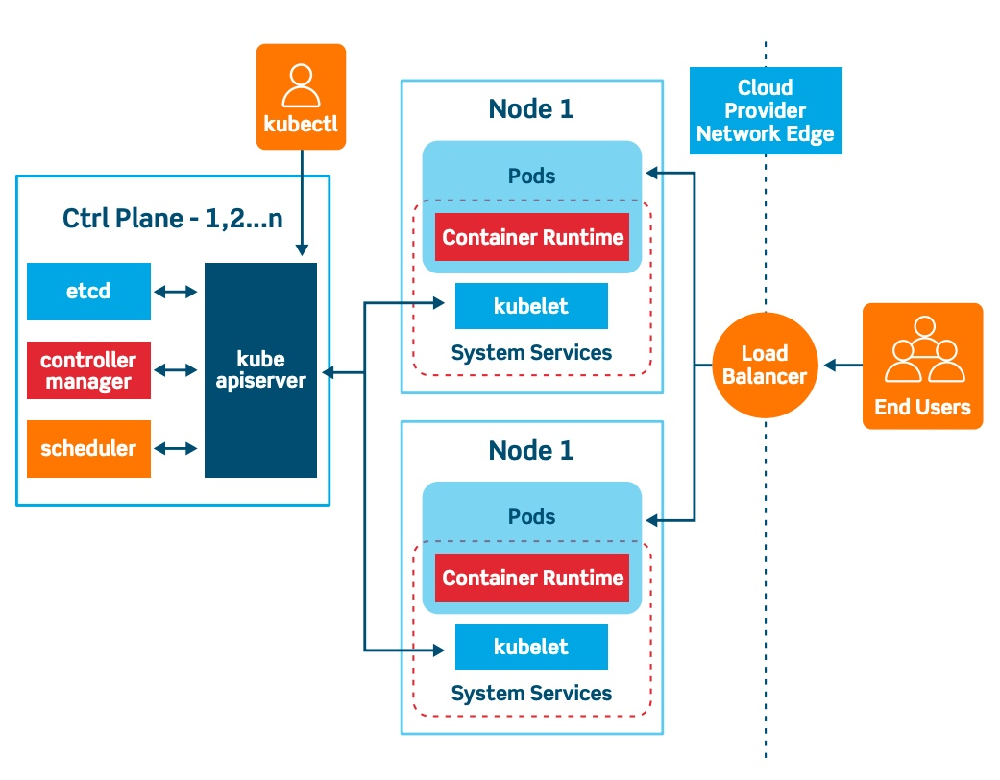
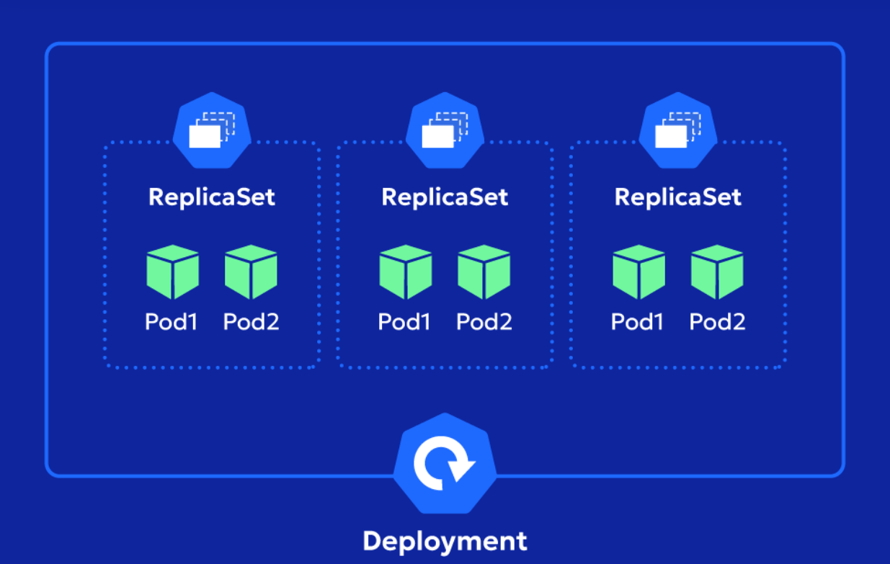
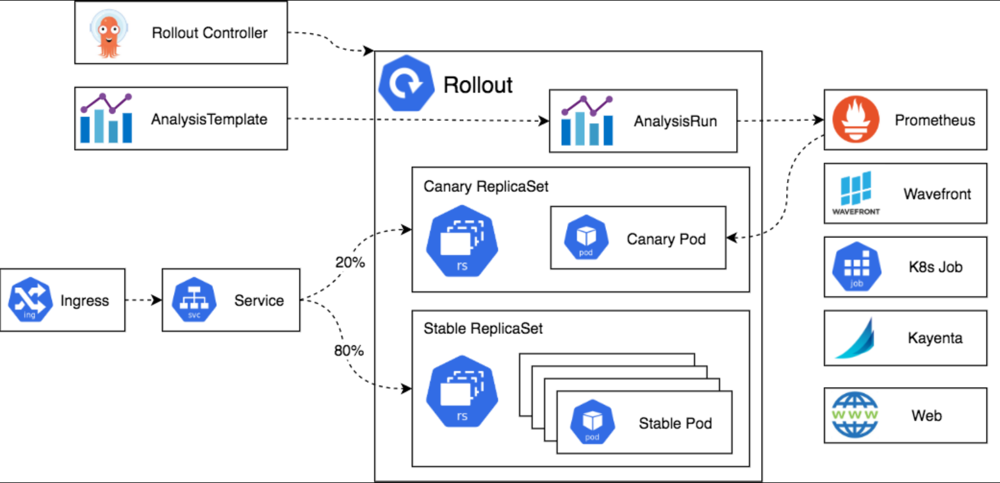

# Deployment và Replica Set
## 1. Khái niệm
Deployment là một controller Kubernetes quản lý việc triển khai và cập nhật Pods một cách declarative. Nó sử dụng ReplicaSet để duy trì số lượng Pods mong muốn, hỗ trợ rollout (cập nhật dần dần), rollback (quay lại phiên bản cũ), và scaling (tăng/giảm replicas). Deployment lý tưởng cho stateless apps như web servers, nơi Pods có thể thay thế mà không mất data.

**Advantages**:
- **Zero-downtime updates**: Cập nhật image hoặc config mà không gián đoạn service (rolling update strategy).
- **Version history**: Tự động tạo ReplicaSet mới cho mỗi update, dễ rollback.
- **Scaling**: Dễ dàng thay đổi số lượng Pods để handle traffic.
- **Self-healing**: Tự động recreate Pods nếu crash hoặc node fail.
- **Pod template**: Định nghĩa spec Pods (containers, volumes, env) trong Deployment.

Deployment không quản lý trực tiếp Pods mà qua ReplicaSet – một layer abstraction để tránh chỉnh sửa thủ công. Trong sản xuất, Deployment là standard cho apps, kết hợp với Services cho exposure.



## 2. ReplicaSet
ReplicaSet là controller duy trì số lượng Pods chính xác theo spec, sử dụng selector (labels) để match và manage Pods. Nếu Pods ít hơn replica, RS tạo thêm nếu nhiều hơn, RS xóa bớt. RS là building block cho Deployment, nhưng hiếm khi dùng trực tiếp vì Deployment cung cấp thêm tính năng update/rollback.

Khác biệt chính:

- **ReplicaSet**: ReplicaSet chỉ có một nhiệm vụ duy nhất: Đảm bảo luôn có đúng số lượng Pod mà bạn yêu cầu, không hỗ trợ update (nếu thay đổi template, phải tạo RS mới).
- **Deployment**: Deployment không trực tiếp tạo Pod. Quản lý nhiều RS (mỗi update tạo RS mới), hỗ trợ strategy như RollingUpdate hoặc Recreate.



## 3. Cấu hình Deployment và ReplicaSet trong YAML
### 3.1 YAML cho ReplicaSet
```yaml
apiVersion: apps/v1
kind: ReplicaSet
metadata:
  name: my-rs
  labels:
    app: myapp
spec:
  replicas: 3  # Số lượng Pods
  selector:
    matchLabels:  # Equality-based
      app: myapp
    matchExpressions:  # Set-based (optional)
    - key: tier
      operator: In
      values: [frontend]
  template:  # Pod template
    metadata:
      labels:
        app: myapp
        tier: frontend
    spec:
      containers:
      - name: nginx
        image: nginx:1.14
        ports:
        - containerPort: 80
```
- Áp dụng: `kubectl apply -f rs.yaml`

### 3.2 YAML cho Deployment
```yaml
apiVersion: apps/v1
kind: Deployment
metadata:
  name: my-deployment
spec:
  replicas: 3
  selector:
    matchLabels:
      app: myapp
  template:  # Giống RS
    metadata:
      labels:
        app: myapp
    spec:
      containers:
      - name: nginx
        image: nginx:1.14
  strategy:  # Update strategy
    type: RollingUpdate  # Hoặc Recreate (kill all then create)
    rollingUpdate:
      maxSurge: 25%  # Số Pods thêm tối đa (int hoặc %)
      maxUnavailable: 25%  # Số Pods unavailable tối đa
  minReadySeconds: 10  # Thời gian chờ Pod ready trước khi coi success
  revisionHistoryLimit: 10  # Giữ bao nhiêu RS cũ cho rollback
  paused: false  # Pause rollout (optional)
```

Quy trình rollout của Deployment:



## 4. Các lệnh quản lý Deployment và ReplicaSet
- **Tạo Imperative**:(ít dùng)
  - Deployment: `kubectl create deployment my-dep --image=nginx --replicas=3`
  - ReplicaSet: `kubectl create rs my-rs --image=nginx --replicas=3`
- **Get/List**:
  - `kubectl get deployments` , `kubectl get rs`
  - `kubectl get deployments -o wide`
- **Describe**:
  - `kubectl describe deployment my-dep`(Xem events, conditions, RS liên quan).
- **Scale**:
  - `kubectl scale deployment my-dep --replicas=5`.
  - `kubectl scale rs my-rs --replicas=5`.
- **Update**:
  - `kubectl set image deployment/my-dep nginx=nginx:1.16`(trigger rollout)
  - EDIT YAML: `kubectl edit deployment my-dep`
- **Rollout Management**(Chỉ Deployment)
  - Status: `kubectl rollout status deployment/my-dep`
  - History: `kubectl rollout history deployment/my-dep`
  - Rollback: `kubectl rollout undo deployment/my-dep --to-revision=2`
  - Pause/Resume: `kubectl rollout pause deployment/my-dep`, `kubectl rollout resume deployment/my-dep`
- **Delete**: `kubectl delete deployment my-dep`

## 5. Lab Deployment và Replica
### 5.1 Tạo ReplicaSet
- Tạo file `rs.yaml` như trên rồi:
```bash
kubectl apply -f rs.yaml
kubectl get rs
kubectl get pods -l app=myapp
```
### 5.2 Tạo Deployment
- Tạo file `dep.yaml` như trên:
```bash
kubectl apply -f dep.yaml
kubectl get deployments
kubectl get rs
```
### 5.3 Scale và Update
```bash
kubectl scale deployment my-deployment --replicas=5
kubectl set image deployment/my-deployment nginx=nginx:1.16
kubectl rollout status deployment/my-deployment # theo dõi
kubectl rollout history deployment/my-deployment
kubectl rollout undo deployment/my-deployment # roll back
```
### 5.4 Clean up
```bash
kubectl delete deployment my-deployment
kubectl delete rs my-rs
```