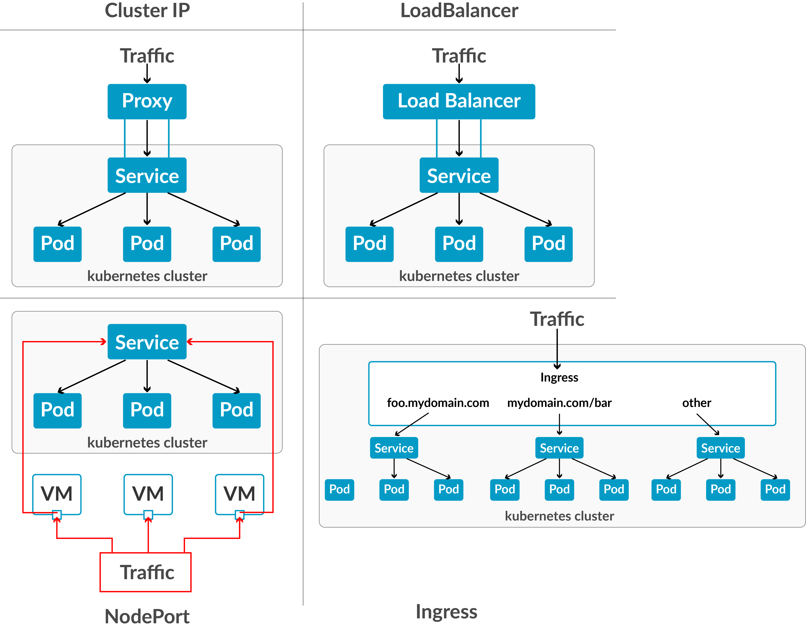

# Service
## 1. Khái niệm
Service là một abstraction layer giúp bạn kết nối đến các Pod một cách ổn định, dù Pod có chết đi sống lại, IP thay đổi liên tục.

| **Vấn đề** | **Giải pháp bằng Service**|
|------------|---------------------------|
| Pod có IP động => không thể hardcode | Service có IP tĩnh (ClusterIP) |
| Nhiều Pod cùng Service => cần load balance | Service tự động round-robin |
| Cần expose ra ngoài cluster | Dùng `NodePort` hoặc `LoadBalancer` |

- Tips: Không bao giờ kết nối trực tiếp bằng Pod IP luôn dùng Service Name (DNS)

## 2. Các loại Service trong Kubernetes

| Loại | Mục đích | Port mở | Dùng khi |
|------|----------|---------|----------|
| **ClusterIP**(default) | Giao tiếp trong cluster | Chỉ nội bộ | API backend, DB, microservices |
| **NodePort**| Expose ra ngoài qua node | 30000 - 32767 | Dev/test, truy cập tạm thời |
| **LoadBalancer** | Expose qua cloud LB | Tùy cloud | Production (AWS ELB, GCP, etc...)|
| **ExternalName** | Map đến DNS bên ngoài | Không mở port | Gọi API bên ngoài |



## 3. Cấu trúc YAML Service cơ bản
```yaml
apiVersion: v1
kind: Service
metadata:
  name: my-service
spec:
  selector:
    app: my-app
  ports:
    - protocol: TCP
      port: 80
      targetPort: 8080
  type: ClusterIP
```
> **Lưu ý**: `port` là của Service, `targetPort` là của Pod, `nodePort` là của Node.

## 4. Thực hành 1: Tạo Deployment + Service ClusterIP
### 4.1 Tạo Deployment
```yaml
apiVersion: apps/v1
kind: Deployment
metadata:
  name: nginx-app
spec:
  replicas: 3
  selector:
    matchLabels:
      app: nginx
  template:
    metadata:
      labels:
        app: nginx
    spec:
      containers:
      - name: nginx
        image: nginx:alpine
        ports:
        - containerPort: 80
```
```bash
kubectl apply -f nginx-deployment.yaml
```
### 4.2 Expose Deployment bằng lệnh Imperative
```bash
kubectl expose deployment nginx-app \
  --name=nginx-service
  --port=80 \
  --target-port=80
```
### 4.3 Tạo Service YAML 
```yaml
apiVersion: v1
kind: Service
metadata: 
  name: nginx-service-yaml
spec:
  selector:
    app: nginx
  ports:
    - protocol: TCP
      port: 8080
      tartgetPort: 80
  type: ClusterIP
```
### 4.4 Test kết nối nội bộ
```bash
kubectl run test-pod --image=busybox --rm -it --restart=Never -- sh wget -qO- http://nginx-service-yaml:8080 
```
- Kubernetes tự resolve DNS theo `ServiceName.Namespace.svc.cluster.local`

## 5. Thực hành 2: Chuyển Sang NodePort Expose ra ngoài
### 5.1 Service NodePort YAML
```yaml
apiVersion: v1
kind: Service
metadata: 
  name: nginx-nodeport
spec:
  selector:
    app: nginx
  type: NodePort
  ports:
    - protocol: TCP
      port: 80
      targetPort: 80
      nodePort: 30080
```
Áp dụng: `kubectl apply -f nginx-nodeport.yaml`
- Truy cập từ máy host:
```bash
minikube service nginx-nodeport --url
curl http://$(minikube ip):30080
```

So sánh ClusterIP và NodePort
| Tiêu chí | ClusterIP | NodePort |
|----------|-----------|----------|
| `type` | Mặc định | `NodePort` |
| IP | Nội bộ | IP của Node |
| Port range | Tùy ý | 30000-32767 |
| Sử dụng | Microservices | Test, demo |
| Có `nodePort` ? | Không | Có |
| Lệnh nhanh | `kubectl expose` | `kubectl expose --type=NodePort` |

## 6. Service không có Selector