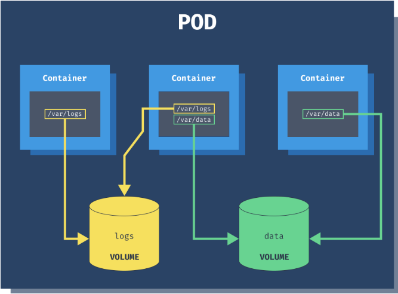
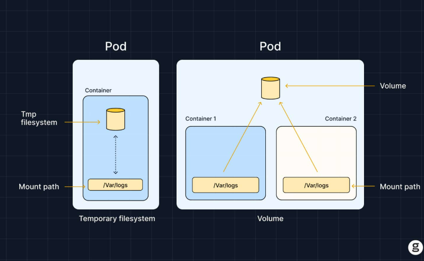

# Volume
## 1. Khái niệm
Volume là một persistent directory mà Pod có thể mount vào container để lưu trữ dữ liệu, chia sẻ giữa containers, hoặc truy cập thư mục trên host. Không giống như container filesystem (ephemeral mất khi container restart), volume giúp dữ liệu sống sót qua restart.

| **Vấn đề với Container Filesystem** | **Giải pháp bằng Volume**|
|----------------------------|--------------|
| Dữ liệu mất khi pod die/restart | Volume giữ dữ liệu (tùy loại) |
| Multi-container không chia sẻ file | Shared volume giữa containers |
| Cần access host dir (logs, config) | hostPath mount host path |



## 2. Các loại Volume cơ bản
Kubernetes hỗ trợ hơn 20 loại volume nhưng ta chỉ cần tập trung vào các loại sau:

| Loại | Mô tả | Bền vững | Dùng khi |
|------|-------|----------|----------|
| **emptyDir** | Thư mục rỗng tạm thời, tạo khi Pod start | Không (mất khi Pod delete)| Chia sẻ data giữa containers (logs, cache)|
| **hostPath** | Mount thư mục từ host node | Có (trên host) | Access host logs/config, dev/test (không production) |
| **persistentVolumeClaim** | Bền vững, dynamic provision | Có | Database, statefull apps |

## 3. Cấu trúc YAML Volume cơ bản
Volume định nghĩa ở `spec.volumes`, mount ở `container.volumeMounts`.
```yaml
apiVersion: v1
kind: Pod
metadata: 
  name: volume-pod
spec:
  volumes:
  - name: shared-data
    emptyDir: {}
  containers:
  - name: producer
    image: busybox
    volumeMounts:
    - name: shared-data
      mountPath: /data
  - name: consumer
    image: busybox
    volumeMounts:
    - name: shared-data
      mountPath: /shared
```

## 4. Thực hành 1: emptyDir Volume Tạm thời chia sẻ giữa Containers
**emptyDir** tạo thư mục tạm khi Pod được schedule đến node. Dữ liệu tồn tại suốt vòng đời Pod, nhưng bị xóa khi Pod bị xóa.

```yaml
apiVersion: v1
kind: Pod
metadata: 
  name: empty-dir-demo
spec:
  volumes:
  - name: temp-data
    emptyDir:
      medium: Memory
      sizeLimit: 10Mi
  containers:
  - name: writer
    image: busybox
    command: ['sh','-c','echo"Hello World" > /output/message.txt && sleep 3600']
    volumeMounts:
    - name: temp-data
      mountPath: /output
  - name: reader
    image: busybox
    command: ['sh', '-c','sleep 3600']
    volumeMounts:
    - name: temp-data
      mountPath: /input
```
Kiểm tra:
```bash
kubectl exec -it empty-dir-demo -c reader -- cat /input/message.txt
```

## 5. Thực hành 2: hostPath Mount thư mục từ Host Node
**hostPath** mount một thư mục hoặc file thật trên host node. Dữ liệu tồn tại trên node, nhưng nếu Pod bị reschedule sang node khác => mất dữ liệu.
```yaml
apiVersion: v1
kind: Pod
metadata:
  name: host-path-demo
spec:
  volumes:
  - name: host-logs
    hostPath:
      path: /var/log
      type: DirectoryOrCreate
  containers:
  - name: log-reader
    image: busybox
    command: ['sh', '-c', 'tail -f /host-logs/syslog && sleep 3600']
    volumeMounts:
    - name: host-logs
      mountPath: /host-logs
      readOnly: true
```
`hostPath` cho phép truy cập trực tiếp vào filesystem của node không an toàn, chỉ nên dùng trong môi trường test.

## 6. So sánh emptyDir và hostPath
| Tiêu chí | emptyDir | hostPath |
|----------|----------|----------|
| Lifecycle | Mất khi Pod xóa | Giữ trên host |
| Chia sẻ | Giữa containers trong Pod | Giữa Pods trên cùng node |
| Medium | Disk hoặc RAM | Host file system |
| Security | An toàn hơn | Nguy hiểm nếu lạm dụng |

## 7. Debug Volume Issues
| Lỗi | Nguyên nhân | Cách fix |
|-----|-------------|----------|
| `Mount failed` | Sai path/type | `kubectl describe pod` |
| Data không share | Sai volume name | Check YAML indentation |
| Permission denied | SELinux/AppArmor | Add `privilegde: true` |
| Volume full | sizeLimit exceeed | Tăng limit hoặc clean |

# PersistentVolume (PV) Và PersistentVolumeClaim (PVC)



## 1. Khái niệm

PersistentVolume là storage thực tế trong cluster, được admin hoặc hệ thống provision sẵn. PersistentVolumeClaim(PVC) là yêu cầu storage mà người dùng gửi đến cluster để xin dung lượng theo nhu cầu. Khi PVC phù hợp với một PV (về size, access mode, storageClass), Kubernetes sẽ tự động bind hai thành phần này.

| Khái niệm | Mô tả | Vai trò |
|-----------|-------|----------|
| PV | Storage thực tế (cluster-wide) | Cung cấp bởi admin, bind 1:1 với PVC |
| PVC | Yêu cầu storage (namespace-scoped) | User tạo, bind tự động nếu match PV |
| StorageClass | Template cho dynamic PV | Tư động tạo PV khi PVC yêu cầu |

PV/PVC tách biệt rõ giữa người cung cấp (admin) và người dùng (developer).

## 2. Các thuộc tính quan trọng của PV/PVC
### 2.1 Access Modes
| Mode | Mô tả | Ví dụ |
|------|-------|-------|
| **ReadWriteOnce(RWO)** | Read/write từ 1 node duy nhất | Database |
| **ReadOnlyMany(ROX)** | Read từ nhiều node | Shared config |
| **ReadWriteMany(RWX)** | Read/write từ nhiều node | NFS, GlusterFS |

Lưu ý: Không phải backend nào cũng hỗ trợ RWX (e.g., local disk chỉ hỗ trợ RWO).

### 2.2 Reclaim Policy

| Policy | Mô tả |
|--------|-------|
| Retain | Giữ PV lại sau khi PVC bị xóa |
| Delete | Xóa PV cùng với PVC |
| Recycle | Dọn sạch data rồi reuse (đã deprecated) |

### 2.3 Lifecycle Phases
- PV: Available => Bound => Released => Failed
- PVC: Pending => Bound => Lost

Nếu PVC bị Pending, kiểm tra ngay kubectl describe pvc để xem Events thường do accessMode hoặc storageClass mismatch.

## 3. Thực hành 1 Tạo Static PV và PVC với hostPath (Local Storage)
### 3.1 Tạo PersistentVolume
```yaml
apiVersion: v1
kind: PersistentVolume
metadata:
  name: local-pv
spec:
  capacity:
    storage: 5Gi
  volumeMode: Filesystem
  accessModes:
  - ReadWriteOnce
  persistentVolumeReclaimPolicy: Retain
  storageClassName: manual
  hostPath:
    path: /mnt/data
```
Chạy lệnh:
```yaml
kubectl apply -f pv.yaml
kubectl get pv local-pv
```
CKAD Tip: Trong Minikube, cần tạo thư mục `/mnt/data` trên host trước bằng `minikube ssh 'sudo mkdir -p /mnt/data`

### 3.2 Tạo PersistentVolumeClaim
```yaml
apiVersion: v1
kind: PersistentVolumeClaim
metadata:
  name: local-pvc
spec:
  accessModes:
  - ReadWriteOnce
  resources:
    requests:
      storage: 5Gi
  storageClassName: manual
```
Chạy lệnh:
```bash
kubectl apply -f pvc.yaml
kubectl get pvc local-pvc #Bound
kubectl get pv local-pv
```
Nếu PVC Pending, kiểm tra lại accessModes, capacity hoặc storageClassName.

## 4. Thực hành 2: Mount PVC vào Pod và Kiểm tra Dữ liệu bền vững
```yaml
apiVersion: v1
kind: Pod
metadata:
  name: pvc-pod
spec:
  volumes:
  - name: persistent-storage
    persistentVolumeClaim:
      claimName: local-pvc
  containers:
  - name: db-container
    image: busybox
    command: ['sh', '-c', 'echo "Persistent Data" > /db/data.txt && sleep 3600']
    volumeMounts:
    - name: persistent-storage
      mountPath: /db
```
Kiểm tra
```bash
kubectl exec -it pvc-pod -- cat /db/data.txt
```
Xóa và tạo lại Pod:
```bash
kubectl delete pod pvc-pod
kubectl apply -f pod-with-pvc.yaml
kubectl exec -it pvc-pod -- cat /db/data.txt
```
Data vẫn còn vì PV được giữ lại theo policy `Retain`

## 5. Dynamic Provisioning với StorageClass
```yaml
apiVersion: storage.k8s.io/v1
kind: StorageClass
metadata:
  name: local-storage
provisioner: kubernetes.io/no-provisioner
volumeBindingMode: WaitForFirstConsumer
reclaimPolicy: Delete
```
PVC có `storageClassName: local-storage` sẽ tự động tạo PV dynamic nếu có provisioner.

## 6. Debug PV/PVC không Bind
| Lỗi | Nguyên nhân | Cách fix |
|-----|-------------|----------|
| PVC Pending | Không PV match | Kiểm tra accessMode, capacity, storageClass |
| PV Bound nhưng Pod fail | Sai claimName | `kubectl describe pod` |
| Storage full | Thiếu dung lượng | Giảm request |
| Node affinity fail | PV local chỉ thuộc 1 node | Add nodeAffinity |