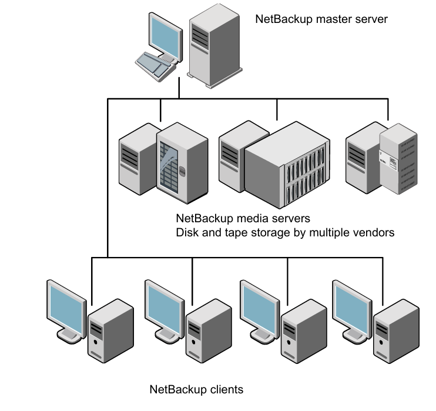

# Kiến trúc tổng thể 

- **Control path**: Primary Server ra lệnh "bắt đầu backup", theo dõi tiến trình, cập nhật catalog
- **Data path**: dữ liệu thực tế chạy thẳng từ Client → Media Server (không đi qua Primary), giúp Primary không bị nghẽn khi có nhiều job chạy song song

## 1. Primary Server
Primary Server không phải một khối đơn, mà là tập hợp nhiều service (daemon/process) phối hợp với nhau.

| Service |	Vai trò |
|---------|---------|
| `nbpem` (Policy Execution Manager) |	Quyết định khi nào một job cần chạy dựa trên schedule/calendar|
| `nbjm` (Job Manager) |	Nhận yêu cầu từ nbpem, tạo job thực tế, giao cho resource (media server, drive)|
| `bpdbm` (Database Manager) |	Quản lý catalog — lưu thông tin mọi backup image|
| `bprd` (Request Daemon) |	Lắng nghe yêu cầu backup/restore từ client |
| `nbrb` (Resource Broker) |	Cấp phát tài nguyên (ổ băng, storage unit) cho job |
| `vnetd`	 | Xử lý giao tiếp mạng, đa kênh (multiplexed network)|

`nbpem` quyết định lịch → `nbjm` tạo job → `nbrb` cấp tài nguyên → job chạy → `bpdbm` ghi kết quả vào catalog.

## 2. Catalog (NBDB)
Catalog là cơ sở dữ liệu (chạy trên nền Sybase SQL Anywhere, gọi là NBDB) chứa:
- Metadata của mọi bản backup: file nào, backup lúc nào, nằm ở media/vị trí nào trên storage
- Thông tin policy, schedule, retention
- Thông tin thiết bị (media, drive, storage unit)

Dữ liệu backup thật vẫn nằm nguyên trên tape/disk/MSDP, nhưng nếu catalog mất, NetBackup không biết dữ liệu đó ở đâu để restore. Về bản chất, mất catalog gần như mất khả năng restore, dù vật lý dữ liệu còn nguyên.

Đây là lý do luôn phải có Catalog Backup riêng biệt, và catalog backup này thường được lưu ở vị trí/độ ưu tiên khác so với backup dữ liệu thông thường.

## 3. Media Server
- Nhận data stream từ client, ghi ra thiết bị lưu trữ (tape drive, disk pool, cloud, MSDP).
- Có thể nén, dedup, mã hoá dữ liệu tại đây tuỳ cấu hình.
- Có thể có nhiều Media Server để scale-out: chia tải backup theo site, theo nhóm client, giảm băng thông traffic dồn về một điểm.

Hệ thống nhỏ: Primary Server kiêm luôn Media Server (gọi là "single-server" hoặc "simple" configuration).

Hệ thống lớn: tách riêng để Primary chỉ tập trung điều phối, không bị tải I/O ghi dữ liệu.

# Cấu Hình Policy & Schedule