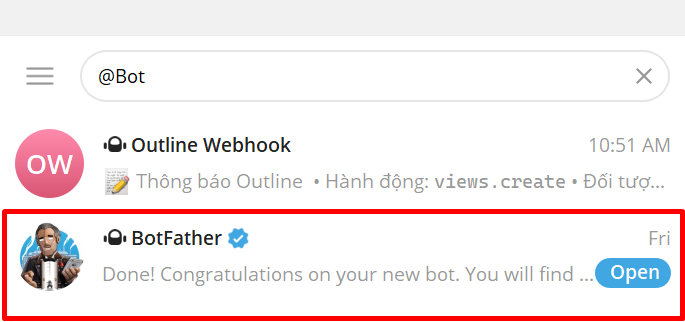
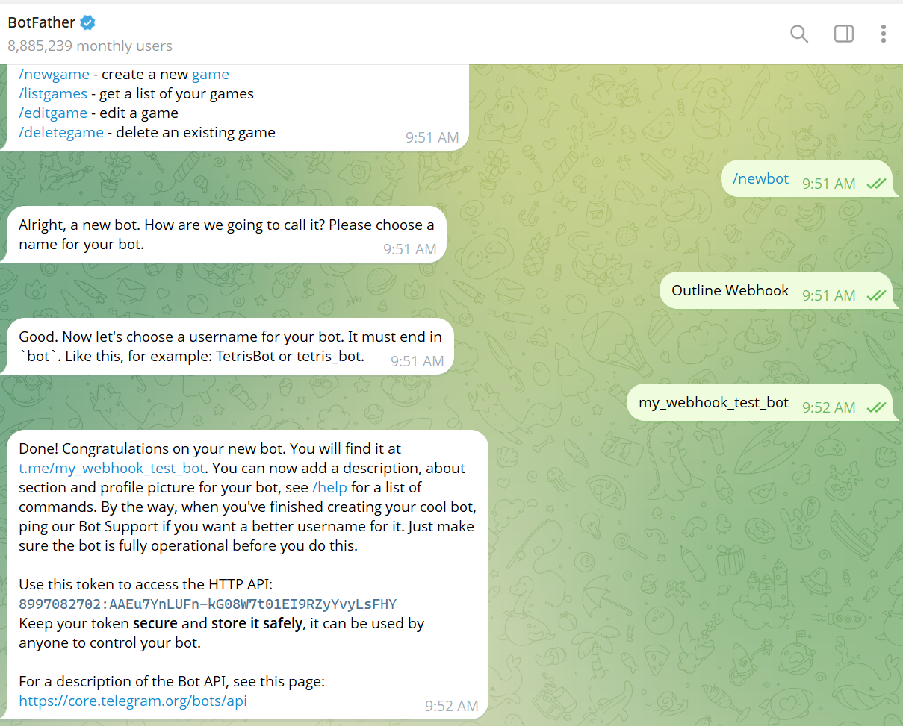
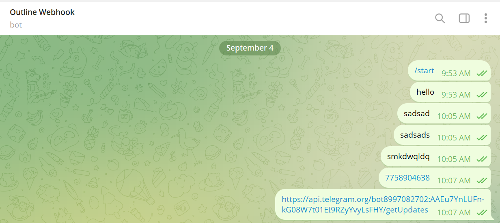
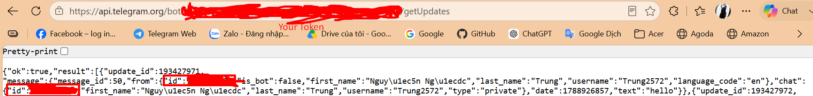
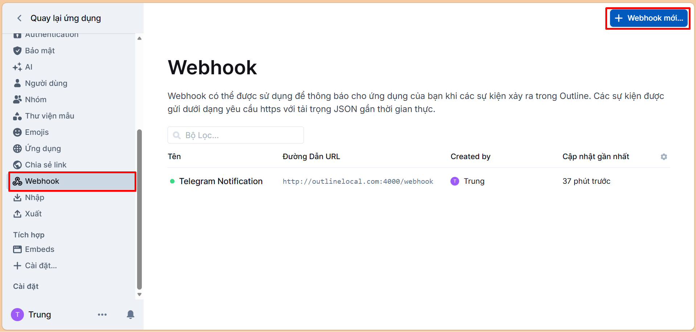
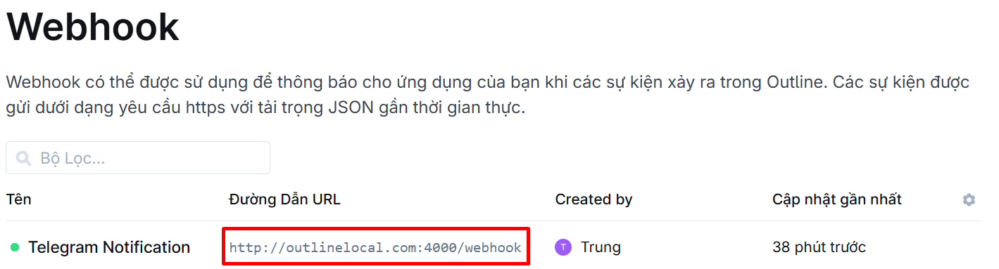
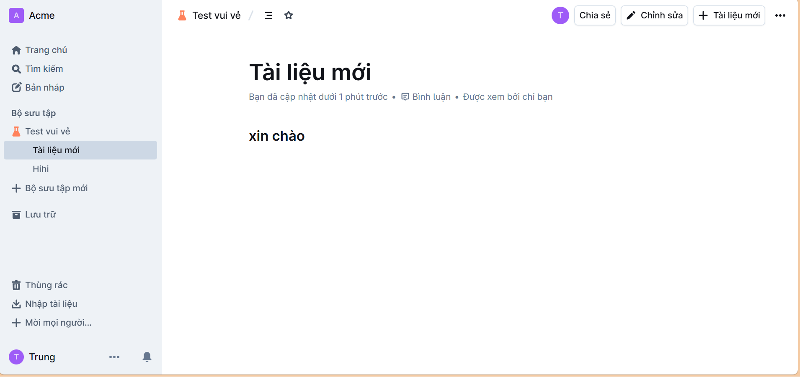
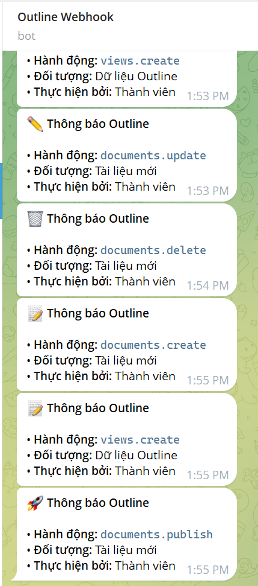

# Hướng dẫn tạo Webhook Telegram bot
## 1. Tạo Telegram bot và Chatbot ID
- Mở ứng dụng Telegram, tìm kiếm từ khóa `@BotFather` (chú ý chọn tài khoản có tích xanh chính chủ).
- Nhấn Start để khởi động cuộc trò chuyện với BotFather.
- Gửi lệnh `/newbot`





- Kích hoạt cuộc trò chuyện với Bot: Tìm kiếm Username của bot bạn vừa tạo -> Nhấn Start (gửi ít nhất 1 tin nhắn bất kỳ cho bot, ví dụ: Hello).



- **Lấy chat ID**: Copy đường dẫn sau và dán vào thanh địa chỉ của trình duyệt (thay `<BOT_TOKEN>` bằng Token bạn nhận được ở trên):
- Nhấn Enter. Trình duyệt sẽ trả về một đoạn dữ liệu JSON.

```api
https://api.telegram.org/bot<BOT_TOKEN>/getUpdates
```



- Test đảm bảo curl được:
```api
curl -X POST "https://api.telegram.org/bot<Token>/sendMessage" -H "Content-Type: application/json" -d '{"chat_id": "...", "text": "Test thong bao Webhook thanh cong!"}'
```
- Bot gửi được thông báo thì là thành công
```JSON
{"ok":true,"result":{"message_id":123,"from":{"id":8997082702,"is_bot":true...}}}
```

## 2. Lựa chọn dùng N8N, Make (Integromat), hoặc Zapier:
- Tạo Webhook URL trung gian:
- Đăng ký tài khoản N8N hoặc Make.com -> Tạo 1 Workflow mới -> Thêm nút Webhook Trigger -> Copy đường link URL nhận Webhook mà N8N/Make cấp cho bạn.
- Cấu hình Webhook trên Outline:
  - Vào giao diện Outline -> Settings -> Integrations -> Webhooks -> Chọn Add Webhook.
  - Dán đường link URL vừa lấy ở Step 1 vào mục URL.
  - Chọn các sự kiện bạn muốn nhận thông báo (VD: documents.create, documents.update).
  - Nhấn Save.
- Xử lý và bắn tin nhắn sang Telegram
  - Bấm Test/Listen trên N8N/Make, sau đó thử tạo 1 bài viết mới trên Outline để gửi dữ liệu mẫu sang.
  - Thêm nút Telegram Bot vào Workflow $\rightarrow$ Dán Bot Token và Chat ID.
  - Ánh xạ (Map) tiêu đề bài viết (title), người tạo (user.name), link bài viết (url) vào ô nội dung tin nhắn Telegram.

## 3. Customize Webhook Receiver
### 3.1 Tạo Server Endpoint: Dùng Node.js (Express) hoặc Python (Flask/FastAPI) tạo một đường dẫn nhận request `POST /webhook`.
- Cài đặt NodeJS và NPM
```bash
curl -fsSL https://deb.nodesource.com/setup_20.x | sudo -E bash -
sudo apt-get install -y nodejs
```
- Check xem máy đã có sẵn hoặc cài đặt thành công chưa bằng:
```bash
node -v
```
- Tạo một thư mục dành riêng cho Webhook Receiver
```bash
mkdir -p ~/outline-telegram-bot && cd ~/outline-telegram-bot
npm init -y
npm install express axios pm2
```
- Tạo file mã nguồn mở xử lý Webhook: `index.js`
```JavaScript
const express = require('express');
const axios = require('axios');
const app = express();

app.use(express.json());

const TELEGRAM_TOKEN = '8997082702:AAEu7YnLUFn-kG08W7t01EI9RZyYvyLsFHY';
const CHAT_ID = '7758904638';
const PORT = 4000;

app.post('/webhook', (req, res) => {
    // Trả về 200 OK ngay lập tức cho Outline
    res.status(200).send('OK');

    setTimeout(async () => {
        try {
            const data = req.body || {};
            const eventType = data.event;

            // Bỏ qua sự kiện "test" khi bấm Save Webhook
            if (!eventType || eventType === 'test') {
                console.log('[Info] Bỏ qua sự kiện test.');
                return;
            }

            console.log(`[RECEIVED] Nhận sự kiện: ${eventType}`);

            // Trích xuất thông tin
            const docTitle = data.payload?.model?.title || data.model?.title || 'Dữ liệu Outline';
            const actorName = data.actor?.name || data.user?.name || 'Thành viên';

            // Tạo nội dung thông báo linh hoạt theo sự kiện
            let icon = '🔔';
            if (eventType.includes('create')) icon = '📝';
            if (eventType.includes('update')) icon = '✏️';
            if (eventType.includes('publish')) icon = '🚀';
            if (eventType.includes('delete') || eventType.includes('archive')) icon = '🗑️';

            const message = `${icon} *Thông báo Outline*\n\n• *Hành động:* \`${eventType}\`\n• *Đối tượng:* ${docTitle}\n• *Thực hiện bởi:* ${actorName}`;

            // Bắn Telegram
            await axios.post(`https://api.telegram.org/bot${TELEGRAM_TOKEN}/sendMessage`, {
                chat_id: CHAT_ID,
                text: message,
                parse_mode: 'Markdown'
            });

            console.log(`[SUCCESS] Đã gửi Telegram cho sự kiện: ${eventType}`);
        } catch (err) {
            console.error('[ERROR] Lỗi gửi Telegram:', err.response?.data || err.message);
        }
    }, 10);
});

app.listen(PORT, '0.0.0.0', () => {
    console.log(`Webhook Receiver đang lắng nghe tại port ${PORT}`);
});
```
- Sử dụng pm2 để quản lý và đảm bảo chương trình luôn chạy ngầm:
```bash
# Khởi chạy service
npx pm2 start index.js --name "outline-telegram"

# Lưu lại trạng thái để PM2 tự khởi động cùng OS khi reboot máy
npx pm2 save
npx pm2 startup
```
- Kiểm tra trạng thái chạy:
```bash
npx pm2 status
```
- Cấu hình Webhook trên giao diện Outline
  - Mở trình duyệt, truy cập vào trang Outline của bạn và đăng nhập tài khoản Quản trị (Admin).
  - Chuyển đến mục Settings (Cài đặt) -> Integrations -> Webhooks.
    
  - Nhập địa chỉ IP nội bộ của VM hoặc Domain
    
  - Events: Tích chọn các sự kiện bạn muốn theo dõi
  - Nhấn Save.
  - Vào Outline, tạo một Tài liệu (Document) mới và nhấn Publish.
  - Kiểm tra Telegram trên điện thoại/máy tính $\rightarrow$ Bot sẽ gửi thông báo báo có bài viết mới.
  - Nếu chưa nhận được tin nhắn, bạn xem log ứng dụng trên Terminal Linux bằng lệnh:
```bash
npx pm2 logs outline-telegram
```

### 3.2 Thêm biến môi trường 
- Outline có sẵn cơ chế chống SSRF (Server-Side Request Forgery). Check code in here: `server/utils/requestFilteringAgent/index.ts`
- Outline cố tình chặn mọi request outbound (bao gồm webhook) đi tới địa chỉ IP riêng tư (private IP) — như dải mạng nội bộ `192.168.x.x`, `10.x.x.x`, `172.16-31.x.x`, hay `127.0.0.1`.
- Để fix cái này dùng 1 biến môi trường: `ALLOWED_PRIVATE_IP_ADDRESSES=192.168.1.50` đặt vào trong file `.env` hoặc trực tiếp trong `docker-compose.yml`
  - Trong đó `192.168.1.50` là địa chỉ IP của máy chứa Webhook bridge.

- Một lưu ý khác:
```
┌─────────────────────────┐         POST request         ┌──────────────────────────┐
│  SERVER OUTLINE         │  ────────────────────────>   │  SERVER CỦA BẠN          |
│  (container Docker,     │  gửi tới URL bạn khai        │  (Node.js index.js,      │
│  chạy code              │  trong Settings → Webhooks   │  máy netbackup@netbackup,│
│  DeliverWebhookTask.ts) │  = subscription.url          │  cổng 4000)              │
└─────────────────────────┘                              └──────────────────────────┘
```
### 4. Test


