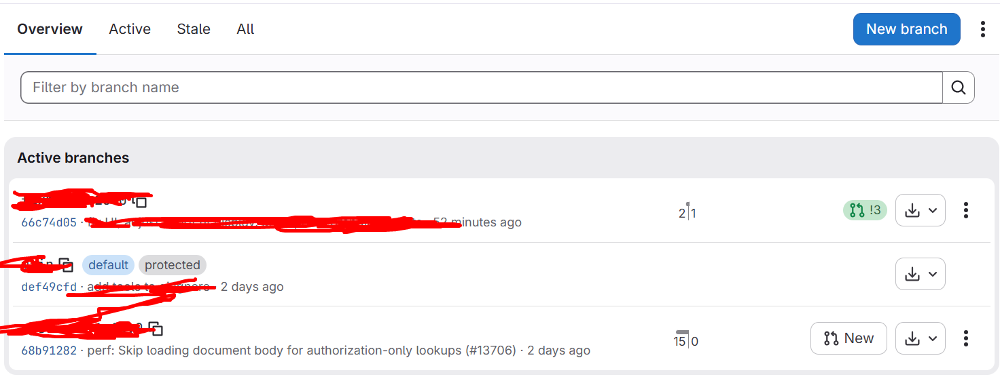

# Git
## 1. Git merge
(gộp nhánh) là lệnh dùng để hợp nhất lịch sử và mã nguồn từ một nhánh (branch) này vào một nhánh khác trong Git. 
Ví dụ:
- Nhánh `main`: Là ngôi nhà chính đang hoạt động ổn định. 
- Nhánh `feature-login`: Bạn tách ra một nhánh riêng để làm tính năng "Đăng nhập" mà không ảnh hưởng đến ngôi nhà chính. 

Sau khi làm xong tính năng Đăng nhập và kiểm tra kỹ lưỡng, bạn muốn đưa phần code mới đó quay trở lại ngôi nhà chính (main) -> Đây chính là lúc bạn dùng git merge.

### 1.2 Các bước thực hiện
Nếu bạn đang ở nhánh `feature-login` và muốn gộp nó vào main:
- Chuyển đến nhánh nhận code:
```bash
git checkout main
```
- Thực hiện gộp nhánh
```bash
git merge feature-login
```
- Khi bạn chạy lệnh này, Git sẽ tìm điểm chung cuối cùng của 2 nhánh, lấy toàn bộ các đoạn code mới từ `feature-login` và áp dụng/ghép vào main.

## 1.3 2 Trường hợp xảy ra khi merge
- Tự động thành công (Fast-Forward / Automatic Merge):
  - Nếu code ở 2 nhánh không sửa trùng một dòng nào, Git sẽ tự động gộp lại mượt mà trong 1 giây.
- Xung đột mã nguồn (Merge Conflict):
  - Nếu cả 2 nhánh cùng sửa chung một dòng code ở một file, Git sẽ dừng lại và báo: "Tôi không biết nên lấy code của ai, bạn hãy chọn giúp tôi!".
  - Bạn chỉ cần mở file đó ra, chọn giữ lại đoạn code đúng rồi lưu lại và git commit là xong.

## 2. Rebase Upstream 
là thao tác cập nhật những mã nguồn mới nhất từ kho lưu trữ gốc (kho dự án chung - Upstream) về nhánh làm việc cá nhân của bạn bằng cách đặt lại gốc (Rebase) cho các bản ghi thay đổi (commit).
- thao tác này rất phổ biến khi làm việc theo mô hình Fork & Pull Request trên GitHub/GitLab.
### 2.1 Sự khác biệt bản chất giữa Merge và Rebase
- **Git Merge (Gộp nhánh)**: Giống như việc bạn nối 2 nhánh cây lại với nhau bằng một đường nối mới (tạo ra một Merge Commit). Lịch sử của cả 2 nhánh giữ nguyên và giao nhau tại điểm nối.
- **Git Rebase (Đặt lại gốc)**: Giống như việc bạn nhổ toàn bộ các commit mới của bạn ra, bê nhánh của bạn đặt lên trên ngọn của nhánh Upstream mới nhất, rồi dán các commit của bạn nối tiếp vào đó. Lịch sử commit lúc này trở thành một đường thẳng.

### 2.2 Khi nào nên dùng cái nào
- **Nên dùng Rebase Upstream khi:**
  - Bạn muốn cập nhật code mới nhất từ dự án chung về máy cá nhân để code tiếp.
  - Bạn muốn lịch sử commit của bạn sạch đẹp, không bị xuất hiện các commit rác kiểu `Merge branch 'main' into feature`.
  - Bạn chuẩn bị gửi Pull Request / Merge Request cho Team Lead duyệt code.
- **Nên dùng merge khi:**
  - Bạn muốn lưu lại chính xác lịch sử thời gian khi các nhánh giao nhau.
  - Nhánh bạn đang làm là nhánh chung có nhiều người cùng đẩy code lên (Tuyệt đối KHÔNG rebase trên nhánh dùng chung vì sẽ làm hỏng mã hash của đồng nghiệp).

### 2.3 Thực hiện Rebase Upstream
```bash
# 1. Lấy dữ liệu mới nhất từ kho gốc Upstream
git fetch upstream

# 2. Chuyển sang nhánh tính năng bạn đang làm
git checkout feature-cua-toi

# 3. Tiến hành Rebase lên đầu nhánh main của Upstream
git rebase upstream/main
```


## 3. Để hiểu các lệnh Git, chúng ta chia chúng thành 3 nhóm theo mục đích sử dụng trong thực tế:

---

### 1. Nhóm Quản lý Kết nối & Từ xa (Remote)

*Nhóm lệnh giúp máy cá nhân kết nối và trao đổi dữ liệu với các kho chứa trên Server (GitHub, GitLab).*

* **`git remote -v`**
* **Ý nghĩa:** Hiển thị danh sách các đường link Server (Remote) mà dự án của bạn đang kết nối kèm theo quyền (`fetch` - tải về, `push` - đẩy lên).
* **Mẹo nhớ:** Chữ **`-v`** đại diện cho **`verbose`** (chi tiết). Muốn xem link Server đầy đủ chi tiết thì thêm `-v`.
* **Ví dụ output:** `origin [https://github.com/user/repo.git](https://github.com/user/repo.git) (fetch)`


* **`git remote add upstream <url>`**
* **Ý nghĩa:** Thêm một kết nối Server mới đặt tên là `upstream` (thường trỏ về kho gốc của dự án khi làm việc theo mô hình Fork).
* **Mẹo nhớ:** Cú pháp như tiếng Anh: `git remote` (Thao tác với remote) + `add` (thêm mới) + `tên` + `đường link`.


### 2. Nhóm Quan sát Lịch sử & Nhánh (History & Branches)

*Nhóm lệnh đóng vai trò như "kính phóng đại" giúp bạn theo dõi sơ đồ và trạng thái dự án.*

* **`git branch -a`**
* **Ý nghĩa:** Liệt kê **TẤT CẢ** các nhánh (branch) đang có, bao gồm cả nhánh ở máy cá nhân (Local) và nhánh trên Server (Remote).
* **Mẹo nhớ:** Chữ **`-a`** đại diện cho **`all`** (tất cả).


* **`git log --oneline --decorate --graph --all -30`**
* **Ý nghĩa:** Bản tóm tắt lịch sử commit dưới dạng **sơ đồ cây (đồ thị)** đẹp mắt, tối đa 30 commit gần nhất.

* `--oneline`: Gộp mỗi commit thành **1 dòng** gọn gàng.
* `--graph`: Vẽ sơ đồ nhánh bằng các ký tự **`* | / \`** (nhìn như cành cây).
* `--decorate`: Hiển thị rõ **nhãn nhánh/tag** (ví dụ: `HEAD -> main`, `origin/main`).
* `--all`: Hiện lịch sử của **tất cả** các nhánh, không chỉ nhánh hiện tại.
* `-30`: Giới hạn chỉ hiện **30** commit gần nhất.


### 3. Nhóm Phiên bản & So sánh Mã nguồn (Tags, Show & Diff)

*Nhóm lệnh dùng để đánh dấu cột mốc (như ra mắt bản v1.0) và soi chi tiết sự thay đổi của code.*

* **`git fetch upstream --tags`**
* **Ý nghĩa:** Tải toàn bộ thông tin mới từ server `upstream` về máy, đồng thời kéo theo tất cả các **Thẻ phiên bản (Tags)**.
* **Mẹo nhớ:** `fetch` là "đi lấy dữ liệu về" nhưng chưa gộp (merge) vào code mình. Thêm `--tags` là lấy luôn danh sách nhãn phiên bản.


* **`git tag`**
* **Ý nghĩa:** Liệt kê toàn bộ các nhãn phiên bản (ví dụ: `v1.0.0`, `v2.1.4`) đã được tạo trong dự án.
* **Mẹo nhớ:** Giống như mở sổ danh sách các cột mốc đã dán tem/nhãn.


* **`git show`**
* **Ý nghĩa:** Soi chi tiết thông tin của **Commit cuối cùng** (ai làm, vào lúc nào, đã thêm/xóa những dòng code nào). Nếu kèm tên tag (ví dụ: `git show v1.0`), nó sẽ hiển thị thông tin của tag đó.
* **Mẹo nhớ:** `show` = "Cho tôi xem chi tiết điểm này có gì".


* **`git diff`**
* **Ý nghĩa:** So sánh sự khác biệt giữa code bạn **chưa lưu (chưa commit)** với code của commit gần nhất. Những dòng thêm mới hiện màu xanh `+`, dòng bị xóa hiện màu đỏ `-`.
* **Mẹo nhớ:** `diff` là viết tắt của **`difference`** (sự khác biệt/sự chênh lệch).

### Kiến thức cần nhớ

1. **Nguyên tắc "Động từ + Đối tượng + Tham số":**
* Muốn thao tác với Server remote $\rightarrow$ Bắt đầu bằng `git remote ...`
* Muốn thao tác với Nhánh $\rightarrow$ Bắt đầu bằng `git branch ...`
* Muốn thao tác với Thẻ phiên bản $\rightarrow$ Bắt đầu bằng `git tag ...`


2. **Cách thuộc các tham số viết tắt phổ biến:**
* **`-a`** = **a**ll (tất cả)
* **`-v`** = **v**erbose (chi tiết)
* **`-r`** = **r**emote (từ xa)
* **`-m`** = **m**essage (lời nhắn/ghi chú)

## 4. Lab Github
- Hiện tại
```
D:\Outline1\
│
├── kb-cloud\              ← CỦA CÔNG TY
│     └── 1.9.2 + custom
│
└── outline-1.10.0\        ← BẠN VỪA CLONE
      └── Official Outline 1.10.0
```
- Mục tiêu:
```
GitLab VNPT
└── kb-cloud
      │
      ├── main
      │     └── 1.9.2 + custom
      │
      └── upstream-1.10.0
            └── Official Outline 1.10.0
```
- Sau đó:
```
main (1.9.2 + custom)
             +
upstream-1.10.0
             │
             ▼
        merge
             │
             ▼
main (1.10.0 + custom)
```
### 4.1 Backup
Repo main hiện tại:
```
D:\Outline1\kb-cloud
```
- Không sửa có thể tạo, copy 1 thư mục backup, Nếu có vấn đề thì vẫn còn nguyên
```
D:\Outline1\kb-cloud-backup
```
### 4.2 Kiểm tra repo 1.10.0 bạn vừa clone
```bash
cd /d/Outline1/<thu-muc-1.10.0>
git status
git remote -v
git log --oneline -5
git describe --tags --always
```
### 4.3 Không push thẳng 1.10.0 vào main
- Trong repo 1.10.0, tạo branch:
```bash
git checkout -b upstream-1.10.0
```
- Check:
```bash
git branch
```
### 4.4 Đổi origin của repo 1.10.0 sang GitLab riêng
- Repo 1.10.0 hiện tại đang có:
```
origin → GitHub Outline
```
Ta đổi thành:
```
origin → GitLab Private
```
Chạy
```bash
git remote set-url origin https://scm-devops.vnpt.vn/it.cloud/infrastructure/iaas-system/kb-cloud.git
```
- Check 
```bash
git remote -v
```
### 4.5 Push branch 1.10.0 lên GitLab
```bash
git push -u origin upstream-1.10.0
```
### 4.6 Quay về repo main
```bash
cd /d/Outline1/kb-cloud
git status
```
### 4.7 Lấy branch 1.10.0 về repo main
```bash
git fetch origin
git branch -a
```
### 4.8 Tạo branch upgrade
Không merge vào main trực tiếp.
- Tư repo main:
```bash
git checkout -b upgrade/1.10.0
```
- Check 
```bash
git branch
```
### 4.9 Merge 1.10.0 vào customization
```bash
git fetch --all --prune # lấy thông tin toàn bộ branch do để thư mục khác nếu bạn k push lên thì nó cx k có lưu cho
git merge origin/upstream-1.10.0
git push origin upgrade/1.10.0
```
### 4.10 Có 2 khả năng
- Như đã đề cập trước: Conflict hoặc không
- Sửa file: (file mà bạn đang đứng chứ không phải file được merge vào)
- Sau đó `git add .` `git commit -m""`
- Hoặc nếu add riêng từng file: `git add package.json`

- Conflict thì mình sửa tại file hiện tại ấy không phải file được merge vào:
  - Có những đề xuất chỉnh sửa
  - Tùy chọn chỉnh sửa 

- Check lại bằng git status xem còn những vấn đề gì không, nếu đã oke hết bạn có thể chốt
### 4.11 Merge vào main (Option)*
```bash
git checkout main
git pull origin main
git merge upgrade/1.10.0
git push origin main
```

## 5. Quay lại commit
- Lỡ git add git commit rồi git push thì có cách nào roll lại
### 5.1 Muốn quay lại 5 commit trước (chưa ai khác pull code của bạn)
```bash
git reset --hard HEAD~5
git push --force
```
- `HEAD~5`: Lùi lại 5 commit
- `--force`: bắt buộc phải có vì lịch sử đã bị viết lại, nhánh remote sẽ không cho push bình thường.
- Nguy hiểm: nếu có người khác đã pull các commit đó về rồi, họ sẽ bị lệch lịch sử, dễ gây conflict khó chịu.
  - Đây là lý do mỗi người làm cần có 1 nhánh branch riêng rồi sau này merge vào.

  

### 5.2 dùng `revert` thay vì `reset`
```bash
git revert HEAD~4..HEAD
git push
```
- Nếu đây là nhánh dùng chung (team, production...), nên dùng `revert` để tạo commit mới đảo ngược thay đổi, chứ không xóa lịch sử.

### 5.3 Chỉ muốn xem lại/khôi phục 1 trạng thái cụ thể
```bash
git log --oneline          # xem lịch sử, tìm hash của commit muốn quay về
git reset --hard <hash>
git push --force
```
- Remote sẽ bị "ghi đè" về đúng trạng thái cũ. Local bạn có gì thì remote sẽ y hệt vậy sau khi `force push`.

### 5.4 Nếu Đã lỡ `reset --hard` + `force push` và giờ mất luôn commit (kể cả bản sai lẫn bản đúng)
```bash
git reflog
```
- Tìm hash của commit bạn muốn khôi phục, rồi:
```bash
git reset --hard <hash-muốn-khôi-phục>
git push --force
```
- Commit sẽ trở lại y như trước khi bạn lỡ tay.
- Lưu ý quan trọng: reflog chỉ tồn tại trên máy local nơi bạn thao tác — không đồng bộ qua GitHub/remote. Nên nếu bạn đổi máy, clone lại từ đầu thì reflog cũ sẽ mất. Ngoài ra mặc định Git giữ reflog khoảng 90 ngày cho commit "reachable" và 30 ngày cho commit "unreachable" (có thể chỉnh nhưng ít khi cần).

- Thao tác này phục vụ cho mục đích nếu bạn lỡ tay reset quá đà thôi.

### 5.5 Dùng `git revert` đảo được commit thay đổi mà không đụng đến commit khác
```bash
git revert --no-commit 58dc90435 60c50d5dd 01390d411
git commit -m "Revert telegram-webhook changes"
git push
```
- Nó dùng là để đảo ngược lại những commit đc chọn ví dụ bạn có 5 commit thì nó chỉ đảo lại trạng thái trc khi thay đổi của 3 commit còn lại thì không làm gì khác cả.
## 6. Rebase  gộp commit
- Ví dụ nếu bạn muốn gộp từ `01390d411` trở lên tới HEAD, thì điểm bắt đầu là commit cha của `01390d411`, tức `45e4af7fe`:
```bash
git rebase -i 45e4af7fe
```
- lệnh đúng: `git rebase -i <base> <upper>`
- cái `45...` là nó phải đứng sau cái commit bạn muốn gộp
- Trong editor hiện ra, bạn sẽ thấy danh sách commit dạng:
  - Commit đầu tiên trong phạm vi giữ nguyên `pick`.
  - Các commit sau đó muốn gộp vào thì đổi `pick` → `squash` (hoặc viết tắt `s`).
  - Commit nào không muốn gộp thì vẫn để `pick`.
- Lưu file, Git sẽ mở tiếp editor để gộp nội dung commit message
- Nếu có conflict lúc rebase, resolve rồi chạy:
```bash
git add .
git rebase --continue
```
```bash
git push --force
```
## 7. Nếu đang gộp commit đột nhiên bị lỗi
```bash
git rebase --abort
```
- Lệnh này sẽ hủy toàn bộ rebase đang dở dang, đưa nhánh của bạn về đúng trạng thái trước khi bắt đầu rebase (an toàn, không mất commit nào).
- Check:
```bash
git status
git log --oneline
```
- Nếu `git status` báo bình thường (không còn "REBASE 7/7" nữa) và `git log` hiện đủ các commit như cũ → bạn đã về trạng thái an toàn.

- Nếu bạn muốn đổi môi trường chỉnh sửa trong git:
```bash
git config --global core.editor "nano"
```
hoặc dùng NotePad
```bash
git config --global core.editor "notepad"
```
## 8. Lỗi lỡ sửa dòng đầu tiên thành squash luôn
```bash
git rebase --edit-todo
```
Lệnh này mở lại đúng file todo-list rebase để bạn sửa. Bạn cần:
- Dòng đầu tiên: đổi lại thành pick (không được để squash/s)
- Các dòng sau: giữ nguyên squash/s như bạn đã đặt
- Sau khi sửa xong:
```bash
git rebase --continue
```
## 9. Chuyển branch
```bash
git checkout fixbug/1.10.0
```


## 10. Phần "remotes" bị sai 
- Đồng bộ lại với remote:
```bash
git fetch --prune
```
hoặc tương đương:
```bash
git remote prune origin
```
- Lệnh này sẽ xóa các `remotes/origin/...` không còn tồn tại trên server. Sau đó chạy lại `git branch -a` để kiểm tra, các nhánh đã bị xóa trên remote sẽ biến mất khỏi danh sách.
- Tự động prune:
```bash
git config --global fetch.prune true
```

## 11. Xóa các nhánh local không cần nữa
```bash
git checkout main
```
- Xóa các nhánh không cần:
```bash
git branch -d fixbug/1.10.0
git branch -d upgrade/1.10.0
git branch -d upstream-1.10.0
```
- `-d`(chữ thường): chỉ xóa được nếu nhánh đó đã merge vào nhánh hiện tại: an toàn, tránh mất commit.
- Nếu Git báo lỗi "not fully merged" mà bạn chắc chắn muốn xóa (vì đã merge trên remote qua PR rồi chẳng hạn), dùng `-D` (chữ hoa, force):
```bash
git branch -D fixbug/1.10.0
```

## 12. Reset working directory
```bash
git restore .
```
- Lệnh này sẽ khôi phục về đúng như commit gần nhất.
- Nếu có file rác/thư mục lạ không nằm trong git tracking
```bash
git clean -fd
```
- Lệnh này xóa vĩnh viễn file/folder chưa add vào git — cẩn thận nếu có file quan trọng chưa track.

## 13. Thư mục này không nên là git repo
```bash
rm -rf .git
```

## 14. Khởi tạo lại git
```bash
git init
git checkout git checkout --orphan new-branch-name
```
- --orphan nghĩa là nhánh này hoàn toàn mới, không kế thừa lịch sử commit nào từ main hay upstream-1.10.0. Sau lệnh này, git status sẽ báo các file hiện tại đều là "new file" chờ add.
```bash
git rm -rf --cached .    # bỏ hết file ra khỏi staging (file vẫn còn trên ổ đĩa)
```

## 15. Lệnh git push nếu lỗi
```bash
git push --force origin up...
```

## 16. Check xem đã sửa gì
```bash
git status
git diff
```
- Nếu muốn giữ lại thay đổi để sau dùng:
```bash
git stash
git checkout main
```
- Thay đổi sẽ được cất đi, quay lại main sạch sẽ. Khi nào cần lấy lại, ví dụ:
```bash
git checkout fixbug/1.10.0
git stash pop
```
- Nếu thay đổi này là hoàn chỉnh muốn giữ luôn trên nhánh:
`fixbug/1.10.0`:
```bash
git add .
git commit -m"mmm"
git checkout main
```
- Nếu thay đổi này không cần nữa, muốn bỏ hẳn:
```bash
git restore .
git checkout main
```
```bash
git push --force-with-lease origin upgrade-1.10.1
```
- Dùng `--force-with-lease` thay vì `--force` để an toàn hơn - nó sẽ từ chối push nếu có ai khác đã push lên nhánh này sau lần bạn fetch gần nhất (tránh ghi đè mất công của người khác).

## 17. Một số cách ép dùng trực tiếp 1 nhánh
```bash
# Merge và ép TẤT CẢ chỗ xung đột lấy theo nhánh hiện tại (bạn đang đứng)
git merge -X ours <tên-nhánh-kia>

# Merge và ép TẤT CẢ chỗ xung đột lấy theo nhánh kia (đang merge vào)
git merge -X theirs <tên-nhánh-kia>
```
- `-X ours` / `-X theirs` chỉ áp dụng cho các dòng bị xung đột thật sự (2 bên cùng sửa cùng chỗ). Những thay đổi không xung đột (chỉ 1 bên sửa) vẫn được giữ nguyên bình thường từ cả 2 bên. Đây không phải kiểu "toàn bộ file lấy y hệt 1 bên" mà là "chỗ nào đụng độ thì lấy bên này".
- Nếu muốn toàn bộ nội dung file lấy y hệt 1 bên (không quan tâm merge gì cả), dùng cách khác:
```bash
git checkout --ours -- path/to/file    # lấy toàn bộ theo bên hiện tại
git checkout --theirs -- path/to/file  # lấy toàn bộ theo bên kia
git add path/to/file
```