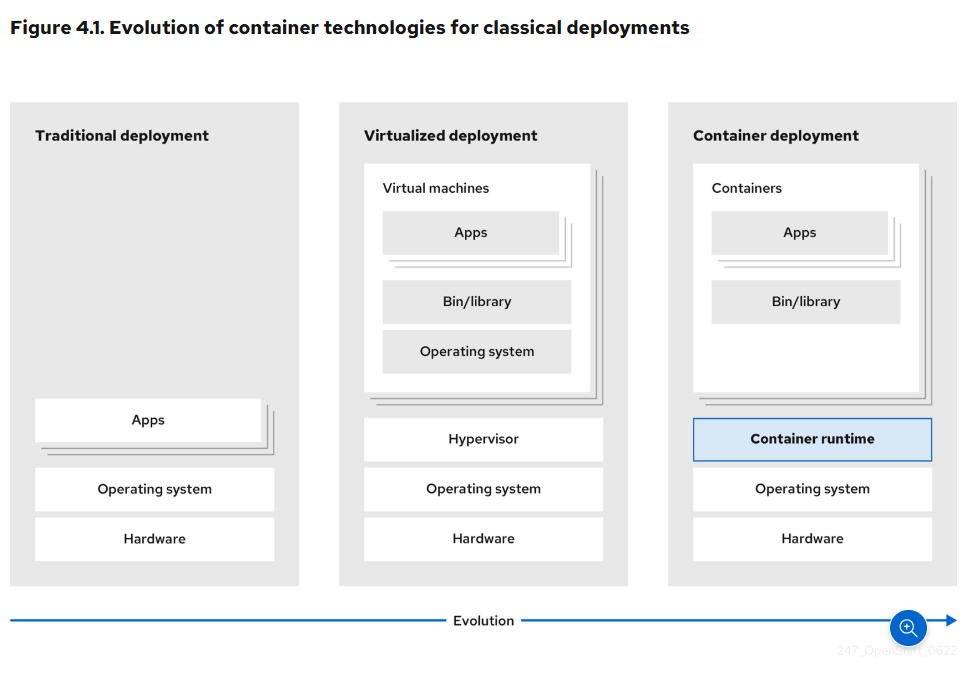
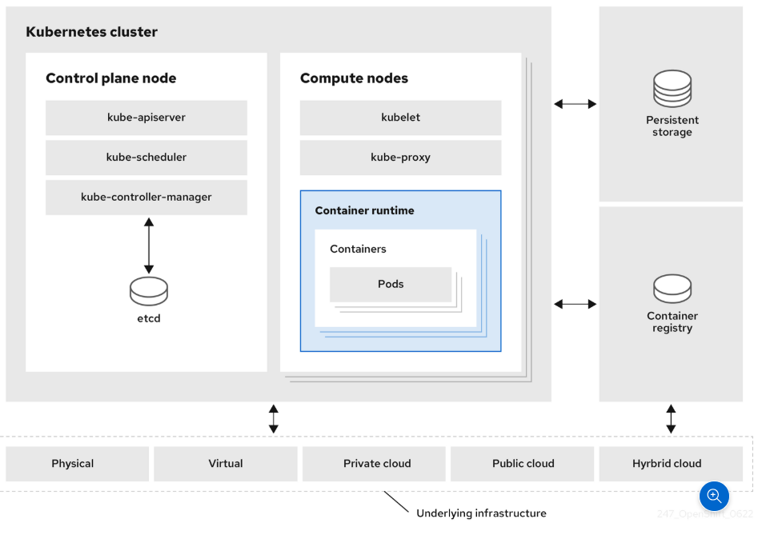

# Kubernetes Overview
## 1. Khái niệm
You can run and manage container-based workloads by using Kubernetes, an open source container orchestration tool developed by Google.

The most common Kubernetes use case is to deploy an array of interconnected microservices, building an application in a cloud native way. You can create Kubernetes clusters that can span hosts across on-premise, public, private, or hybrid clouds.

Traditionally, applications were deployed on top of a single operating system. With virtualization, you can split the physical host into several virtual hosts. Working on virtual instances on shared resources is not optimal for efficiency and scalability. Because a virtual machine (VM) consumes as many resources as a physical machine, providing resources to a VM such as CPU, RAM, and storage can be expensive. Also, you might see your application degrading in performance due to virtual instance usage on shared resources.

Kubernetes is a core component of an OpenShift Container Platform. You can use OpenShift Container Platform for developing and running containerized applications. With its foundation in Kubernetes, the OpenShift Container Platform incorporates the same technology that serves as the engine for massive telecommunications, streaming video, gaming, banking, and other applications. You can extend your containerized applications beyond a single cloud to on-premise and multi-cloud environments by using the OpenShift Container Platform.

You can run Kubernetes containers across various machines and environments.

A cluster is a single computational unit consisting of multiple nodes in a cloud environment. A Kubernetes cluster includes a control plane and compute nodes.

The control plane node controls and maintains the state of a cluster. You can run the Kubernetes application by using compute nodes. You can use the Kubernetes namespace to differentiate cluster resources in a cluster. Namespace scoping is applicable for resource objects, such as deployments, services, and pods. You cannot use namespace for cluster-wide resource objects such as storage classes, nodes, and persistent volumes.

## 2. Kubernetes conceptual guidelines
To more effectively deploy and scale applications, you should understand how Kubernetes aligns with OpenShift Container Platform.

The API to OpenShift Container Platform cluster is 100% Kubernetes.

Nothing changes between a container running on any other Kubernetes and running on OpenShift Container Platform. No changes to the application. OpenShift Container Platform brings added-value features to provide enterprise-ready enhancements to Kubernetes. OpenShift Container Platform CLI tool (`oc`) is compatible with `kubectl`. While the Kubernetes API is 100% accessible within OpenShift Container Platform, the `kubectl` command-line lacks many features that could make it more user-friendly. OpenShift Container Platform offers a set of features and command-line tool like `oc`. Although Kubernetes excels at managing your applications, it does not specify or manage platform-level requirements or deployment processes. 

Powerful and flexible platform management tools and processes are important benefits that OpenShift Container Platform offers. You must add authentication, networking, security, monitoring, and logs management to your containerization platform.