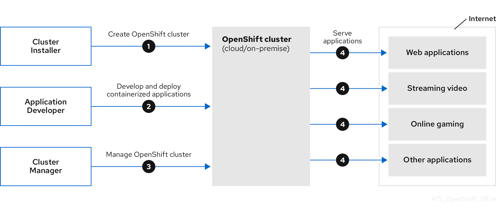
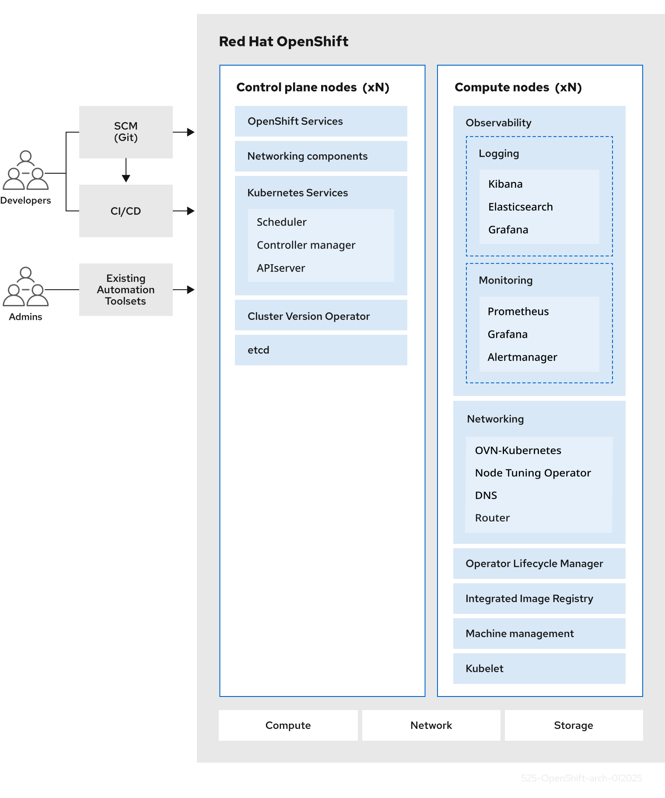

# Kiến trúc OpenShift Container Platform

## 1. Mục tiêu của tài liệu

Tài liệu này giải thích kiến trúc **Red Hat OpenShift Container Platform (OCP) 4.x** theo hướng: mỗi thành phần tồn tại để giải quyết vấn đề gì, nằm ở đâu và phối hợp với thành phần khác như thế nào.

Sau khi đọc xong, cần trả lời được:

1. Ai tạo cluster, ai triển khai ứng dụng và ai vận hành cluster?
2. Control plane khác worker/compute node ở điểm nào?
3. Điều gì xảy ra từ lúc gửi manifest đến khi container thực sự chạy?
4. OpenShift bổ sung gì bên trên Kubernetes?
5. Cluster tự duy trì, tự phục hồi và cập nhật bằng cách nào?

> **Ý chính:** OpenShift không chỉ là chương trình chạy container. Nó là cả một nền tảng gồm Kubernetes, hệ điều hành node, container runtime, networking, storage, security, monitoring và các Operator quản lý vòng đời cluster.

---

## 2. Bức tranh lớn: ai làm gì với OpenShift?



Hình trên không mô tả các gói tin chạy bên trong cluster. Nó mô tả **vòng đời sử dụng OpenShift** qua bốn hoạt động lớn.

| Số trên hình | Ai thực hiện? | Công việc | Kết quả |
|---|---|---|---|
| **1** | Cluster Installer / Platform Engineer | Chuẩn bị hạ tầng và cài OpenShift | Có một cluster sẵn sàng hoạt động |
| **2** | Application Developer / DevOps | Đóng gói và triển khai ứng dụng container | Ứng dụng chạy thành các Pod trong cluster |
| **3** | Cluster Administrator / Platform Engineer / SRE | Quản lý node, quyền, mạng, storage, nâng cấp và sức khỏe cluster | Cluster ổn định và đáp ứng chính sách |
| **4** | OpenShift cluster | Công bố và phục vụ ứng dụng | Người dùng trên mạng có thể sử dụng web, API, streaming hoặc dịch vụ khác |

### 2.1. Bốn bước này diễn ra như thế nào?

**Bước 1 — Tạo cluster.** Installer nhận cấu hình như domain, network, pull secret, nền tảng hạ tầng và số lượng máy. Nó tạo hoặc sử dụng các máy đã có, khởi tạo bootstrap, dựng control plane rồi nối các worker vào cluster.

**Bước 2 — Đưa ứng dụng vào cluster.** Developer đẩy source code lên Git. Pipeline có thể test, build container image, đẩy image vào registry và triển khai các object như Deployment, Service và Route.

**Bước 3 — Quản lý cluster.** Administrator theo dõi Cluster Operator, node, dung lượng, chứng chỉ, quyền truy cập và cập nhật phiên bản. SRE theo dõi độ tin cậy của dịch vụ. Security Engineer kiểm tra chính sách và rủi ro.

**Bước 4 — Phục vụ người dùng.** Traffic đi qua DNS, load balancer và OpenShift router rồi tới Service và Pod phù hợp.

Các hoạt động không chỉ diễn ra một lần. Developer liên tục phát hành phiên bản mới, administrator liên tục vận hành cluster và OpenShift liên tục đối chiếu trạng thái thực tế với trạng thái mong muốn.

### 2.2. Kiến trúc khai báo: nói “muốn gì”, hệ thống tìm cách duy trì

OpenShift hoạt động theo mô hình **declarative**. Bạn khai báo trạng thái mong muốn thay vì viết từng lệnh vận hành chi tiết.

Ví dụ:

```yaml
spec:
  replicas: 3
```

Ý nghĩa là: “Hãy duy trì 3 Pod của ứng dụng”. Nếu một Pod bị mất, controller phát hiện thực tế chỉ còn 2 và tạo Pod thay thế. Cơ chế lặp lại việc quan sát rồi điều chỉnh này gọi là **reconciliation loop**.

```text
Trạng thái mong muốn ──> API/etcd
                              │
                              v
                    Controller quan sát
                              │
                 so sánh desired với actual
                              │
                              v
                    Điều chỉnh trạng thái
                              │
                              └──── lặp liên tục
```

Đây là tư tưởng trung tâm của Kubernetes và Operator trong OpenShift.

---

## 3. Bên trong một OpenShift cluster



Hình chia cluster thành hai vùng chính:

- **Control plane nodes:** bộ não điều phối và lưu trạng thái cluster.
- **Compute nodes (worker nodes):** nơi chủ yếu chạy ứng dụng và nhiều dịch vụ nền của cluster.

Phía dưới là **compute, network và storage** do hạ tầng cung cấp. Phía trái là Git, CI/CD và công cụ tự động hóa mà developer/admin dùng để gửi yêu cầu vào cluster.

### 3.1. Cách đọc đúng hình kiến trúc

Hình mang tính **logic**, không phải sơ đồ triển khai chính xác cho mọi cluster:

- `xN` nghĩa là có thể có nhiều node cho khả năng chịu lỗi và mở rộng.
- Không phải mọi ô trong cột compute đều chạy trên mọi worker.
- Monitoring, logging, registry và router thường là các Pod được scheduler đặt lên node phù hợp; có thể dành riêng infrastructure node bằng label/taint.
- Kubelet và CRI-O chạy trên từng node RHCOS, kể cả control plane node, dù hình nhấn mạnh kubelet ở phía compute.
- Danh sách Elasticsearch, Kibana hoặc Grafana phản ánh một kiến trúc/minh họa cụ thể; stack quan sát thực tế phụ thuộc phiên bản và Operator đã cài. Không nên dùng hình này để kết luận chính xác sản phẩm logging nào đang có trong cluster.

### 3.2. Nền hạ tầng: nơi các node tồn tại

Node OpenShift có thể là máy vật lý hoặc máy ảo trên nền tảng được hỗ trợ. Hạ tầng phải cung cấp ba nhóm tài nguyên:

| Nhóm | Cung cấp gì? | Nếu thiếu sẽ xảy ra gì? |
|---|---|---|
| **Compute** | CPU và RAM cho node, Pod và process | Pod Pending, node quá tải hoặc ứng dụng bị OOM |
| **Network** | Kết nối giữa node, API, Pod, Service và bên ngoài | Node mất liên lạc, API/ứng dụng không truy cập được |
| **Storage** | Đĩa cho node, etcd, registry và dữ liệu ứng dụng | Không lưu được trạng thái bền vững hoặc hết dung lượng |

OpenShift điều phối tài nguyên nhưng không tạo CPU, RAM hay đĩa từ hư không. Nếu tăng replicas nhưng cluster hết tài nguyên, các Pod mới vẫn ở trạng thái `Pending` cho đến khi có chỗ chạy.

### 3.3. Các loại máy trong quá trình cài đặt

| Loại máy | Vai trò | Có tồn tại lâu dài không? |
|---|---|---|
| **Bootstrap machine** | Chạy Kubernetes tối thiểu để dựng control plane ban đầu | Không; được loại bỏ sau khi bootstrap hoàn tất |
| **Control plane node** | Chạy API, etcd, scheduler, controller và các thành phần quản trị nền tảng | Có |
| **Compute/worker node** | Chạy workload ứng dụng và dịch vụ cluster được schedule lên nó | Có |
| **Infrastructure node** | Worker được gán role/taint để dành cho router, registry, monitoring… nếu thiết kế cần | Tùy thiết kế |

Infrastructure node không phải loại node Kubernetes hoàn toàn khác. Về kỹ thuật, nó vẫn là worker được tổ chức và áp chính sách scheduling riêng.

---

## 4. Control plane: bộ não của cluster

Control plane trả lời bốn câu hỏi:

1. Cluster đang được yêu cầu ở trạng thái nào?
2. Trạng thái hiện tại là gì?
3. Workload nên chạy ở node nào?
4. Cần điều chỉnh gì để trạng thái thực tế khớp mong muốn?

### 4.1. API server — cửa chính của cluster

`kube-apiserver` cung cấp Kubernetes API. OpenShift còn có API riêng cho những tài nguyên như Route, Project, ImageStream và SCC.

`oc`, `kubectl`, web console, controller, Operator và công cụ CI/CD đều làm việc với cluster thông qua API. Chúng không nên sửa trực tiếp dữ liệu trong etcd.

Một yêu cầu tạo Deployment đi qua luồng rút gọn:

```text
oc / Web Console / CI-CD
          │
          v
     API endpoint
          │
          ├─ Authentication: bạn là ai?
          ├─ Authorization (RBAC): bạn có được làm việc này không?
          ├─ Admission: object có hợp lệ và đúng chính sách không?
          v
     Ghi trạng thái vào etcd
```

### 4.2. etcd — bộ nhớ trạng thái của cluster

`etcd` là cơ sở dữ liệu key-value lưu trạng thái Kubernetes/OpenShift, ví dụ:

- Deployment nào tồn tại và cần bao nhiêu replica;
- Pod đã được gán vào node nào;
- Service, Secret, ConfigMap và cấu hình cluster;
- trạng thái do controller và Operator báo cáo.

`etcd` **không phải database nghiệp vụ** của ứng dụng. Đơn hàng, tài khoản khách hàng hoặc giao dịch phải nằm trong database riêng của ứng dụng.

Vì etcd chứa trạng thái điều khiển quan trọng, control plane production thường được triển khai theo mô hình chịu lỗi và etcd cần có chiến lược backup được hỗ trợ.

### 4.3. Scheduler — chọn node cho Pod

Scheduler quan sát Pod chưa được gán node, sau đó:

1. lọc những node không đáp ứng CPU/RAM, taint/toleration, affinity, volume hoặc ràng buộc khác;
2. chấm điểm các node còn lại;
3. ghi quyết định gán Pod vào node phù hợp qua API.

Scheduler **chỉ chọn nơi chạy**. Nó không trực tiếp khởi động container.

### 4.4. Controller Manager — duy trì trạng thái mong muốn

Controller quan sát object rồi điều chỉnh tài nguyên liên quan. Ví dụ:

- Deployment controller quản lý rollout;
- ReplicaSet controller duy trì số lượng Pod;
- node controller theo dõi tình trạng node;
- endpoint controller cập nhật backend phục vụ Service.

Nếu `replicas: 3` nhưng chỉ có 2 Pod, controller tạo thêm một Pod. Scheduler sau đó chọn node cho Pod mới; kubelet trên node đó mới thực sự chạy container.

### 4.5. OpenShift services và networking components

OpenShift bổ sung OAuth/authentication, API/controller riêng, ingress/router, monitoring và nhiều dịch vụ nền. Các thành phần này thường cũng chạy dưới dạng Pod và được Operator quản lý.

Control plane quyết định và quản lý toàn cluster, nhưng **không phải mọi dịch vụ nền đều phải chạy trên control plane node**. Nhiều dịch vụ như router, registry hoặc monitoring có thể chạy trên worker/infrastructure node.

---

## 5. Worker node: nơi biến PodSpec thành process thật

Worker nhận quyết định từ control plane và cung cấp môi trường thực thi workload.

### 5.1. RHCOS — hệ điều hành được thiết kế cho OpenShift

Red Hat Enterprise Linux CoreOS (RHCOS) là hệ điều hành hướng tới vận hành OpenShift ổn định và nhất quán. Các thành phần quan trọng gồm:

| Thành phần | Vai trò |
|---|---|
| **Ignition** | Cấu hình máy ở lần boot đầu trong quá trình dựng node |
| **kubelet** | Node agent nhận PodSpec và theo dõi Pod trên node |
| **CRI-O** | Container runtime tương thích Kubernetes, quản lý vòng đời container |
| **rpm-ostree** | Hỗ trợ cập nhật hệ điều hành theo mô hình image/transaction |
| **systemd, NetworkManager, kernel** | Quản lý service, network và tài nguyên hệ điều hành |

Trong OCP 4.22, control plane machine dùng RHCOS; compute machine có thể dùng RHCOS hoặc RHEL theo phạm vi hỗ trợ. Worker RHEL cần nhiều công việc bảo trì thủ công hơn.

### 5.2. Kubelet — quản đốc của từng node

Kubelet chạy trên node và chịu trách nhiệm:

- đăng ký node với cluster;
- theo dõi Pod đã được gán cho node đó;
- yêu cầu CRI-O tạo/dừng container;
- mount volume thông qua cơ chế storage phù hợp;
- chạy startup, readiness và liveness probe;
- cập nhật trạng thái Pod/Node về API server;
- restart container theo restart policy khi cần.

Kubelet không chọn Pod chạy ở node nào. Scheduler đã thực hiện quyết định đó.

### 5.3. CRI-O — container runtime của OpenShift

CRI-O nhận yêu cầu qua **Container Runtime Interface (CRI)** từ kubelet. Nó chịu trách nhiệm:

- kéo image từ registry nếu node chưa có;
- chuẩn bị root filesystem của container;
- tạo Pod sandbox và container;
- phối hợp cấu hình network cho Pod;
- gọi OCI runtime để tạo process;
- báo trạng thái container về kubelet.

CRI-O không quản lý Deployment, không chọn node, không tự scale và không thực hiện rollout. Những việc đó thuộc Kubernetes/OpenShift ở lớp cao hơn.

### 5.4. OCI runtime và Linux kernel — nơi container trở thành process

CRI-O gọi OCI runtime như `crun` hoặc `runc`. OCI runtime yêu cầu Linux kernel tạo process với các cơ chế cách ly và giới hạn:

| Cơ chế | Tác dụng |
|---|---|
| **Namespaces** | Tách góc nhìn về process, network, mount, hostname… |
| **cgroups** | Đo và giới hạn CPU, memory cùng tài nguyên khác |
| **SELinux** | Áp nhãn và kiểm soát truy cập bắt buộc |
| **Capabilities** | Chia nhỏ quyền root thành các quyền cụ thể |
| **seccomp** | Giới hạn system call mà process được phép sử dụng |

> **Điểm rất dễ nhầm:** container không mang một kernel Linux riêng. Container chứa application, thư viện và filesystem cần thiết nhưng **dùng chung kernel của node**. Đây là lý do container nhẹ hơn VM, đồng thời cũng là lý do chính sách kernel, SELinux và SCC của host ảnh hưởng trực tiếp đến container.

### 5.5. Toàn bộ chuỗi runtime

```text
PodSpec đã được scheduler gán node
                │
                v
          kubelet trên node
                │ CRI
                v
              CRI-O
       ┌────────┼─────────┐
       │        │         │
     image    network   volume
       │        │         │
       └────────┼─────────┘
                │ OCI
                v
          crun hoặc runc
                │
                v
 Linux kernel: namespaces, cgroups,
 SELinux, capabilities, seccomp
                │
                v
      process của container chạy
```

Phân biệt nhanh:

| Thành phần | Câu hỏi nó trả lời |
|---|---|
| Scheduler | Pod chạy ở node nào? |
| Kubelet | Trên node này, Pod có đang chạy đúng yêu cầu không? |
| CRI-O | Tạo, dừng và kiểm tra container bằng cách nào? |
| OCI runtime | Tạo process container theo OCI spec ra sao? |
| Kernel | Cách ly, cấp phát và kiểm soát process như thế nào? |

---

## 6. Luồng triển khai một ứng dụng từ đầu đến cuối

Giả sử team cần triển khai website `shop` với ba replica.

### 6.1. Giai đoạn build

```text
Developer → Git → CI/CD build/test → image shop:v1 → Registry
```

Container image là bản đóng gói bất biến gồm application và dependencies. Registry là nơi lưu/phân phối image; image chưa phải container đang chạy.

### 6.2. Giai đoạn khai báo

Developer hoặc GitOps controller gửi Deployment, Service và Route tới API:

```text
Deployment: cần 3 Pod dùng image shop:v1
Service:    chọn các Pod có label app=shop
Route:      công bố Service shop ra bên ngoài
```

API xác thực danh tính, kiểm tra RBAC, admission/security rồi lưu object vào etcd.

### 6.3. Giai đoạn tạo Pod

```text
Deployment controller
       │
       v
ReplicaSet controller
       │
       v
Tạo 3 Pod chưa có node
       │
       v
Scheduler gán mỗi Pod vào node phù hợp
```

Ba replica không mặc nhiên nằm trên ba node khác nhau. Muốn phân bố chống lỗi cần cấu hình topology spread hoặc anti-affinity phù hợp và phải có đủ node/tài nguyên.

### 6.4. Giai đoạn chạy container

Kubelet trên node được chọn thấy PodSpec, gọi CRI-O, mount volume, cấu hình network và khởi chạy container. Khi readiness probe thành công, Pod mới được coi là backend sẵn sàng cho Service.

### 6.5. Giai đoạn phục vụ traffic

```text
Người dùng
    │
    v
   DNS
    │
    v
Load Balancer
    │
    v
OpenShift Ingress Controller / Router
    │ đọc Route
    v
 Service ──> EndpointSlice ──> Pod IP ──> containerPort
```

- **Route** mô tả hostname/path/TLS và Service đích.
- **Router** thực thi quy tắc Route để chuyển traffic.
- **Service** tạo danh tính mạng ổn định cho một nhóm Pod.
- **EndpointSlice** ghi nhận các backend phù hợp và sẵn sàng.
- **Pod IP** có thể thay đổi khi Pod được tạo lại; Service giúp client không phải theo dõi từng IP.

### 6.6. Khi có lỗi, ai xử lý?

| Sự cố | Thành phần chính phản ứng | Kết quả mong đợi |
|---|---|---|
| Process trong container chết | Kubelet/CRI-O | Restart container theo policy |
| Pod của Deployment bị xóa | ReplicaSet controller | Tạo Pod thay thế |
| Node hỏng | Node controller và workload controller | Sau khi phát hiện, workload đủ điều kiện được tạo lại ở node khác |
| Readiness probe lỗi | Kubelet cập nhật trạng thái; Service bỏ endpoint chưa Ready | Pod tạm không nhận traffic |
| Không đủ CPU/RAM | Scheduler không tìm thấy node phù hợp | Pod ở `Pending`; cần giải phóng hoặc bổ sung tài nguyên |
| Application lỗi logic | Thường không thể tự sửa bằng Kubernetes | Developer phải sửa code/config và phát hành phiên bản mới |

“Self-healing” không có nghĩa OpenShift sửa được mọi lỗi. Nó khôi phục các trạng thái mà controller biết cách đối chiếu, chẳng hạn thiếu replica hoặc process chết.

---

## 7. Networking, storage, image và security

### 7.1. Networking

OpenShift dùng network plugin để tạo kết nối Pod-to-Pod và thực thi chính sách mạng. OCP 4.22 dùng OVN-Kubernetes làm plugin mặc định.

| Object/thành phần | Vai trò |
|---|---|
| **Pod network** | Cho Pod giao tiếp qua IP trong cluster |
| **Service** | Endpoint logic ổn định và cân bằng tới nhóm Pod |
| **Route** | Công bố Service HTTP/HTTPS ra ngoài theo cách riêng của OpenShift |
| **Ingress Controller/Router** | Nhận traffic ngoài và thực thi Route/Ingress |
| **DNS** | Phân giải tên Service và tên ứng dụng |
| **NetworkPolicy** | Giới hạn ingress/egress giữa các Pod/namespace |

Route trỏ tới Service, không trỏ trực tiếp tới Deployment. Deployment quản lý Pod; Service chọn Pod bằng label.

### 7.2. Storage

Filesystem bên trong container thường không nên được coi là nơi lưu dữ liệu bền vững. Khi Pod bị tạo lại, dữ liệu cục bộ có thể mất.

```text
Pod yêu cầu PVC
      │
      v
PVC được bind với PV
      │
      v
CSI driver kết nối storage thật với node/Pod
```

- **PVC:** yêu cầu dung lượng/lớp lưu trữ của workload.
- **PV:** tài nguyên lưu trữ mà Kubernetes quản lý.
- **StorageClass:** mô tả cách cấp phát storage.
- **CSI driver:** cầu nối giữa Kubernetes và hệ thống storage.

Persistent volume không thay thế backup. Nếu dữ liệu quan trọng, vẫn cần chính sách backup, restore và kiểm thử phục hồi.

### 7.3. Image, registry và build

| Khái niệm | Vai trò |
|---|---|
| **Container image** | Template bất biến dùng để tạo container |
| **Registry** | Lưu và phân phối image layer/tag |
| **ImageStream** | API OpenShift theo dõi/tham chiếu image và tag; không chứa image layer |
| **BuildConfig** | API build truyền thống của OpenShift, mô tả source, strategy, output và trigger |
| **ImagePullSecret** | Credential để kéo image private |
| **Podman/Buildah/Skopeo** | Chạy/build/copy/kiểm tra image ngoài luồng kubelet–CRI-O |

Registry lưu image, không lưu dữ liệu phát sinh khi ứng dụng chạy. Image database và dữ liệu database là hai loại hoàn toàn khác nhau.

### 7.4. Authentication, authorization và admission

Ba lớp kiểm soát yêu cầu API:

1. **Authentication:** xác định người hoặc ServiceAccount là ai.
2. **Authorization/RBAC:** xác định danh tính đó được làm gì trên tài nguyên nào.
3. **Admission:** kiểm tra hoặc biến đổi object trước khi chấp nhận lưu.

OpenShift dùng **Security Context Constraints (SCC)** để kiểm soát Pod có được chạy privileged, dùng host network/hostPath, chạy UID nào, xin capability gì và dùng loại volume nào.

Ứng dụng thân thiện với OpenShift nên:

- chạy được bằng UID tùy ý và không yêu cầu root;
- không phụ thuộc vào privileged hoặc host namespace;
- ghi dữ liệu vào đường dẫn/volume có permission phù hợp;
- dùng cổng lớn hơn 1024 nếu không được cấp capability;
- khai báo resource requests/limits và startup/readiness/liveness probe.

---

## 8. Operator: cơ chế tự quản lý của OpenShift

Operator là controller có kiến thức vận hành một phần mềm hoặc một năng lực nền tảng. Nó quan sát custom resource và các object liên quan, sau đó liên tục đưa hệ thống về trạng thái mong muốn.

### 8.1. Cluster Operators

Cluster Operators được cài cùng OpenShift và quản lý các chức năng cốt lõi như authentication, ingress, network, monitoring và machine configuration.

```bash
oc get clusteroperators
```

Các condition quan trọng:

| Condition | Trạng thái khỏe thường mong đợi | Ý nghĩa |
|---|---|---|
| `Available` | `True` | Chức năng đang sẵn sàng |
| `Progressing` | `False` | Không còn rollout/thay đổi đang tiến hành |
| `Degraded` | `False` | Operator không báo tình trạng suy giảm |

Không nên chỉ nhìn `Available=True`. Một Operator có thể vẫn Available nhưng đồng thời `Degraded=True`, nghĩa là chức năng còn phục vụ nhưng có vấn đề cần xử lý.

### 8.2. CVO, MCO và OLM khác nhau thế nào?

| Thành phần | Quản lý gì? | Cách nhớ |
|---|---|---|
| **Cluster Version Operator (CVO)** | Phiên bản/payload OpenShift và Cluster Operators cốt lõi | Điều phối phiên bản toàn cluster |
| **Machine Config Operator (MCO)** | OS và cấu hình node RHCOS như kubelet, CRI-O, systemd, kernel config | Đưa cấu hình máy về trạng thái mong muốn |
| **Operator Lifecycle Manager (OLM)** | Operator bổ sung cài từ catalog/software catalog | Cài và quản lý add-on Operator |

OLM không quản lý các Cluster Operator cốt lõi thuộc payload OpenShift.

### 8.3. Luồng cập nhật cluster

```text
Administrator chọn phiên bản đích
              │
              v
 CVO lấy release image và áp manifest
              │
              v
 Cluster Operators reconcile thành phần của mình
              │
              v
 MCO cập nhật cấu hình/OS các node theo pool
              │
              v
 Cluster hội tụ về phiên bản mong muốn
```

Cập nhật cluster khác cập nhật application. CVO/MCO quản lý nền tảng OpenShift; pipeline hoặc GitOps của application team quản lý phiên bản ứng dụng.

---

## 9. OpenShift bổ sung gì so với Kubernetes?

| Kubernetes cung cấp nền tảng | OpenShift chuẩn hóa hoặc bổ sung |
|---|---|
| API, scheduler, controller, kubelet | Trải nghiệm cài đặt và lifecycle được tích hợp |
| Namespace | Project và trải nghiệm quản trị dành cho người dùng |
| Ingress/Service | Route và Ingress Controller/Router tích hợp |
| Runtime tùy distribution | CRI-O tích hợp với RHCOS |
| RBAC và cơ chế admission | OAuth, SCC và chính sách bảo mật mặc định |
| Controller/operator có thể tự cài | Cluster Operators, CVO, MCO, OLM và software catalog |
| Monitoring/registry/build tự lựa chọn | Các capability tích hợp hoặc được quản lý theo nền tảng |
| `kubectl` | `oc` dùng được với tài nguyên Kubernetes và tài nguyên riêng OpenShift |
| Cập nhật các thành phần riêng lẻ | Quy trình cập nhật cluster phối hợp theo release payload |

OpenShift vẫn là Kubernetes ở lõi. Các object chuẩn như Pod, Deployment, Service, ConfigMap, Secret và PVC vẫn giữ nguyên ý nghĩa. OpenShift thêm các thành phần để biến Kubernetes thành một nền tảng doanh nghiệp có cách cài đặt, bảo mật, vận hành và cập nhật thống nhất hơn.

---

## 10. Bản đồ trách nhiệm theo vai trò

| Vai trò | Quan tâm nhiều nhất | Cần hiểu kiến trúc đến đâu? |
|---|---|---|
| **Application Developer** | Image, Deployment, Service, Route, config, secret, probe, log | Hiểu luồng ứng dụng từ image tới traffic; biết debug Pod |
| **DevOps/GitOps Engineer** | Build, registry, pipeline, manifest, promotion môi trường | Hiểu API, RBAC, rollout và phụ thuộc platform |
| **Platform/Cluster Administrator** | Installation, node, Operator, update, capacity, access | Hiểu sâu toàn cluster và quan hệ control plane–worker |
| **SRE** | Availability, metric, log, trace, alert, scaling, recovery | Hiểu sâu reconciliation, failure mode và observability |
| **Security Engineer** | Identity, RBAC, SCC, network policy, image/runtime security | Hiểu request path và ranh giới bảo mật từ API tới kernel |
| **Storage/Network Engineer** | CSI, volume, load balancer, DNS, connectivity | Hiểu interface giữa OpenShift và hạ tầng chuyên môn |

Mọi vai trò nên hiểu toàn bộ kiến trúc ở mức bản đồ để biết sự cố nằm ở đâu. Mỗi người chỉ cần chuyên sâu phần gắn với trách nhiệm của mình.

---

## 11. Lệnh quan sát kiến trúc thực tế

### 11.1. Tổng quan cluster

```bash
oc version
oc whoami
oc get clusterversion
oc get clusteroperators
oc get nodes -o wide
oc get machineconfigpools
```

### 11.2. Theo dõi một workload

```bash
oc get deployment,pods,service,route
oc describe pod <pod-name>
oc get pod <pod-name> -o wide
oc logs <pod-name>
oc get events --sort-by=.lastTimestamp
```

### 11.3. Kiểm tra tài nguyên OpenShift riêng

```bash
oc api-resources | grep -E 'Route|ImageStream|BuildConfig|SecurityContextConstraints'
oc get routes
oc get imagestreams
oc auth can-i create deployments
oc auth can-i use scc/restricted-v2
```

Quyền xem tài nguyên cluster-wide tùy RBAC. Bị `Forbidden` có thể chỉ có nghĩa tài khoản không được cấp quyền, không đồng nghĩa cluster bị lỗi.

---

## 12. Những nhầm lẫn thường gặp

| Nhầm lẫn | Hiểu đúng |
|---|---|
| Kubelet chọn node cho Pod | Scheduler chọn node; kubelet chạy và theo dõi Pod trên node đã chọn |
| CRI-O là OpenShift | CRI-O chỉ là container runtime; OpenShift là toàn bộ platform |
| Container là VM nhỏ | Container là process được cách ly và dùng chung kernel host |
| Service chạy container | Service là abstraction mạng; container chạy trong Pod |
| Route trỏ vào Deployment | Route trỏ tới Service; Service chọn Pod |
| 3 replicas chắc chắn nằm trên 3 node | Chỉ đúng khi scheduling constraints và tài nguyên bảo đảm điều đó |
| PVC là backup | PVC cung cấp persistent storage; backup là quy trình riêng |
| OLM quản lý mọi Operator | OLM quản lý add-on Operator; CVO quản lý Cluster Operators lõi |
| Self-healing sửa được lỗi code | OpenShift có thể tạo lại workload; lỗi logic vẫn cần con người sửa |
| Mọi ô trong hình chạy trên đúng node được vẽ | Hình mô tả logic; vị trí Pod thực tế do scheduling và cấu hình cluster quyết định |

---

## 13. Câu hỏi tự kiểm tra

1. Tại sao API server được gọi là cửa chính của cluster?
2. etcd lưu gì và tại sao không dùng nó làm database cho ứng dụng?
3. Scheduler, kubelet, CRI-O và OCI runtime khác nhau ở nhiệm vụ nào?
4. Vì sao Pod Ready mới nên nhận traffic từ Service?
5. Khi một Pod của Deployment bị xóa, thành phần nào tạo Pod thay thế?
6. Vì sao container nhẹ hơn VM nhưng vẫn chịu ảnh hưởng của kernel host?
7. Route, Service và EndpointSlice phối hợp để đưa traffic tới Pod ra sao?
8. CVO, MCO và OLM quản lý ba phạm vi nào?
9. Vì sao `Available=True` chưa đủ để kết luận Cluster Operator hoàn toàn khỏe?
10. Khi tăng replicas nhưng Pod vẫn Pending, nên kiểm tra điều gì?

## 14. Tóm tắt bằng một chuỗi duy nhất

```text
Con người/công cụ khai báo mong muốn qua API
                    │
                    v
          etcd lưu trạng thái cluster
                    │
                    v
 Controller tạo/điều chỉnh object cần thiết
                    │
                    v
       Scheduler chọn node cho Pod
                    │
                    v
    Kubelet yêu cầu CRI-O chạy container
                    │
                    v
 OCI runtime + kernel tạo process được cách ly
                    │
                    v
 Route/Service/network đưa traffic tới ứng dụng
                    │
                    v
 Operator và controller tiếp tục quan sát, sửa lệch
```

Nếu chỉ nhớ một điều, hãy nhớ: **OpenShift là một hệ thống nhiều vòng điều khiển cùng quan sát API và liên tục đưa cluster về trạng thái đã khai báo.** Container runtime chỉ là đoạn cuối biến mong muốn đó thành process thật trên node.

## 15. Tài liệu tham khảo

- [OpenShift Container Platform 4.22 architecture](https://docs.redhat.com/en/documentation/openshift_container_platform/4.22/html/architecture/architecture)
- [OpenShift architecture overview](https://docs.redhat.com/en/documentation/openshift_container_platform/4.22/html/architecture/architecture-overview)
- [OpenShift control plane architecture](https://docs.redhat.com/en/documentation/openshift_container_platform/4.22/html/architecture/control-plane)
- [OpenShift update architecture](https://docs.redhat.com/en/documentation/openshift_container_platform/4.22/html/updating_clusters/index)
- [OpenShift Security Context Constraints](https://docs.redhat.com/en/documentation/openshift_container_platform/4.22/html/authentication_and_authorization/managing-pod-security-policies)
- [OpenShift Cluster Network Operator](https://docs.redhat.com/en/documentation/openshift_container_platform/4.22/html/networking_operators/cluster-network-operator)
- [Kubernetes components](https://kubernetes.io/docs/concepts/overview/components/)
- [Kubernetes Container Runtime Interface](https://kubernetes.io/docs/concepts/containers/cri/)
- [CRI-O](https://cri-o.io/)
