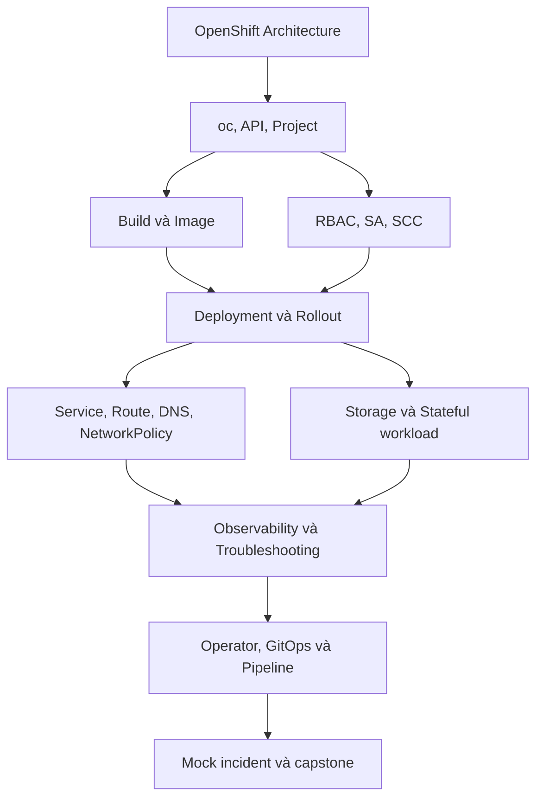

# Lộ trình OpenShift chuyên sâu trong 7 ngày

## 1. Mục tiêu thực tế

Sau một tuần học tập trung, mục tiêu phù hợp là **vận hành ứng dụng OpenShift độc lập ở mức developer/platform operator cơ bản**:

- hiểu request đi từ Route đến container và từ manifest đến CRI-O;
- build, deploy, update, rollback và scale ứng dụng;
- quản lý Project, RBAC, ServiceAccount, SCC, quota và Secret;
- xử lý lỗi image, scheduling, probe, Route, DNS, storage và quyền;
- đọc trạng thái Cluster Operator, MachineConfigPool và version;
- sử dụng Operator, GitOps/Pipeline ở mức thực hành;
- biết giới hạn quyền và thời điểm cần chuyển sự cố cho platform team.

Kinh nghiệm production, thiết kế HA, disaster recovery và tuning quy mô lớn vẫn cần nhiều tuần hoặc tháng thực chiến.

## 2. Bản đồ kiến thức

## 3. Lịch học đề xuất

Mỗi ngày dành 6–8 giờ: 2 giờ lý thuyết, 4–5 giờ lab, 1 giờ ghi chú và làm lại không nhìn đáp án.

| Ngày | Chủ đề | Tài liệu | Đầu ra bắt buộc |
| --- | --- | --- | --- |
| 1 | Kiến trúc, RHCOS, CRI-O, Operator, CLI | [25](25.OpenShift_Container_Runtime_Architecture.md), [29](29.OpenShift_CLI_Project_RBAC_SCC.md) | Sơ đồ request/runtime; tạo Project và quyền tối thiểu |
| 2 | Deployment, Route và vận hành | [26](26.OpenShift_Deployment_Operations.md), [27](27.OpenShift_Hands_on_Lab.md) | App truy cập được; rollout/rollback; sửa Route 503 |
| 3 | Build, registry và ImageStream | [30](30.OpenShift_Builds_Images_Registry.md) | Build từ source/Dockerfile, theo dõi image digest |
| 4 | Network và storage | [31](31.OpenShift_Networking_Routes.md), [32](32.OpenShift_Storage_Stateful.md) | Route TLS; NetworkPolicy; PVC sống qua Pod restart |
| 5 | Operator và automation | [33](33.OpenShift_Operators_OLM.md), [35](35.OpenShift_GitOps_Pipelines.md) | Cài/dùng một Operator lab; đồng bộ GitOps hoặc chạy Pipeline |
| 6 | Monitoring, troubleshooting và cluster lifecycle | [34](34.OpenShift_Observability_Troubleshooting.md), [37](37.OpenShift_Cluster_Lifecycle_Admin.md) | Giải 6 tình huống lỗi; viết runbook update/backup |
| 7 | Tổng ôn và capstone | Phần 5 của file này | Hoàn thành ứng dụng production-like và postmortem |

## 4. Quy tắc học

1. Mỗi lệnh phải trả lời được: đang hỏi API nào và muốn loại trừ giả thuyết nào?
2. Mỗi lab có bước **xác minh trạng thái thực tế**, không dừng ở `oc apply`.
3. Làm lần đầu theo hướng dẫn, lần hai không nhìn đáp án.
4. Không thực hành quyền cluster-admin, MCO, CVO hay node debug trên production.
5. Ghi `triệu chứng → bằng chứng → nguyên nhân → sửa → xác minh` cho mọi lỗi.
6. Không commit pull secret, kubeconfig, token, private key hoặc Secret thật.

## 5. Capstone ngày 7

Triển khai một ứng dụng gồm frontend, backend và database giả lập:

- manifest quản lý bằng Kustomize hoặc Helm;
- image dùng digest hoặc ImageStreamTag có quy trình promote;
- mỗi workload có request/limit và probes;
- Route edge TLS cho frontend;
- backend/database dùng Service nội bộ;
- NetworkPolicy chỉ cho frontend → backend → database và DNS;
- ServiceAccount/RBAC tối thiểu, không tự động mount token nếu không cần;
- database dùng PVC;
- HPA cho frontend nếu metrics khả dụng;
- GitOps đồng bộ môi trường dev hoặc Pipeline build/deploy;
- dashboard/query/log dùng để xác nhận rollout;
- mô phỏng Service selector sai hoặc image sai rồi viết postmortem.

## 6. Bài kiểm tra cuối tuần

Bạn đạt mục tiêu tuần khi có thể hoàn thành mà không nhìn đáp án:

- [ ] Tạo Project và cấp quyền `view`/`edit` đúng người dùng.
- [ ] Giải thích SCC nào đã admit Pod và vì sao Pod root bị từ chối.
- [ ] Build, import/tag image và tìm digest thực tế đang chạy.
- [ ] Triển khai Deployment → Service → Route và kiểm tra EndpointSlice.
- [ ] Cấu hình Route TLS, NetworkPolicy và DNS exception.
- [ ] Tạo PVC, kiểm tra StorageClass, binding mode và dữ liệu bền vững.
- [ ] Phân biệt Cluster Operator với Operator do OLM quản lý.
- [ ] Đọc ClusterVersion/MachineConfigPool và mô tả quy trình update/backup an toàn.
- [ ] Dùng Events/log/status/metrics để tìm nguyên nhân trong 10 phút.
- [ ] Mô tả đường rollback ứng dụng và giới hạn của rollback.
- [ ] Hoàn thành capstone và dọn toàn bộ tài nguyên lab.

## 7. Hình minh họa

Các sơ đồ Mermaid trong bộ tài liệu có thể render trực tiếp trên GitHub, GitLab, VS Code với extension Mermaid hoặc [Mermaid Live Editor](https://mermaid.live/). Danh sách nguồn ảnh chính thức và cách lưu ảnh có ghi tại [36.Nguon_Anh_Minh_Hoa_OpenShift.md](36.Nguon_Anh_Minh_Hoa_OpenShift.md).
