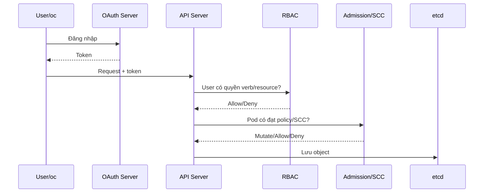

# OpenShift CLI, Project, RBAC và SCC

## 1. Mô hình truy cập



Authentication trả lời **bạn là ai**; RBAC trả lời **được làm gì**; admission/SCC trả lời **object có được phép tồn tại với cấu hình đó không**.

## 2. `oc` và context

```bash
oc login --token=<TOKEN> --server=<API_URL>
oc whoami
oc whoami --show-server
oc config get-contexts
oc project
oc status
oc logout
```

`oc` tương thích phần lớn lệnh `kubectl` và bổ sung `new-project`, `new-app`, `expose`, `start-build`, `adm`, `debug`, xử lý Route/ImageStream/BuildConfig.

## 3. Project và Namespace

Project dựa trên Namespace nhưng bổ sung metadata và workflow OpenShift. Một Project chứa object, policy, quota, ServiceAccount và giới hạn riêng.

```bash
oc new-project team-a --display-name='Team A' --description='OpenShift lab'
oc get project team-a -o yaml
oc project team-a
oc get all
```

Không chạy workload người dùng trong project hệ thống như `default`, `openshift-*` hoặc `kube-*`.

## 4. RBAC

Các ClusterRole thường dùng:

| Role | Khả năng điển hình |
| --- | --- |
| `view` | Đọc phần lớn resource application, không đọc Secret |
| `edit` | Tạo/sửa workload trong Project, không quản trị role theo ý muốn |
| `admin` | Quản trị Project và role binding trong giới hạn chống escalation |
| `cluster-admin` | Toàn quyền cluster; không dùng cho application account |

```bash
oc adm policy add-role-to-user view alice -n team-a
oc adm policy add-role-to-user edit bob -n team-a
oc adm policy add-role-to-group view qa-team -n team-a
oc get rolebindings -n team-a
oc auth can-i create deployments -n team-a --as=bob
oc auth can-i get secrets -n team-a --as=alice
```

Lab least privilege:

1. Tạo ServiceAccount `reporter`.
2. Tạo Role chỉ `get,list,watch` Pod.
3. Bind Role cho `reporter`.
4. Xác nhận list Pod được nhưng đọc Secret và namespace khác bị từ chối.

```bash
oc create sa reporter
oc create role pod-reader --verb=get,list,watch --resource=pods
oc create rolebinding reporter-pod-reader --role=pod-reader --serviceaccount=$(oc project -q):reporter
oc auth can-i list pods --as=system:serviceaccount:$(oc project -q):reporter
oc auth can-i get secrets --as=system:serviceaccount:$(oc project -q):reporter
```

## 5. ServiceAccount token

Pod dùng ServiceAccount để gọi API. Nếu app không gọi API, tắt token mount:

```yaml
spec:
  serviceAccountName: app
  automountServiceAccountToken: false
```

Token bound/projected có thời hạn và gắn với Pod. Không tạo token Secret dài hạn cho tiện nếu không có yêu cầu rõ ràng.

## 6. Security Context Constraints

SCC kiểm tra Pod theo quyền của user tạo Pod và ServiceAccount chạy Pod. `restricted-v2` là lựa chọn mặc định an toàn cho workload thông thường trong OpenShift hiện đại.

```bash
oc get pod <POD> -o jsonpath='{.metadata.annotations.openshift\.io/scc}{"\n"}'
oc auth can-i use scc/restricted-v2 --as=system:serviceaccount:$(oc project -q):default
oc adm policy who-can use scc/restricted-v2
```

Thiết kế image tương thích restricted:

- không yêu cầu UID 0 hoặc UID cố định;
- thư mục cần ghi có group permission phù hợp;
- dùng port >1024;
- drop capabilities, cấm privilege escalation;
- không dùng hostPath/hostNetwork/privileged nếu không thật sự cần.

Không chỉnh SCC mặc định. Khi workload đặc biệt cần thêm quyền, platform team tạo SCC riêng hẹp và cấp quyền `use` cho đúng ServiceAccount.

## 7. Quota và LimitRange

```bash
oc get resourcequota,limitrange
oc describe quota
oc describe appliedclusterresourcequota
```

Quota giới hạn tổng tài nguyên/object của Project. LimitRange đặt min/max/default cho từng container/Pod/PVC. Pod có thể bị API từ chối vì quota, hoặc Pending vì request vượt khả năng node; hai lỗi cần đọc ở nơi khác nhau.

## 8. Lab lỗi quyền

1. Dùng user/SA chỉ có `view` thử tạo Deployment và ghi lại lỗi RBAC.
2. Dùng user có `edit` tạo Pod privileged và ghi lỗi SCC.
3. Sửa Pod đạt `restricted-v2`, kiểm tra annotation SCC.
4. Đặt quota nhỏ rồi tạo workload vượt quota; đọc lỗi API và `oc describe quota`.

## 9. Tài liệu và ảnh

- [OpenShift authentication and authorization 4.20](https://docs.redhat.com/en/documentation/openshift_container_platform/4.20/html/authentication_and_authorization/)
- [Managing SCC](https://docs.redhat.com/en/documentation/openshift_container_platform/4.20/html/authentication_and_authorization/managing-pod-security-policies)
- [OpenShift quotas](https://docs.redhat.com/en/documentation/openshift_container_platform/4.20/html/building_applications/quotas)
- Ảnh nên lấy: sơ đồ OAuth/API/RBAC từ tài liệu Authentication; màn hình **Administrator → User Management → RoleBindings** trong web console lab của chính bạn.

