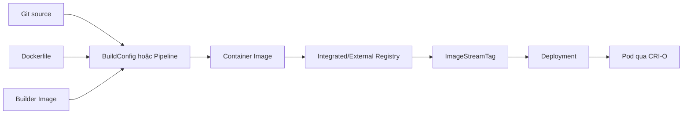
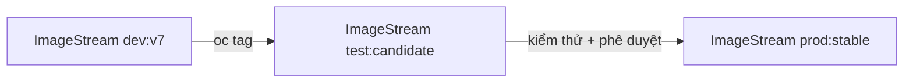

# OpenShift Builds, ImageStream và Registry

## 1. Luồng image



Container image chứa filesystem và metadata bất biến. Registry chứa layer/manifest. ImageStream lưu metadata và ánh xạ tag/digest trong API OpenShift, không chứa image layer.

## 2. Các chiến lược build

| Cách | Dùng khi | Điểm cần nhớ |
| --- | --- | --- |
| Source-to-Image (S2I) | Muốn build source bằng builder image chuẩn | Assemble source thành image, developer ít phải viết Dockerfile |
| Docker strategy | Repository có Dockerfile/Containerfile | Build theo chỉ dẫn image; cần kiểm soát base image và secret |
| Custom build | Có quy trình builder đặc thù | Quyền cao hơn, chỉ dùng khi thật cần |
| OpenShift Pipelines/Tekton | Workflow CI nhiều task | Pipeline linh hoạt, provenance/signing/scan dễ tích hợp |
| Build ngoài cluster | CI khác build và push image | OpenShift chỉ deploy image/digest |

## 3. BuildConfig

BuildConfig mô tả source, strategy, output và trigger. Khám phá:

```bash
oc api-resources | grep -E 'builds|buildconfigs|imagestreams'
oc get bc,build,is
oc explain buildconfig.spec
```

Tạo app từ Git có thể sinh nhiều object:

```bash
oc new-app <BUILDER_IMAGE>~<GIT_URL> --name=demo
oc get bc,is,deploy,svc
oc logs -f buildconfig/demo
```

`oc new-app` tiện cho học và tạo khung. Trong repository thực tế, export rồi chuẩn hóa manifest để review được thay vì chỉ phụ thuộc lệnh imperative.

## 4. Binary build lab

Tạo thư mục có `index.html` và `Dockerfile`:

```dockerfile
FROM registry.access.redhat.com/ubi9/nginx-124
COPY index.html /opt/app-root/src/
```

Khởi tạo binary Docker build:

```bash
oc new-build --name=web-build --binary --strategy=docker
oc start-build web-build --from-dir=. --follow
oc get build
oc get is web-build -o yaml
oc describe istag web-build:latest
```

Sau đó deploy output:

```bash
oc new-app web-build:latest --name=web-build-app
oc expose service/web-build-app
oc rollout status deployment/web-build-app
```

Tên builder/image có thể thay đổi theo catalog và release. Kiểm tra image được Red Hat hỗ trợ hoặc dùng image nội bộ được tổ chức phê duyệt.

## 5. ImageStream

```bash
oc import-image app:1.0 --from=<REGISTRY>/<REPO>:1.0 --confirm
oc tag app:1.0 app:stable
oc get is,istag
oc describe is app
```

Các tham chiếu:

- `ImageStreamTag`: `app:stable`, dễ promote/rollback tag.
- `ImageStreamImage`: `app@sha256:...`, bất biến trong stream.
- Docker image reference: `registry/repository@sha256:...`.

Production nên biết chính xác digest đang chạy:

```bash
oc get pod -l app=web -o jsonpath='{range .items[*]}{.metadata.name}{" "}{.status.containerStatuses[0].imageID}{"\n"}{end}'
```

## 6. Registry authentication

```bash
oc create secret docker-registry registry-creds \
  --docker-server=<REGISTRY> \
  --docker-username=<USER> \
  --docker-password=<PASSWORD>
oc secrets link default registry-creds --for=pull
```

Không gõ password thật vào lịch sử shell trong production. Tạo secret qua secret manager hoặc input an toàn. Phân biệt:

- build secret: build process truy cập source/base/artifact;
- push secret: push output;
- image pull secret: kubelet/CRI-O kéo image cho Pod.

## 7. Trigger và promotion



Không build lại cùng source riêng cho từng môi trường. Promote cùng digest đã được scan/test. Kiểm tra trigger trước khi tag vì ImageChange trigger có thể tạo rollout/build tự động.

## 8. Troubleshooting build/image

| Dấu hiệu | Kiểm tra |
| --- | --- |
| Build Pending | quota, build pod scheduling, PVC, policy |
| Git clone fail | URL, CA/proxy, source secret, egress |
| Build fail | `oc logs build/<NAME>`, Dockerfile/S2I scripts |
| Push fail | output registry, push secret, storage registry |
| ImagePullBackOff | image reference, pull secret, registry DNS/TLS |
| ImageStream không cập nhật | import policy, scheduled import, tag/digest |

## 9. Tiêu chí thành thạo

- [ ] Giải thích image, registry và ImageStream khác nhau.
- [ ] Thực hiện một S2I hoặc Docker build và đọc build log.
- [ ] Deploy output và xác định digest thực tế.
- [ ] Promote cùng digest qua hai tag.
- [ ] Sửa được lỗi pull secret hoặc image reference.

## 10. Tài liệu và ảnh

- [OpenShift Images 4.20](https://docs.redhat.com/en/documentation/openshift_container_platform/4.20/html-single/images/images)
- [Managing images](https://docs.redhat.com/en/documentation/openshift_container_platform/4.20/html/images/managing-images)
- [Builds using BuildConfig](https://docs.redhat.com/en/documentation/openshift_container_platform/4.20/html/builds_using_buildconfig/)
- Ảnh nên lấy: topology của app/build trong **Developer → Topology**, trang **Builds → BuildConfigs**, và YAML/ImageStream graph từ cluster lab.

