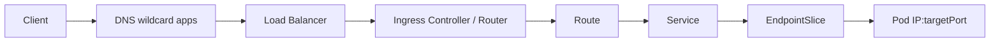
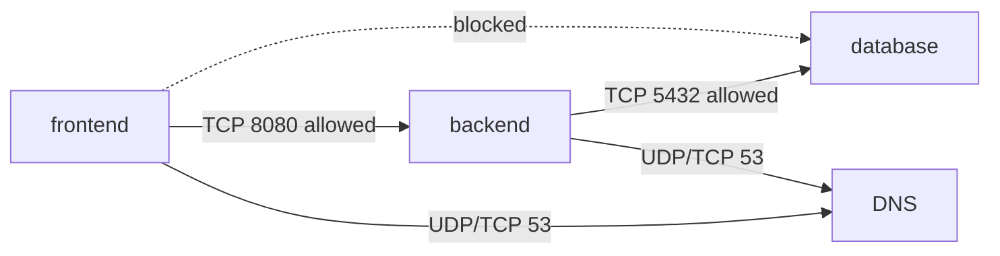

# OpenShift Networking, Route và NetworkPolicy

## 1. Luồng mạng



Pod có IP trong cluster network; Service cung cấp virtual IP/DNS ổn định; Route công bố Service ra ngoài. OVN-Kubernetes hiện là network plugin mặc định, nhưng hành vi cụ thể cần xem cấu hình cluster.

## 2. Service và DNS

```bash
oc get svc,endpointslice
oc describe svc <SERVICE>
oc get pod --show-labels -o wide
oc run dns-test --image=registry.access.redhat.com/ubi9/ubi-minimal --restart=Never -- sleep 3600
oc exec dns-test -- getent hosts <SERVICE>
```

Service DNS trong cùng Project là `<service>`. FQDN là `<service>.<namespace>.svc.cluster.local` theo cluster domain thông thường. Nếu EndpointSlice rỗng, so selector, labels và readiness trước khi debug router.

## 3. Route

Route trỏ tới Service và port được đặt tên. Các kiểu TLS:

| TLS termination | TLS kết thúc ở đâu | Backend |
| --- | --- | --- |
| Edge | Router | HTTP hoặc re-encrypt tùy thiết kế khác |
| Passthrough | Pod/backend | Backend tự có certificate; không dùng path routing theo HTTP ở router |
| Re-encrypt | Router rồi tạo TLS mới tới backend | Backend dùng TLS và destination CA |

Tạo Route thường:

```bash
oc expose service web
oc get route web
oc describe route web
```

Route edge lab với certificate do cluster/router quản lý mặc định:

```bash
oc create route edge web-tls --service=web --insecure-policy=Redirect
oc get route web-tls -o jsonpath='{.spec.host}{"\n"}'
```

Không đưa private key production vào Git. Certificate custom nên được quản lý qua quy trình secret/certificate automation của tổ chức.

## 4. Route admission và 503

```bash
oc get route <ROUTE> -o jsonpath='{range .status.ingress[*].conditions[*]}{.type}{"="}{.status}{" "}{.reason}{"\n"}{end}'
oc get endpointslice -l kubernetes.io/service-name=<SERVICE>
```

Route `Admitted=True` chỉ chứng minh router nhận Route. HTTP 503 thường do không có endpoint Ready, sai `targetPort`, app không listen hoặc network policy chặn.

## 5. NetworkPolicy

Policy là allowlist cộng dồn. Một kết nối phải được phép bởi egress policy của nguồn và ingress policy của đích nếu các Pod tương ứng bị isolate.



Lab:

1. Triển khai frontend/backend/database với label rõ ràng.
2. Xác nhận kết nối trước policy.
3. Tạo default-deny ingress và egress.
4. Mở DNS.
5. Mở frontend → backend và backend → database.
6. Lập bảng request được/chặn và đối chiếu mong đợi.

Ví dụ default deny:

```yaml
apiVersion: networking.k8s.io/v1
kind: NetworkPolicy
metadata:
  name: default-deny
spec:
  podSelector: {}
  policyTypes: [Ingress, Egress]
```

## 6. Debug network theo tầng

```text
DNS resolve?
  → Service tồn tại và đúng port?
    → EndpointSlice có Pod Ready?
      → app listen đúng address/port?
        → NetworkPolicy cho phép hai chiều cần thiết?
          → Route admitted và router reach backend?
```

Lệnh hữu ích:

```bash
oc get networkpolicy
oc describe networkpolicy <NAME>
oc exec <POD> -- getent hosts <SERVICE>
oc exec <POD> -- curl -sv --max-time 5 http://<SERVICE>:<PORT>/
oc get events --sort-by=.lastTimestamp
```

Image distroless có thể thiếu shell/curl; dùng Pod debug riêng thay vì cài công cụ vào container production.

## 7. Tài liệu và ảnh

- [OpenShift Networking 4.20](https://docs.redhat.com/en/documentation/openshift_container_platform/4.20/html/networking_overview/)
- [Ingress and load balancing](https://docs.redhat.com/en/documentation/openshift_container_platform/4.20/html/ingress_and_load_balancing/)
- [Network security](https://docs.redhat.com/en/documentation/openshift_container_platform/4.20/html/network_security/)
- Ảnh nên lấy: Route topology trong web console, OVN-Kubernetes architecture từ Red Hat docs và sơ đồ Mermaid trong bài này.

