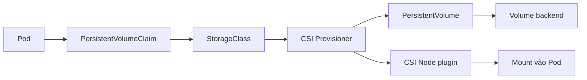
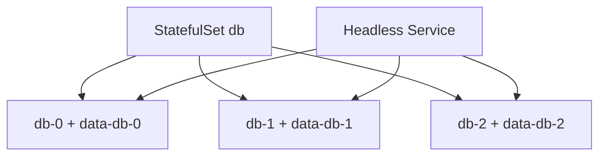

# OpenShift Storage và workload có trạng thái

## 1. Luồng cấp volume



PVC là yêu cầu của ứng dụng; StorageClass mô tả cách provision; PV biểu diễn volume; CSI driver kết nối storage backend. OpenShift không biến ứng dụng stateless thành stateful: consistency, backup và recovery vẫn là trách nhiệm thiết kế ứng dụng/storage.

## 2. Khái niệm cần nắm

| Khái niệm | Ý nghĩa |
| --- | --- |
| Access mode | RWO, ROX, RWX hoặc RWOP; là khả năng/semantics được driver hỗ trợ |
| Reclaim policy | `Delete` hoặc `Retain` sau khi PVC/PV được giải phóng |
| Binding mode | `Immediate` hoặc `WaitForFirstConsumer` |
| Volume expansion | Tăng dung lượng khi StorageClass/driver hỗ trợ |
| Topology | Volume chỉ attach được ở zone/node phù hợp |
| VolumeSnapshot | Snapshot qua CSI; cần CRD, controller và driver hỗ trợ |

## 3. Lab PVC

```bash
oc get storageclass
oc get csidriver
```

Chọn StorageClass khả dụng rồi tạo:

```yaml
apiVersion: v1
kind: PersistentVolumeClaim
metadata:
  name: app-data
spec:
  accessModes: [ReadWriteOnce]
  storageClassName: <STORAGE_CLASS>
  resources:
    requests:
      storage: 1Gi
---
apiVersion: v1
kind: Pod
metadata:
  name: writer
spec:
  containers:
  - name: writer
    image: busybox:1.36
    command: [sh, -c, 'date > /data/proof; sleep 3600']
    volumeMounts:
    - name: data
      mountPath: /data
  volumes:
  - name: data
    persistentVolumeClaim:
      claimName: app-data
```

```bash
oc apply -f storage-lab.yaml
oc get pvc,pod
oc describe pvc app-data
oc exec writer -- cat /data/proof
oc delete pod writer
```

Tạo Pod reader khác mount cùng PVC và xác nhận file còn tồn tại. Nếu PVC dùng `WaitForFirstConsumer`, trạng thái Pending trước khi có Pod có thể là bình thường.

## 4. StatefulSet

StatefulSet cung cấp identity ổn định, ordinal, ordered rollout và volumeClaimTemplate cho mỗi replica. Nó không tự sao chép dữ liệu giữa replica và không thay Operator database.



## 5. SCC và permission volume

OpenShift cấp UID động. Nếu image chỉ cho owner cố định ghi thư mục data, container có thể `Permission denied`. Cách thiết kế tốt:

- image cho group root (`GID 0`) quyền ghi và giữ group permission;
- dùng `fsGroup` khi storage/driver và SCC cho phép;
- không giải quyết bằng `privileged` hoặc `chmod 777` thiếu kiểm soát;
- dùng image/Operator được thiết kế cho OpenShift.

Xem lỗi:

```bash
oc describe pod <POD>
oc logs <POD>
oc get pod <POD> -o jsonpath='{.metadata.annotations.openshift\.io/scc}{"\n"}'
```

## 6. Backup và recovery

Phân biệt:

- snapshot volume: trạng thái block/filesystem tại thời điểm chụp;
- backup application-consistent: app/database đã flush/quiesce phù hợp;
- backup Kubernetes objects: manifest/metadata;
- disaster recovery: restore dữ liệu, object, secret, DNS và dependencies rồi kiểm thử.

Một snapshot thành công chưa chứng minh restore thành công. Lab phải tạo PVC mới từ snapshot/backup và kiểm tra nội dung.

## 7. Troubleshooting

| Triệu chứng | Bằng chứng cần xem |
| --- | --- |
| PVC Pending | StorageClass, provisioner, Events, quota, topology |
| Pod Pending vì volume | attach limit, zone/node affinity, multi-attach |
| Mount fail | kubelet Events, CSI node/controller logs, Secret/config |
| Permission denied | UID/GID, SCC, `fsGroup`, filesystem permission |
| Expansion không chạy | `allowVolumeExpansion`, driver, filesystem resize |

## 8. Tài liệu và ảnh

- [OpenShift Storage 4.20](https://docs.redhat.com/en/documentation/openshift_container_platform/4.20/html/storage/)
- [Kubernetes Persistent Volumes](https://kubernetes.io/docs/concepts/storage/persistent-volumes/)
- [Kubernetes CSI documentation](https://kubernetes-csi.github.io/docs/)
- Ảnh nên lấy: CSI architecture từ Kubernetes CSI docs; trang **Storage → PersistentVolumeClaims** và **StorageClasses** trong web console lab.

