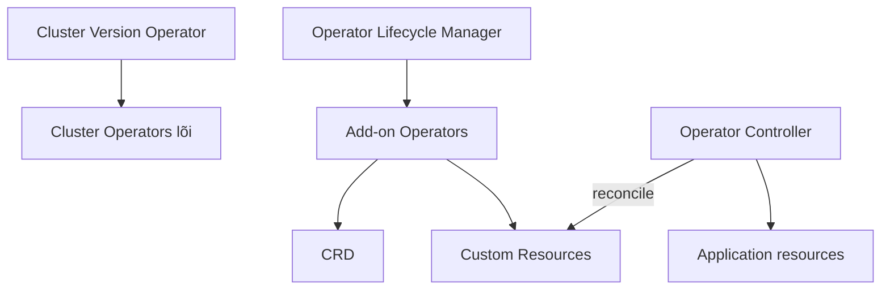

# OpenShift Operators và Operator Lifecycle Manager

## 1. Ba lớp dễ nhầm



| Thành phần | Quản lý gì |
| --- | --- |
| CVO | Payload và Cluster Operators của nền tảng OpenShift |
| Cluster Operator | Một năng lực lõi: network, ingress, authentication... |
| OLM | Cài đặt/nâng cấp Operator bổ sung qua catalog/subscription |
| Operator | Controller có domain knowledge, quan sát Custom Resource |

OLM không quản lý Cluster Operators lõi do CVO quản lý.

## 2. Object của OLM

| Object | Vai trò |
| --- | --- |
| CatalogSource | Nguồn package/bundle Operator |
| PackageManifest | Thông tin package nhìn thấy từ catalog |
| Subscription | Chọn package, channel và chính sách update |
| InstallPlan | Kế hoạch cài/nâng version cụ thể |
| ClusterServiceVersion (CSV) | Metadata, RBAC, CRD và trạng thái version Operator |
| OperatorGroup | Phạm vi namespace Operator theo dõi |

```bash
oc get catalogsource -n openshift-marketplace
oc get packagemanifest
oc get subscription,installplan,csv -A
oc describe csv <CSV> -n <NAMESPACE>
```

## 3. Manual và Automatic approval

- `Automatic`: OLM tự phê duyệt InstallPlan theo channel; tiện nhưng cần quản trị rủi ro thay đổi.
- `Manual`: administrator review rồi approve; kiểm soát cao hơn, dễ tồn đọng upgrade.

Channel (`stable`, `fast`, version-specific...) do nhà phát hành định nghĩa. Không suy ra ý nghĩa chỉ từ tên; đọc release notes và upgrade graph.

## 4. Lab dùng Operator đã cài

Chọn một Operator nhẹ đã có trong cluster hoặc được phép cài trên cluster lab. Quy trình:

1. Xem package, channel, install mode và namespace scope.
2. Cài qua web console OperatorHub hoặc Subscription YAML.
3. Theo dõi Subscription → InstallPlan → CSV `Succeeded` → controller Pod Ready.
4. Khám phá CRD bằng `oc api-resources` và `oc explain`.
5. Tạo Custom Resource nhỏ.
6. Quan sát resource con và `status.conditions`.
7. Sửa spec, xóa resource con và xem reconcile.
8. Dọn CR trước, rồi Subscription/CSV theo hướng dẫn Operator; không xóa CRD khi còn CR.

Không chọn database production cho bài đầu. Operator có thể tạo cluster-scoped RBAC/CRD; chỉ cài trên cluster lab và đọc quyền trước.

## 5. Debug Operator

```text
CR không hoạt động
  → CRD có tồn tại/served version đúng?
  → CR có qua validation?
  → Subscription/InstallPlan/CSV có healthy?
  → controller Pod Ready?
  → RBAC/watch namespace đúng?
  → log controller và status.conditions nói gì?
```

```bash
oc get subscription,installplan,csv -n <OPERATOR_NS>
oc get pods -n <OPERATOR_NS>
oc logs deployment/<OPERATOR_DEPLOYMENT> -n <OPERATOR_NS>
oc describe <CUSTOM_RESOURCE> <NAME>
oc get events -n <APP_NS> --sort-by=.lastTimestamp
```

## 6. Cluster Operator health

```bash
oc get clusteroperators
oc describe clusteroperator <NAME>
oc get clusterversion
```

Không xóa hoặc tự cài lại Cluster Operator như cách xử lý add-on Operator. Với `Degraded=True`, đọc condition/message và tài liệu support trước khi thay đổi.

## 7. Tài liệu và ảnh

- [OpenShift Operators 4.20](https://docs.redhat.com/en/documentation/openshift_container_platform/4.20/observability/operators/index)
- [Control plane architecture](https://docs.redhat.com/en/documentation/openshift_container_platform/4.20/html/architecture/control-plane)
- [Operator SDK](https://sdk.operatorframework.io/)
- Ảnh nên lấy: sơ đồ OLM object flow từ Operator Framework docs; màn hình **Operators → Installed Operators** và trang CSV trong cluster lab.

