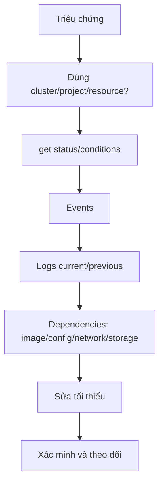

# OpenShift Observability và Troubleshooting

## 1. Bốn loại tín hiệu

| Signal | Trả lời |
| --- | --- |
| Metrics | Hệ thống thay đổi theo thời gian thế nào? |
| Logs | Process đã ghi gì về một sự kiện? |
| Traces | Một request đi qua dịch vụ nào và mất thời gian ở đâu? |
| Events | Kubernetes/OpenShift controller đã quyết định hoặc thất bại gì? |

Golden signals: latency, traffic, errors, saturation. Metrics cluster và user workload monitoring phụ thuộc cấu hình/quyền của cluster.

## 2. Luồng điều tra



## 3. Bộ lệnh nền tảng

```bash
oc status
oc get deployment,pod,svc,route,pvc
oc get events --sort-by=.lastTimestamp
oc describe pod <POD>
oc logs <POD> --all-containers --tail=200
oc logs <POD> --previous
oc rollout status deployment/<NAME>
oc get endpointslice
oc get pod <POD> -o yaml
```

Lọc condition:

```bash
oc get pod <POD> -o jsonpath='{range .status.conditions[*]}{.type}{"="}{.status}{" "}{.reason}{"\n"}{end}'
```

## 4. Ma trận lỗi

| Dấu hiệu | Lớp lỗi | Kiểm tra đầu tiên |
| --- | --- | --- |
| API `Forbidden` | RBAC hoặc admission/SCC | đọc nguyên văn response, `oc auth can-i` |
| Pod Pending | scheduling/storage/quota | `describe pod`, PVC, quota, node selector |
| ImagePullBackOff | registry | Events, image, pull secret, TLS/DNS |
| CrashLoopBackOff | process/app | logs current/previous, command/env/config |
| Running nhưng NotReady | probe/app | readiness path/port/timeout và app log |
| Route 503 | service/backend | EndpointSlice, targetPort, readiness |
| PVC Pending | storage | StorageClass, provisioner, binding mode, Events |
| Operator không reconcile | Operator/API | CSV/controller log, RBAC, CR status |
| Node NotReady | platform | node condition, kubelet, CRI-O, network |

## 5. Metrics và alert

Developer thường dùng Developer Perspective, Observe hoặc query được cấp quyền. Cluster admin kiểm tra monitoring stack và alert:

```bash
oc adm top pods
oc adm top nodes
oc get pods -n openshift-monitoring
oc get prometheusrules -A
```

`oc adm top` không thay Prometheus: nó cung cấp resource metrics hiện tại. Alert tốt cần symptom có tác động, ngưỡng/thời gian hợp lý, label điều hướng và runbook.

## 6. Debug node và runtime

Chỉ dùng trên cluster lab/quyền quản trị:

```bash
oc debug node/<NODE>
chroot /host
systemctl status kubelet crio
journalctl -u kubelet -n 100 --no-pager
journalctl -u crio -n 100 --no-pager
crictl pods
crictl ps -a
exit
exit
```

Không dùng `crictl rm` hoặc sửa file node để chữa workload do controller quản lý. Thu thập bằng chứng rồi sửa desired state hoặc theo runbook platform.

## 7. Sáu bài failure injection

Thực hiện trên Project lab, giới hạn 10 phút/case:

1. Image tag không tồn tại → sửa `ImagePullBackOff`.
2. Command thoát code 1 → dùng `logs --previous` sửa CrashLoop.
3. Readiness sai port → Pod Running nhưng Route 503.
4. Service selector sai → EndpointSlice rỗng.
5. PVC dùng StorageClass giả → PVC Pending.
6. Pod privileged → SCC từ chối ngay tại admission.

Với từng case ghi:

```text
Triệu chứng:
Bằng chứng:
Nguyên nhân gốc:
Thay đổi đã làm:
Cách xác minh:
Biện pháp phòng ngừa:
```

## 8. Must-gather và escalation

`oc adm must-gather` thu thập dữ liệu hỗ trợ cluster và thường cần quyền cao, dung lượng đáng kể. Chạy theo hướng dẫn support, bảo vệ archive vì có metadata nhạy cảm, và không đăng công khai.

Escalate khi sự cố vượt namespace hoặc liên quan Cluster Operator Degraded, API/etcd, nhiều node, CNI/CSI, certificate hoặc update. Cung cấp timeline, resource names, conditions, Events/log liên quan và thay đổi vừa xảy ra.

## 9. Tài liệu và ảnh

- [OpenShift Monitoring 4.20](https://docs.redhat.com/en/documentation/openshift_container_platform/4.20/html/monitoring/)
- [OpenShift Support and troubleshooting](https://docs.redhat.com/en/documentation/openshift_container_platform/4.20/html/support/)
- [Kubernetes debugging](https://kubernetes.io/docs/tasks/debug/)
- Ảnh nên lấy: dashboard Workloads/Monitoring của cluster lab; biểu đồ metrics trước và sau failure injection; sơ đồ Mermaid điều tra ở trên.

