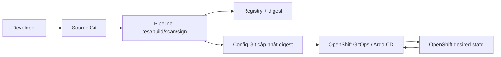
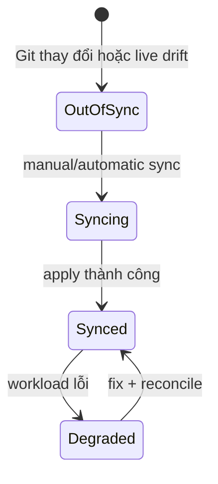

# OpenShift GitOps và Pipelines

## 1. Hai vòng tự động hóa



Pipeline tạo artifact; GitOps đưa desired state từ Git vào cluster và phát hiện drift. Không để Pipeline dùng `oc apply` tùy tiện đồng thời với Argo CD quản lý cùng resource, vì hai controller có thể ghi đè nhau.

## 2. OpenShift Pipelines

OpenShift Pipelines dựa trên Tekton:

| Object | Vai trò |
| --- | --- |
| Task | Một đơn vị công việc tái sử dụng |
| TaskRun | Một lần chạy Task |
| Pipeline | DAG các Task |
| PipelineRun | Một lần chạy Pipeline |
| Workspace | Dữ liệu chia sẻ/PVC giữa task |
| Trigger | Nhận event tạo PipelineRun |

Pipeline production điển hình:

```text
clone → unit test → build → scan → SBOM → sign
→ push digest → update config repository
```

Credentials đặt trong Secret/ServiceAccount hoặc cơ chế identity của platform, không hard-code trong Task. Task dùng image được pin version/digest.

## 3. OpenShift GitOps

OpenShift GitOps dựa trên Argo CD. Các khái niệm:

- Application: source Git/Helm/Kustomize + destination cluster/namespace;
- sync status: Git có khớp live state không;
- health status: resource có khỏe không;
- automated sync, prune và self-heal;
- AppProject giới hạn source, destination và resource kinds.



Synced không đồng nghĩa Healthy. YAML có thể khớp Git nhưng Pod CrashLoop.

## 4. Lab GitOps

Yêu cầu cluster lab đã cài OpenShift GitOps Operator và repository thử:

1. Repository chứa `base` và overlay `dev`.
2. Tạo Argo CD Application trỏ đúng path/namespace.
3. Sync và kiểm tra Deployment/Route.
4. Đổi replica/image trong Git, chờ reconcile.
5. Sửa trực tiếp replica bằng `oc scale`, quan sát OutOfSync và self-heal nếu bật.
6. Commit cấu hình đúng, xác nhận Synced + Healthy.

Không đưa repository credential trực tiếp vào Application YAML public.

## 5. Lab Pipeline

Yêu cầu OpenShift Pipelines Operator:

1. Tạo Task đơn giản clone/build hoặc dùng resolver/catalog tin cậy.
2. Tạo Pipeline có task test và build.
3. Chạy PipelineRun, xem log từng step.
4. Cố ý làm test fail và xác nhận các task phụ thuộc không chạy.
5. Sửa source, chạy lại, ghi image digest output.
6. Cập nhật config Git bằng pull request thay vì apply trực tiếp nếu GitOps quản lý workload.

CLI thường dùng khi đã cài Tekton CLI:

```bash
tkn pipeline list
tkn pipelinerun list
tkn pipelinerun logs <RUN> -f
oc get task,pipeline,taskrun,pipelinerun
```

## 6. Bảo mật chuỗi cung ứng

- pin Task/builder/base image;
- scan source, dependencies, image và manifest;
- tạo SBOM;
- ký/xác minh image digest;
- tách quyền build với quyền deploy;
- bảo vệ branch và yêu cầu review;
- dùng short-lived identity khi có thể;
- lưu provenance và audit trail.

## 7. Troubleshooting

| Vấn đề | Kiểm tra |
| --- | --- |
| PipelineRun Pending | SA, PVC/workspace, quota, scheduling |
| Git clone fail | secret, CA/proxy, URL, egress |
| Push fail | registry credential và permission |
| Argo OutOfSync | diff, ignore rules, mutating webhook/default |
| Synced nhưng Degraded | Pod status, probe, Service/PVC |
| Prune nguy hiểm | resource ownership, sync policy, finalizer |

## 8. Tài liệu và ảnh

- [Red Hat OpenShift GitOps documentation](https://docs.redhat.com/en/documentation/red_hat_openshift_gitops/)
- [Red Hat OpenShift Pipelines documentation](https://docs.redhat.com/en/documentation/red_hat_openshift_pipelines/)
- [Argo CD documentation](https://argo-cd.readthedocs.io/)
- [Tekton documentation](https://tekton.dev/docs/)
- Ảnh nên lấy: Argo CD application graph, PipelineRun graph/log trong web console và sơ đồ Mermaid CI→GitOps ở đầu bài.

