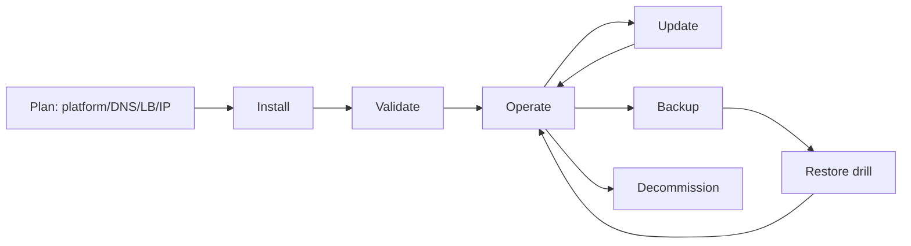
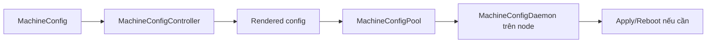
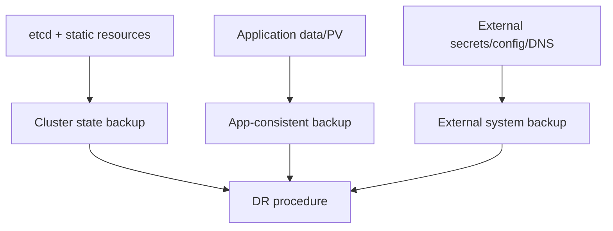

# OpenShift Cluster Lifecycle dành cho người vận hành

## 1. Phạm vi

Bài này dành cho cluster administrator: cài đặt, health, node, update, backup và recovery. Các thao tác có thể làm mất cluster; chỉ thực hành trên cluster lab có snapshot và đúng tài liệu release/platform.

## 2. Vòng đời cluster



## 3. Lập kế hoạch và cài đặt

Trước cài:

- chọn release/channel và platform được hỗ trợ;
- thiết kế DNS cho API và wildcard apps;
- load balancer, IP/VIP, firewall, proxy/NTP;
- machine sizing và failure domain;
- storage class mặc định và registry storage;
- connected/disconnected registry strategy;
- pull secret, SSH key và nơi lưu installer state an toàn;
- recovery objective và backup location.

Các installer phổ biến: Assisted, IPI, UPI và Agent-based. Không trộn hướng dẫn giữa platform/release. Giữ `metadata.json`, auth/kubeconfig và installer logs như dữ liệu nhạy cảm.

Sau cài:

```bash
oc get clusterversion
oc get clusteroperators
oc get nodes
oc get machineconfigpools
oc get csr
oc get pods -A | grep -v -E 'Running|Completed'
```

Cluster ổn định khi các Cluster Operator cần thiết Available, không Degraded, không Progressing kéo dài; node Ready; MCP Updated và không Degraded.

## 4. Machine Config Operator

MCO quản lý OS/config của RHCOS qua MachineConfig và MachineConfigPool. Thay đổi có thể cordon, drain và reboot node.



```bash
oc get machineconfig
oc get machineconfigpool
oc describe machineconfigpool worker
oc get nodes -l node-role.kubernetes.io/worker
```

Không SSH và sửa lâu dài từng RHCOS node; thay đổi sẽ drift hoặc bị MCO ghi đè. Dùng MachineConfig/KubeletConfig/ContainerRuntimeConfig API đúng mục đích và thử trên pool canary trước.

## 5. Node maintenance

```bash
oc adm cordon <NODE>
oc adm drain <NODE> --ignore-daemonsets --delete-emptydir-data
# bảo trì theo runbook
oc adm uncordon <NODE>
```

Đọc PDB trước khi drain. Không dùng cờ cưỡng chế để vượt PDB khi chưa hiểu ảnh hưởng. Kiểm tra workload phân bố lại, volume detach/attach và node Ready sau bảo trì.

## 6. Update cluster

CVO điều phối update payload và Cluster Operators; MCO cập nhật node/RHCOS. Quy trình:

1. Đọc release notes, known issues, compatibility Operator/storage/network.
2. Cluster phải healthy; giải quyết Degraded/Progressing kéo dài.
3. Có backup và kế hoạch quay lại được support.
4. Chọn channel/update graph được hỗ trợ, không nhảy version tùy ý.
5. Theo dõi ClusterVersion, ClusterOperators và MCP trong suốt update.
6. Chạy smoke test ứng dụng sau update.

```bash
oc adm upgrade
oc get clusterversion -o yaml
oc get clusteroperators
oc get machineconfigpools
```

Không nâng RPM thủ công trên RHCOS và không ép update khi graph không cung cấp edge nếu chưa theo quy trình support chính thức.

## 7. Certificate

OpenShift quản lý nhiều certificate tự động nhưng administrator vẫn phải theo dõi certificate custom: API, ingress, registry, external identity/provider và application Route. Kiểm tra owner, expiration, rotation procedure và trust chain. Không thay certificate bằng cách sửa Secret ngẫu nhiên; dùng procedure của đúng component.

```bash
openssl s_client -connect <HOST>:443 -servername <HOST> </dev/null
```

## 8. Backup và disaster recovery

Backup control plane/etcd không thay backup dữ liệu ứng dụng trong PV/database. Cần cả hai.



Thực hiện cluster backup bằng script/procedure do Red Hat cung cấp đúng release. Lưu archive và static pod resources ở vị trí mã hóa ngoài cluster. Restore etcd là recovery operation nghiêm trọng; diễn tập trên cluster lab và đo RTO/RPO.

Checklist restore drill:

- [ ] Backup có timestamp/checksum và lưu ngoài failure domain.
- [ ] Có đúng release binary/procedure.
- [ ] Khôi phục API/etcd thành công.
- [ ] Cluster Operators/MCP trở lại healthy.
- [ ] Secret, Route và workload object tồn tại.
- [ ] Dữ liệu ứng dụng được restore bằng quy trình riêng.
- [ ] Smoke test và DNS/external integration hoạt động.

## 9. Capacity và performance

Theo dõi CPU/RAM/node, API latency, etcd size/latency, Pod density, storage latency/IOPS, ingress throughput và quota. Requests sai làm scheduler/capacity plan sai; limits quá thấp tạo throttling/OOM. Thử tải trước production và dùng sizing guide cho release/platform.

## 10. Lab an toàn trong một tuần

1. Dựng OpenShift Local hoặc cluster dùng Assisted Installer nếu có hạ tầng.
2. Ghi baseline health bằng `clusterversion`, `clusteroperators`, MCP và nodes.
3. Tạo một MachineConfigPool canary nếu topology lab hỗ trợ; không thử trên cluster một node nếu thay đổi có thể làm mất cluster.
4. Cordon/drain/uncordon worker lab và xác nhận PDB.
5. Xem danh sách update nhưng không update nếu không có snapshot/thời gian.
6. Thực hiện backup theo tài liệu release; kiểm tra file/checksum.
7. Viết runbook restore; thực hành restore chỉ trên cluster dùng để phá bỏ.

## 11. Tài liệu và ảnh

- [OpenShift Installation 4.20](https://docs.redhat.com/en/documentation/openshift_container_platform/4.20/html/installation_overview/)
- [OpenShift Updating clusters 4.20](https://docs.redhat.com/en/documentation/openshift_container_platform/4.20/html/updating_clusters/)
- [Machine configuration 4.20](https://docs.redhat.com/en/documentation/openshift_container_platform/4.20/html/machine_configuration/)
- [OpenShift backup and restore](https://docs.redhat.com/en/documentation/openshift_container_platform/4.20/html/backup_and_restore/)
- Ảnh nên lấy: Cluster Settings/update graph, MachineConfigPool status, node maintenance timeline và sơ đồ lifecycle Mermaid ở trên.

