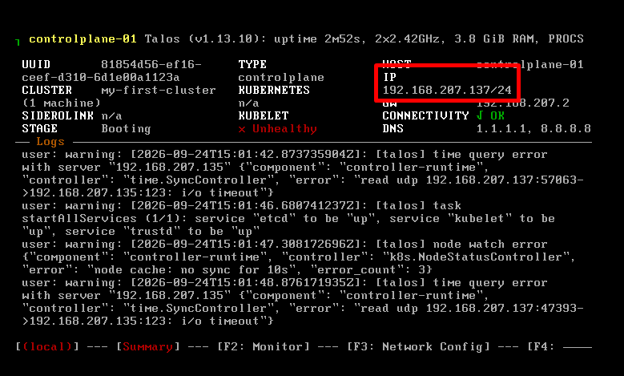

# Install Talos
## 0. Tải bản mới nhất
```bash
curl -sL https://talos.dev/install | sh
```
```bash
# Download the ISO image
curl -L -O https://github.com/siderolabs/talos/releases/latest/download/metal-amd64.iso
```
## 1. Tải lại ISO và talosctl đúng phiên bản 1.13.10

Thực hiện trên máy Ubuntu/bastion Linux amd64. Dùng cùng phiên bản `v1.13.10` cho ISO và `talosctl` để tránh sinh cấu hình mới hơn phiên bản node. Nguồn tải: [Talos v1.13.10](https://github.com/siderolabs/talos/releases/tag/v1.13.10).

### 1.1. Xóa ISO cũ và tải lại

Vào đúng thư mục chứa ISO đã tải trước đó (ví dụ `cd ~` nếu file ở thư mục home), kiểm tra rồi xóa đúng file:

```bash
pwd
ls -lh ./metal-amd64.iso
rm -i -- ./metal-amd64.iso
```

Trả lời `y` để xóa. Nếu file đã bị xóa thì bỏ qua bước này. Đây chỉ là xóa file ISO trên bastion, không xóa Talos trên ổ đĩa VM và không xóa các file cấu hình/secrets.

Tải lại bằng URL cố định phiên bản, không dùng `/latest/`:

```bash
mkdir -p ~/talos-downloads/v1.13.10
cd ~/talos-downloads/v1.13.10
curl -fL --retry 3 -o metal-amd64-v1.13.10.iso \
  https://github.com/siderolabs/talos/releases/download/v1.13.10/metal-amd64.iso
```

Chỉ sử dụng ISO sau khi `curl` hoàn tất thành công. Khi cài VM mới, chọn file `metal-amd64-v1.13.10.iso` cho ổ CD/DVD của VM. Tải lại ISO không tự thay đổi phiên bản node đã cài.

### 1.2. Thay talosctl bằng bản 1.13.10

Tải thành công trước rồi cài đè binary cũ tại `/usr/local/bin/talosctl`; không cần xóa binary đang dùng trước khi tải:

```bash
curl -fL --retry 3 -o talosctl-linux-amd64 \
  https://github.com/siderolabs/talos/releases/download/v1.13.10/talosctl-linux-amd64
# Chỉ chạy các lệnh sau khi tải thành công
sudo install -m 0755 talosctl-linux-amd64 /usr/local/bin/talosctl
hash -r
type -a talosctl
talosctl version --client
```

Kết quả Client phải là `v1.13.10`. Nếu vẫn hiện bản khác, kiểm tra `type -a talosctl` để biết binary/alias nào đang được ưu tiên; thử `/usr/local/bin/talosctl version --client`.

Kiểm tra phiên bản node mới đang ở maintenance mode:

```bash
talosctl version --insecure --nodes 192.168.207.137
```

Nếu node đã nhận cấu hình và yêu cầu chứng chỉ, dùng `talosconfig` của đúng cụm:

```bash
talosctl --talosconfig ~/talos-new/talosconfig \
  --endpoints 192.168.207.137 --nodes 192.168.207.137 version
```

Việc thay binary không chuyển đổi file `controlplane.yaml` đã tạo. Nếu file chứa `DiscoveryServiceConfig` của Talos 1.14 mà node là 1.13, hãy dùng lại bộ cấu hình 1.13 tương ứng. Chỉ sinh bộ cấu hình/secrets mới khi tạo cụm mới; với cụm cần giữ, phải giữ lại secrets và thông tin xác thực ban đầu.

### 1.3. Cài kubectl

- You also need `kubectl`
```bash
# On Linux
curl -LO "https://dl.k8s.io/release/$(curl -L -s https://dl.k8s.io/release/stable.txt)/bin/linux/amd64/kubectl"
chmod +x kubectl
sudo mv kubectl /usr/local/bin/
```
## 2. Generating Your Cluster Configuration
- This is where Talos differs from other approaches. Instead of running an installer on the node, you generate a configuration on your workstation and push it to the node.



```bash
talosctl gen config my-first-cluster https://192.168.207.137:6443 --install-disk /dev/vda --output-dir ./talos-new
```

- `talosctl gen config` thì chưa cài Talos lên ổ đĩa hay tạo cluster.** Lệnh này chỉ tạo 3 file trong thư mục hiện tại: `controlplane.yaml`, `worker.yaml`, `talosconfig`. Tham số `--install-disk /dev/vda` chỉ ghi lựa chọn ổ cài vào cấu hình. [Tài liệu Talos](https://www.talos.dev/latest/reference/cli/)

Bạn có thể xử lý như sau:

**1. Giữ nguyên để dùng tiếp**

Nếu IP và ổ `/dev/vda` đúng, giữ các file này để thực hiện bước `apply-config`.

**2. Tạo bộ cấu hình khác, giữ bộ cũ**

Xuất sang thư mục mới để tránh ghi đè:

```bash
talosctl gen config my-first-cluster https://192.168.1.50:6443 --install-disk /dev/vda --output-dir ./talos-new
```

Lệnh trên tạo **bộ secrets mới**. Nếu cụm đã chạy và bạn muốn thêm node, hãy dùng cấu hình/secrets của cụm cũ.

**3. Xóa bộ file vừa tạo**

Chỉ thực hiện nếu đây là các file vừa tạo thử, chưa dùng cho cụm cần giữ. Chạy tại đúng thư mục chứa chúng.

Trên Linux/Bash:

```bash
sudo rm -rf controlplane.yaml worker.yaml talosconfig
```

This produces three files:

- `controlplane.yaml` - configuration for control plane nodes
- `worker.yaml` - configuration for worker nodes
- `talosconfig` - configuration for the talosctl client

For a single-node cluster, you only need `controlplane.yaml`.
## 3. Cho phép ứng dụng chạy trên node control plane
- Đoạn này dùng để cho phép chạy ứng dụng trên node control-plane, phù hợp khi cluster của bạn chỉ có 1 node vừa quản lý cụm vừa chạy workload.
```bash
# Create a patch file: allow-scheduling.yaml
cluster:
  allowSchedulingOnControlPlanes: true
```

Đây là file patch: một phần cấu hình sẽ được ghép vào cấu hình Talos đầy đủ.
- cluster: nhóm cấu hình cấp cluster.
- allowSchedulingOnControlPlanes: true: cho phép Kubernetes lập lịch Pod ứng dụng lên các node control-plane.
Nếu không bật, một cụm chỉ có control-plane có thể khiến Pod ứng dụng nằm ở trạng thái Pending vì không có node phù hợp để chạy.

- Regenerate the config with this patch:
```bash
# Regenerate with the scheduling patch
talosctl gen config my-first-cluster https://192.168.1.50:6443 \
  --install-disk /dev/vda \
  --config-patch @allow-scheduling.yaml
```

| Thành phần | Ý nghĩa |
|---|---|
| `talosctl gen config` | Sinh các file cấu hình Talos |
| `my-first-cluster` | Tên cluster |
| `https://192.168.1.50:6443` | Địa chỉ Kubernetes API của cụm |
| `--install-disk /dev/vda` | Chọn ổ cài Talos khi cấu hình được áp dụng |
| `--config-patch @allow-scheduling.yaml` | Đọc file patch và ghép vào cấu hình được sinh |
| `\` | Nối dòng lệnh trong Bash; PowerShell không dùng ký tự này để nối dòng |

## 3. CNI: None
- Vào controlplane chỉnh sửa: network của cluster là CNI (Container Network Interface là None)
```bash
cluster:
  network:
    cni:
      name: none
```
- Tra cứu tham khảo [link](https://docs.siderolabs.com/talos/v1.13/reference/configuration/v1alpha1/config)
```bash
apiVersion: v1alpha1
kind: HostnameConfig
hostname: controlplane-01
---
apiVersion: v1alpha1
kind: LinkConfig
name: ens33
up: true
addresses:
  - address: 192.168.207.133/24
routes:
  - destination: 0.0.0.0/0
    gateway: 192.168.207.2
---
apiVersion: v1alpha1
kind: ResolverConfig
nameservers:
  - address: 1.1.1.1
  - address: 8.8.8.8
---
apiVersion: v1alpha1
kind: TimeSyncConfig
enabled: true
ntp:
  servers:
    - <IP_MAY_CHU_NTP>
```
### Cài Chrony trên bastion để phục vụ NTP cho Talos

Trong lab này, bastion Ubuntu có IP `192.168.207.138`, node Talos có IP `192.168.207.137`, cùng mạng `192.168.207.0/24`. Bastion lấy giờ từ nguồn thời gian bên ngoài rồi phục vụ NTP cho các node Talos. Thực hiện các bước cài dịch vụ dưới đây trên bastion.

**1. Cài Chrony**

```bash
sudo apt update
sudo apt install -y chrony
```

**2. Cho phép mạng lab truy vấn NTP**

```bash
sudo nano /etc/chrony/chrony.conf
```

Giữ nguyên các nguồn thời gian mặc định của Ubuntu, thêm dòng sau nếu chưa có:

```conf
allow 192.168.207.0/24
```

Lưu bằng `Ctrl+O`, `Enter`, rồi thoát bằng `Ctrl+X`. Bật dịch vụ và nạp lại cấu hình:

```bash
sudo systemctl enable --now chrony
sudo systemctl restart chrony
```

**3. Mở firewall nếu UFW đang bật**

```bash
sudo ufw status
```

Nếu kết quả là `Status: active`, cho phép NTP từ mạng lab:

```bash
sudo ufw allow from 192.168.207.0/24 to any port 123 proto udp
```

Nếu UFW chưa bật hoặc chưa cài, bỏ qua bước này. Nếu có firewall khác giữa các máy, cũng cần cho phép UDP 123 từ Talos tới bastion.

**4. Kiểm tra Chrony trên bastion**

```bash
sudo systemctl status chrony --no-pager
sudo ss -lunp | grep ':123'
chronyc sources -v
chronyc tracking
```

Kết quả mong đợi:

- Dịch vụ `chrony` ở trạng thái `active (running)`.
- UDP 123 lắng nghe trên địa chỉ mạng của bastion hoặc địa chỉ wildcard, không chỉ localhost.
- `chronyc sources -v` có nguồn được chọn với dấu `^*`.
- `chronyc tracking` có `Leap status: Normal`.

Đồng bộ lần đầu có thể cần chờ một lúc. Nếu các nguồn đều hiện `^?` và tracking báo chưa đồng bộ, kiểm tra DNS và kết nối từ bastion tới các máy chủ thời gian đã cấu hình.

**5. Trỏ Talos tới bastion và kiểm tra**

Trong file cấu hình node, sửa khối `TimeSyncConfig` hiện có thành khối sau; không thêm một khối trùng:

```yaml
---
apiVersion: v1alpha1
kind: TimeSyncConfig
enabled: true
ntp:
  servers:
    - 192.168.207.138
```

Với node mới, áp dụng file cấu hình đầy đủ ở bước 4 bên dưới. Với node đã cấu hình nhưng cần đổi máy chủ NTP, áp dụng bằng thông tin xác thực của đúng cụm (điều chỉnh đường dẫn file nếu khác):

```bash
talosctl --talosconfig ~/talos-new/talosconfig \
  --endpoints 192.168.207.137 --nodes 192.168.207.137 \
  apply-config --file ~/talos-new/controlplane.yaml
```

Nếu Talos đã trỏ tới `192.168.207.138`, không cần apply lại hoặc reboot chỉ vì vừa cài Chrony; Talos sẽ tiếp tục thử đồng bộ. Kiểm tra từ bastion:

```bash
talosctl --talosconfig ~/talos-new/talosconfig \
  --endpoints 192.168.207.137 --nodes 192.168.207.137 \
  get timestatus -o yaml
```

Trong `spec`, cần thấy `synced: true` và `syncDisabled: false`. Lỗi `time.SyncController ... 192.168.207.138:123 ... connection refused` cho biết truy vấn NTP bị từ chối; kiểm tra lại dịch vụ, cổng lắng nghe và firewall trên bastion.

Tham khảo: [Ubuntu — phục vụ NTP bằng Chrony](https://documentation.ubuntu.com/server/how-to/networking/serve-ntp-with-chrony/index.html), [Talos 1.13 — TimeSyncConfig](https://docs.siderolabs.com/talos/v1.13/reference/configuration/network/timesyncconfig).

## 4. Applying the Configuration
```bash
# Apply the control plane config to the node
# Use --insecure because the node does not have TLS set up yet
talosctl apply-config --insecure \
  --nodes 192.168.207.137\
  --file controlplane.yaml
```
- The node will reboot, install Talos to the disk, and come back up with the configuration applied. This takes a couple of minutes.
## 5. Setting Up talosctl
```bash
# Tell talosctl where to find the cluster
export TALOSCONFIG="talosconfig"
talosctl config endpoint 192.168.207.137
talosctl config node 192.168.207.137
```
## 6. Bootstrapping Kubernetes
```bash
# Bootstrap Kubernetes - only run this once
talosctl bootstrap
```
- Watch the progress:
```bash
# Watch the services come up
talosctl services

# Check the health of the cluster
talosctl health
```
## 7. Getting Kubeconfig
```bash
# Download the kubeconfig to your local machine
talosctl kubeconfig
```

```bash
# Check that the node is ready
kubectl get nodes

# You should see something like:
# NAME          STATUS   ROLES           AGE   VERSION
# talos-node1   Ready    control-plane   5m    v1.29.x
```
## 8. Deploy your first work load
```bash
# Create a simple nginx deployment
kubectl create deployment nginx --image=nginx:latest

# Expose it as a service
kubectl expose deployment nginx --port=80 --type=NodePort

# Check the pod is running
kubectl get pods

# Find the NodePort assigned
kubectl get svc nginx
```

## Một số lỗi bị gặp phải
Chốt lại bằng **hai tình huống khác nhau**. Điểm dễ nhầm nhất là: `talosconfig` dùng để quản lý **Talos OS**, còn `kubeconfig` dùng để truy cập **Kubernetes API**. Đổi IP không đồng nghĩa với đổi CA; tạo cluster mới thì CA có thể đã đổi.

## A. Vẫn là cluster cũ, chỉ đổi IP control plane `.134` → `.133`

Làm theo thứ tự:

1. **Đổi IP trên node Talos** và xác nhận Ubuntu kết nối được tới IP mới:

   ```bash
   talosctl -e 192.168.207.133 -n 192.168.207.133 version
   ```

2. **Sửa endpoint Kubernetes trong machine config của Talos** thành `https://192.168.207.133:6443`. Nếu node đã kết nối được, dùng strategic merge patch:

   ```bash
   talosctl -e 192.168.207.133 -n 192.168.207.133 \
     patch machineconfig \
     -p 'cluster:
     controlPlane:
       endpoint: https://192.168.207.133:6443'
   ```

   Nếu bạn sửa và áp dụng lại toàn bộ `controlplane.yaml`, file phải chứa **đầy đủ cấu hình cần giữ**; `apply-config --file` có thể loại bỏ mục cũ không còn trong file. Với machine config nhiều tài liệu, dùng strategic merge patch như trên, không dùng JSON Patch. ([www.talos.dev][1])

3. **Sửa `talosconfig` trên máy Ubuntu** để `talosctl` gọi IP mới:

   ```bash
   talosctl config endpoint 192.168.207.133
   talosctl config node 192.168.207.133
   talosctl config info
   ```

4. **Sửa URL trong kubeconfig** vì CA vẫn là CA của *cùng cluster*:

   ```bash
   CLUSTER_NAME=$(kubectl config view --minify -o jsonpath='{.clusters[0].name}')
   kubectl config set-cluster "$CLUSTER_NAME" \
     --server=https://192.168.207.133:6443

   kubectl get nodes -o wide
   ```

Nếu bạn **đổi cả hostname**, Kubernetes có thể tạo Node object tên mới. Khi node mới đã `Ready`, xóa *Node object cũ* đang `NotReady` bằng `kubectl delete node <tên-cũ>`. ([www.talos.dev][2])

## B. Bạn tạo cluster mới, ví dụ cluster ở `.137`

**Không lấy kubeconfig cũ rồi chỉ đổi `server` sang `.137`.** File cũ vẫn chứa CA và chứng chỉ của cluster trước, chính là nguyên nhân lỗi `x509: certificate signed by unknown authority` bạn vừa gặp.

Lấy kubeconfig **từ cluster mới**, kiểm tra bằng file riêng trước:

```bash
cd ~/talos-new

talosctl --talosconfig ./talosconfig \
  -e 192.168.207.137 -n 192.168.207.137 \
  kubeconfig ./kubeconfig-new --merge=false

kubectl --kubeconfig ./kubeconfig-new get nodes -o wide
```

Nếu chạy được, dùng file đó:

```bash
export KUBECONFIG="$HOME/talos-new/kubeconfig-new"
kubectl get nodes
kubectl get pods -A
```

`talosctl kubeconfig` tải cấu hình admin từ node Talos, gồm CA và thông tin xác thực tương ứng với cluster ấy. ([www.talos.dev][3])


