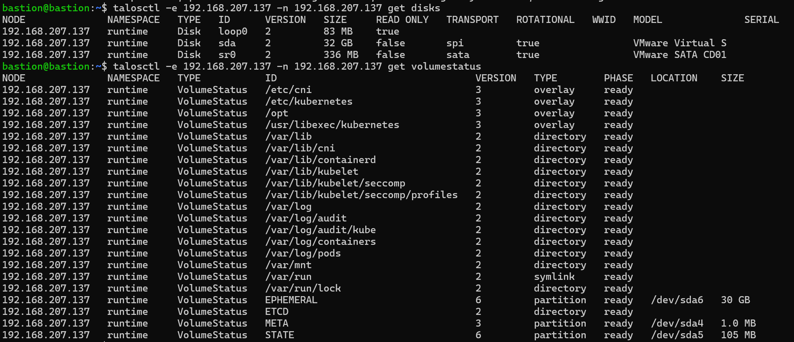
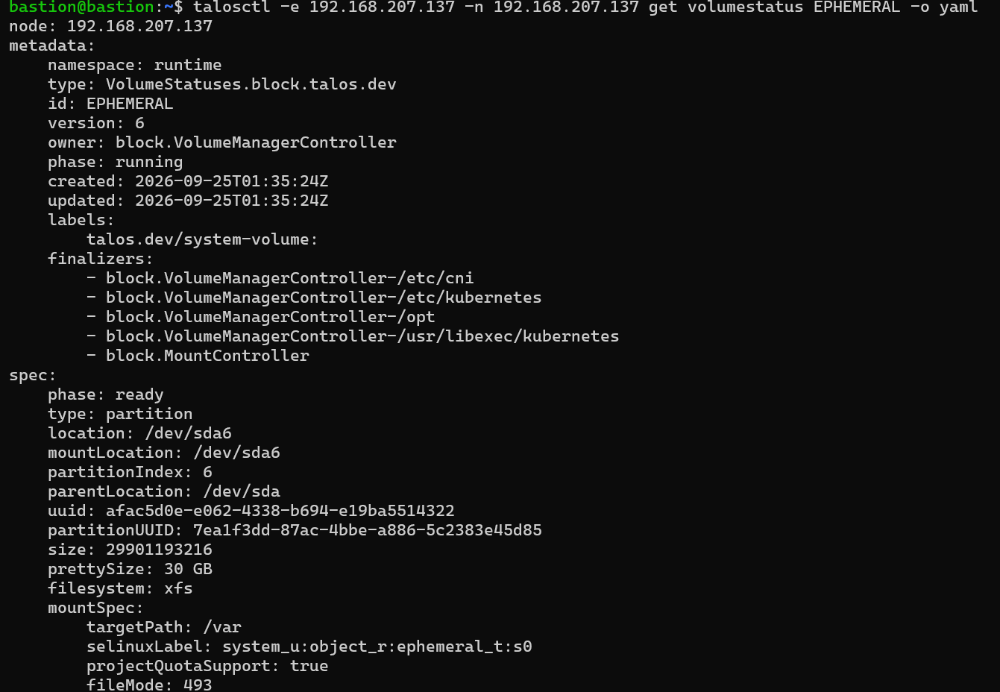

# Sổ tay lệnh `talosctl` (Talos Linux v1.13)

Tài liệu này dành cho `talosctl` v1.13, phù hợp với lab v1.13.10 trong [01.InstallTalos.md](./01.InstallTalos.md). Các ví dụ dùng Bash trên máy quản trị; thay IP, đường dẫn và phiên bản theo cụm của bạn. Không dùng lệnh `kubectl` trong tài liệu này. Danh sách tùy chọn đầy đủ của từng lệnh nằm ở [CLI reference v1.13](https://docs.siderolabs.com/talos/v1.13/reference/cli); trên máy có thể xem `talosctl <lệnh> --help` vì cú pháp có thể đổi theo phiên bản.

## 1. Chuẩn bị kết nối

`talosconfig` chứa chứng chỉ để **quản trị Talos**; `controlplane.yaml` và `worker.yaml` là cấu hình máy và chứa secrets của cụm. Giữ chúng an toàn. `-e`/`--endpoints` là Talos API endpoint (thường là control-plane); `-n`/`--nodes` là node đích. Endpoint cần thuộc **cùng cụm** với node đích. Cổng Talos API thường là TCP 50000, còn URL `https://...:6443` khi sinh config là Kubernetes API. [Nguồn: talosctl](https://docs.siderolabs.com/talos/v1.13/learn-more/talosctl), [CLI reference](https://docs.siderolabs.com/talos/v1.13/reference/cli).

```bash
# Mỗi phiên shell, nếu talosconfig nằm trong thư mục lab
export TALOSCONFIG="$HOME/talos-new/talosconfig"

# Xem context/endpoint đang dùng; sửa talosconfig hiện tại
talosctl config contexts
talosctl config info
talosctl config endpoint 192.168.207.137
talosctl config node 192.168.207.137

# Mẫu gọi rõ endpoint và node, tránh nhầm cụm
talosctl -e 192.168.207.137 -n 192.168.207.137 version

# Hoặc chỉ rõ file trong từng lệnh
talosctl --talosconfig ./talosconfig -e 192.168.207.137 -n 192.168.207.137 version
```

Có thể dùng `talosctl config context <tên>`, `talosctl config add <file>`, `talosctl config merge <file>`, `talosctl config remove <tên>` để quản lý nhiều context. Xem `talosctl config --help` trước khi sửa hoặc xóa context. Trong các đoạn dưới, giả sử đã đặt `TALOSCONFIG` và endpoint; thay `192.168.207.137` bằng IP node cần kiểm tra.

## 2. Phiên bản, trạng thái và dashboard

```bash
talosctl version --client                         # Phiên bản binary talosctl trên máy quản trị
talosctl -n 192.168.207.137 version              # Phiên bản client và Talos trên node
talosctl --insecure -n 192.168.207.137 version   # Chỉ khi node mới ở maintenance mode
talosctl -n 192.168.207.137 health               # Kiểm tra sức khỏe cụm
talosctl -n 192.168.207.137 dashboard            # Màn hình theo dõi tương tác
talosctl -n 192.168.207.137 time                 # Giờ của node
talosctl -n 192.168.207.137 events               # Theo dõi runtime events
```

`--insecure` chỉ dùng khi node chưa nhận machine config/chứng chỉ, đặc biệt cho lần `apply-config` đầu. Không cần cờ này với node đang vận hành bình thường. [Nguồn: CLI reference](https://docs.siderolabs.com/talos/v1.13/reference/cli).

## 3. Tra cứu tài nguyên Talos (`get`)

`get` đọc tài nguyên của Talos OS, không phải danh sách tài nguyên Kubernetes. Alias và loại resource có thể thay đổi; bắt đầu bằng `get rd` để biết node hỗ trợ gì. `-o yaml` cho chi tiết, `-w` theo dõi thay đổi. [Nguồn: Controllers and Resources](https://docs.siderolabs.com/talos/v1.13/learn-more/controllers-resources).

```bash
talosctl -n 192.168.207.137 get rd                  # Danh sách resource definitions
talosctl -n 192.168.207.137 get namespaces          # Các namespace nội bộ Talos
talosctl -n 192.168.207.137 get machines             # Thông tin machine
talosctl -n 192.168.207.137 get members              # Thành viên Talos được phát hiện
talosctl -n 192.168.207.137 get services             # Trạng thái dịch vụ dưới dạng resource
talosctl -n 192.168.207.137 get services -w          # Theo dõi thay đổi dịch vụ
talosctl -n 192.168.207.137 get disks                # Ổ đĩa; hữu ích trước khi chọn install.disk
talosctl -n 192.168.207.137 get links                # Liên kết mạng
talosctl -n 192.168.207.137 get addresses            # Địa chỉ mạng
talosctl -n 192.168.207.137 get routes               # Route
talosctl -n 192.168.207.137 get resolvers            # DNS resolver
talosctl -n 192.168.207.137 get timestatus -o yaml  # Đồng bộ thời gian/NTP
talosctl -n 192.168.207.137 get machineconfig v1alpha1 -o yaml

# Node mới ở maintenance mode: một số resource đã truy vấn được
talosctl --insecure -n 192.168.207.140 get disks
```

`get machineconfig ... -o yaml` có thể lộ secrets; tránh dán đầu ra vào ticket công khai. Nếu một alias không tồn tại trên bản Talos của bạn, dùng `get rd` để tìm tên resource tương ứng.

## 4. Dịch vụ, log và sự cố khởi động

Lệnh **`service`** xem/điều khiển dịch vụ; `get services` xem resource. `logs <tên>` xem log Talos service; với container, tên có thể lấy từ `containers`. [Nguồn: CLI reference](https://docs.siderolabs.com/talos/v1.13/reference/cli).

```bash
talosctl -n 192.168.207.137 service                   # Danh sách và trạng thái dịch vụ
talosctl -n 192.168.207.137 service kubelet            # Một dịch vụ
talosctl -n 192.168.207.137 logs kubelet              # Log kubelet
talosctl -n 192.168.207.137 logs etcd                 # Log etcd trên control-plane
talosctl -n 192.168.207.137 logs machined             # Log Talos machine daemon
talosctl -n 192.168.207.137 logs controller-runtime   # Log bộ điều khiển Talos
talosctl -n 192.168.207.137 logs kubelet --follow     # Xem liên tục
talosctl -n 192.168.207.137 dmesg                     # Kernel ring buffer
talosctl -n 192.168.207.137 dmesg --follow
talosctl -n 192.168.207.137 containers                # Container theo namespace/runtime
talosctl -n 192.168.207.137 stats                     # Thống kê container
talosctl -n 192.168.207.137 processes                 # Process trên node
talosctl -n 192.168.207.137 support                   # Thu thập gói thông tin hỗ trợ
```

Nếu cần xem log container, chạy `talosctl logs <tên-container> --help` để chọn cờ namespace/runtime đúng phiên bản. `support` có thể thu thập dữ liệu vận hành nhạy cảm; kiểm tra gói trước khi chia sẻ. Xem thêm [Troubleshooting](https://docs.siderolabs.com/talos/v1.13/troubleshooting/troubleshooting).

## 5. Mạng, ổ đĩa, tài nguyên và file trên node

Talos không cung cấp shell/SSH kiểu Linux thông thường. Các lệnh sau đọc trạng thái qua Talos API. `read`, `list`, `copy` chỉ làm việc với đường dẫn mà API cho phép truy cập; chúng không thay thế quyền truy cập tùy ý vào hệ thống file. [Nguồn: CLI reference](https://docs.siderolabs.com/talos/v1.13/reference/cli).

```bash
talosctl -n 192.168.207.137 netstat                  # Socket/kết nối mạng
talosctl -n 192.168.207.137 mounts                   # Filesystem đang mount
talosctl -n 192.168.207.137 memory                   # RAM
talosctl -n 192.168.207.137 cgroups                  # Sử dụng cgroups v2
talosctl -n 192.168.207.137 cgroups --preset cpu
talosctl -n 192.168.207.137 usage /                  # Dung lượng theo đường dẫn
talosctl -n 192.168.207.137 list /var                # Liệt kê thư mục được phép
talosctl -n 192.168.207.137 read /proc/meminfo      # Đọc file được phép
talosctl -n 192.168.207.137 image list              # Image trong container runtime
talosctl -n 192.168.207.137 pcap --help             # Bắt gói; cần chọn interface/output
talosctl -n 192.168.207.137 inspect dependencies --help
```

Với vấn đề mạng, bắt đầu từ `get links`, `get addresses`, `get routes`, `get resolvers`, `netstat`, rồi mới dùng `pcap`. Xem [Networking Resources](https://docs.siderolabs.com/talos/v1.13/learn-more/networking-resources).

## 6. Sinh và kiểm tra cấu hình trước khi cài

`gen config` tạo file ở máy quản trị; **chưa cài node**. Ví dụ dưới tạo một cụm **mới**, lưu `controlplane.yaml`, `worker.yaml` và `talosconfig` vào thư mục riêng. `--install-disk /dev/vda` được ghi vào cấu hình; kiểm tra ổ thực tế bằng `get disks` trước khi `apply-config`. [Nguồn: Getting Started](https://docs.siderolabs.com/talos/v1.13/getting-started/getting-started), [Reproducible Machine Configuration](https://docs.siderolabs.com/talos/v1.13/configure-your-talos-cluster/system-configuration/reproducible-machine-configuration).

```bash
talosctl gen config my-first-cluster https://192.168.207.137:6443 \
  --install-disk /dev/vda --output-dir ./talos-new

talosctl validate --config ./talos-new/controlplane.yaml --mode metal
talosctl validate --config ./talos-new/worker.yaml --mode metal

# Tạo secrets một lần cho cụm mới; lưu bảo mật để có thể tái sinh cấu hình
talosctl gen secrets -o secrets.yaml
talosctl gen config my-first-cluster https://192.168.207.137:6443 \
  --with-secrets ./secrets.yaml --install-disk /dev/vda \
  --talos-version v1.13.10 --output-dir ./talos-from-secrets
```

Hai lần `gen config` trên là **hai ví dụ độc lập**; dùng một trong hai cách khi tạo cụm. Với cụm đã chạy, tái dùng secrets/config ban đầu. Sinh lại config không có `--with-secrets` sẽ tạo khóa mới và node mới không thể tham gia cụm cũ. Với quy trình lưu cấu hình lâu dài, cố định `--talos-version`, phiên bản Kubernetes và các patch như hướng dẫn chính thức.

## 7. Cài node, bootstrap, thêm node

```bash
# Node chưa cấu hình: áp dụng file đúng vai trò
talosctl apply-config --insecure -n 192.168.207.137 -f ./talos-new/controlplane.yaml
talosctl apply-config --insecure -n 192.168.207.140 -f ./talos-new/worker.yaml

# Chỉ một lần, trên một control-plane khi tạo cụm mới
talosctl -e 192.168.207.137 -n 192.168.207.137 bootstrap
talosctl -e 192.168.207.137 -n 192.168.207.137 health

# Xuất kubeconfig admin ra file riêng (không cần dùng kubectl ở đây)
talosctl -n 192.168.207.137 kubeconfig ./kubeconfig-talos --merge=false
```

Thêm worker/control-plane vào **cụm đang chạy**: boot Talos trên máy mới, lấy IP, dùng lại `worker.yaml` hoặc `controlplane.yaml` của đúng cụm, sửa hostname/IP/ổ cài riêng của node, rồi `apply-config --insecure`. **Không bootstrap lại**. [Nguồn: Scale up](https://docs.siderolabs.com/talos/v1.13/deploy-and-manage-workloads/scaling-up).

## 8. Đọc, sửa và áp dụng machine config của node đang chạy

```bash
talosctl -n 192.168.207.137 get machineconfig v1alpha1 -o yaml
talosctl -n 192.168.207.137 edit machineconfig
talosctl -n 192.168.207.137 patch machineconfig -p @allow-scheduling.yaml
talosctl -n 192.168.207.137 apply-config --dry-run -f ./controlplane.yaml
talosctl -n 192.168.207.137 apply-config -f ./controlplane.yaml
```

Ví dụ `allow-scheduling.yaml`:

```yaml
cluster:
  allowSchedulingOnControlPlanes: true
```

`patch machineconfig` áp dụng một thay đổi nhỏ; `apply-config` gửi **cả file đầy đủ**, có thể bỏ các thiết lập đang chạy nếu file đã cũ. Dùng `--dry-run` để xem loại thay đổi (áp dụng ngay/reboot) trước khi thực hiện. Với sửa mạng, xem `apply-config --mode try` và `--timeout` để tự hoàn tác nếu mất kết nối. Không lưu `machineconfig` chứa secrets vào Git công khai. [Nguồn: Machine Configuration](https://docs.siderolabs.com/talos/v1.13/configure-your-talos-cluster/system-configuration/editing-machine-configuration), [CLI reference](https://docs.siderolabs.com/talos/v1.13/reference/cli).

## 9. etcd và bảo trì control-plane

```bash
talosctl -n 192.168.207.137 etcd members           # Thành viên etcd
talosctl -n 192.168.207.137 etcd status            # Trạng thái local etcd
talosctl -n 192.168.207.137 etcd alarm list       # Cảnh báo etcd
talosctl -n 192.168.207.137 etcd snapshot ./etcd.snapshot
```

Chụp snapshot đều đặn và cất ngoài node. `etcd defrag`, `etcd leave`, `etcd remove-member`, `etcd alarm disarm`, `etcd forfeit-leadership` là lệnh can thiệp cụm; đọc [Etcd Maintenance](https://docs.siderolabs.com/talos/v1.13/build-and-extend-talos/cluster-operations-and-maintenance/etcd-maintenance) và hướng dẫn khôi phục trước khi chạy. Không dùng `bootstrap` như cách sửa lỗi etcd thông thường.

## 10. Nâng cấp, reboot và lệnh phá hủy

```bash
# Kiểm tra phiên bản trước/sau nâng cấp
talosctl -n 192.168.207.137 version

# Ví dụ cú pháp; chọn image đúng kiến trúc, extensions và bản nâng cấp đã kiểm tra
talosctl -n 192.168.207.137 upgrade --image ghcr.io/siderolabs/installer:v1.13.10

# Nâng cấp Kubernetes là thao tác khác nâng cấp Talos
talosctl -n 192.168.207.137 upgrade-k8s --to <phien-ban-kubernetes>

talosctl -n 192.168.207.137 reboot
talosctl -n 192.168.207.137 shutdown
```

Nâng cấp từng control-plane, kiểm tra sức khỏe giữa các node và dùng image có cùng extensions với bản đang chạy. Xem [Upgrading Talos](https://docs.siderolabs.com/talos/v1.13/configure-your-talos-cluster/lifecycle-management/upgrading-talos) và [Upgrading Kubernetes](https://docs.siderolabs.com/talos/v1.13/configure-your-talos-cluster/lifecycle-management/upgrading-kubernetes) để chọn đường nâng cấp hợp lệ.

Các lệnh sau được liệt kê để **nhận biết**, không phải quy trình chạy thử trên cluster đang dùng:

| Lệnh | Tác động |
|---|---|
| `talosctl reset` | Gỡ node khỏi cụm, xóa trạng thái Talos; có thể làm mất dữ liệu trên node. |
| `talosctl wipe disk` | Xóa dữ liệu trên ổ được chỉ định. |
| `talosctl rollback` | Quay về image Talos trước nếu điều kiện cho phép. |
| `talosctl rotate-ca` | Xoay CA của Talos/Kubernetes; cần quy trình riêng. |
| `talosctl cluster destroy` | Chỉ dành cho cụm local do `talosctl cluster create` tạo, không phải lệnh xóa cluster VM/bare metal bất kỳ. |

Xem `talosctl <lệnh> --help` và [CLI reference](https://docs.siderolabs.com/talos/v1.13/reference/cli) trước khi dùng các lệnh trên.

## 11. Tra nhanh các lệnh khác

| Nhóm | Lệnh | Công dụng |
|---|---|---|
| Cấu hình client | `config`, `completion` | Context, endpoint, node mặc định và shell completion. |
| Tạo chứng chỉ | `gen ca`, `gen crt`, `gen csr`, `gen key`, `gen keypair`, `gen secrets` | Công cụ PKI; `gen secrets` cho cluster mới. |
| Cấu hình offline | `machineconfig gen`, `machineconfig patch`, `validate` | Tạo/patch/kiểm tra file cấu hình trên máy quản trị. |
| Runtime | `containers`, `stats`, `image list`, `image pull`, `image remove` | Xem container và quản lý image. |
| Chẩn đoán | `debug`, `inspect`, `support`, `pcap`, `dmesg` | Điều tra lỗi và thu thập dữ liệu. |
| Hệ thống | `meta`, `service`, `restart`, `reboot`, `shutdown` | Metadata, dịch vụ và vòng đời node. |
| Cluster local | `cluster create`, `cluster show`, `cluster destroy` | Tạo/xem/xóa lab local trên Docker/QEMU. |

Để thấy **toàn bộ** lệnh và cờ đúng với binary đang cài:

```bash
talosctl --help
talosctl get --help
talosctl logs --help
talosctl etcd --help
talosctl image --help
talosctl config --help
```

Nguồn chính: [Sidero Labs CLI reference v1.13](https://docs.siderolabs.com/talos/v1.13/reference/cli), [talosctl overview](https://docs.siderolabs.com/talos/v1.13/learn-more/talosctl), [Controllers and Resources](https://docs.siderolabs.com/talos/v1.13/learn-more/controllers-resources), [Scaling up](https://docs.siderolabs.com/talos/v1.13/deploy-and-manage-workloads/scaling-up), [Reproducible Machine Configuration](https://docs.siderolabs.com/talos/v1.13/configure-your-talos-cluster/system-configuration/reproducible-machine-configuration).

## 12. Check dung lượng còn lại

`usage` liệt kê dung lượng theo từng thư mục con cấp 1 bên trong `/var`, đơn vị là **byte**:

| Thư mục | Byte | Quy đổi | Ghi chú |
|---|---|---|---|
| `lib` | 1,219,347,184 | ≈ 1.22 GB | `/var/lib` — chứa containerd, kubelet, cni... (chiếm nhiều nhất, dễ hiểu vì image/container nằm đây) |
| `log` | 18,105,870 | ≈ 18 MB | `/var/log` — log hệ thống, log pod |
| `system` | 59,792,220 | ≈ 60 MB | `/var/system` — dữ liệu nội bộ của Talos |
| `.` | 1,297,245,342 | ≈ 1.3 GB | **Tổng cộng của cả `/var`** (= tổng 3 dòng trên, cộng thêm phần lệch nhỏ do thư mục/inode) |

Dòng `.` chính là số bạn cần: **`/var` đang dùng khoảng 1.3 GB**.

## Tính ra còn bao nhiêu trống

```bash
talosctl -e 192.168.207.137 -n 192.168.207.137 disks
talosctl -e 192.168.207.137 -n 192.168.207.137 get volumestatus
talosctl -e 192.168.207.137 -n 192.168.207.137 get volumestatus EPHEMERAL -o yaml
```





Từ lệnh `get volumestatus` trước, volume `EPHEMERAL` (mount vào `/var`) có tổng dung lượng:

```
size: 29,901,193,216 byte ≈ 29.9 GB (pretty: 30 GB)
```

Vậy:

```
Đã dùng:  ~1.3 GB
Tổng:     ~29.9 GB
Còn trống: ~28.6 GB
% đã dùng: ~4.3%
```

