## Mục lục
- [1. Giới thiệu](#1-gioi-thieu)
  - [1.1. Tổng quan](#11-tong-quan)
  - [1.2. Mục tiêu](#12-muc-tieu)
- [2. Nội dung chính](#2-noi-dung-chinh)
  - [2.1. Phần một](#21-phan-mot)
  - [2.2. Phần hai](#22-phan-hai)

## 1. Khái quát về mô hình TCP/IP

### 1.1 TCP Definition
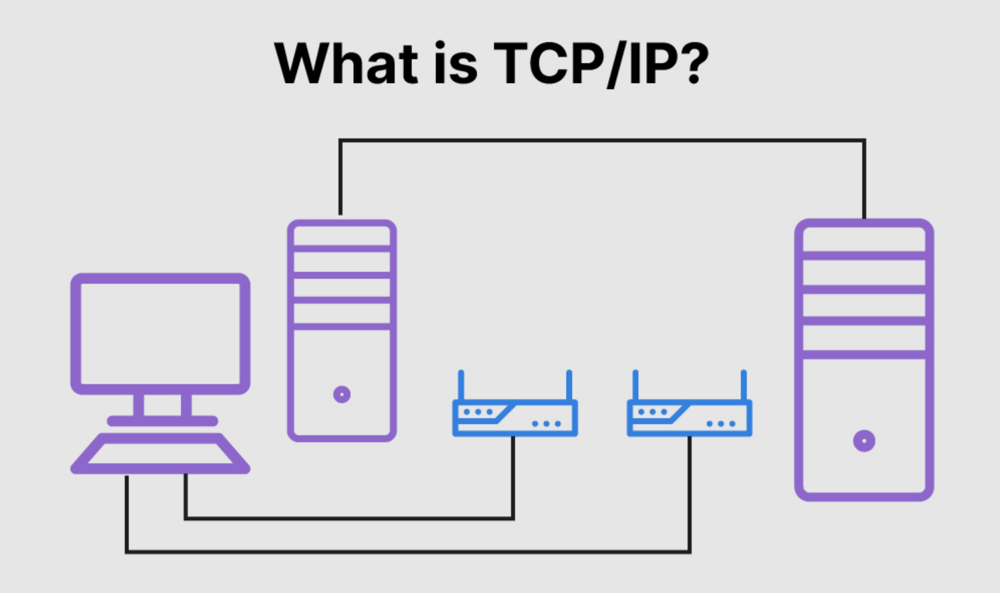
- TCP/IP(Transmission Control Protocol/ Internet Protocol): là một framework được sử dụng để mô hình quá trình giao tiếp trong một mạng máy tính hay tổ chức các giao thức truyền thông được sử dụng trên Internet và các bộ máy tính tương tự theo các tiêu chí, chức năng.
- Hai giao thức nền tảng của bộ giao thức là TCP và IP:
- TCP: là một tiêu chuẩn cộng đồng cho phép các chương trình ứng dụng và thiết bị máy tính trao đổi dữ liệu qua mạng. Giao thức này được thiết kế để truyền các gói dữ liệu trên Internet và đảm bảo dữ liệu được giao nhận thành công giữa các thiết bị trong mạng.
- TCP là một trong những giao thức cơ bản của Internet, được chuẩn hoá bởi tổ chức IETF (Internet engineering task force). Đây cũng là một trong những giao thức được sử dụng rộng rãi nhất trong các mạng truyền thông số với chức năng chính là đảm bảo chuyển dữ liệu đầu cuối end-to-end một cách đáng tin cậy.
- TCP tổ chức dữ liệu sao cho có thể truyền đi giữa máy chủ và máy khách, đồng thởi đảm bảo tính toàn vẹn của dữ liệu trong suốt quá trình truyền tải. Trước khi bắt đầu truyền, TCP thiết lập một kết nối giữa nguồn và đích, và duy trì kết nối này cho đến khi phiên giao tiếp kết thúc. Dữ liệu sẽ được chia nhỏ thành các gói tin packets, và TCP đảm bảo tất cả các gói tin này được truyền đi đầy đủ và đúng thứ tự.

- Hầu hết các giao thức cấp cao trong mạng đều sử dụng TCP làm nền tảng, bao gồm:
  - Các giao thức chia sẻ dữ liệu như: FTP(File Transfer Protocol), SSH(Secure shell) và Telnet.
  - Gửi và nhận email với IMAP, POP3, SMTP.
  - Truy cập web qua HTTP.

- So sánh với UDP - Giao thức gói tin người dùng(User datagram protocol)
  - Một lựa chọn thay thế cho TCP là UDP được dùng trong tình huống yêu cầu độ trễ thấp và tốc độ truyền cao. So với TCP, UDP ít tốn kém hơn vì không kiểm tra lỗi, không đảm bảo thứ tự các gói, và không thiết lập kết nối trước khi truyền dữ liệu. Điều này khiến UDP kém đáng tin cậy hơn, nhưng lại nhanh hơn và tiết kiệm tài nguyên. 
  - UDP thường được sử dụng trong các ứng dụng thời gian thực hoặc cần truyền nhanh như:
    - Tra cứu DNS
    - Gọi điện Internet(VoIP)
    - Phát video, Streaming media.
  - TCP tốn tài nguyên hơn do có các cơ chế: Xác nhận(acknowledgment) - Thiết lập và duy trì kết nối - Điều khiển luồn(flow control).

- IP (Internet Protocol): là 1 phương thức để gửi dữ liệu từ 1 thiết bị sang thiết bị khác qua Internet. Mỗi một thiết bị đều có 1 địa chỉ IP riêng biệt, giúp xác định danh tính của thiết bị đó và cho phép giao tiếp, trao đổi dữ liệu với các thiết bị khác được kết nối mạng. IP được xem là tiêu chuẩn cho việc truyền thông tin nhanh chóng và đảm bảo an toàn cộng đồng trực tiếp giữa các thiết bị di động.
  - IP chịu trách nhiệm định nghĩa làm thế nào các ứng dụng và các thiết bị trao đổi các gói dữ liệu với nhau. Đây là giao thức truyền thông chính chịu trách nhiệm cho việc định dạng, cấu trúc và quy tắc để truyền và nhận dữ liệu giữa các máy tính dù trong một mạng cục bộ hay trên nhiều mạng kết nối qua Internet.
  --> Thực hiện thông qua bộ giao thức Internet(Internet Protocol Suite - TCP/IP) một tập hợp các giao thức truyền thông được tổ chức thành 4 abstraction layers.

  ## 4 Tầng của TCP/IP  
  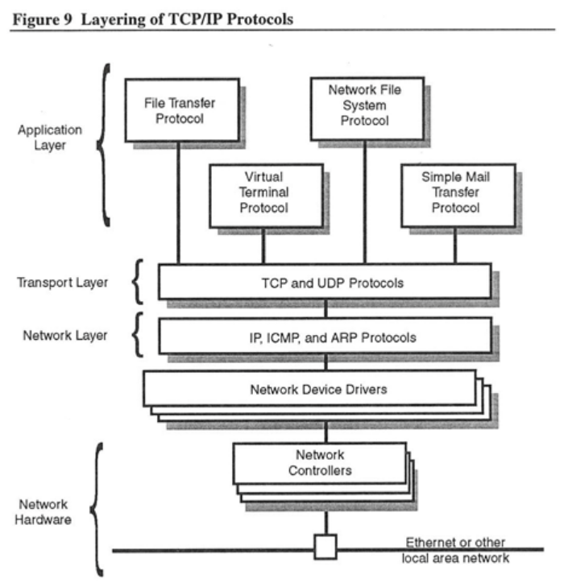

  ### 4.1 Tầng truy cập mạng (Network Access Layer)
  - Tầng này tương ứng với 2 tầng Data Link và Physical trong mô hình OSI, tầng truy cập mạng trong mô hình TCP/IP đảm bảo việc gửi dữ liệu trên phương tiện vật lý của mạng. Nó sẽ định nghĩa data được truyền đi như thế nào từ ứng dụng này qua đường truyền vật lý tới ứng dụng khác, xử lý quá trình vật lý gửi và nhận dữ liệu.
  - **Chức năng chính**:
    - Thiết lập kết nối vật lý giữa các thiết bị trong cùng một mạng(như dây cáp Wi-Fi,...),
    - Đóng gói dữ liệu thành các khung (frames) để truyền qua liên kết vật lý.
    - Gắn địa chỉ MAC để định danh thiết bị.
    - Kiểm tra lỗi cơ bản trong quá trình truyền.

  ### 4.2 Tầng Internet (Internet Layer)
  - Internet Layer chịu trách nhiệm định tuyến gói tin (packet) từ nguồn đến đích trên một mạng lưới các mạng (internetwork). Đây là tầng đảm bảo dữ liệu có thể đi qua nhiều mạng trung gian và đến đúng địa chỉ IP của thiết bị đích.
  - **Các nhiệm vụ chính**:
    - Định địa chỉ (Addressing): Gán địa chỉ IP cho các thiết bị, giúp xác định thiết bị nguồn và đích. 
    - Đóng gói dữ liệu(Encapsulation): Đóng gói dữ liệu từ tầng Transport vào các IP Packet.
    - Định tuyến(Routing): Xác định đường đi tốt nhất để gói tin đến đích qua các router.
    - Phân mảnh(Fragmentation): Nếu gói tin quá lớn(thường đã được chia nhỏ ở tầng trên rồi) tầng này sẽ tiếp tục chia nhỏ để phù hợp với từng mạng.
  - **Giao thức chính của tầng**:
    - IP(Internet Protocol): Giao thức lõi, chịu trách nhiệm vận chuyển gói tin.
    - ICMP(Internet control message protocol): Giao thức chuẩn đoán báo lỗi. (dùng trong ping)
    - ARP(Address Resolution Protocol): Dùng để tìm địa chỉ MAC từ địa chỉ IP trong cùng mạng LAN.
  
  ### 4.3 Tầng Transport(Transport Layer)
  - Tầng Transport chịu trách nhiệm chính giữa các ứng dụng(process to process communiacation). Nó quản lý phiên làm việc giữa hai ứng dụng trên các thiết bị khác nhau và đảm bảo dữ liệu được truyền đến đúng ứng dụng đích với độ tin cậy phù hợp.
  - **Các nhiệm vụ chính**
    - Phân biệt ứng dụng(Port Addressing): Gắn số hiệu cổng(port number) vào gói tin để xác định ứng dụng nào gửi/ nhận
    - Kiểm soát luồn(Flow control): Điều chỉnh lượng dữ liệu để tránh tràn bộ đệm ở bên nhận.
    - Phát hiện lỗi và sửa lỗi: Kiểm tra dữ liệu có bị lỗi hay không và yêu cầu truyền lại nếu cần (ở TCP).
    - Kiểm soát tắc nghẽn (Congestion control): Giảm tốc độ truyền khi mạng bị quá tải.
    - Chia nhỏ và sắp xếp lại dữ liệu: Nếu dữ liệu quá lớn, tầng này sẽ chia ra các mạng nhỏ (segment) và sắp xếp lại khi đến nơi.

  - **Giao thức chính**
    - TCP/UDP: Kết nối đáng tin cậy, có kiểm soát luồng và lỗi. Dùng cho Web, Email, FTP, SSH.
    - UDP: Connectionless, không đảm bảo, nhanh. VoIP, video streaming, game online, DNS.

    - Port Number: Giống như “cửa” để kết nối tới ứng dụng. Ví dụ: HTTP → port 80, HTTPS → port 443.

    - Connection-oriented (TCP): Thiết lập kết nối trước khi truyền dữ liệu (3-way handshake).
    - TCP header:
    
    

    - Connectionless (UDP): Gửi luôn mà không cần thiết lập kết nối.
    
  - **Quy trình bắt tay 3 bước**:
    - là quy trình ba bước được TCP sử dụng để thiết lập kết nối song công đáng tin cậy giữa client và server trước khi truyền dữ liệu.

    - Hai thiết bị kết nối qua Internet hiện nay sẽ tuân theo mô hình TCP/IP. Trong đó, lớp ứng dụng (Application) là lớp trên cùng của một loạt các mô hình TCP/IP. Từ đó các ứng dụng được tham chiếu mạng như trình duyệt web (google chorme) ở máy khách sẽ kết nối với máy chủ.

    - Từ lớp ứng dụng, thông tin được gửi đến lớp vận chuyển, đây là nơi giao thức TCP xuất hiện và hoạt động. TCP là giao thức điều khiển truyền dẫn. Trong lớp vận chuyển TCP và giao thức UDP là 2 giao thức quan trọng nhất. Tuy nhiên TCP phổ biến hơn.

    - TCP có khả năng cung cấp kết nối đáng tin cậy hơn với PAR. PAR (Positive Acknowledgment with Retransmission) là một cơ chế đảm bảo độ tin cậy của giao tiếp dữ liệu. Nếu dữ liệu lỗi (phát hiện nhờ checksum), bên nhận loại bỏ segment và bên gửi sẽ gửi lại.

      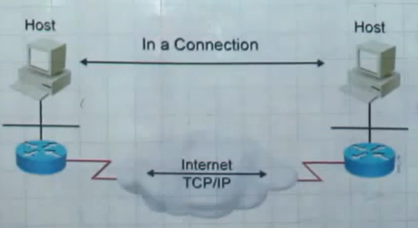

  - **Quy trình thiết lập kết nối**
    - Bước 1 (SYN): Trong bước này, thiết bị gửi một gói tin TCP có cờ SYN (synchronize) được bật lên (1) với số thứ tự (SEQ = 100) để bắt đầu quá trình thiết lập kết nối. Gói tin này chứa một số cổng nguồn và một số cổng đích mà máy chủ mong muốn thiết lập kết nối.
    - Bước 2 (SYN + ACK): Khi thiết bị đích nhận được gói tin SYN từ thiết bị nguồn, nó sẽ gửi lại một gói tin TCP với cờ SYN và ACK (acknowledgment). Trong gói tin này, nó xác nhận nhận được yêu cầu thiết lập kết nối ACK = 101 -> nó đề xuất một số cổng nguồn mới cho thiết bị nguồn SEQ = 300 rồi gửi lại sang cho Host A.
    - Bước 3 (ACK): Khi thiết bị nguồn nhận được gói tin SYN + ACK từ thiết bị đích, nó sẽ gửi lại một gói tin ACK = 301, SEQ = 101 (đáp ứng đúng yêu cầu trên ACK muốn nhận là 101) để xác nhận nhận được thông điệp xác nhận (ACK). Quá trình này hoàn tất việc thiết lập kết nối giữa hai thiết bị, và sau đó, dữ liệu có thể được truyền qua kết nối TCP mới được thiết lập. ( Chỉ có cờ CTL = ACK được bật lên)

    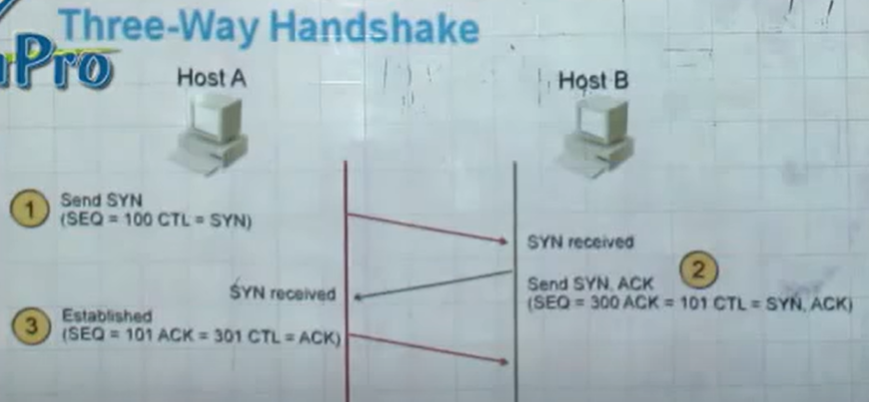

    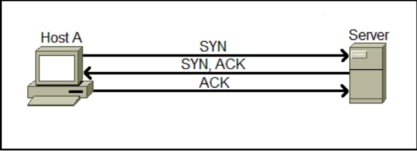

  - **Flow control protocol**
    - Là cơ chế giúp bên gửi không "dội" quá nhiều vào bên nhận, tránh làm tràn bộ đệm (buffer) của bên nhận. TCP sử dụng 1 cơ chế Sliding window protocol để điều khiển luồng này.

      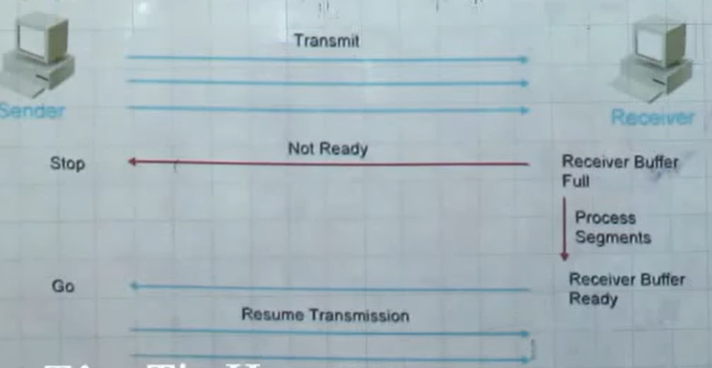

    - Bên nhận thông báo cho bên gửi biết bao nhiêu byte nữa nó có thể tiếp nhận.
    - Kích thước này được chứa trong window size của TCP header.
    - Khi bên gửi nhận được ACK rằng một phần dữ liệu đã được nhận và xử lý, thì cửa sổ trượt sang phải để gửi tiếp phần tiếp theo.
    - Cửa sổ này có thể co giãn nếu bên nhận bị quá tải: giảm window size; nếu xử lý tốt nó tăng window size. 
    - Khi window = 0 -> bên nhận tạm thời không thể nhận thêm dữ liệu
    - Bên gửi tạm dừng gửi dữ liệu và thỉnh thoảng gửi gói tin kiểm tra (Window Probe) để hỏi lại kích thước cửa sổ đã thay đổi chưa.

    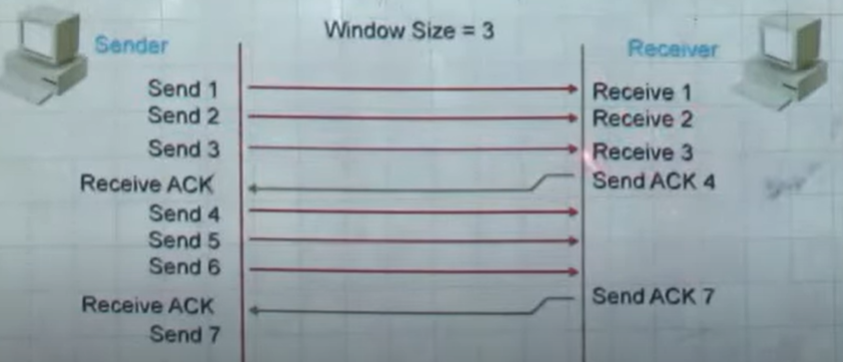
    
    - Trường hợp không nhận được gói tin thứ 3, máy nhận sẽ gửi lại ACK = 3 là nó mong muốn nhận lại gói tin thứ 3 và thông báo windowsize bằng 2 vì nó chỉ còn 2 chỗ chống và đang bận xử lý các byte trc đó.

    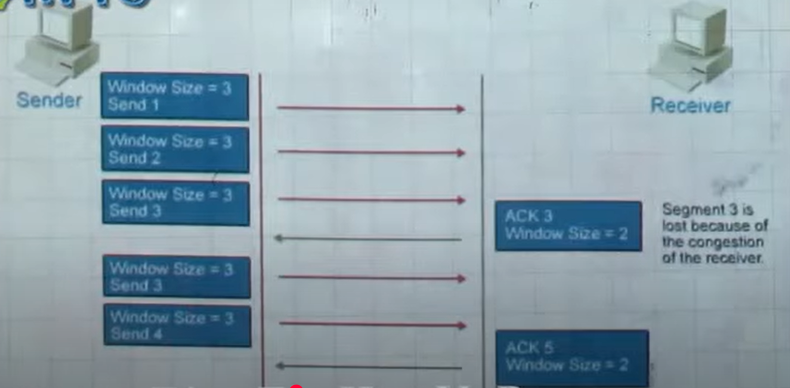

    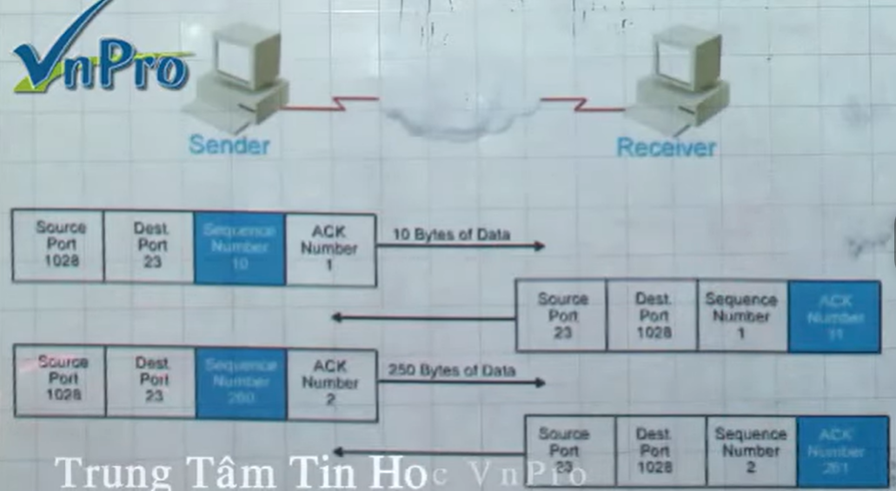
  - **Quy trình kết thúc kết nối**
  - Khi dữ liệu truyền dẫn kết thúc, giao thức TCP kết thúc kết nối giữa 2 thiết bị. Do đó, ta có quy trình 4 bước từ lúc thiết lập kết nối đến lúc hoàn thành quá trình truyền dẫn như sau:
    - Bước 1: Ứng dụng khách muốn kết thúc kết nối, vì vậy nó gửi một đoạn tin TCP với cờ FIN được đặt thành 1. Điều này là tín hiệu cho máy chủ biết rằng khách hàng muốn kết thúc kết nối.
    - Bước 2: Máy chủ xác nhận yêu cầu: Máy chủ nhận được yêu cầu đóng kết nối từ ứng dụng khách và gửi lại một đoạn tin TCP ACK để xác nhận rằng nó đã nhận được yêu cầu đóng kết nối.
    - Bước 3: Máy chủ yêu cầu đóng kết nối: Sau khi máy chủ nhận được xác nhận từ khách hàng, nó tự gửi một đoạn tin TCP riêng của mình với cờ FIN được đặt thành 1 đến khách hàng. Điều này là tín hiệu cho khách hàng biết rằng máy chủ muốn đóng kết nối.
    - Bước 4: Ứng dụng khách nhận được yêu cầu từ máy chủ và gửi lại một đoạn tin TCP ACK để xác nhận. Sau đó, kết nối được đóng và không còn tồn tại nữa. 

    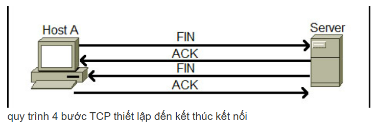
  - **TCP Flags option**
    - 1 TCP Segment mang theo dữ liệu trong khi những cái khác chỉ đơn giản là báo nhận cho dữ liệu nhận được trước đó. Quá trình bắt tay 3 bước sử dụng SYN và ACK có sẵn trong TCP giúp hoàn thiện kết nối trước khi dữ liệu được truyền. Mỗi TCP Segment đều có mục đích và điều này được xác định với sự trợ giúp của TCP Flag Options, cho phép bên gửi hoặc bên nhận chỉ ra cờ nên được sử dụng để các Segment xử lý 1 cách chính xác ở phía bên kia. 
    - Mỗi cờ có độ dài 1 bit và có 6 cờ tất cả nên tổng cộng TCP Flags có độ dài 6 bits. 3 cờ phổ biến nhất hay ít nhất mà chúng ta có nghe nói tới là cờ SYN, cờ ACK và cờ FIN lần lượt dùng để thiết lập kết nối, báo nhận thành công và kết thúc kết nối.
      - Cờ đầu tiên - Urgent Pointer. Cờ này để xác định dữ liệu đến là "khẩn cấp" tức là nâng độ ưu tiên của Segment. Những Segment có cờ Urgent Pointer được bật không phải chờ đợi cho đến khi các Segment trước đó được xử lý mà được gửi trực tiếp và xử lý ngay lập tức.
      - Cờ thứ 2 - ACKnowledgement. Cờ ACK được sử dụng để xác nhận việc nhận thành công các gói tin. Khi client gửi yều cầu kết nối trong đó có cờ syn, Sau khi server nhận được cờ syn rồi thì sẽ phản hồi lại cho client 1 gói tin gồm có cờ syn và 1 cờ ACK đi sau nó để báo là đã nhận gói dữ liệu vừa nhận được. Nếu không thiết bị gửi sẽ liên tục gửi với cờ SYN cho tới khi nhận được phản hồi ACK.

      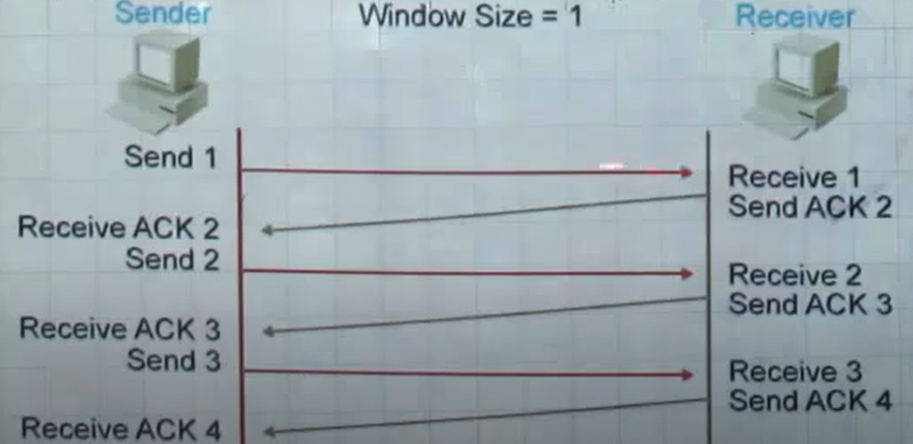

      - Cờ thứ 3 - PUSH. Cờ PUSH giống như cờ Urgent Pointer, tồn tại để đảm bảo rằng các dữ liệu được ưu tiên và được xử lý tại nơi gửi hoặc nơi nhận. Cờ này cụ thể được sử dụng khá thường xuyên ở đầu và cuối của việc truyền dữ liệu, ảnh hưởng đến cách dữ liệu được xử lý ở cả 2 đầu. Khi sử dụng, cờ PUSH làm cho các Segment chắc chắn được xử lý 1 cách chính xác và ưu tiên thích hợp ở cả 2 đầu của kết nối.
        - Khi 1 máy muốn gửi dữ liệu của nó, nó tạm thời được cất trong bộ đệm TCP, 1 khu vực đặc biệt trong bộ nhớ, cho đến khi Segment đã đạt đến 1 kích thước nhất định và sau đó được gửi đến bên nhận. Thiết kế này đảm bảo rằng việc chuyển giao dữ liệu là hiệu quả nhất có thể mà không phải đợi thời gian và băng thông bằng cách tạo ra nhiều Segment, nhưng kết hợp chúng vào 1 hoặc nhiều cái lớn hơn.
      - Cờ thứ 4 - Reset (RST). Cờ RST là cờ được sử dụng khi 1 Segment đến mà không được dự định dùng trong kết nối hiện thời. Nói cách khác, nếu ta gửi 1 gói tin đến 1 máy chủ để thiết lập kết nối và không có dịch vụ nào chờ đợi để trả lời yêu cầu, máy chủ sẽ tự động gửi 1 gói tin trả lời với cờ RST được bật. Điều này chỉ ra rằng máy chủ đã thiết lập lại kết nối.
      - Cờ thứ 5 - SYNchronisation. Cờ thứ 5 trong TCP Flag Options có lẽ thường được sử dụng nhất trong truyền thông sử dụng TCP. Như chúng ta đã biết, cờ SYN được sử dụng để khởi tạo quá trình bắt tay 3 bước trong TCP.
      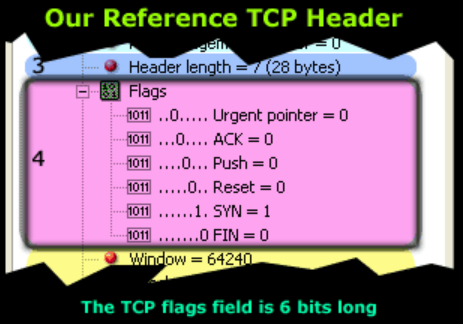

  ## 5. Workflow TCP/IP
    - TCP/IP chia các tác vụ truyền thông thành các tầng nhằm chuẩn hóa quá trình truyền dữ liệu, giúp các nhà cung cấp phần cứng và phần mềm không cần phải tự xử lý từng bước. Các gói dữ liệu phải đi qua bốn tầng trước khi được thiết bị đích nhận, sau đó TCP/IP sẽ đi qua các tầng theo thứ tự ngược lại để khôi phục lại thông điệp ban đầu.

    - Là một giao thức dựa trên kết nối, TCP thiết lập và duy trì kết nối giữa các ứng dụng hoặc thiết bị cho đến khi việc trao đổi dữ liệu hoàn tất. Nó xác định cách chia nhỏ thông điệp gốc thành các gói tin, đánh số và sắp xếp lại các gói tin, sau đó gửi chúng đến các thiết bị khác trong mạng như bộ định tuyến (router), cổng bảo mật (security gateway), và switch, rồi tiếp tục đến đích cuối. TCP cũng gửi và nhận các gói từ tầng mạng, xử lý việc truyền lại các gói bị mất, quản lý luồng dữ liệu, và đảm bảo tất cả các gói đều đến được nơi nhận.

    - Một ví dụ thực tế cho cách thức hoạt động này là khi một email được gửi thông qua SMTP từ máy chủ email. Đầu tiên, tầng TCP tại máy chủ sẽ chia nhỏ thông điệp thành các gói tin, đánh số chúng, và chuyển tiếp xuống tầng IP, tầng này sẽ vận chuyển từng gói đến máy chủ email đích. Khi các gói tin đến nơi, chúng sẽ được chuyển ngược lại lên tầng TCP để sắp xếp thành thông điệp gốc và bàn giao cho máy chủ email, nơi sẽ đưa email vào hộp thư đến của người dùng.

    - TCP/IP sử dụng cơ chế "bắt tay ba bước" (three-way handshake) để thiết lập kết nối giữa thiết bị và máy chủ. Cơ chế này đảm bảo rằng nhiều kết nối TCP socket có thể được truyền song song hai chiều. Cả thiết bị và máy chủ phải đồng bộ và xác nhận các gói tin trước khi việc truyền thông bắt đầu, sau đó họ có thể thỏa thuận, phân tách và truyền các kết nối TCP socket.

  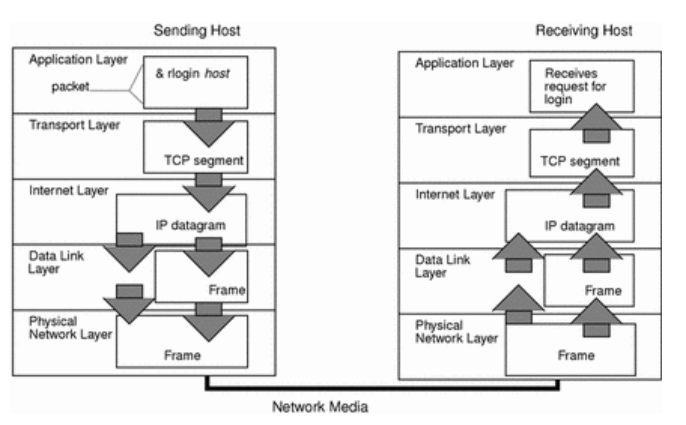
    - **4.4 Tầng Application**
    
  ## 6. So sánh TCP/IP và OSI model
    - TCP/IP và OSI là hai mô hình giao thức mạng truyền thông được sử dụng rộng rãi nhất hiện nay.
    - OSI là một mô hình khái niệm, không được sử dụng trực tiếp trong thực tế để truyền dữ liệu. Thay vào đó, nó cung cấp định nghĩa về cách các ứng dụng có thể giao tiếp qua mạng.
    - TCP/IP lại là một mô hình thực tiễn, được triển khai rộng rãi để thiết lập các kết nối và truyền thông mạng.
    - Các giao thức trong TCP/IP định ra các tiêu chuẩn đã xây dựng nên Internet, trong khi mô hình OSI chỉ đưa ra hướng dẫn về cách thức giao tiếp nên thực hiện như thế nào. Do đó, TCP/IP là mô hình có tính ứng dụng thực tế cao hơn.
    - Mô hình OSI có 7 Layers gồm: Application Layer, Presentation Layer, Session Layer, Transport Layer, Network Layer, Data-Link Layer, Physical Layer
    - *_Điểm giống nhau_*
      - Cả hai đều là mô hình logic.
      - Cả hai đều định nghĩa các tiêu chuẩn trong mạng.
      - Đều chia quá trình truyền thông mạng thành các tầng riêng biệt.
      - Đều cung cấp khung chuẩn để tạo và triển khai các tiêu chuẩn mạng và thiết bị.
      - Cho phép thiết bị của các nhà sản xuất khác nhau có thể tương thích và hoạt dộng cùng nhau.
    
    - *_Điểm khác nhau_*

    | Tiêu chí          | TCP/IP                                | OSI                                   |
    |-------------------|---------------------------------------|---------------------------------------|
    | Số tầng           | 4 tầng                                | 7 tầng                               |
    | Tầng ứng dụng     | Gộp chung Application, Presentation, Session | Tách riêng Application, Presentation, Session |
    | Tầng mạng         | Gộp Physical + Data Link              | Tách riêng Physical và Data Link      |
    | Cách phát triển   | Giao thức được phát triển sau đó mới xây dựng mô hình          | Mô hình trước, sau đó phát triển giao thức cho từng tầng        |
    | Kích thước header | 20 byte                               | 5 byte                               |
    | Hướng tiếp cận    | Ngang (thực tiễn, linh hoạt)                  | Dọc (học thuật)                      |
    | Mục tiêu          | Kết nối hệ các loại máy tính khác nhau          | Chuẩn hóa thiết bị như switch, router, bo mạch chủ, v..v. mạng               |
    | Tính chất         | Dựa trên giao thức thực tế            | Dựa trên chức năng của từng tầng      |

    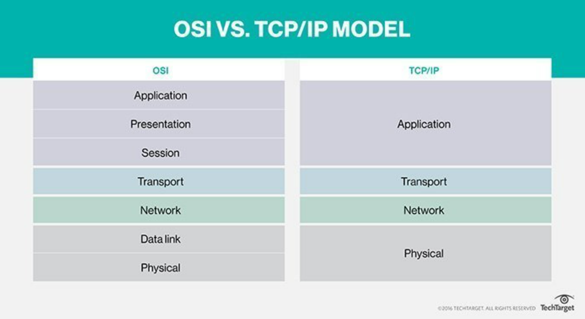
            