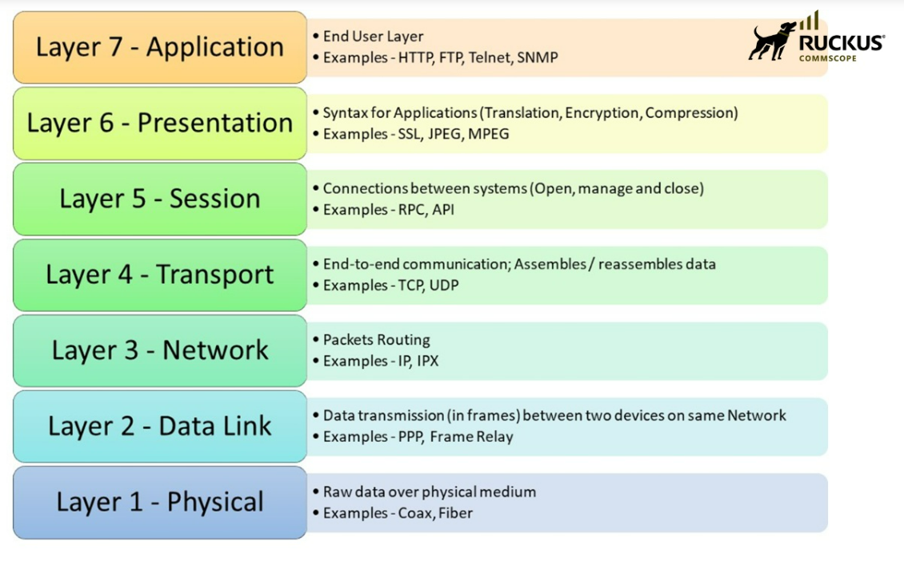
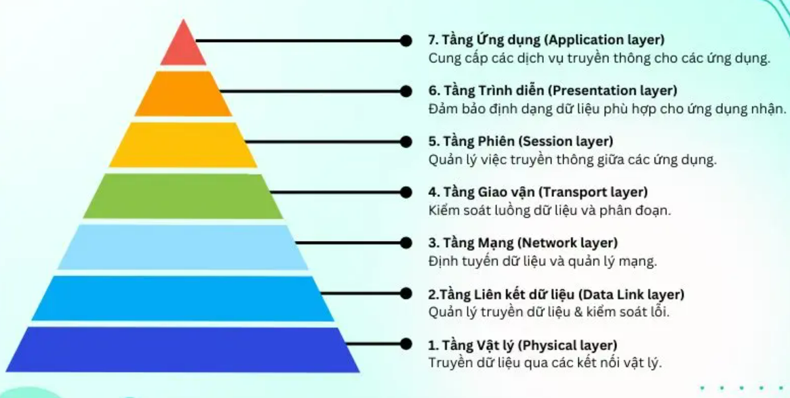
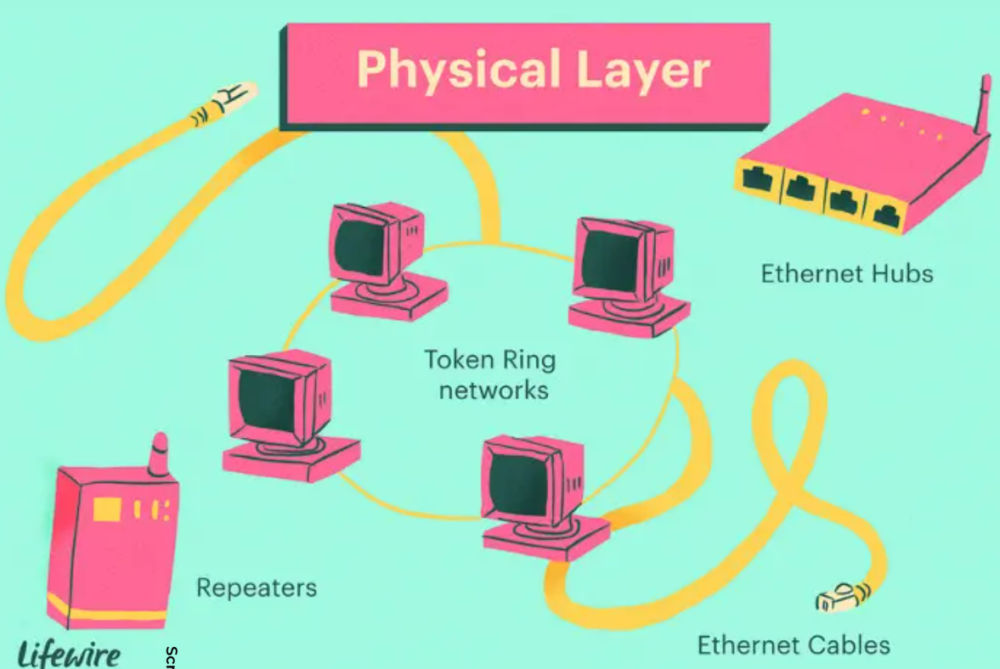
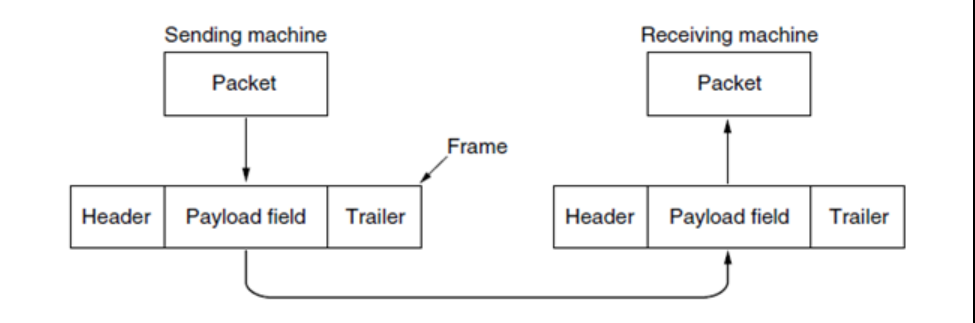
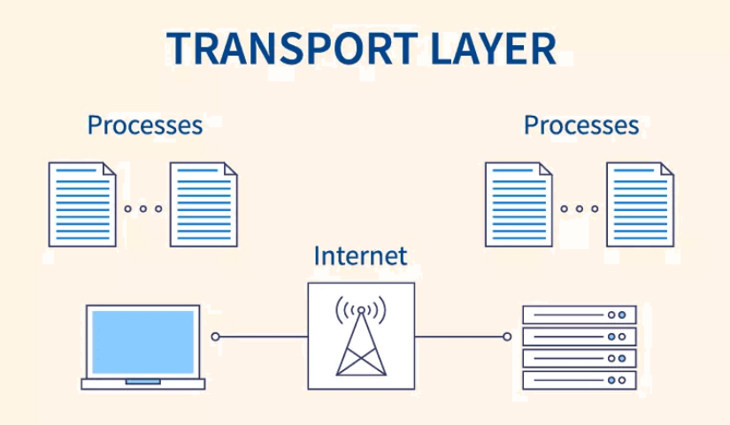
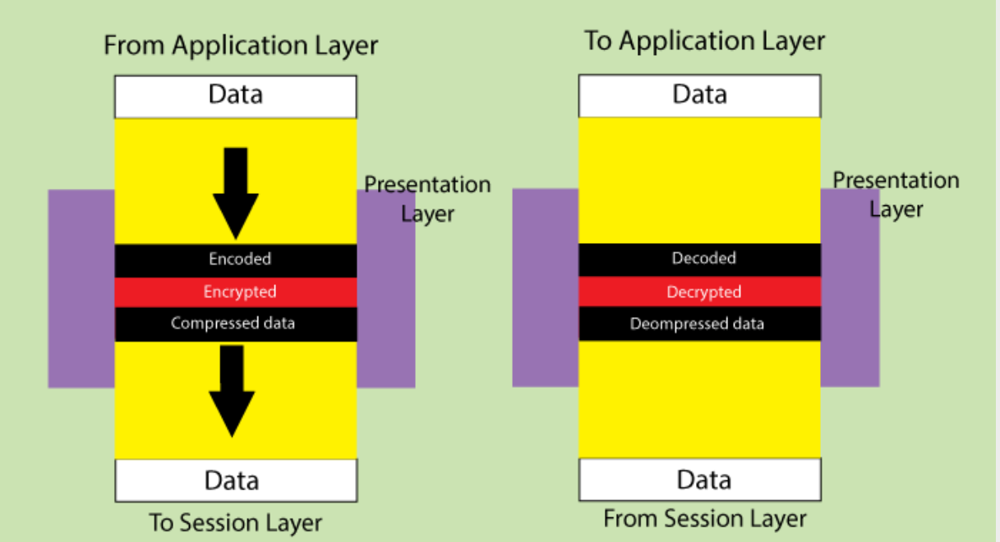
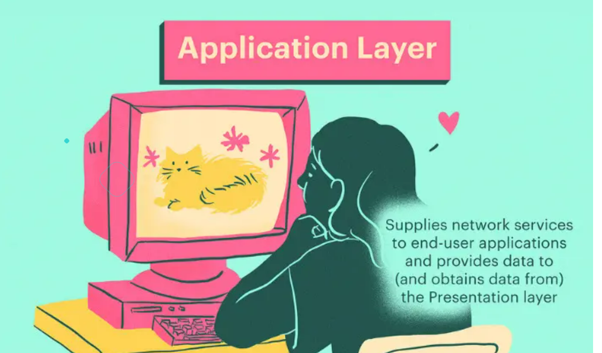
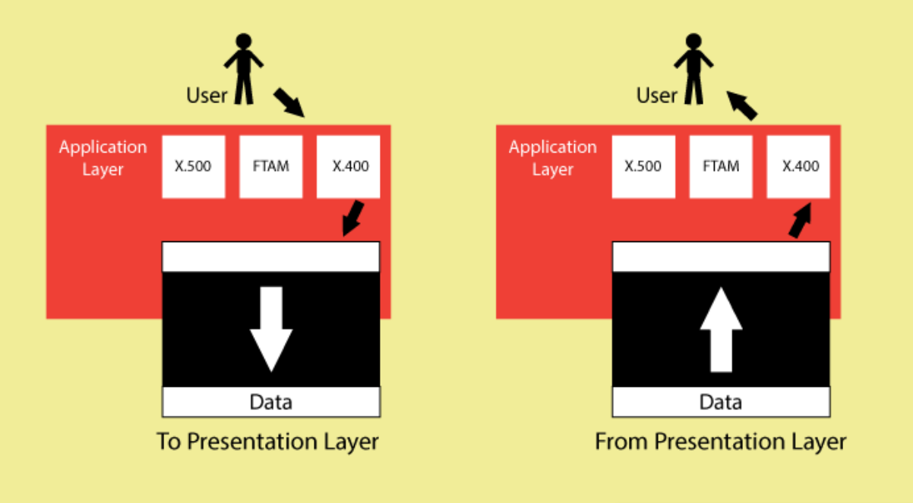
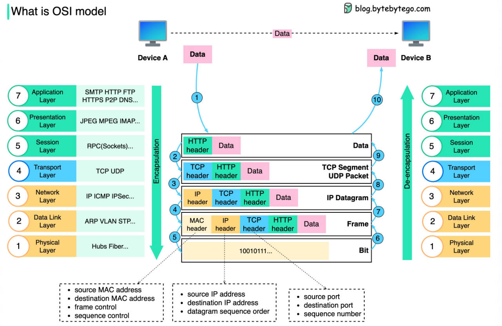

<h1 style="text-align: center;">OSI MODEL</h1>

## Mục lục

1. [Khái quát về mô hình OSI](#1-khái-quát-về-mô-hình-osi )   
    1.1 [Mô hình OSI là gì](#11-mô-hình-osi-là-gì)         
    1.2 [Tại sao chúng ta cần mô hình OSI](#12-tại-sao-chúng-ta-cần-mô-hình-osi)
2. [Các tầng trong mô hình OSI](#2-7-layers-trong-mô-hình-osi)  
    2.1 [Physical Layer](#21-physical-layer-tầng-vật-lý)  
    2.2 [DataLink Layer](#22-datalink-layer-tầng-liên-kết-dữ-liệu)  
    2.3 [Network Layer](#23-network-layer)  
    2.4 [Transport Layer](#24-transport-layer)  
    2.5 [Session Layer](#25-session-layer)  
    2.6 [Presentation Layer](#26-presentation-layer)  
    2.7 [Application Layer](#27-application-layer)  
3. [Workflow với mô hình OSI](#how-does-osi-model-work)                                                           
4. [Link Tham khảo](#link-tham-khảo)

## 1. Khái quát về mô hình OSI

#### 1.1 Mô hình OSI là gì
- OSI (Open Systems Interconnection) là mô hình tham chiếu kết nối các hệ thống mở, một mô hình được phát triển bởi tổ chức quốc tế và tiêu chuẩn hóa (ISO). Nó mô tả cách các thiết bị mạng và phần mềm giao tiếp với nhau qua các tầng (Layers). Mục tiêu chính của mô hình OSI là tạo ra 1 chuẩn chung cho việc truyền thông mạng, giúp các nhà sản xuất thiết bị mạng và phần mềm có thể tương thích với nhau một cách dễ dàng.
#### 1.2 Tại sao chúng ta cần mô hình OSI 
 Chúng ta cần có mô hình OSI vì nhiều lý do nhưng sau đây là các ý chính tiêu biểu.
- Reduces complexity: Chia thành nhiều nhóm công việc, mỗi nhóm có các công việc tương tự nhau. Các công việc được chia ra, chuyên biệt hóa, mỗi vùng, mỗi tổ chức chỉ phải xử lý chuyên biệt, riêng 1 công việc mà không cần xử lý từ đầu đến cuối.
- Standardizes interfaces: Quy định chung 1 chuẩn bắt buộc các nhà sản xuất khi đã tham gia vào phải tuân theo, đảm bảo giao tiếp được giữa người dùng với người dùng qua các hãng khác nhau.
- Facilitates modular engineering: Tạo điều kiện để chuyên môn hóa cho kỹ sư, một công ty chuyên biệt giải quyết 1 tầng sẽ đạt hiệu quả cao hơn việc phải làm tất cả các công việc.
- Ensures interoperable technology: Đảm bảo tích tương thích về mặt công nghệ, thiết bị của các hãng khác nhau có thể giao tiếp được với  nhau.
- Accelerates evolution: Kỹ năng tăng cao, tốc độ và năng suất cũng sẽ tăng.
- Simplifies teaching and learning: Tạo điều kiện thuận lợi để học và giảng dạy khi chia ra các lớp.

## 2. 7 Layers trong mô hình OSI

#### 2.1 Physical Layer (Tầng Vật Lý)
- Tầng Physical là tầng số 1. Thấp nhất trong mô hình OSI, chịu trách nhiệm truyền 1 dòng bit qua 1 đường truyền vật lý cụ thể.
- Không cần quan tâm đến dữ liệu nghĩa là gì, nó chỉ lo chuyển đổi dữ liệu thành tín hiệu vật lý và truyền đi qua môi trường vật lý. Bit 0 và 1 trong máy tính sẽ được biến thành Dòng điện (cáp đồng), Ánh sáng(Cáp quang), Sóng vô tuyến(Wi-Fi, Bluetooth). Nó sẽ tạo ra một đường truyền vật lý ổn định và đáng tin cậy để tầng cao hơn có thể gửi và nhận dữ liệu.
- **Chức năng chính**: 
    - Truyền bit: Chuyển bit 0/1 thành tín hiệu vật lý và ngược lại. 
    - Xác định đặc tính tín hiệu: Điện áp, cường độ sóng, tần số và bước sóng.
    - Quy định đầu nối và giao diện: Kiểu giắc cắm, chân cắm, chuẩn cáp (RJ45, USB, v.v.).
    - Điều khiển chế độ truyền: Simplex(một chiều),Half-Duplex, Full-Duplex.
    - Đồng bộ bit: Đảm bảo người gửi và nhận hiểu đúng điểm bắt đầu/ kết thúc bit.
    - Cách đấu nối vật lý: Topology vật lý: Bus, Star, Ring, Mesh.
    - Chuẩn hóa tốc độ truyền: Tốc độ bit (bit rate): bao nhiêu bit/ giây (bps).

- **Ví dụ thiết bị & công nghệ**:
  - Cáp xoắn đôi(UTP/STP): mang tín hiệu điện,  Cáp quang(Fiber): Mang tín hiệu ánh sáng, Card mạng (NIC): Chuyển đổi tín hiệu giữa máy tính và cáp, Hub: Thiết bị thu và phát tín hiệu điện, Repeater: Khuếch đại tín hiệu để đi xa hơn. Đầu nối RJ45, cổng USB, jack cáp quang: Chuẩn đầu cắm. WI-FI adapter, Bluetooth: Chuẩn tín hiệu thành sóng vô tuyến.

#### 2.2 DataLink Layer (Tầng liên kết dữ liệu)
- Datalink Layer là tầng thứ hai trong mô hình OSI. Nó làm nhiệm vụ quản lý truyền dữ liệu tin cậy giữa hai thiết bị liền kề trên cùng một liên kết vật lý (Physical).
- Điều khiển việc truy nhập vào đường truyền vật lý, định nghĩa **format dữ liệu** và làm thế nào để dạng dữ liệu đó tiếp cận vào đường truyền vật lý.
- Physical Layer chỉ _bắn_ các bit 0 và 1, Data Link Layer biến những bit rời rạc đó thành các frames và đảm bảo khung đi đến chính xác.
- **Chức năng chính**:
  - Framing: Đóng gói các bit thành khung để truyền đi.
  - Gán địa chỉ MAC(Media Access Control).
  - Có chức năng kiểm tra lỗi : CRC, Checksum.
  - Một số giao thức có khả năng sửa lỗi đơn giản.
  - Điều khiển truy cập môi trường.
  - Kiểm soát luồng, tránh bên gửi quá nhanh.
- **Các thành phần chính**:
  - Lớp con LLC(Logical Link Control): Định nghĩa khung, giao tiếp với tầng Network, Xác định kiểu dịch vụ(connectionless hay connection-oriented).
  - Lớp con MAC(Media Access Control): Quy định truy cập đường truyền chia sẻ, Đặt địa chỉ MAC, quản lý va chạm hay xung đột tín hiệu.
- **Đơn vị dữ liệu**:
  - Frame: Mỗi Frame chứa: Header(có địa chỉ MAC nguồn/đích)+ Payload(dữ liệu)+ Trailer(CRC).
- **Một số thiết bị hoạt động ở tầng Data Link**
  - Switch: Chuyển mạch các khung dựa trên địa chỉ MAC.
  - Bridge: Kết nối các đoạn mạng LAN.
  - Network Interface Card(NIC): Xử lý khung, gán địa chỉ MAC.
- **Giao thức DataLink phổ biến**
  - Ethernet(IEEE 802.3) - phổ biến nhất.
  - Wi-Fi(IEEE 802.11) - có MAC frame riêng.
  - PPP (Point-to-Point Protocol) - dùng cho modem, WAN.
  - HDLC (High Level Data-Link Control).
  - Frame Relay

#### 2.3 Network Layer
- Là tầng thứ 3 nằm trong mô hình OSI (Open Systems Interconnection)
- Nhiệm vụ chính là xác định đường đi cho dữ liệu từ nguồn đến đích một cách tối ưu nhất qua nhiều mạng trung gian (Routing).
- **Chức năng chính**
  - Định tuyến (Routing): Chọn đường đi tối ưu cho các gói tin máy gửi đến máy nhận qua các Router, mạng trung gian. Các giao thức định tuyến tiêu biểu: RIP, OSPF, BGP, IS-IS.
  - Đánh địa chỉ Logic(Logical Addressing): Cung cấp địa chỉ IP cho mỗi thiết bị trong mạng. Mỗi gói tin ở tầng này có địa chỉ IP nguồn và địa chỉ IP đích: IPv4(32-bit), IPv6(128-bit).
  - Phân mảnh và lắp ráp(Fragmentation and Reassembly): Nếu gói tin quá lớn so với kích thước Maximum Transmission Unit của mạng con, Network Layer sẽ phân mảnh nó và thiết bị nhận sẽ lắp ráp lại gói tin ban đầu.
  - Kiểm soát nghẽn mạng 
  - Error Reporting and control: Destination Unreachable, Time exceeded, Redirect,...
- **Các giao thức tiêu biểu ở tầng Network**
  - Internet Protocol(IP): Giao thức chính, truyền gói tin. ICMP: báo lỗi, chuẩn đoán. IGMP: Quản lý nhóm multicast, ARP/RARP: Tra cứu địa chỉ IP <-> Mac. OSPF, RIP, BGP: Định tuyến. MPLS: Label Switching.
- **Gói tin ở tầng Network**
  - Đơn vị gói dữ liệu: Packet(Gói tin)
  - Thành phần: Header-Chứa địa chỉ IP nguồn/đích, TTL, ID phân mảnh, v.v. Payload: Dữ liệu từ tầng Transport(TCP/UDP segment).
- **Thiết bị làm việc ở tầng Network**
  - Router: Là thiết bị chính xử lý và định tuyến gói tin ở tầng Network.
  - Layer 3 Switch: Switch hỗ trợ định tuyến IP.
  - Firewall: Tường lửa lọc gói tin dựa trên thiết bị IP, giao thức.
- **Vấn đề bảo mật cần lưu ý**
  - IP spoofing: Kẻ tấn công giả mạo địa chỉ IP
  - DDoS: Tấn công phân tán từ nhiều địa chỉ IP giả mạo
  - Firewall và IPS/IDS thường kiểm tra và lọc gói tin từ tầng network.

#### 2.4 Transport Layer
  - Transport Layer thuộc tầng 4 trong mô hình OSI.
  - Có trách nhiệm truyền dữ liệu đầu cuối giữa các tiến trình trên các thiết bị khác nhau một cách đáng tin cậy, đúng thứ tự, hiệu quả bất kể sử dụng các thiết bị mạng hoặc thiết bị khác nhau.
  - Là cầu nối giữa mạng và ứng dụng. Nó sẽ lo việc truyền dữ liệu từ ứng dụng A đến ứng dụng B (Ví dụ như trình duyệt Web đến Web server). Đảm bảo đến đúng ứng dụng, 
- **Các chứng năng chính**
  - Phân mảnh và tái lắp ráp: Chia dữ liệu lớn thành các đoạn nhỏ(Segment) để truyền, gán số thứ tự ở mỗi gói. Khi nhận được tầng giao vận lắp ráp lại các gói lại thành dữ liệu ban đầu.
  - Truyền tin đáng tin cậy(Reliable Delivery): Đảm bảo giữ liệu đến nơi không bị mất sai hoặc trùng lặp.
  - Điều khiển luồng: Tầng giao vận quản lý việc truyền dữ liệu và điểu chỉnh tốc độ truyền để đảm bảo rằng không bị chậm hoặc quá tải so với nguồn tiêu thụ.
  - Kiểm soát lỗi(Errol Control): Tầng giao vận sử dụng các cơ chế kiểm soát lỗi như Checksum và ACK/NACK để đảm bảo rằng dữ liệu được truyền một cách đáng tin cậy và không bị lỗi, gửi lại gói tin bị mất hoặc hỏng.
  - Kiểm soát tốc độ đường truyền khi mạng bị nghẽn.
  - Kết nối hoặc phi kết nối: có thể thiết lập kết nối TCP hoặc truyền trực tiếp UDP.
  - Dữ liệu đến đúng ứng dụng đích qua cổng như 80, 443,..
  - Tầng giao vận cũng hỗ trợ việc thiết lập và duy trì các kết nối mạng đa kết nối (multi-connection), cho phép nhiều ứng dụng trên cùng một thiết bị mạng gửi và nhận dữ liệu đồng thời.
- **Giao thức tiêu biểu của Transport Layer**
  - TCP (Transmission Control Protocol): connection-oriented, tin cậy, có kiểm lỗi, thứ tự, luồng. Được dùng cho Web(HTTP/HTTPS), Email, FTP.
  - UDP (User Datagram Protocol): Connectionless, đảm bảo tin cậy, rất nhanh. Được ứng dụng trong: VoIP, Streaming, DNS.
  - SCTP : Kết hợp ưu điểm của TCP & UDP được dùng làm truyền tín hiệu viễn thông.
- **Đơn vị dữ liệu ở Transport Layer**
  - TCP: Segment
  - UDP: Datagram
- **Thiết bị xử lý Transport Layer**
  - Client và Server(Máy tính đầu cuối xử lý tầng Transport)
  - Router không xử lý tầng này, trừ khi có NAT, Firewall, Load balancer.
- **Minh họa cách hoạt động**
  - Trình duyệt --> tạo HTTP request.
  - TCP tầng Transport:
    - Mở tạm port (ví dụ 49312)
    - Gửi đến server port 443 (HTTPS)
  - TCP đảm bảo
    - Thiết lập kết nối.
    - Truyền đúng thứ tự, không mất gói.
    - Tự động gửi lại nếu có lỗi.

#### 2.5 Session Layer
  - Là tầng thứ 5 trong mô hình OSI
  - Có trách nhiệm thiết lập, duy trì và kết thúc các phiên giao tiếp giữa các ứng dụng trên mạng. Nó tạo ra một môi trường nhất quán cho việc thiết lập và duy trì phiên giao tiếp, đồng bộ hoá dữ liệu và chấm dứt phiên. Giải quyết vấn đề Làm thế nào các ứng dụng có thể truy cập vào được đường truyền này.

  - Giao tiếp với các lớp khác trong mô hình OSI: Giao tiếp với presentation layer để đảm bảo việc truyền thông tin, dữ liệu được hiển thị đúng cách. Liên kết với tầng transport layer để đảm bảo việc truyền thông tin một cách đáng tin cậy.
- **Các chức năng hoạt động chính:**
  - **_Thiết lập phiên_** Khi hai ứng dụng muốn giao tiếp với nhau, tầng này sẽ thiết lập một phiên làm kênh giao tiếp logic giữa chúng. Quá trình này bao gồm xác định và thiết lập các thông số phiên như các thông tin định danh, cấu hình và các thông tin điều khiển khác.
  - **_Duy trì phiên_** Kiểm soát việc truyền dữ liệu giữa các ứng dụng trong suốt thời gian phiên diễn ra, đồng bộ hóa dữ liệu và xử lý các yêu cầu, phản hồi. Quản lý các phiên song song ( Nhiều người dùng cùng truy cập).
  - **_Đồng bộ phiên_** Xác định các điểm đồng bộ trong quá trình truyền dữ liệu giữa các ứng dụng, đảm bảo rằng dữ liệu được truyền một cách nhất quán và đúng thứ tự giữa nguồn và đích. Chia các dòng dữ liệu thành các phần logic gọi là "checkpoint" hoặc "sync points". Nếu lỗi xảy ra chỉ cần truyền lại từ checkpoint gần nhất, không cần truyền lại từ đầu.
  - **_Khôi phục phiên_** Sau lỗi kết nối, có thể khôi phục lại phiên, tiếp tục từ chỗ dừng.
  - **_Kết thúc phiên_** Cho phép các ứng dụng kết thúc một cách an toàn, đúng quy trình. Quá trình bao gồm thông báo, truyền tải thông tin hoàn thành và giải phóng tài nguyên được sử dụng trong phiên.
- **Ví dụ thực tế của tầng Session** 
  - Video call: Zoom, Skype: Quản lý bắt đầu, kết thúc cuộc gọi, đồng bộ âm thanh, hình ảnh.
  - Truyền file: Đánh dấu checkpoint và truyền lại từ điểm gần nhất nếu mất kết nối.
  - Quản lý phiên chat trực tuyến.
  - Database session: Giữ phiên giao dịch giữa client và hệ thống CSDL.
- **Giao thức được sử dụng ở Session Layer**
  - NetBIOS: Hỗ trợ tạo phiên giữa các máy tính trong mạng LAN.
  - RPC(Remote Procedure Call): Giao tiếp từ xa giữa các hàm chương trình.
  - PPTP(Point to point Tuneling protocol): Quản lý phiên VPN
  - SQL Session: Giao tiếp có phiên giữa  ứng dụng và cơ sở dữ liệu.
  - SIP(Session initiation protocol): Quản lý phiên gọi thoại qua IP(VoIP).

#### 2.6 Presentation Layer
- Là tầng thứ 6 trong mô hình OSI (Nằm giữa Session Layer và Application Layer)
- Giải quyết ứng dụng này truyền chưa chắc ứng dụng kia đã hiểu --> Trình bày lại dữ liệu sao cho 2 ứng dụng hiểu được nhau
- Tầng này đảm nhiệm vai trò chuyển đổi và xử lý dữ liệu từ định dạng của ứng dụng thành định dạng chuẩn để truyền qua mạng và ngược lại. Nó cung cấp các dịch vụ và các cơ chế chuyển đổi, mã hóa, nén và định dạng dữ liệu để đảm bảo rằng dữ liệu được truyền và nhận một cách chính xác, an toàn và hiệu quả.
- **Các chức năng chính**
  - Mã hóa/ Giải mã (Encryption/Decryption): Tầng Presentation có khả năng mã hóa dữ liệu trước khi truyền và giải mã dữ liệu khi nhận. Điều này đảm bảo tính bảo mật trong truyền dữ liệu trên mạng.
  - Nén/ Giải nén (Compression/ Decompression): Tầng Presentation nén dữ liệu để giảm dung lượng truyền và giải nén dữ liệu khi nhận. Điều này giúp tăng tốc độ truyền dữ liệu và giảm sử dụng băng thông mạng.
  - Định dạng dữ liệu (Data Formatting): thực hiện việc định dạng dữ liệu từ định dạng của ứng dụng thành định dạng chuẩn để truyền qua mạng và ngược lại. Điều này đảm bảo tính tương thích giữa các ứng dụng và hệ thống khác nhau.
  - Quản lý phiên (Session management): có khả năng quản lý các thông tin phiên giao tiếp giữa các ứng dụng. Nó hỗ trợ khởi tạo, duy trì và kết thúc phiên giao tiếp, đồng bộ hóa các hoạt động truyền dữ liệu và xử lý lỗi.
- **Ví dụ thực tế của tầng**
  - Truy cập website HTTPS: Mã hóa dữ liệu bằng STL/LTS trước khi gửi.
  - Gửi hình ảnh: chuyển qua định dạng (JPEG, PNG), nén ảnh.
  - Gửi file email: Mã hóa base64, giải mã ở đầu nhận.
  - Dịch ký tự: Chuyển EBCDIC <-> ASCII nếu 2 máy dùng bộ mã khác nhau.
- **Giao thức chuẩn và công nghệ liên quan**
  - SSL/TLS: Mã hóa kết nối mạng (HTTPS)
  - JPEG,PNG, MP3, MPEG: Định dạng mã hóa dữ liệu hình ảnh, âm thanh.
  - ASII, Unicode, EBCDIC: Chuẩn mã hóa ký tự
  - XML, JSON, YAML: Định dạng trình bay dữ liệu giữa ứng dụng
  - MIME(email): Chuẩn hóa nội dung đa phương tiện trong email

- **Minh họa hoạt động**
  - Máy A gửi thông điệp:"XIN CHÀO" dưới dạng UTF-8
  - presentation layer: nén + mã hóa + chuyển mã.
  ---
  Qua mạng TCP/IP
  - Máy B nhận gói -> giải mã -> giải nén -> chuyển UTF-8 -> UNICODE
  - Application Layer: hiển "XIN CHÀO".

   

#### 2.7 Application Layer
- Là tầng cuối cùng và cao nhất trong mô hình OSI.
- Giao tiếp trực tiếp với người dùng, cung cấp các dịch vụ mạng như là email, file,..etc.., cung cấp user authentication. (cơ chế xác thực người dùng)
- Cung cấp giao diện giữa người dùng và mạng, cho phép người dùng truy cập vào mạng và thực hiện các hoạt động liên quan đến ứng dụng. Nhưng không phải là ứng dụng mà là giao diện giữa app và giao thức mạnh.
- **Chức năng của Application Layer**
  - Giao tiếp với người dùng (User Interface): Cung cấp giao diện người dùng tương tác với hệ thống mạng.
  - Gửi yêu cầu và nhận phản hồi từ xa thông qua các giao thức như HTTP, SMTP...
  - Xác thực(Authentication): Hỗ trợ xác minh người dùng (Đăng nhập, mã OTP,...)
  - Hỗ trợ dịch vụ mạng như truy cập web, gửi email, truyền file, truy vấn DNS. -> gửi xuống Presentation để xử lý.
- **Giao thức tầng Application phổ biến**
  - HTTP/HTTPS: Truy cập website
  - SMTP, POP3, IMAP: gửi và nhận email
  - FTP, SFTP: Truyền file
  - DNS: Tra cứu tên miền thành địa chỉ IP
  - Telnet, SSH: Truy cập máy chủ từ xa
  - DHCP: Cấp phát IP động cho thiết bị
  - SNMP: Quản lý thiết bị mạng
- **Minh họa hoạt động**
  - Người dùng Chrome -> Nhập https://example.com
  - Application Layer của trình duyệt dùng giao thức HTTPS để tạo yêu cầu Get
  - Gửi xuống tầng Presentation để mã hóa -> Truyền qua TCP/IP
  - Server trả lại HTML -> Application xử lý và hiển thị nội dung web. 

#### How does OSI model work?

#### Ví dụ khi gửi một bức email từ Mỹ tới Anh
##### Điểm gửi
- Sender từ New York gửi một bức email tới London, quy trình bắt đầu từ tầng 7. Tầng Application sẽ nhét 1 SMTP(Simple mail transfer protocol) header trước tập tin và cho phép nó truyền vào mạng.
- Email này được gửi xuống tầng Presentation, tại đây nó sẽ được mã hóa và định dạng lại để sao cho phù hợp với tiêu chuẩn để bắt đầu truyền đi.
- Xuống tầng 5, Tầng session này sẽ thiết lập 1 phiên truyền giữa máy chủ email ở NewYork và máy chủ email ở London. Tầng này sẽ quản lý, duy trì phiên đủ lâu để truyền đủ email, sau đó nó sẽ đóng lại và giải phóng bộ nhớ.
- Tại tầng Transport, TCP hoặc UDP header sẽ tiếp tục được add vào tập data trước đó. Nó sẽ được chia nhỏ và đóng gói thành các TCP/UDP segments. Cái header này sẽ chứa port nguồn, port đích và số thứ tự. TCP sẽ đảm bảo gói tin được truyền đúng thứ tự và đáng tin cậy.
- Các segments này sẽ được bọc 1 lớp IP header khi xuống dưới tầng Network. IP header sẽ chứa địa chỉ IP của nguồn và đích. Điều này cho phép gói tin đi qua được các mạng bao gồm routers, switches, để đến tới điểm đến.
- Tại tầng Datalink gói sẽ được bọc thêm một MAC header với địa chỉ MAC nguồn và đích xử lý các gói qua mạng cục bộ và sửa lỗi nếu cần. 
- Frames đã được đóng gói sẽ được gửi tới tầng thứ nhất và được truyển đổi thành các tín hiệu điện để truyền qua đường dây cáp mạng dưới tầng đại dương.
##### Điểm nhận
- Khi thiết bị B nhận bits từ Network, nó sẽ tiến hành quá trình bóc tách. Các lớp bọc sẽ được tách ra dần dần và thiết bị B ở London sẽ nhận được email.
- Tầng vật lý sẽ chuyển đổi lại các gói dữ liệu, sau đó tầng datalink sẽ lắp ghép lại chúng.
- Tầng Network đảm bảo các packets tới 1 cách chính xác, và tầng transport sắp xếp lại chúng nếu cần thiết.
- Tầng phiên duy trì hoạt động cho tới khi quá trình nhận email được hoàn tất.
- Tầng Presentation giải mã và định dạng lại email. Tầng ứng dụng phát email tới máy người nhận, email sẽ xuất hiện ở inbox.
---
## Link Tham khảo
- https://www.cloudflare.com/learning/ddos/glossary/open-systems-interconnection-model-osi/
- https://www.imperva.com/learn/application-security/osi-model/
- https://bytebytego.com/guides/guides/what-is-osi-model/
- https://studyopedia.com/computer-networks/application-layer-in-osi-model/