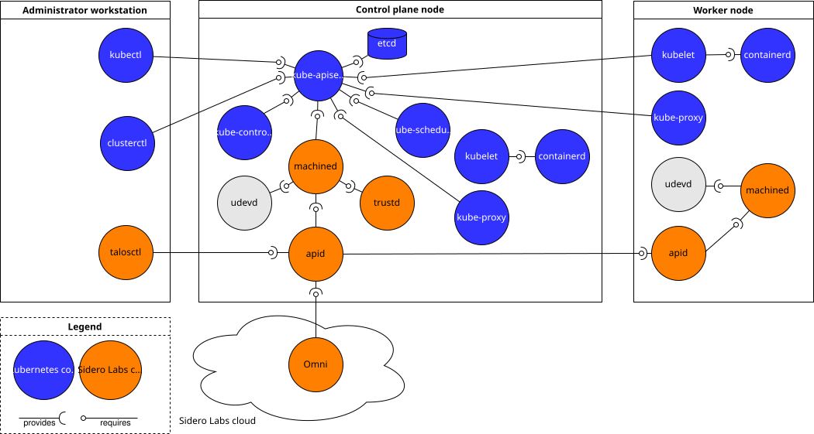
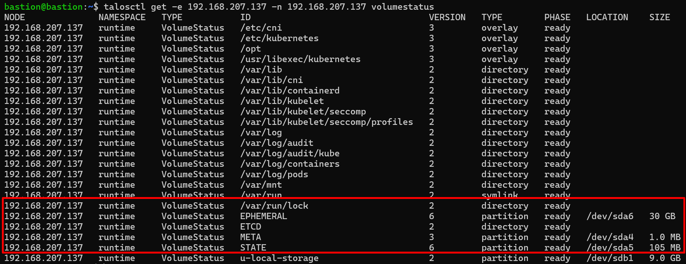

# Hệ điều hành Talos
## 1. Khái niệm
Talos Linux is a Kubernetes optimized Linux distro. It does one thing and it does it better than any general purpose Linux distribution.

Talos Linux — một hệ điều hành Linux được thiết kế chỉ để chạy Kubernetes.

Ubuntu bình thường là 1 hệ điều hành: gồm systemd, apt, SSH, shell, Docker/containerd, Kubernetes.

Talos Linux gần như không có môi trường Linux truyền thống cho người dùng, không ssh, không apt/yum, cấu hình qua API, containerd, Kubernetes.

Talos sinh ra gần như chỉ đề làm OS cho Kubernets node. Nó không hướng tới việc làm general-purpose server như Ubuntu/RHEL.

Talos is managed by a single, declarative gRPC API. This is the most unique thing about Talos and something Talos users love.

It’s designed to be as minimal as possible while still maintaining practicality. For these reasons, Talos has a number of features unique to it:
- API managed
- Immutable file system
- Minimal packages
- Secure by default

Talos can be deployed anywhere you can run a modern Linux kernel.

## 2. Components



Talos = một hệ điều hành gần như “đóng băng” phần hệ thống, chỉ cho phép ghi vào những nơi thật sự cần thiết.

### 2.1 Hai triết lý quan trọng nhất: Atomic + Modular
Talos is designed to be atomic in deployment and modular in composition.

Atomic  = đóng gói nguyên cục

Modular = bên trong chia module

#### Atomic — nguyên khối khi triển khai
Talos không cài hàng trăm package kiểu:
```
apt install ...
apt upgrade ...
yum install ...
```
Mà toàn bộ Talos được phát hành thành một image hoàn chỉnh:
```
Talos Image
│
├── Linux kernel
├── initramfs
├── Talos services
├── system components
└── configuration mechanisms
```
Trong đó:
- có version
- được ký 
- immutable
- upgrade theo image
```
Talos v1.13.10
       ↓
upgrade
       ↓
Talos v1.14.x
```
- Thay vì:
```
upgrade kernel
upgrade systemd
upgrade openssl
upgrade package A
upgrade package B
...
```
#### Modular
```
                 Talos
                   │
        ┌──────────┼──────────┐
        │          │          │
     Network     Runtime    Machine
     service      service    service
        │          │          │
        └────── gRPC ─────────┘
```
Các thành phần Talos không viết thành một chương trình khổng lồ phụ thuộc chặt vào nhau.
```
Talos image = một chiếc PC nguyên bộ

nhưng bên trong:

CPU
RAM
SSD
NIC
GPU
```

Chúng giao tiếp qua: API gRPC + local socket
```
Component A
    │
    │ gRPC
    ▼
 local socket
    │
    ▼
Component B
```
- Tại sao lại như vậy:
```
Network Service
      │
      │ API cố định
      ▼
Machine Service
```
Team Talos có thể sửa toàn bộ logic bên trong Network Service. Miễn là API gRPC vẫn giữ đúng contract thì: Machine Service không cần biết bên trong Network Service đã thay đổi thế nào.
- Đây chính là: Loose coupling = giảm phụ thuộc giữa các component

### 2.2 partition
Talos chia disk thành 6 vùng chính:
```
Disk
│
├── EFI
├── BIOS
├── BOOT
├── META
├── STATE
└── EPHEMERAL
```

- Nên bạn nhìn vào sẽ có thắc mắc tại sao khi tôi:
```bash
talosctl -e 192.168.207.137 -n 192.168.207.137 mounts | grep -E "FILESYSTEM|/dev/sd"
```
- Lại có tới sda6 vì nó mới chính là emepheral phần tốn tài nguyên thực sự. 

| Partition |	Tên Talos |	Vai trò |
| `sda1` |	EFI |	Chứa bootloader (UEFI)|
| `sda2`| BIOS |	Dành cho boot kiểu BIOS/legacy|
| `sda3` |	BOOT |	Chứa kernel, initramfs, bootloader (GRUB/systemd-boot)|
| `sda4` | META |	Lưu metadata nhỏ (1 MB), ví dụ cấu hình mạng ban đầu|
| `sda5` |	STATE |	Lưu machine config và node identity (105 MB)|
| `sda6` |	EPHEMERAL |	Phần còn lại của ổ, mount tại /var, chứa containerd, kubelet, etcd, log, dữ liệu pod|

Bằng chứng rõ ràng nhất:



#### EFI, BIOS, BOOT — nhóm để khởi động máy
EFI: Chứa dữ liệu boot nếu máy dùng UEFI.

BIOS: Nếu hệ thống boot theo kiểu BIOS/GRUB legacy thì partition này phục vụ phần boot của GRUB.

BOOT: kernel + initramfs
```
Firmware
   ↓
Bootloader
   ↓
BOOT partition
   ↓
Kernel + initramfs
   ↓
Talos chạy
```
#### META
- Nó chứa metadata về Talos node:
```
Node ID
metadata
machine-related identity information
```
#### STATE 
- bộ nhớ dài hạn quan trọng của Talos. STATE chứa những dữ liệu như:
```
machine configuration
node identity
cluster discovery
KubeSpan information
```
- Nó là phần giúp Talos: reboot xong vẫn biết mình là ai.

#### EPHEMERAL
Đây không phải vùng Talos xem là permanent machine identity/configuration.
- Có thể hiểu thế này:

Nó không phải là cái mà bạn nghĩ là nó sẽ mất khi reboot. Lưu ý

Hiểu đơn giản ubuntu tất cả đều là emepheral vì có thể tùy chỉnh ví dụ như ubuntu thì tất cả đều là emepheral, hiểu đơn giản hơn nó cho phép bạn custom tùy bạn thích.

#### filesystem
- Talos có thể chia làm 3 lớp
```
Layer 1: squashfs  → OS read-only
Layer 2: tmpfs     → dữ liệu runtime trong RAM
Layer 3: overlayfs → dữ liệu cần persist
```
#### Layer 1 — squashfs: hệ điều hành bị đóng băng
Core filesystem của Talos là: `SquashFS` và READ ONLY tức là bạn không dc quyền:
```bash
vim /etc/abc
apt install nginx
rm /usr/bin/xxx
```
để tránh:
```
Node 1:
cài package A
sửa config B
sửa file C

Node 2:
quên cài A
config B khác
file C khác
```
- Sau 1 thời gian:
```
Node1 ≠ Node2 ≠ Node3
```
#### Layer 2 — tmpfs và /system
Talos tạo:
```
/system
```
trên writable filesystem runtime.
- Talos ghi nội dung vào đây sau đó bind mount vào: 
```
/system/etc/hosts
        │
        │ bind mount
        ▼
    /etc/hosts
```
- Talos chỉ cho:
```
/etc
 ├── hosts        ← writable
 ├── resolv.conf  ← writable
 └── phần còn lại read-only
```
- `/system` sẽ mất sau khi reboot tức là khi reboot là sẽ xóa toàn bộ system cũ viết lại hoàn toàn một system mới
#### OverlayFS: Nếu có thứ cần giữ qua reboot thì sao?
- Tưởng tượng hai tờ giấy chồng lên nhau.
```
Read-only Talos OS
        +
Writable XFS (/var)
        ↓
     OverlayFS
        ↓
 /etc/kubernetes
```
```
                       TALOS FILESYSTEM
                              │
          ┌───────────────────┼────────────────────┐
          │                   │                    │
          ▼                   ▼                    ▼

     SquashFS              tmpfs              OverlayFS
     READ ONLY             RAM                persistent-ish
          │                   │                    │
          │                   │                    │
      Talos OS             /system          /etc/kubernetes
                              │                    │
                              │                    │
                      hosts/resolv.conf            │
                              │                    │
                         bind mount                │
                              │                    │
                              ▼                    │
                      /etc/hosts                   │
                                                   │
                                                   ▼
                                                  /var
                                                   │
                                                   ▼
                                               EPHEMERAL
```

- `/var` là "sân chơi của Kubernetes"
- Nên /etc/resolv.conf trên Talos vẫn được write, chỉ là không phải bạn trực tiếp write. Chính Talos write nó thay bạn.
- MachineConfig không phải filesystem của Talos. MachineConfig là “mệnh lệnh/desire state”; Talos nhận nó rồi tự biến nó thành filesystem/runtime state bên trong node.

```
apid     = cửa API
machined = ông quản lý chính
containerd = chạy container
trustd   = thiết lập trust
udevd    = quản lý device
kernel   = lõi Linux
```
#### 2.3 apid 
API Gateway của Talos.
```
-e / --endpoints
``` 
- là node mà talosctl kết nối vào trước.
```
-n / --nodes
```
- là node mà bạn muốn lấy dữ liệu hoặc thực hiện lệnh trên đó

Lấy ví dụ:
```bash
talosctl \
  -e 192.168.207.137 \
  -n 192.168.207.138 \
  memory
```
Nghĩa là:
```
talosctl
   │
   ▼
apid trên 192.168.207.137
   │
   │ forward request
   ▼
apid trên 192.168.207.138
   │
   ▼
machined
   │
   ▼
lấy memory
```
hoặc:
```bash
talosctl \
  -e 192.168.207.137 \
  -n 192.168.207.137,192.168.207.138,192.168.207.139 \
  memory
```
### 2.4 machined
`machined` là sự thay thế cho init process truyền thống của Linux và được thiết kế đặc biệt để chạy Kubernetes. Nó không cho phép bạn tự ý chạy arbitrary user-defined service.

`machined` xử lý machine configuration, API handling, resource management và controller management.

### 2.5 trustd và udevd
- thiết lập trust giữa các node
- xử lý kernel device notification và tạo các link/device cần thiết trong `/dev`
  - udevd = cầu nối giữa kernel device event và userspace device.

Nhìn tổng thể:
```
                    Bastion
                       │
                    talosctl
                       │
                       ▼
                     apid
                       │
                       ▼
                    machined
                       │
        ┌──────────────┼──────────────┐
        │              │              │
        ▼              ▼              ▼
    networkd        trustd        containerd
                                      │
                                      ▼
                                    kubelet
                                      │
                                      ▼
                                Kubernetes Pods
```