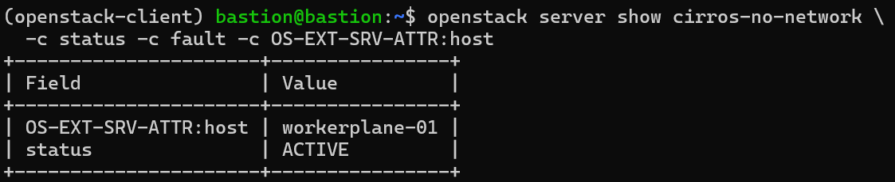
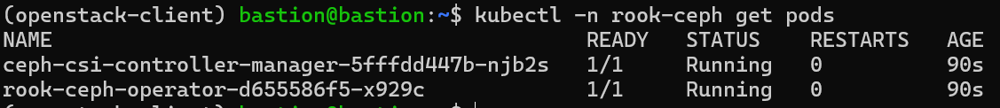
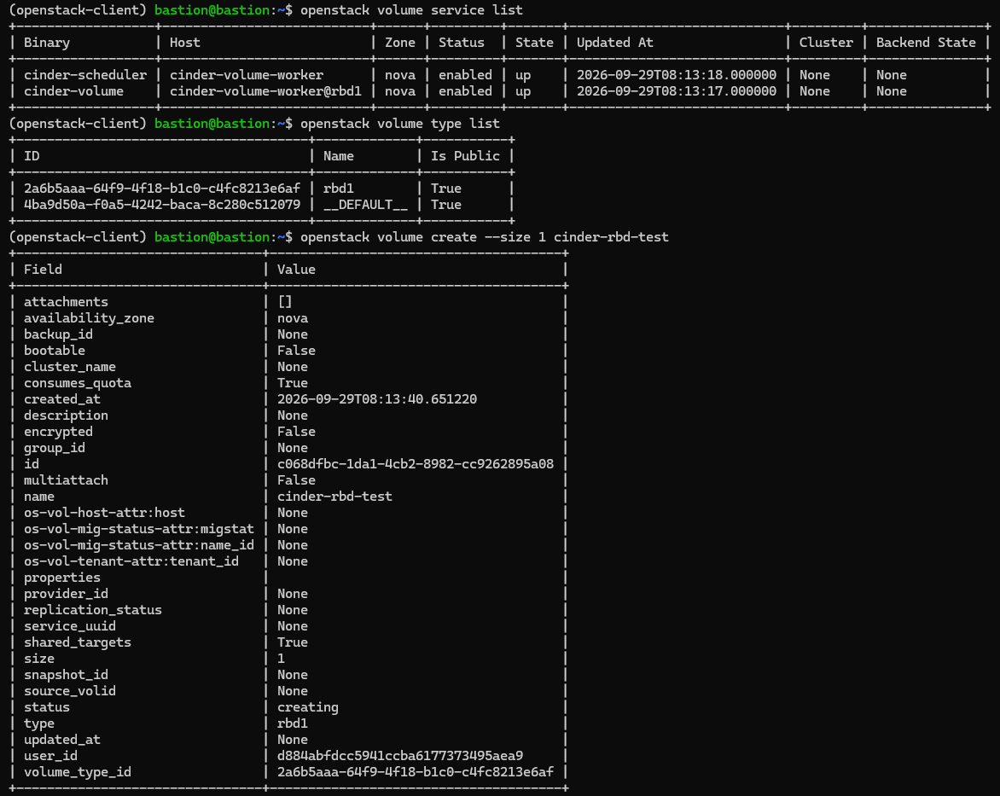
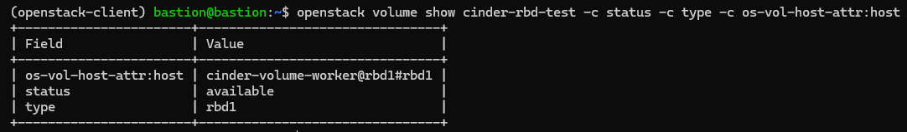
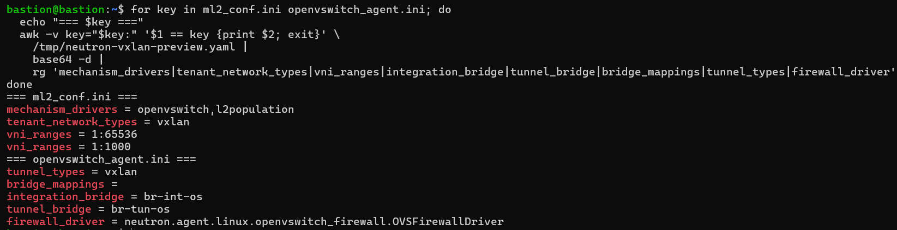

# OpenStack Helm on K8s Cluster
## 1. Check để kiểm soát bare-metal lab

**Check**:
```bash
kubectl get nodes -o wide
kubectl describe nodes | grep -E '^(Name:|Taints:|Capacity:|Allocatable:)|^[[:space:]]+(cpu:|memory:|ephemeral-storage:)'
kubectl get storageclass
kubectl get pv,pvc -A
kubectl get pods -A -o wide
```
```bash
kubectl get csidriver
kubectl get daemonset -A
kubectl -n kube-system logs deployment/coredns --tail=80
kubectl -n kube-system describe pod coredns-5595ddfdbc-fp5c5
```
- Nâng CPU/RAM cho cả hai Talos VM nếu cần:
```bash
kubectl get nodes
kubectl describe nodes | grep -E '^(Name:|Allocatable:)|^[[:space:]]+(cpu:|memory:)'
kubectl get pods -A
```

```bash
talosctl -n 192.168.207.139 read /proc/cpuinfo | grep -m1 -E 'vmx|svm'
talosctl -n 192.168.207.139 read /proc/modules | grep -E '^kvm(_intel|_amd)? '
talosctl -n 192.168.207.139 get links
talosctl -n 192.168.207.139 get addresses
```

## 2. Cài Provisioner
```bash
kubectl apply -f https://raw.githubusercontent.com/rancher/local-path-provisioner/v0.0.37/deploy/local-path-storage.yaml

kubectl -n local-path-storage rollout status deployment/local-path-provisioner --timeout=180s
```
- Trỏ nó vào 2 volume Talos: Lệnh này thay riêng cấu hình đường dẫn của provisioner. Node khác hai tên bên dưới sẽ không được cấp local PV:
```bash
kubectl -n local-path-storage patch configmap local-path-config \
  --type=merge \
  -p '{"data":{"config.json":"{\"nodePathMap\":[{\"node\":\"controlplane-01\",\"paths\":[\"/var/mnt/local-storage\"]},{\"node\":\"workerplane-01\",\"paths\":[\"/var/mnt/local-path-provisioner\"]},{\"node\":\"DEFAULT_PATH_FOR_NON_LISTED_NODES\",\"paths\":[]}]}"}}'
```
- Kiểm tra cấu hình đã nhận
```bash
kubectl -n local-path-storage get configmap local-path-config \
  -o jsonpath='{.data.config\.json}{"\n"}'

kubectl -n local-path-storage logs deployment/local-path-provisioner --tail=40
kubectl get storageclass
```
- Thử đúng ổ 70GB của worker: Tạo một PVC 1 GiB và pod cố định trên workerplane-01:
```bash
kubectl apply -f - <<'EOF'
apiVersion: v1
kind: PersistentVolumeClaim
metadata:
  name: test-worker-storage
spec:
  accessModes:
    - ReadWriteOnce
  storageClassName: local-path
  resources:
    requests:
      storage: 1Gi
---
apiVersion: v1
kind: Pod
metadata:
  name: test-worker-storage
spec:
  nodeSelector:
    kubernetes.io/hostname: workerplane-01
  containers:
    - name: test
      image: busybox:1.36
      command: ["sh", "-c", "sleep 36000"]
      volumeMounts:
        - name: data
          mountPath: /data
  volumes:
    - name: data
      persistentVolumeClaim:
        claimName: test-worker-storage
EOF
```
```bash
kubectl get pod test-worker-storage -o wide
kubectl get pvc test-worker-storage
kubectl get pv
kubectl exec test-worker-storage -- sh -c 'echo openstack-lab > /data/check.txt && cat /data/check.txt'
```
- Nếu lỗi:
```bash
kubectl describe pod test-worker-storage
kubectl describe pvc test-worker-storage
kubectl -n local-path-storage logs deployment/local-path-provisioner --tail=100
```

- Có 1 lỗi nhỏ: `Local-path-provisioner` cần helper pod truy cập đường dẫn trên host để tạo thư mục PV. Chính sách baseline của namespace local-path-storage chặn việc đó. Đây là lý do PV chưa được tạo.
- Sửa đúng namespace của provisioner, không cần nới chính sách cho namespace default hoặc toàn cụm:
```bash
kubectl label namespace local-path-storage \
  pod-security.kubernetes.io/enforce=privileged \
  --overwrite
```
Sau đó provisioner sẽ tự thử lại PVC đang Pending; không cần xóa hay tạo lại PVC/pod. Kiểm tra:
```bash
kubectl wait --for=condition=Ready pod/test-worker-storage --timeout=120s
kubectl get pvc test-worker-storage
kubectl get pv -o wide
kubectl get pod test-worker-storage -o wide
```
- Ghi dữ liệu xem đường dẫn PV:
```bash
kubectl exec test-worker-storage -- sh -c 'echo openstack-lab > /data/check.txt && cat /data/check.txt'

kubectl get pv pvc-e824b1f2-fd7d-48d8-a797-a0d8aad63f3b \
  -o jsonpath='{.spec.hostPath.path}{"\n"}'
```
- Xóa riêng pod rồi tạo lại với cùng PVC
```bash
kubectl delete pod test-worker-storage
```
```bash
kubectl apply -f - <<'EOF'
apiVersion: v1
kind: Pod
metadata:
  name: test-worker-storage
spec:
  nodeSelector:
    kubernetes.io/hostname: workerplane-01
  containers:
    - name: test
      image: busybox:1.36
      command: ["sh", "-c", "sleep 36000"]
      volumeMounts:
        - name: data
          mountPath: /data
  volumes:
    - name: data
      persistentVolumeClaim:
        claimName: test-worker-storage
EOF
```
```bash
kubectl wait --for=condition=Ready pod/test-worker-storage --timeout=120s
kubectl exec test-worker-storage -- cat /data/check.txt
```
- Thử PVC trên control plane:
```bash
kubectl apply -f - <<'EOF'
apiVersion: v1
kind: PersistentVolumeClaim
metadata:
  name: test-control-storage
spec:
  accessModes:
    - ReadWriteOnce
  storageClassName: local-path
  resources:
    requests:
      storage: 1Gi
---
apiVersion: v1
kind: Pod
metadata:
  name: test-control-storage
spec:
  nodeSelector:
    kubernetes.io/hostname: controlplane-01
  containers:
    - name: test
      image: busybox:1.36
      command: ["sh", "-c", "sleep 36000"]
      volumeMounts:
        - name: data
          mountPath: /data
  volumes:
    - name: data
      persistentVolumeClaim:
        claimName: test-control-storage
EOF
```
```bash
kubectl wait --for=condition=Ready pod/test-control-storage --timeout=120s
kubectl get pod test-control-storage -o wide
kubectl get pvc test-control-storage
kubectl get pv -o jsonpath='{range .items[*]}{.metadata.name}{"  "}{.spec.hostPath.path}{"\n"}{end}'
kubectl exec test-control-storage -- sh -c 'echo control-ok > /data/check.txt && cat /data/check.txt'
```
- Xác nhận thành công dọn dẹp
```bash
kubectl delete pod test-control-storage test-worker-storage
kubectl delete pvc test-control-storage test-worker-storage
kubectl get pv,pvc -A
```
- Thêm mạng provider riêng trong VMware
```bash
talosctl -n 192.168.207.139 get links
talosctl -n 192.168.207.139 get addresses
```

## 3. Một chút lưu ý kiến thức

| Thành phần sẽ cài | Node dự kiến | Phần nằm trên `/dev/sda` | Dữ liệu cần lưu lâu dài dự kiến trên `/dev/sdb` |
|---|---|---|---|
| MariaDB | Control plane | Container image, log/tạm | Database qua PVC trên **sdb 10 GB** |
| RabbitMQ | Control plane | Container image, log/tạm | Dữ liệu queue qua PVC trên **sdb 10 GB** |
| Memcached | Control plane | Container image, dữ liệu cache tạm | Không cần PVC |
| Keystone API | Control plane | Container image, phần ghi tạm | Thông tin Keystone nằm trong MariaDB |
| Glance API | Control plane | Container image, phần ghi tạm | **Glance image phải có backend riêng**; dự kiến PVC, nhưng sdb control chỉ 10 GB nên phải giới hạn image hoặc đặt backend trên worker |
| Placement API | Control plane | Container image, phần ghi tạm | Thông tin trong MariaDB |
| Nova API, scheduler, conductor | Control plane | Container image, phần ghi tạm | Thông tin VM trong MariaDB; không phải đĩa VM |
| Neutron server | Control plane | Container image, phần ghi tạm | Thông tin network trong MariaDB |
| Horizon | Control plane | Container image, phần ghi tạm | Không cần đĩa lớn riêng |
| OVS/agent Neutron, libvirt, nova-compute | Worker | Container image, log/tạm và một số dữ liệu host | **Đĩa VM và image cache phải cấu hình rõ đường dẫn** để nằm trên **sdb 60 GB**, nếu không có thể làm đầy sda 10 GB |

- Kiểm tra READ-ONLY 
```bash
kubectl get pv,pvc -A
kubectl -n kube-system get daemonset ovs-ovn -o yaml | grep -A8 -B4 -E 'hostPath:|mountPath:|/run/openvswitch|/var/run/openvswitch|/var/lib/openvswitch'
kubectl -n kube-system get daemonset kube-ovn-cni -o yaml | grep -A8 -B4 -E 'hostPath:|mountPath:|/run/openvswitch|/var/run/openvswitch'
kubectl get nodes --show-labels
```
```bash
kubectl -n kube-system get svc,pod -o wide | grep -E 'ovn|ovs|NAME'
helm list -A
helm repo list
helm plugin list
kubectl get nodes -o wide
```
## 4. Chuẩn bị Helm và render chat
```bash
helm repo add openstack-helm https://tarballs.opendev.org/openstack/openstack-helm
helm repo update
helm plugin install https://opendev.org/openstack/openstack-helm-plugin
```
- Check:
```bash
helm repo list
helm plugin list
helm search repo openstack-helm/neutron --versions | head -12
helm search repo openstack-helm/ovn --versions | head -12
helm search repo openstack-helm/nova --versions | head -12
```
- Check values thực tế trước
```bash
helm show values openstack-helm/neutron \
  --version '2026.1.69+4e05862fc' \
  | grep -nE 'backend:|mechanism_drivers:|ovn_nb_connection:|ovn_sb_connection:|daemonset_ovs_agent:|daemonset_ovn_agent:|daemonset_l3_agent:|daemonset_dhcp_agent:' 

helm show values openstack-helm/nova \
  --version '2026.1.44+89c5a3c84' \
  | grep -nE 'ceph:|enabled:|nova-compute|ovn-controller|libvirt|instances_path'

helm show values openstack-helm/ovn \
  --version '2026.1.35+c73f68ac8' \
  | grep -nE 'daemonset_ovn_controller:|statefulset_ovn|deployment_ovn|ovn_nb|ovn_sb|external'
```

```bash
helm show values openstack-helm/neutron \
  --version '2026.1.69+4e05862fc' | sed -n '115,145p;2135,2180p;2775,2810p'

helm show values openstack-helm/nova \
  --version '2026.1.44+89c5a3c84' | sed -n '245,290p;590,615p'

kubectl -n kube-system get pod ovs-ovn-dhs2h --show-labels
```

```bash
kubectl create namespace openstack

kubectl label node controlplane-01 \
  openstack-control-plane=enabled --overwrite

kubectl label node workerplane-01 \
  openstack-compute-node=enabled --overwrite

kubectl get nodes \
  -L openstack-control-plane,openstack-compute-node
```

```bash
kubectl label namespace openstack \
  pod-security.kubernetes.io/enforce=privileged \
  --overwrite
```
## 5. Install RabbitMQ
```bash
RABBIT_CHART_VERSION=$(helm search repo openstack-helm/rabbitmq --versions | awk 'NR==2 {print $2}')
printf 'RabbitMQ chart: %s\n' "$RABBIT_CHART_VERSION"
```
- Render trước chưa cài
```bash
helm template rabbitmq openstack-helm/rabbitmq \
  --version "$RABBIT_CHART_VERSION" \
  --namespace openstack \
  --set pod.replicas.server=1 \
  --set volume.class_name=local-path \
  --set volume.size=768Mi \
  > /tmp/rabbitmq-rendered.yaml

grep -nE 'kind: StatefulSet|kind: PersistentVolumeClaim|storageClassName:|storage: 768Mi|openstack-control-plane' \
  /tmp/rabbitmq-rendered.yaml | head -30
```
- Cài đặt
```bash
helm upgrade --install rabbitmq openstack-helm/rabbitmq \
  --version '2026.1.27+a606f21e3' \
  --namespace openstack \
  --set pod.replicas.server=1 \
  --set volume.class_name=local-path \
  --set volume.size=768Mi \
  --wait --timeout 10m
```
- Check vị trí pod, dữ liệu
```bash
helm -n openstack status rabbitmq
kubectl -n openstack get pods,pvc -o wide
kubectl get pv -o jsonpath='{range .items[*]}{.metadata.name}{"  "}{.spec.hostPath.path}{"\n"}{end}'
```
## 6. MariaDB
```bash
MARIADB_CHART_VERSION=$(helm search repo openstack-helm/mariadb --versions | awk 'NR==2 {print $2}')
printf 'MariaDB chart: %s\n' "$MARIADB_CHART_VERSION"

helm template mariadb openstack-helm/mariadb \
  --version "$MARIADB_CHART_VERSION" \
  --namespace openstack \
  --set pod.replicas.server=1 \
  --set volume.class_name=local-path \
  --set volume.size=3Gi \
  --set volume.backup.enabled=false \
  > /tmp/mariadb-rendered.yaml

grep -nE 'kind: StatefulSet|storageClassName:|storage: 3Gi|openstack-control-plane' \
  /tmp/mariadb-rendered.yaml | head -35
```
- Render đúng không báo lỗi enabled đầy đủ là oke:
```bash
MariaDB chart: 2026.1.24+0ee5adeff
2869:        openstack-control-plane: enabled
2948:kind: StatefulSet
3025:        openstack-control-plane: enabled
3234:          storage: 3Gi
3235:      storageClassName: local-path
3260:    openstack-control-plane: enabled
```
```bash
helm upgrade --install mariadb openstack-helm/mariadb \
  --version '2026.1.24+0ee5adeff' \
  --namespace openstack \
  --set pod.replicas.server=1 \
  --set volume.class_name=local-path \
  --set volume.size=3Gi \
  --set volume.backup.enabled=false \
  --wait --timeout 10m
```
```bash
helm -n openstack status mariadb
kubectl -n openstack get pods,pvc -o wide
kubectl get pv -o jsonpath='{range .items[*]}{.metadata.name}{"  "}{.spec.hostPath.path}{"\n"}{end}'
```
```bash
kubectl -n openstack get events --sort-by=.lastTimestamp | tail -30
```
## 7. Memcached
```bash
MEMCACHED_CHART_VERSION=$(helm search repo openstack-helm/memcached --versions | awk 'NR==2 {print $2}')
printf 'Memcached chart: %s\n' "$MEMCACHED_CHART_VERSION"

helm upgrade --install memcached openstack-helm/memcached \
  --version "$MEMCACHED_CHART_VERSION" \
  --namespace openstack \
  --wait --timeout 5m
```
```bash
helm -n openstack status memcached
kubectl -n openstack get pods -o wide
kubectl -n openstack get svc | grep -E 'mariadb|rabbitmq|memcached'
```
## 7. Keystone
```bash
mkdir -p ~/osh-lab/overrides

KEYSTONE_CHART_VERSION=$(helm search repo openstack-helm/keystone --versions | awk 'NR==2 {print $2}')
printf 'Keystone chart: %s\n' "$KEYSTONE_CHART_VERSION"

helm osh get-values-overrides \
  -d \
  -p ~/osh-lab/overrides \
  -c keystone \
  2026.1 ubuntu_noble
```
```bash
find ~/osh-lab/overrides/keystone -maxdepth 1 -type f -print

helm osh get-values-overrides \
  -p ~/osh-lab/overrides \
  -c keystone \
  2026.1 ubuntu_noble
```
```bash
helm template keystone openstack-helm/keystone \
  --version '2026.1.39+506b0bcb2' \
  --namespace openstack \
  --values ~/osh-lab/overrides/keystone/2026.1-ubuntu_noble.yaml \
  > /tmp/keystone-rendered.yaml

grep -nE '^kind: (Deployment|Job|Service)$|name: keystone-api|openstack-control-plane' \
  /tmp/keystone-rendered.yaml | head -45

sed -n '1,100p' ~/osh-lab/overrides/keystone/2026.1-ubuntu_noble.yaml
```
```bash
helm upgrade --install keystone openstack-helm/keystone \
  --version '2026.1.39+506b0bcb2' \
  --namespace openstack \
  --values ~/osh-lab/overrides/keystone/2026.1-ubuntu_noble.yaml \
  --wait --timeout 15m
```
- Check
```bash
helm -n openstack status keystone
kubectl -n openstack get pods -o wide
kubectl -n openstack get svc keystone-api
```
## 8. Placement
```bash
PLACEMENT_CHART_VERSION=$(helm search repo openstack-helm/placement --versions | awk 'NR==2 {print $2}')
printf 'Placement chart: %s\n' "$PLACEMENT_CHART_VERSION"

helm osh get-values-overrides \
  -d -p ~/osh-lab/overrides \
  -c placement 2026.1 ubuntu_noble

find ~/osh-lab/overrides/placement -maxdepth 1 -type f -print
```
```bash
helm upgrade --install placement openstack-helm/placement \
  --version '2026.1.35+6cec8010b' \
  --namespace openstack \
  --values ~/osh-lab/overrides/placement/2026.1-ubuntu_noble.yaml \
  --wait --timeout 15m
```
```bash
helm -n openstack status placement
kubectl -n openstack get pods -o wide
kubectl -n openstack get svc | grep placement
```
## 9. Glance
```bash
GLANCE_CHART_VERSION=$(helm search repo openstack-helm/glance --versions | awk 'NR==2 {print $2}')
printf 'Glance chart: %s\n' "$GLANCE_CHART_VERSION"

helm osh get-values-overrides \
  -d -p ~/osh-lab/overrides \
  -c glance 2026.1 ubuntu_noble

helm show values openstack-helm/glance \
  --version "$GLANCE_CHART_VERSION" \
  | grep -n -A12 -B3 -E '^storage:|^volume:|^volume_staging:|^labels:|^  replicas:'
```
Render và check
```bash
cat > ~/osh-lab/overrides/glance/lab-worker-pvc.yaml <<'EOF'
storage: pvc

labels:
  api:
    node_selector_key: kubernetes.io/hostname
    node_selector_value: workerplane-01

volume:
  class_name: local-path
  size: 10Gi
  accessModes:
    - ReadWriteOnce

volume_staging:
  class_name: local-path
  size: 2Gi
  accessModes:
    - ReadWriteOnce
EOF

helm template glance openstack-helm/glance \
  --version '2026.1.39+dd5656a9c' \
  --namespace openstack \
  --values ~/osh-lab/overrides/glance/2026.1-ubuntu_noble.yaml \
  --values ~/osh-lab/overrides/glance/lab-worker-pvc.yaml \
  > /tmp/glance-rendered.yaml

grep -n -A12 -B4 -E \
  '^kind: PersistentVolumeClaim$|^kind: Deployment$|storageClassName:|storage: 10Gi|storage: 2Gi|kubernetes.io/hostname: workerplane-01' \
  /tmp/glance-rendered.yaml | head -110
```
- Cài đặt
```bash
helm upgrade --install glance openstack-helm/glance \
  --version '2026.1.39+dd5656a9c' \
  --namespace openstack \
  --values ~/osh-lab/overrides/glance/2026.1-ubuntu_noble.yaml \
  --values ~/osh-lab/overrides/glance/lab-worker-pvc.yaml \
  --wait --timeout 15m
```
- Check
```bash
helm -n openstack status glance
kubectl -n openstack get pods,pvc -o wide
kubectl get pv -o jsonpath='{range .items[*]}{.metadata.name}{"  "}{.spec.claimRef.name}{"  "}{.spec.hostPath.path}{"\n"}{end}'
```


## 10. Cài đặt libvirt
- Check kỹ cấu hình bằng các lệnh sau:
```bash
talosctl -n 192.168.207.139 ls /dev/kvm
talosctl -n 192.168.207.139 read /proc/modules | grep -E '^kvm(_intel|_amd)? ' || true
talosctl -n 192.168.207.139 df -h /var /var/mnt/local-path-provisioner
LIBVIRT_CHART_VERSION=$(helm search repo openstack-helm/libvirt --versions | awk 'NR==2 {print $2}')
printf 'Libvirt chart: %s\n' "$LIBVIRT_CHART_VERSION"

helm show values openstack-helm/libvirt \
  --version "$LIBVIRT_CHART_VERSION" \
  | grep -n -A14 -B5 -E \
    '^  ceph:|^  virt_type:|^  instances:|/dev/kvm|/var/lib/nova|openstack-compute-node|^  libvirt:'
```

Render cho thấy một điểm cần xử lý trước khi cài: libvirt đang chờ pod neutron-ovs-agent trên cùng node (DEPENDENCY_POD_JSON), trong khi mình muốn là Neutron/OVN dùng OVS do Kube-OVN quản lý. Nếu cài ngay, libvirt sẽ kẹt ở init container. Manifest cũng gắn /var/lib/nova từ host, nên cần xác định chính xác hostPath để chuyển đĩa VM sang volume 60 GB.

```bash
helm show values openstack-helm/libvirt \
  --version '2026.1.29+a34a2f9b9' \
  | grep -n -A45 -B8 -E '^dependencies:|^  static:|^  targeted:|^  backend:|^  libvirt:'
```
```bash
sed -n '560,590p;600,625p;650,725p' /tmp/libvirt-rendered.yaml
```
```bash
helm template nova openstack-helm/nova \
  --version '2026.1.44+89c5a3c84' \
  --namespace openstack \
  --set conf.ceph.enabled=false \
  > /tmp/nova-inspect.yaml

grep -n -A7 -B5 -E \
  'path: /var/lib/nova|mountPath: /var/lib/nova|instances_path:|DEPENDENCY_POD_JSON|openstack-compute-node' \
  /tmp/nova-inspect.yaml | head -150
```
- Check trên bastion:
```bash
talosctl -n 192.168.207.139 get volumeconfig EPHEMERAL -o yaml
talosctl -n 192.168.207.139 get disks
```

> Lưu ý ngoài luồng
```bash
talosctl -n 192.168.207.139 mounts | grep -E ' /var$|/var/mnt/local-path-provisioner'
```
```bash
talosctl -n 192.168.207.139 reboot
kubectl wait node/workerplane-01 --for=condition=Ready --timeout=10m
talosctl -n 192.168.207.139 mounts | grep -E ' /var$|/var/mnt/local-path-provisioner'
kubectl -n openstack get pod -l application=glance -o wide
```

Sửa dependency của libvirt
```bash
cat > ~/osh-lab/overrides/libvirt/lab.yaml <<'EOF'
conf:
  ceph:
    enabled: false

dependencies:
  dynamic:
    targeted:
      openvswitch:
        libvirt:
          pod: []
EOF

helm template libvirt openstack-helm/libvirt \
  --version '2026.1.29+a34a2f9b9' \
  --namespace openstack \
  --values ~/osh-lab/overrides/libvirt/2026.1-ubuntu_noble.yaml \
  --values ~/osh-lab/overrides/libvirt/lab.yaml \
  > /tmp/libvirt-lab-rendered.yaml

grep -n -A2 -B2 -E \
  'DEPENDENCY_POD_JSON|openstack-compute-node:|path: /var/lib/nova|path: /run$' \
  /tmp/libvirt-lab-rendered.yaml
```
- Cài đặt libvirt
```bash
helm upgrade --install libvirt openstack-helm/libvirt \
  --version '2026.1.29+a34a2f9b9' \
  --namespace openstack \
  --values ~/osh-lab/overrides/libvirt/2026.1-ubuntu_noble.yaml \
  --values ~/osh-lab/overrides/libvirt/lab.yaml \
  --wait --timeout 10m
```
```bash
helm -n openstack status libvirt
kubectl -n openstack get pods -l application=libvirt -o wide
kubectl -n openstack get daemonset -l application=libvirt
kubectl get nodes
```
- Check log nếu k chạy đc
```bash
kubectl -n openstack describe pod -l application=libvirt
kubectl -n openstack logs -l application=libvirt --all-containers --tail=80
```

## 12. (Option) Gỡ cài đặt libvirt 
```bash
helm uninstall libvirt -n openstack
kubectl -n openstack get pods -l application=libvirt
```
- Nếu kẹt
```bash
kubectl -n openstack delete pod -l application=libvirt --force --grace-period=0
```
- Reboot worker
```bash
talosctl -n 192.168.207.139 reboot
kubectl get nodes -w
```
- Kiểm tra đã sạch:
```bash
helm ls -n openstack
kubectl -n openstack get all -l application=libvirt
```
- Tùy chọn dọn sạch thư mục:
```bash
kubectl debug node/workerplane-01 -it --image=busybox -- \
  sh -c 'rm -rf /host/var/lib/libvirt-etc /host/var/lib/libvirt /host/var/log/libvirt'
```
- Xóa pod debug còn xót lại:
```bash
kubectl get pods | grep node-debugger
kubectl delete pod <tên-pod-node-debugger>
```
- Dọn sạch rác kube-OVN 
```bash
kubectl -n kube-system get pods --field-selector=status.phase=Failed --no-headers | wc -l
kubectl -n kube-system delete pods --field-selector=status.phase=Failed
kubectl -n kube-system get pods | grep ovs-ovn
```

## 13. Cài lại libvirt
```bash
LIBVIRT_CHART_VERSION='2026.1.29+a34a2f9b9'
mkdir -p ~/osh-lab/charts-clean

helm pull openstack-helm/libvirt \
  --version "$LIBVIRT_CHART_VERSION" \
  --untar \
  --untardir ~/osh-lab/charts-clean

grep -n -C4 -E \
  'path: /etc/libvirt/qemu|path: /etc/modprobe.d|path: /var/lib/nova|path: /run$|path: /sys/fs/cgroup' \
  ~/osh-lab/charts-clean/libvirt/templates/daemonset-libvirt.yaml

grep -n -C5 -E \
  'cgcreate|cgexec|systemd-run|libvirtd --listen' \
  ~/osh-lab/charts-clean/libvirt/templates/bin/_libvirt.sh.tpl
```
```bash
python3 - <<'PY'
from pathlib import Path

root = Path.home() / "osh-lab/charts-clean/libvirt"

ds = root / "templates/daemonset-libvirt.yaml"
s = ds.read_text()
old = """        - name: etc-libvirt-qemu
          hostPath:
            path: /etc/libvirt/qemu
"""
new = """        - name: etc-libvirt-qemu
          hostPath:
            path: /var/lib/libvirt/qemu
"""
assert s.count(old) == 1, f"hostPath match count: {s.count(old)}"
ds.write_text(s.replace(old, new))

script = root / "templates/bin/_libvirt.sh.tpl"
s = script.read_text()
old = "cgexec -g ${CGROUPS%,}:/osh-libvirt systemd-run --scope --slice=system libvirtd --listen"
assert s.count(old) == 2, f"startup match count: {s.count(old)}"
assert s.count("cgcreate -g ${CGROUPS%,}:/osh-libvirt") == 1
s = s.replace("cgcreate -g ${CGROUPS%,}:/osh-libvirt", ': "Use container runtime cgroup"')
s = s.replace(old + " &", "libvirtd --listen &")
s = s.replace(old, "exec libvirtd --listen")
script.write_text(s)
PY

cat > ~/osh-lab/overrides/libvirt/talos-lab.yaml <<'EOF'
conf:
  ceph:
    enabled: false
  libvirt:
    log_outputs: "1:stderr"

dependencies:
  dynamic:
    targeted:
      openvswitch:
        libvirt:
          pod: []
EOF

helm template libvirt ~/osh-lab/charts-clean/libvirt \
  -n openstack \
  -f ~/osh-lab/overrides/libvirt/2026.1-ubuntu_noble.yaml \
  -f ~/osh-lab/overrides/libvirt/talos-lab.yaml \
  > /tmp/libvirt-talos-clean.yaml

grep -n -E \
  'systemd-run|cgexec|cgcreate|Use container runtime cgroup|exec libvirtd --listen|path: /var/lib/libvirt/qemu|DEPENDENCY_POD_JSON|openstack-compute-node:' \
  /tmp/libvirt-talos-clean.yaml | head -25
```
```bash
cat ~/osh-lab/overrides/libvirt/talos-lab.yaml
sed -n '45,60p;78,85p;155,163p' \
  ~/osh-lab/charts-clean/libvirt/templates/bin/_libvirt.sh.tpl
```

```bash
kubectl -n openstack describe pod libvirt-libvirt-default-62blx | tail -65

kubectl -n openstack logs libvirt-libvirt-default-62blx \
  -c libvirt --tail=100

kubectl -n openstack get pod libvirt-libvirt-default-62blx \
  -o jsonpath='{range .status.initContainerStatuses[*]}init {.name}: {.state.terminated.reason}{"\n"}{end}{range .status.containerStatuses[*]}container {.name}: ready={.ready}, restarts={.restartCount}{"\n"}{end}'
```
```bash
talosctl -n 192.168.207.139 read /var/log/libvirt/libvirtd.log | tail -80
```

## 14. Horizon
```bash
HORIZON_CHART_VERSION=$(helm search repo openstack-helm/horizon --versions | awk 'NR==2 {print $2}')
printf 'Horizon chart: %s\n' "$HORIZON_CHART_VERSION"

helm osh get-values-overrides \
  -d -p ~/osh-lab/overrides \
  -c horizon 2026.1 ubuntu_noble

helm template horizon openstack-helm/horizon \
  --version "$HORIZON_CHART_VERSION" \
  --namespace openstack \
  --values ~/osh-lab/overrides/horizon/2026.1-ubuntu_noble.yaml \
  > /tmp/horizon-rendered.yaml

grep -nE '^kind: (Deployment|DaemonSet|StatefulSet|PersistentVolumeClaim)$|openstack-control-plane:|openstack-compute-node:|path: /run$|path: /dev$' \
  /tmp/horizon-rendered.yaml | head -50
```
```bash
helm upgrade --install horizon openstack-helm/horizon \
  --version '2026.1.31+0ee5adeff' \
  --namespace openstack \
  --values ~/osh-lab/overrides/horizon/2026.1-ubuntu_noble.yaml \
  --wait --timeout 10m
```
```bash
kubectl -n openstack get pods -l application=horizon -o wide
kubectl -n openstack get svc | grep horizon
```

kiểm tra trang đăng nhập qua bastion. Mở một terminal trên bastion và giữ lệnh này chạy:
```bash
kubectl -n openstack port-forward svc/horizon-int 18080:80
```
Ở terminal bastion thứ hai:
```bash
ssh -L 18080:127.0.0.1:18080 bastion@192.168.207.138
```
Giữ cửa sổ SSH đó mở, rồi vào `http://127.0.0.1:18080/auth/login/` trên trình duyệt Windows. Đăng nhập bằng tài khoản admin và mật khẩu Keystone bạn đã cấu hình khi cài chart.
- Tên đăng nhập admin - password - default


## 15. Cài lại libvirt
```bash
cat > ~/osh-lab/overrides/libvirt/talos-lab.yaml <<'EOF'
conf:
  ceph:
    enabled: false
  libvirt:
    log_level: "1"
    log_outputs: "1:stderr"

network:
  backend:
    - openvswitch

dependencies:
  dynamic:
    targeted:
      openvswitch:
        libvirt:
          pod: []
EOF
```
- Render trước khi cài:
```bash
helm template libvirt ~/osh-lab/charts/libvirt \
  --namespace openstack \
  --values ~/osh-lab/overrides/libvirt/talos-lab.yaml \
  > /tmp/libvirt-talos-rendered.yaml
```
- Nếu báo lỗi dừng lại nếu không check tiếp:
```bash
grep -n -E \
  'image:|path: /run$|mountPath: /run$|path: /run/libvirt$|mountPath: /run/libvirt$|path: /var/lib/libvirt-etc/|path: /etc/libvirt/qemu$|path: /etc/modprobe.d$|systemd-run|cgexec|cgcreate|DEPENDENCY_POD_JSON|openstack-compute-node:' \
  /tmp/libvirt-talos-rendered.yaml | tail -65
```
- Cài release:
```bash
kubectl label node workerplane-01 \
  openstack-compute-node=enabled --overwrite

helm install libvirt ~/osh-lab/charts/libvirt \
  --namespace openstack \
  --values ~/osh-lab/overrides/libvirt/talos-lab.yaml \
  --timeout 10m
```
- Xác nhận libvirt dùng được:
```bash
kubectl -n openstack get pods -l application=libvirt -o wide

kubectl -n openstack logs \
  -l application=libvirt -c libvirt --tail=100

kubectl -n openstack describe pod \
  -l application=libvirt | tail -70
```
```bash
LIBVIRT_POD=$(kubectl -n openstack get pod \
  -l application=libvirt \
  -o jsonpath='{.items[0].metadata.name}')

kubectl -n openstack exec "$LIBVIRT_POD" \
  -c libvirt -- timeout 12s virsh -c qemu:///system list --all
```
- Xác nhận thành công
```bash
kubectl -n openstack exec libvirt-libvirt-default-qf67p \
  -c libvirt -- timeout 12s virsh -c qemu:///system list --all
```

## 26. Chuẩn bị cài Nova
```bash
helm search repo openstack-helm/nova --versions | head -8

helm -n openstack list

kubectl get node workerplane-01 \
  -L openstack-compute-node
```
```bash
mkdir -p ~/osh-lab/charts ~/osh-lab/overrides/nova

helm pull openstack-helm/nova \
  --version '2026.1.44+89c5a3c84' \
  --untar \
  --untardir ~/osh-lab/charts

helm osh get-values-overrides \
  -d \
  -u https://opendev.org/openstack/openstack-helm/raw/branch/master/values_overrides \
  -p ~/osh-lab/overrides \
  -c nova \
  2026.1 ubuntu_noble

find ~/osh-lab/overrides/nova \
  -maxdepth 1 -type f -print | sort
```
```bash
cat ~/osh-lab/overrides/nova/2026.1-ubuntu_noble.yaml

grep -n -C 3 -E \
  'ceph:|backend:|openvswitch:|neutron:|libvirt:|node_selector_key:|node_selector_value:|bootstrap:|wait_for_computes:' \
  ~/osh-lab/charts/nova/values.yaml | head -240

grep -R -n -E \
  'hostPath:|path: /run|path: /etc|systemd-run|cgexec|cgcreate' \
  ~/osh-lab/charts/nova/templates/daemonset-compute.yaml \
  ~/osh-lab/charts/nova/templates/bin 2>/dev/null | head -100
```
```bash
sed -n '240,325p' ~/osh-lab/charts/nova/values.yaml

sed -n '390,565p' \
  ~/osh-lab/charts/nova/templates/daemonset-compute.yaml

kubectl get nodes \
  -L openstack-control-plane,openstack-compute-node
```
- Tạo Overwrite nova cho lab
```bash
cat > ~/osh-lab/overrides/nova/talos-lab.yaml <<'EOF'
conf:
  ceph:
    enabled: false
  enable_iscsi: false

network:
  backend:
    - openvswitch

dependencies:
  dynamic:
    targeted:
      openvswitch:
        compute:
          pod: []

bootstrap:
  wait_for_computes:
    enabled: false
EOF
```
```bash
python3 - <<'PY'
from pathlib import Path

p = Path.home() / "osh-lab/charts/nova/templates/daemonset-compute.yaml"
s = p.read_text()

mount_old = """            - name: run
              mountPath: /run
"""
mount_new = """            - name: run
              mountPath: /run/libvirt
"""
host_old = """        - name: run
          hostPath:
            path: /run
"""
host_new = """        - name: run
          hostPath:
            path: /run/libvirt
            type: DirectoryOrCreate
"""

assert s.count(mount_old) == 1, f"run mount: {s.count(mount_old)} matches"
assert s.count(host_old) == 1, f"run hostPath: {s.count(host_old)} matches"

s = s.replace(mount_old, mount_new).replace(host_old, host_new)
p.write_text(s)
PY
```
- Render
```bash
helm template nova ~/osh-lab/charts/nova \
  -n openstack \
  -f ~/osh-lab/overrides/nova/2026.1-ubuntu_noble.yaml \
  -f ~/osh-lab/overrides/nova/talos-lab.yaml \
  > /tmp/nova-talos-rendered.yaml

grep -n -E \
  'path: /run$|mountPath: /run$|path: /run/libvirt$|mountPath: /run/libvirt$|path: /etc/iscsi$|path: /etc/multipath$|DEPENDENCY_POD_JSON|openstack-control-plane:|openstack-compute-node:' \
  /tmp/nova-talos-rendered.yaml | tail -70
```
```bash
sed -n '2985,2996p' /tmp/nova-talos-rendered.yaml
```
```bash
helm install nova ~/osh-lab/charts/nova \
  -n openstack \
  -f ~/osh-lab/overrides/nova/2026.1-ubuntu_noble.yaml \
  -f ~/osh-lab/overrides/nova/talos-lab.yaml \
  --timeout 10m
```
```bash
helm -n openstack status nova
kubectl -n openstack get pods -l application=nova -o wide
```
```bash
kubectl -n openstack describe pod nova-cell-setup-rfkc8 | tail -65

kubectl -n openstack describe pod nova-compute-default-wxcfp | tail -80

kubectl -n openstack describe pod nova-bootstrap-6b959 | tail -55
```
- check
```bash
bastion@bastion:~$ kubectl -n openstack get pod nova-cell-setup-rfkc8 \
  -o jsonpath='{range .spec.initContainers[?(@.name=="init")].env[?(@.name=="DEPENDENCY_POD_JSON")]}{.value}{"\n"}{end}'

kubectl -n openstack get pod nova-compute-default-wxcfp \
  -o jsonpath='{range .spec.initContainers[?(@.name=="init")].env[?(@.name=="DEPENDENCY_SERVICE")]}{.value}{"\n"}{end}'
[{"labels":{"application":"nova","component":"compute"},"requireSameNode":false}]
openstack:rabbitmq,openstack:glance-api,openstack:nova-api,openstack:neutron-server,openstack:nova-metadata
```
## 27. Chuẩn bị cài Neutron
```bash
helm search repo openstack-helm/neutron --versions | head -6

mkdir -p ~/osh-lab/charts ~/osh-lab/overrides/neutron

helm osh get-values-overrides \
  -d \
  -u https://opendev.org/openstack/openstack-helm/raw/branch/master/values_overrides \
  -p ~/osh-lab/overrides \
  -c neutron \
  2026.1 ubuntu_noble

find ~/osh-lab/overrides/neutron \
  -maxdepth 1 -type f -print | sort
```
```bash
helm pull openstack-helm/neutron \
  --version '2026.1.69+4e05862fc' \
  --untar \
  --untardir ~/osh-lab/charts

grep -n -C 2 -E \
  '^(network:|  backend:|manifests:|  daemonset_|  deployment_server:|  job_|  configmap_|  service_|  auto_bridge_add:|  plugins:)' \
  ~/osh-lab/charts/neutron/values.yaml | tail -210

cat ~/osh-lab/overrides/neutron/2026.1-ubuntu_noble.yaml
```
- Tạo overwrite neutron api
```bash
cat > ~/osh-lab/overrides/neutron/talos-api-only.yaml <<'EOF'
manifests:
  daemonset_dhcp_agent: false
  daemonset_l3_agent: false
  daemonset_metadata_agent: false
  daemonset_ovs_agent: false
  daemonset_sriov_agent: false
  daemonset_netns_cleanup_cron: false
  deployment_ovn_maintenance_worker: false
EOF
```
- render và liệt kê workload trc khi cài
```bash
helm template neutron ~/osh-lab/charts/neutron \
  -n openstack \
  -f ~/osh-lab/overrides/neutron/2026.1-ubuntu_noble.yaml \
  -f ~/osh-lab/overrides/neutron/talos-api-only.yaml \
  > /tmp/neutron-api-only.yaml

grep -E '^kind: (DaemonSet|Deployment|Job|CronJob|Service)$|^  name: neutron-' \
  /tmp/neutron-api-only.yaml | tail -100

grep -n -E 'br-ex:|auto_bridge_add:|path: /etc|mountPath: /etc' \
  /tmp/neutron-api-only.yaml | tail -35
```
- Cài
```bash
helm install neutron ~/osh-lab/charts/neutron \
  -n openstack \
  -f ~/osh-lab/overrides/neutron/2026.1-ubuntu_noble.yaml \
  -f ~/osh-lab/overrides/neutron/talos-api-only.yaml \
  --timeout 10m
```
- Sau khi helm về chạy:
```bash
kubectl -n openstack get pods -l application=neutron -o wide
kubectl -n openstack get endpoints neutron-server
kubectl -n openstack get pods -l application=nova -o wide
```

```bash
ip -br -4 addr
talosctl -n 192.168.207.139 get addresses
kubectl get subnet -o wide
```
```bash
ip -4 route show dev ens37

kubectl -n kube-system get pods -o wide | grep -E 'ovs-ovn|ovn-central'

kubectl -n kube-system exec ovs-ovn-dhs2h \
  -- ovs-vsctl show
```
```bash
bastion@bastion:~$ kubectl -n kube-system exec ovs-ovn-d8rd5 \
  -- ovs-vsctl show
```
```bash
rg -n -i 'linux.?bridge|mechanism_drivers|daemonset_.*agent' \
  ~/osh-lab/charts/neutron/values.yaml \
  ~/osh-lab/charts/neutron/templates | head -100
```
```bash
openstack compute service list
openstack hypervisor list
```

## 28. Cài Cli trên bastion
```bash
sudo apt update
sudo apt install -y python3-venv
python3 -m venv ~/openstack-client
~/openstack-client/bin/pip install python-openstackclient
~/openstack-client/bin/openstack --version
```

Để kiểm tra CLI từ bastion, mở một terminal chạy port-forward và giữ terminal đó mở:
```bash
kubectl -n openstack port-forward svc/keystone-api 5000:5000
```

Ở terminal bastion thứ hai, kiểm tra đường kết nối:
```bash
curl -sS http://127.0.0.1:5000/v3/ | head
{"version": {"id": "v3.14", "status": "stable", "updated": "2020-04-07T00:00:00Z", "links": [{"rel": "self", "href": "http://127.0.0.1:5000/v3/"}], "media-types": [{"base": "application/json", "type": "application/vnd.openstack.identity-v3+json"}]}}
```

Giữ port-forward Keystone đang chạy. Mở terminal thứ ba trên bastion và chạy:
```bash
kubectl -n openstack port-forward svc/nova-api 8774:8774
```

Nếu có phản hồi JSON, URL Keystone dành cho CLI trên bastion sẽ là `http://127.0.0.1:5000/v3`. Sau đó ta cấu hình xác thực và kiểm tra openstack compute service list; chưa cần đụng tới mạng Kube-OVN hay ens37.

```bash
source ~/openstack-client/bin/activate

export OS_AUTH_URL=http://127.0.0.1:5000/v3
export OS_IDENTITY_API_VERSION=3
export OS_AUTH_TYPE=password
export OS_USERNAME=admin
export OS_PROJECT_NAME=admin
export OS_USER_DOMAIN_NAME=default
export OS_PROJECT_DOMAIN_NAME=default
export OS_COMPUTE_ENDPOINT_OVERRIDE=http://127.0.0.1:8774/v2.1

read -rsp 'Keystone admin password: ' OS_PASSWORD
echo
export OS_PASSWORD

openstack token issue
```
Try
```bash
openstack compute service list
openstack hypervisor list
```

```bash
kubectl -n openstack port-forward svc/glance-api 9292:9292
```

```bash
export OS_IMAGE_ENDPOINT_OVERRIDE=http://127.0.0.1:9292
openstack image list
openstack flavor list
```
Nếu không có flavor
```bash
openstack flavor create m1.tiny --ram 512 --disk 2 --vcpus 1
```
Thử:
```bash
openstack --os-compute-api-version 2.37 server create \
  --image 268b5234-a94c-4ca0-ab1f-bb882af59860 \
  --flavor m1.tiny \
  --nic none \
  cirros-no-network
```
```
+-------------------------------------+------------------------------------------------------------+
| Field                               | Value                                                      |
+-------------------------------------+------------------------------------------------------------+
| OS-DCF:diskConfig                   | MANUAL                                                     |
| OS-EXT-AZ:availability_zone         | None                                                       |
| OS-EXT-SRV-ATTR:host                | None                                                       |
| OS-EXT-SRV-ATTR:hostname            | cirros-no-network                                          |
| OS-EXT-SRV-ATTR:hypervisor_hostname | None                                                       |
| OS-EXT-SRV-ATTR:instance_name       | None                                                       |
| OS-EXT-SRV-ATTR:kernel_id           | None                                                       |
| OS-EXT-SRV-ATTR:launch_index        | None                                                       |
| OS-EXT-SRV-ATTR:ramdisk_id          | None                                                       |
| OS-EXT-SRV-ATTR:reservation_id      | r-ir8hdm8q                                                 |
| OS-EXT-SRV-ATTR:root_device_name    | None                                                       |
| OS-EXT-SRV-ATTR:user_data           | None                                                       |
| OS-EXT-STS:power_state              | N/A                                                        |
| OS-EXT-STS:task_state               | scheduling                                                 |
| OS-EXT-STS:vm_state                 | building                                                   |
| OS-SRV-USG:launched_at              | None                                                       |
| OS-SRV-USG:terminated_at            | None                                                       |
| accessIPv4                          | None                                                       |
| accessIPv6                          | None                                                       |
| addresses                           | N/A                                                        |
| adminPass                           | D7qoZUoJCjnb                                               |
| config_drive                        | None                                                       |
| created                             | 2026-09-29T06:45:54Z                                       |
| description                         | None                                                       |
| flavor                              | m1.tiny (c3e9e73a-6fcf-445a-b0a5-600c009695e6)             |
| hostId                              | None                                                       |
| host_status                         | None                                                       |
| id                                  | de693a29-00b6-4e6a-9fa2-0462a1700405                       |
| image                               | Cirros 0.6.2 64-bit (268b5234-a94c-4ca0-ab1f-bb882af59860) |
| key_name                            | None                                                       |
| locked                              | None                                                       |
| locked_reason                       | None                                                       |
| name                                | cirros-no-network                                          |
| progress                            | None                                                       |
| project_id                          | 9bc840788cb246f49f1748c53c50b1b8                           |
| properties                          | None                                                       |
| security_groups                     | name='default'                                             |
| server_groups                       | None                                                       |
| status                              | BUILD                                                      |
| tags                                |                                                            |
| trusted_image_certificates          | None                                                       |
| updated                             | 2026-09-29T06:45:54Z                                       |
| user_id                             | d884abfdcc5941ccba6177373495aea9                           |
| volumes_attached                    |                                                            |
+-------------------------------------+------------------------------------------------------------+
```

```bash
openstack server show cirros-no-network \
  -c status -c fault -c OS-EXT-SRV-ATTR:host
```


## 29. Cinder

```bash
mkdir -p ~/osh-lab/charts ~/osh-lab/overrides/cinder

helm search repo openstack-helm/cinder --versions | head -8

helm osh get-values-overrides \
  -d \
  -u https://opendev.org/openstack/openstack-helm/raw/branch/master/values_overrides \
  -p ~/osh-lab/overrides \
  -c cinder \
  2026.1 ubuntu_noble
```
```bash
talosctl -n 192.168.207.139 get disks
kubectl get storageclass
```
```bash
helm pull openstack-helm/cinder \
  --version '2026.1.43+79215e72f' \
  --untar \
  --untardir ~/osh-lab/charts

talosctl -n 192.168.207.139 get discoveredvolumes
talosctl -n 192.168.207.139 get volumestatus
```
- Check Chart đã tải:
```bash
rg -n -C 3 \
  'enabled_backends:|default_volume_type:|statefulset_volume:|daemonset_volume:|volume_group:|target_helper:|enable_iscsi:' \
  ~/osh-lab/charts/cinder/values.yaml \
  ~/osh-lab/charts/cinder/templates \
  ~/osh-lab/charts/nova/values.yaml | head -220

talosctl -n 192.168.207.139 get extensions
```
```bash
helm repo add rook-release https://charts.rook.io/release
helm repo update rook-release

helm search repo rook-release/rook-ceph --versions | head -6
helm search repo rook-release/rook-ceph-cluster --versions | head -6

kubectl get node workerplane-01 \
  -o jsonpath='{.status.allocatable.cpu}{" CPU, "}{.status.allocatable.memory}{" RAM\n"}'
```
```bash
kubectl describe node workerplane-01 |
  sed -n '/Allocated resources:/,/Events:/p'

kubectl create namespace rook-ceph --dry-run=client -o yaml |
  kubectl apply -f -

kubectl label namespace rook-ceph \
  pod-security.kubernetes.io/enforce=privileged \
  --overwrite

helm upgrade --install rook-ceph rook-release/rook-ceph \
  --version v1.20.7 \
  -n rook-ceph \
  --wait --timeout 10m

kubectl -n rook-ceph get pods -o wide
```


- Tạo values giới hạn đúng một node, một ổ; tắt các dịch vụ Ceph chưa dùng: 

> Lưu ý: Chưa dùng Ceph CSI riêng lúc này:
```bash
mkdir -p ~/osh-lab/overrides/rook

cat > ~/osh-lab/overrides/rook/ceph-single-node.yaml <<'EOF'
operatorNamespace: rook-ceph

cephClusterSpec:
  mon:
    count: 1
    allowMultiplePerNode: false
  mgr:
    count: 1
  storage:
    useAllNodes: false
    useAllDevices: false
    nodes:
      - name: workerplane-01
        devices:
          - name: sdc

cephBlockPools: []
cephFileSystems: []
cephObjectStores: []

toolbox:
  enabled: true
EOF
```
- Kiểm tra manifest trước khi cài:
```bash
helm template rook-ceph-cluster rook-release/rook-ceph-cluster \
  --version v1.20.7 \
  -n rook-ceph \
  -f ~/osh-lab/overrides/rook/ceph-single-node.yaml \
  > /tmp/rook-ceph-single-node.yaml

rg -n -C 3 \
  'kind: CephCluster|count: 1|useAllNodes: false|useAllDevices: false|name: workerplane-01|name: sdc|kind: CephFilesystem|kind: CephObjectStore' \
  /tmp/rook-ceph-single-node.yaml
```
- Nếu render thành công:
```bash
helm upgrade --install rook-ceph-cluster \
  rook-release/rook-ceph-cluster \
  --version v1.20.7 \
  -n rook-ceph \
  -f ~/osh-lab/overrides/rook/ceph-single-node.yaml
```
- Lệnh cài sẽ cho Rook sử dụng và ghi dữ liệu Ceph lên sdc; ổ này là ổ trống mới bạn dành cho Ceph. Sau đó xem tiến độ:
```bash
kubectl -n rook-ceph get cephcluster,pods -o wide
```
- Đợi rook khởi tạo OSD rồi check:
```bash
kubectl -n rook-ceph get pods -w
```
- Khi thấy pod rook-ceph-osd-0:
```bash
kubectl -n rook-ceph get cephcluster rook-ceph
kubectl -n rook-ceph exec deploy/rook-ceph-tools -- ceph -s
kubectl -n rook-ceph exec deploy/rook-ceph-tools -- ceph osd tree
```
- Tạo pool chỉ dành cho Cinder bằng tài nguyên do Rook quản lý:
```bash
cat > ~/osh-lab/overrides/rook/cinder-pool.yaml <<'EOF'
apiVersion: ceph.rook.io/v1
kind: CephBlockPool
metadata:
  name: cinder-volumes
  namespace: rook-ceph
spec:
  failureDomain: host
  replicated:
    size: 1
    requireSafeReplicaSize: false
EOF

kubectl apply -f ~/osh-lab/overrides/rook/cinder-pool.yaml

kubectl -n rook-ceph get cephblockpool cinder-volumes
kubectl -n rook-ceph exec deploy/rook-ceph-tools -- \
  ceph osd pool ls detail
```
```bash
cat > ~/osh-lab/overrides/rook/cinder-client.yaml <<'EOF'
apiVersion: ceph.rook.io/v1
kind: CephClient
metadata:
  name: cinder
  namespace: rook-ceph
spec:
  caps:
    mon: 'profile rbd, allow r'
    osd: 'profile rbd pool=cinder-volumes'
EOF

kubectl apply -f ~/osh-lab/overrides/rook/cinder-client.yaml

kubectl -n rook-ceph get cephclient cinder \
  -o jsonpath='{.status.phase}{" secret="}{.status.info.secretName}{"\n"}'

kubectl -n rook-ceph get configmap rook-ceph-mon-endpoints \
  -o jsonpath='{.data.data}{"\n"}'
```
```bash
rg -n -C 5 \
  'ceph_client:|external_ceph|conf:|  ceph:|monitors:|admin_keyring:|  pools:|job_storage_init:|job_backup_storage_init:|deployment_volume:|statefulset_volume:' \
  ~/osh-lab/charts/cinder/values.yaml | head -280

rg -n -C 5 \
  'ceph_client|ceph-keyring|etcceph|storage.init|storage_init|external_ceph|rbd_user_keyring' \
  ~/osh-lab/charts/cinder/templates \
  ~/osh-lab/charts/cinder/templates/bin | head -280
```

Trước tiên đưa chỉ khóa client `cinder` sang namespace `openstack`, không in khóa ra terminal:
```bash
kubectl -n rook-ceph get secret rook-ceph-client-cinder \
  -o jsonpath='{.data.cinder}' |
  base64 -d |
  kubectl -n openstack create secret generic cinder-rook-client-key \
    --from-file=key=/dev/stdin \
    --dry-run=client -o yaml |
  kubectl apply -f -
```
Tạo `ceph.conf` cho Cinder trỏ tới MON đã xác nhận:
```bash
cat > /tmp/cinder-rook-ceph.conf <<'EOF'
[global]
fsid = 5e428227-4c6e-4484-957f-d44717df72f8
mon_host = 10.111.124.238:6789
auth_cluster_required = cephx
auth_service_required = cephx
auth_client_required = cephx
EOF

kubectl -n openstack create configmap cinder-rook-ceph-etc \
  --from-file=ceph.conf=/tmp/cinder-rook-ceph.conf \
  --dry-run=client -o yaml |
  kubectl apply -f -
```
- Override
```bash
cat > ~/osh-lab/overrides/cinder/talos-rook.yaml <<'EOF'
ceph_client:
  configmap: cinder-rook-ceph-etc
  user_secret_name: cinder-rook-client-key

conf:
  cinder:
    DEFAULT:
      enabled_backends: rbd1
      default_volume_type: rbd1
  backends:
    rbd1:
      rbd_pool: cinder-volumes
      rbd_user: cinder

manifests:
  job_storage_init: false
  job_backup_storage_init: false
  deployment_backup: false
  pvc_backup: false
EOF

helm template cinder ~/osh-lab/charts/cinder \
  -n openstack \
  -f ~/osh-lab/overrides/cinder/2026.1-ubuntu_noble.yaml \
  -f ~/osh-lab/overrides/cinder/talos-rook.yaml \
  > /tmp/cinder-rook-rendered.yaml
```
- Kiểm tra kết quả render và Secret/ConfigMap đã có tên đúng:
```bash
kubectl -n openstack get secret cinder-rook-client-key \
  -o go-template='{{range $k, $v := .data}}{{printf "%s\n" $k}}{{end}}'

kubectl -n openstack get configmap cinder-rook-ceph-etc \
  -o jsonpath='{.data.ceph\.conf}' | head -5

rg -n \
  'cinder-rook-client-key|cinder-rook-ceph-etc|cinder-volumes|cinder-storage-init|cinder-backup-storage-init|name: cinder-volume' \
  /tmp/cinder-rook-rendered.yaml | tail -45
```
```bash
rg -n -C 5 \
  'ceph-keyring|client-keyring|pvc-ceph-client-key|cinder-rook-client-key|ceph-keyring-placement|RBD_USER|cinder-volume-rbd-secret-clean' \
  /tmp/cinder-rook-rendered.yaml | tail -180

sed -n '2550,2700p' /tmp/cinder-rook-rendered.yaml
```
- Thêm vào cuối file:
```bash
cat >> ~/osh-lab/overrides/cinder/talos-rook.yaml <<'EOF'

secrets:
  rbd:
    volume: cinder-rook-client-key
EOF
```
- Render lại và kiểm tra đúng pod volume:
```bash
helm template cinder ~/osh-lab/charts/cinder \
  -n openstack \
  -f ~/osh-lab/overrides/cinder/2026.1-ubuntu_noble.yaml \
  -f ~/osh-lab/overrides/cinder/talos-rook.yaml \
  > /tmp/cinder-rook-rendered.yaml

rg -n -C 3 \
  'ceph-keyring-placement-rbd1|secretName: "?cinder-rook-client-key"?|secretName: "?cinder-volume-rbd-keyring"?|cinder-volume-rbd-secret-clean|DEPENDENCY_JOB' \
  /tmp/cinder-rook-rendered.yaml | tail -110
```
```bash
helm template cinder ~/osh-lab/charts/cinder \
  -n openstack \
  -f ~/osh-lab/overrides/cinder/2026.1-ubuntu_noble.yaml \
  -f ~/osh-lab/overrides/cinder/talos-rook.yaml \
  > /tmp/cinder-rook-rendered.yaml

rg -n 'secretName: "cinder-rook-client-key"|cinder-volume-rbd-secret-clean|cinder-storage-init' \
  /tmp/cinder-rook-rendered.yaml
```
```bash
helm upgrade --install cinder ~/osh-lab/charts/cinder \
  -n openstack \
  -f ~/osh-lab/overrides/cinder/2026.1-ubuntu_noble.yaml \
  -f ~/osh-lab/overrides/cinder/talos-rook.yaml \
  --wait --timeout 15m

kubectl -n openstack get pods -l application=cinder -o wide
```
```bash
sed -n '3290,3415p' /tmp/cinder-rook-rendered.yaml

rg -n -C 5 'cinder-volume-rbd-secret-clean' \
  ~/osh-lab/charts/cinder/templates
```
```bash
helm template cinder ~/osh-lab/charts/cinder \
  -n openstack \
  -f ~/osh-lab/overrides/cinder/2026.1-ubuntu_noble.yaml \
  -f ~/osh-lab/overrides/cinder/talos-rook.yaml \
  --set manifests.job_clean=false \
  > /tmp/cinder-rook-no-clean.yaml

rg -n 'Source: cinder/templates/job-clean.yaml|secretName: "cinder-rook-client-key"' \
  /tmp/cinder-rook-no-clean.yaml

sed -n '1,25p' ~/osh-lab/charts/cinder/templates/job-clean.yaml
```
```bash
python3 - <<'PY'
from pathlib import Path

p = Path.home() / "osh-lab/overrides/cinder/talos-rook.yaml"
s = p.read_text()
anchor = "  pvc_backup: false\n"
assert s.count(anchor) == 1, "Không tìm thấy đúng một dòng pvc_backup"
assert "  job_clean:" not in s, "job_clean đã có; hãy xem lại vị trí của nó"
p.write_text(s.replace(anchor, anchor + "  job_clean: false\n"))
PY

helm template cinder ~/osh-lab/charts/cinder \
  -n openstack \
  -f ~/osh-lab/overrides/cinder/2026.1-ubuntu_noble.yaml \
  -f ~/osh-lab/overrides/cinder/talos-rook.yaml \
  > /tmp/cinder-rook-rendered.yaml

rg -n 'Source: cinder/templates/job-clean.yaml|secretName: "cinder-rook-client-key"' \
  /tmp/cinder-rook-rendered.yaml
```
```bash
helm upgrade --install cinder ~/osh-lab/charts/cinder \
  -n openstack \
  -f ~/osh-lab/overrides/cinder/2026.1-ubuntu_noble.yaml \
  -f ~/osh-lab/overrides/cinder/talos-rook.yaml \
  --wait --timeout 15m

kubectl -n openstack get pods -l application=cinder -o wide
```
Trên bastion, mở port-forward ở một terminal và giữ nó chạy:
```bash
kubectl -n openstack port-forward svc/cinder-api 8776:8776
```

```bash
export OS_BLOCK_STORAGE_ENDPOINT_OVERRIDE=http://127.0.0.1:8776/v3
export OS_VOLUME_API_VERSION=3

openstack volume service list
openstack volume type list
openstack volume create --size 1 cinder-rbd-test
openstack volume show cinder-rbd-test -c status -c type -c os-vol-host-attr:host
```




Bước tiếp theo là cấu hình libvirt và Nova nhận quyền truy cập Rook Ceph, rồi mới thử gắn volume này vào VM cirros-no-network. Trước khi sửa, cho tôi xem cấu hình Ceph hiện tại của hai chart để viết override đúng với phiên bản bạn đã cài:

```bash
rg -n -C 5 'ceph:|rbd_secret_uuid|rbd_user|user_secret_name|configmap:|rbd_pool|images_type' \
  ~/osh-lab/charts/libvirt/values.yaml \
  ~/osh-lab/charts/nova/values.yaml | head -220

helm -n openstack get values libvirt
helm -n openstack get values nova
```
```bash
rg -n -C 4 'conf.ceph.enabled|ceph_client.user_secret_name|ceph_client.configmap|secret_uuid|client-keyring|ceph-keyring' \
  ~/osh-lab/charts/libvirt/templates/daemonset-libvirt.yaml \
  ~/osh-lab/charts/libvirt/templates/bin/_libvirt.sh.tpl \
  ~/osh-lab/charts/nova/templates/daemonset-compute.yaml | head -230

rg -n -C 3 'conf.ceph.enabled|job_storage_init|rbd_pool|ceph_client.user_secret_name' \
  ~/osh-lab/charts/nova/templates/job-storage-init.yaml \
  ~/osh-lab/charts/nova/templates/daemonset-compute.yaml \
  ~/osh-lab/charts/nova/values.yaml | head -130
```
1. Nova sẽ mount hostPath /var/lib/openstack-helm/compute/nova. Trên Talos đường dẫn này có thể chưa tồn tại; template hiện không ghi type: DirectoryOrCreate.

2. Libvirt sẽ đi vào nhánh tạo Ceph secret trong _libvirt.sh.tpl. Nhánh này khởi chạy rồi dừng libvirtd một lần trước khi chạy chính thức, có thể ảnh hưởng VM cirros-no-network đang ACTIVE.
Lệnh thứ hai báo job-storage-init.yaml không tồn tại chỉ vì chart dùng tên file khác; chưa có thay đổi nào được thực hiện. Đừng bật conf.ceph.enabled hoặc nâng cấp hai release ngay.
```bash
sed -n '80,165p' ~/osh-lab/charts/libvirt/templates/bin/_libvirt.sh.tpl
sed -n '140,215p' ~/osh-lab/charts/nova/templates/daemonset-compute.yaml
rg -n -C 2 'secret_uuid:|job_storage_init|storage.init|rbd_pool' \
  ~/osh-lab/charts/nova/values.yaml \
  ~/osh-lab/charts/nova/templates | head -105
```
```bash
cat ~/osh-lab/charts/libvirt/templates/bin/_ceph-keyring.sh.tpl
cat ~/osh-lab/charts/libvirt/templates/bin/_ceph-admin-keyring.sh.tpl
cat ~/osh-lab/charts/nova/templates/bin/_ceph-keyring.sh.tpl
sed -n '145,205p' ~/osh-lab/charts/libvirt/templates/daemonset-libvirt.yaml
```

libvirt thiếu Ceph secret UUID 457eb676-33da-42ec-9a8c-9293d545c337. Nova đã đi đến bước gắn đĩa vào VM; Cinder tạo volume vẫn ổn. Ta thêm secret vào libvirt đang chạy, không sửa chart, không restart pod hay VM. Libvirt hỗ trợ định nghĩa secret và nạp giá trị từ stdin/file.

```bash
LIBVIRT_POD=$(kubectl -n openstack get pods -o name |
  rg '^pod/libvirt-libvirt-' | head -1)

kubectl -n openstack exec -i "$LIBVIRT_POD" -c libvirt -- \
  virsh secret-define /dev/stdin <<'EOF'
<secret ephemeral='no' private='no'>
  <uuid>457eb676-33da-42ec-9a8c-9293d545c337</uuid>
  <usage type='ceph'>
    <name>client.cinder secret</name>
  </usage>
</secret>
EOF

kubectl -n openstack get secret cinder-rook-client-key \
  -o jsonpath='{.data.key}' |
  base64 -d |
  kubectl -n openstack exec -i "$LIBVIRT_POD" -c libvirt -- \
    virsh secret-set-value \
      457eb676-33da-42ec-9a8c-9293d545c337 \
      --file /dev/stdin --plain

kubectl -n openstack exec "$LIBVIRT_POD" -c libvirt -- virsh secret-list
```
```bash
bastion@bastion:~$ LIBVIRT_POD=$(kubectl -n openstack get pods -o name |
  rg '^pod/libvirt-libvirt-' | head -1)

kubectl -n openstack exec -i "$LIBVIRT_POD" -c libvirt -- \
  sh -c '
    set -e
    umask 077
    trap "rm -f /tmp/cinder-secret.xml" EXIT
    cat > /tmp/cinder-secret.xml
    virsh secret-define /tmp/cinder-secret.xml
  ' <<'EOF'
<secret ephemeral='no' private='no'>
  <uuid>457eb676-33da-42ec-9a8c-9293d545c337</uuid>
  <usage type='ceph'>
    <name>client.cinder secret</name>
  </usage>
</secret>
EOF

kubectl -n openstack get secret cinder-rook-client-key \
  -o jsonpath='{.data.key}' |
  base64 -d |
  kubectl -n openstack exec -i "$LIBVIRT_POD" -c libvirt -- \
    sh -c '
      set -e
      umask 077
      trap "rm -f /tmp/cinder-client-key" EXIT
      cat > /tmp/cinder-client-key
      test -s /tmp/cinder-client-key
      virsh secret-set-value \
        457eb676-33da-42ec-9a8c-9293d545c337 \
        --file /tmp/cinder-client-key --plain
    '

kubectl -n openstack exec "$LIBVIRT_POD" -c libvirt -- virsh secret-list
```
```bash
Secret 457eb676-33da-42ec-9a8c-9293d545c337 created

Secret value set

 UUID                                   Usage
-------------------------------------------------------------------
 457eb676-33da-42ec-9a8c-9293d545c337   ceph client.cinder secret
```
```bash
openstack server add volume cirros-no-network cinder-rbd-test

openstack volume show cinder-rbd-test -c status -c attachments
openstack server volume list cirros-no-network
```
```bash
openstack server event show cirros-no-network \
  req-263c3662-9d51-4c82-8538-0491bc60b0ae -f yaml

NOVA_POD=$(kubectl -n openstack get pods -o name |
  rg '^pod/nova-compute-' | head -1)

kubectl -n openstack logs "$NOVA_POD" -c nova-compute \
  --since=30m --tail=2000 |
  rg -n -i -C 5 \
  'req-263c3662-9d51-4c82-8538-0491bc60b0ae|Failed to attach|libvirtError|rbd|ceph|secret|permission denied|connection refused' |
  tail -120
```
```bash
LIBVIRT_POD=$(kubectl -n openstack get pods -o name |
  rg '^pod/libvirt-libvirt-' | head -1)

kubectl -n openstack get secret cinder-rook-client-key \
  -o jsonpath='{.data.key}' |
  base64 -d |
  kubectl -n openstack exec -i "$LIBVIRT_POD" -c libvirt -- \
    sh -c '
      set -e
      umask 077
      trap "rm -f /tmp/cinder-client-key" EXIT
      cat > /tmp/cinder-client-key
      test -s /tmp/cinder-client-key
      virsh secret-set-value \
        457eb676-33da-42ec-9a8c-9293d545c337 \
        --file /tmp/cinder-client-key
    '
```
## 30. Neutron
```bash
talosctl -n 192.168.207.137 get links | rg 'NODE|ens33|ens37'
talosctl -n 192.168.207.137 get addresses | rg 'NODE|ens33|ens37'

talosctl -n 192.168.207.139 get links | rg 'NODE|ens33|ens37'
talosctl -n 192.168.207.139 get addresses | rg 'NODE|ens33|ens37'

ip -br -4 addr show ens37
```
```bash
cat > cp-ens37.yaml <<'EOF'
apiVersion: v1alpha1
kind: LinkConfig
name: ens37
up: true
addresses:
  - address: 192.168.233.10/24
EOF

cat > worker-ens37.yaml <<'EOF'
apiVersion: v1alpha1
kind: LinkConfig
name: ens37
up: true
addresses:
  - address: 192.168.233.11/24
EOF
```
```bash
talosctl -n 192.168.207.137 patch mc --mode=no-reboot -p @cp-ens37.yaml
talosctl -n 192.168.207.139 patch mc --mode=no-reboot -p @worker-ens37.yaml
```
```bash
talosctl -n 192.168.207.137 get addresses | rg 'ens33|ens37'
talosctl -n 192.168.207.139 get addresses | rg 'ens33|ens37'
ping -I ens37 -c 2 192.168.233.10
ping -I ens37 -c 2 192.168.233.11
kubectl get nodes -o wide
```
```bash
kubectl annotate node controlplane-01 workerplane-01 \
  ovn.kubernetes.io/tunnel_interface=ens37 --overwrite
```
```bash
kubectl get nodes -o wide
kubectl -n kube-system get pods -o wide | rg 'ovs-ovn|kube-ovn-cni'
kubectl get node controlplane-01 workerplane-01 \
  -o jsonpath='{range .items[*]}{.metadata.name}{" tunnel="}{.metadata.annotations.ovn\.kubernetes\.io/tunnel_interface}{"\n"}{end}'
```
```bash
kubectl -n kube-system exec ovs-ovn-96k4w -- \
  ovs-vsctl get Open_vSwitch . external_ids:ovn-encap-ip

kubectl -n kube-system exec ovs-ovn-d8rd5 -- \
  ovs-vsctl get Open_vSwitch . external_ids:ovn-encap-ip
```
```bash
kubectl -n openstack get pods -o wide | rg 'NAME|Running'

rg -n -C 3 \
  'integration_bridge|tunnel_bridge|local_ip|tunnel_types|mechanism_drivers|daemonset_ovs_agent' \
  ~/osh-lab/charts/neutron/values.yaml | head -180
```
```bash
# Từ Neutron trên controlplane → Glance trên worker
kubectl -n openstack exec neutron-server-85c6879859-cvqcr -- \
  python3 -c 'import socket; s=socket.create_connection(("10.16.0.9", 9292), 5); print("controlplane -> worker: OK"); s.close()'

# Từ Glance trên worker → Keystone trên controlplane
kubectl -n openstack exec glance-api-5d7bb66786-lkbw9 -- \
  python3 -c 'import socket; s=socket.create_connection(("10.16.0.14", 5000), 5); print("worker -> controlplane: OK"); s.close()'
```
```bash
sed -n '2178,2210p' ~/osh-lab/charts/neutron/values.yaml
rg -n 'ovs_bridge|integration_bridge|tunnel_bridge|br-int|bridge_mappings' \
  ~/osh-lab/charts/nova/values.yaml \
  ~/osh-lab/charts/neutron/values.yaml | head -70
```
```bash
kubectl -n kube-system exec ovs-ovn-d8rd5 -- ovs-vsctl list-br

rg -n -C 2 \
  'integration_bridge|local_ip|openvswitch_agent|daemonset_ovs_agent|openvswitch=enabled' \
  ~/osh-lab/charts/neutron/templates | head -180
```
```bash
sed -n '455,505p' \
  ~/osh-lab/charts/neutron/templates/bin/_neutron-openvswitch-agent-init.sh.tpl

sed -n '65,110p;335,375p' \
  ~/osh-lab/charts/neutron/templates/daemonset-ovs-agent.yaml

rg -n -C 4 'interface:|tunnel:|backend:|ovs_agent:' \
  ~/osh-lab/charts/neutron/values.yaml | head -130
```
```bash
sed -n '300,320p;108,120p;650,678p' \
  ~/osh-lab/charts/neutron/values.yaml

sed -n '1,100p' \
  ~/osh-lab/charts/neutron/templates/bin/_neutron-openvswitch-agent-init-modules.sh.tpl

sed -n '1,75p;400,455p' \
  ~/osh-lab/charts/neutron/templates/bin/_neutron-openvswitch-agent-init.sh.tpl
```
```bash
rg -n -C 3 'auto_bridge_add|ovsdb_connection|integration_bridge|tunnel_bridge' \
  ~/osh-lab/charts/neutron/values.yaml | head -100

sed -n '120,155p;275,335p' \
  ~/osh-lab/charts/neutron/templates/daemonset-ovs-agent.yaml

helm -n openstack get values neutron -o yaml |
  rg -n -C 2 'auto_bridge_add|network:|interface:|backend:|labels:|ovs:'
```
```bash
mkdir -p ~/osh-lab/overrides/neutron

cat > ~/osh-lab/overrides/neutron/vxlan-ens37-preview.yaml <<'EOF'
network:
  interface:
    tunnel: ens37

labels:
  ovs:
    node_selector_key: openstack-compute-node
    node_selector_value: enabled

conf:
  plugins:
    openvswitch_agent:
      ovs:
        integration_bridge: br-int-os
        tunnel_bridge: br-tun-os
        bridge_mappings: ""
      securitygroup:
        firewall_driver: neutron.agent.linux.openvswitch_firewall.OVSFirewallDriver

dependencies:
  dynamic:
    targeted:
      openvswitch:
        ovs_agent:
          pod: []

manifests:
  daemonset_ovs_agent: true
EOF

helm -n openstack get values neutron -o yaml > /tmp/neutron-current-values.yaml

helm template neutron ~/osh-lab/charts/neutron \
  -n openstack \
  -f /tmp/neutron-current-values.yaml \
  -f ~/osh-lab/overrides/neutron/vxlan-ens37-preview.yaml \
  > /tmp/neutron-vxlan-preview.yaml
```
```bash
rg -n -C 3 \
  'name: neutron-ovs-agent|name: neutron-openvswitch-agent-kernel-modules|openstack-compute-node|mountPath: /run|path: /run|DEPENDENCY_POD_JSON' \
  /tmp/neutron-vxlan-preview.yaml | tail -100
```
```bash
python3 - <<'PY'
from pathlib import Path
from shutil import copy2

root = Path.home() / "osh-lab/charts/neutron/templates/bin"
modules = root / "_neutron-openvswitch-agent-init-modules.sh.tpl"
init = root / "_neutron-openvswitch-agent-init.sh.tpl"
values = Path.home() / "osh-lab/overrides/neutron/vxlan-ens37-preview.yaml"

m = modules.read_text()
i = init.read_text()
v = values.read_text()

old_modprobe = "chroot /mnt/host-rootfs modprobe ip6_tables || chroot /mnt/host-rootfs modprobe nf_tables"
old_socket = "chown neutron: ${OVS_SOCKET}"
old_control = """OVS_PID=$(cat /run/openvswitch/ovs-vswitchd.pid)
OVS_CTL=/run/openvswitch/ovs-vswitchd.${OVS_PID}.ctl
chown neutron: ${OVS_CTL}"""
old_iface = "  iface=${bmap#*:}\n"

assert m.count(old_modprobe) == 1
assert i.count(old_socket) == 1
assert i.count(old_control) == 1
assert i.count(old_iface) == 1
assert "\npod:\n" not in v

m = m.replace(old_modprobe, ': "Talos manages kernel modules"')
i = i.replace(old_socket, ': "Keep Kube-OVN OVS socket ownership"')
i = i.replace(old_control, ': "Do not change Kube-OVN OVS control socket"')
i = i.replace(
    old_iface,
    old_iface + '  if [[ -z "${iface}" || "${iface}" == "null" ]]; then continue; fi\n',
)
v += """
pod:
  security_context:
    neutron_ovs_agent:
      pod:
        runAsUser: 0
"""

for path in (modules, init, values):
    backup = path.with_name(path.name + ".before-talos-vxlan")
    if not backup.exists():
        copy2(path, backup)

modules.write_text(m)
init.write_text(i)
values.write_text(v)
print("Updated local Neutron chart and preview values; cluster unchanged")
PY
```
```bash
helm template neutron ~/osh-lab/charts/neutron \
  -n openstack \
  -f /tmp/neutron-current-values.yaml \
  -f ~/osh-lab/overrides/neutron/vxlan-ens37-preview.yaml \
  > /tmp/neutron-vxlan-preview.yaml

rg -n -C 3 \
  'name: neutron-ovs-agent|openstack-compute-node|runAsUser: 0|mountPath: /run' \
  /tmp/neutron-vxlan-preview.yaml | head -100
```
```bash
for key in ml2_conf.ini openvswitch_agent.ini; do
  echo "=== $key ==="
  awk -v key="$key:" '$1 == key {print $2; exit}' \
    /tmp/neutron-vxlan-preview.yaml |
    base64 -d |
    rg 'mechanism_drivers|tenant_network_types|vni_ranges|integration_bridge|tunnel_bridge|bridge_mappings|tunnel_types|firewall_driver'
done
```


```bash
kubectl -n kube-system exec ovs-ovn-d8rd5 -- \
  ls -l /run/openvswitch/db.sock

python3 - <<'PY'
from pathlib import Path
p = Path.home() / "osh-lab/overrides/neutron/vxlan-ens37-preview.yaml"
s = p.read_text()
old = "        tunnel_bridge: br-tun-os\n"
assert s.count(old) == 1
assert "ovsdb_connection:" not in s
p.write_text(s.replace(old, old + "        ovsdb_connection: unix:/run/openvswitch/db.sock\n"))
PY

helm template neutron ~/osh-lab/charts/neutron -n openstack \
  -f /tmp/neutron-current-values.yaml \
  -f ~/osh-lab/overrides/neutron/vxlan-ens37-preview.yaml \
  > /tmp/neutron-vxlan-preview.yaml

awk '$1 == "openvswitch_agent.ini:" {print $2; exit}' \
  /tmp/neutron-vxlan-preview.yaml | base64 -d |
  rg 'ovsdb_connection|integration_bridge|tunnel_bridge'
```
```bash
helm upgrade neutron ~/osh-lab/charts/neutron \
  -n openstack \
  --reuse-values \
  -f ~/osh-lab/overrides/neutron/vxlan-ens37-preview.yaml \
  --atomic --wait --timeout 10m
```
```bash
kubectl -n openstack get daemonset neutron-ovs-agent-default
kubectl -n openstack get pods -l component=neutron-ovs-agent -o wide
openstack network agent list
```
```bash
kubectl -n openstack logs neutron-ovs-agent-default-qw47t \
  -c init --tail=100

kubectl -n openstack describe pod neutron-ovs-agent-default-qw47t |
  tail -90
```
```bash
python3 - <<'PY'
from pathlib import Path
p = Path.home() / "osh-lab/overrides/neutron/vxlan-ens37-preview.yaml"
s = p.read_text()
old = "dependencies:\n  dynamic:\n"
assert s.count(old) == 1
p.write_text(s.replace(
    old,
    "dependencies:\n  static:\n    ovs_agent:\n      pod: []\n  dynamic:\n",
))
PY

helm template neutron ~/osh-lab/charts/neutron -n openstack \
  -f /tmp/neutron-current-values.yaml \
  -f ~/osh-lab/overrides/neutron/vxlan-ens37-preview.yaml \
  --show-only templates/daemonset-ovs-agent.yaml \
  > /tmp/neutron-ovs-only.yaml

rg -n -A 1 'DEPENDENCY_POD_JSON' /tmp/neutron-ovs-only.yaml
```
```bash
helm upgrade neutron ~/osh-lab/charts/neutron \
  -n openstack \
  --reuse-values \
  -f ~/osh-lab/overrides/neutron/vxlan-ens37-preview.yaml \
  --atomic --wait --timeout 10m

kubectl -n openstack rollout status \
  daemonset/neutron-ovs-agent-default --timeout=3m

kubectl -n openstack get pods -l component=neutron-ovs-agent -o wide
```
```bash
kubectl -n openstack patch daemonset neutron-ovs-agent-default \
  --type=json \
  -p='[
    {"op":"test","path":"/spec/template/spec/initContainers/1/name","value":"neutron-openvswitch-agent-kernel-modules"},
    {"op":"remove","path":"/spec/template/spec/initContainers/1/securityContext/capabilities"}
  ]'

kubectl -n openstack get pods -l component=neutron-ovs-agent -o wide
```
```bash
kubectl -n openstack get pods -l component=neutron-ovs-agent -o wide
kubectl -n openstack rollout status \
  daemonset/neutron-ovs-agent-default --timeout=2m
kubectl -n openstack get pods -l component=neutron-ovs-agent -o wide
```
```bash
kubectl -n openstack exec neutron-ovs-agent-default-dcpfn \
  -c neutron-ovs-agent -- cat /tmp/pod-shared/ml2-local-ip.ini

kubectl -n kube-system exec ovs-ovn-d8rd5 -- ovs-vsctl list-br

kubectl -n openstack logs neutron-ovs-agent-default-dcpfn \
  -c neutron-ovs-agent --tail=40
```
```bash
python3 - <<'PY'
from pathlib import Path
p = Path.home() / "osh-lab/overrides/neutron/vxlan-ens37-preview.yaml"
s = p.read_text()
old = "    neutron_ovs_agent:\n      pod:\n        runAsUser: 0\n"
assert s.count(old) == 1
p.write_text(s.replace(old, old + """    neutron_ovs_agent:
      pod:
        runAsUser: 0
      container:
        neutron_openvswitch_agent_kernel_modules:
          capabilities:
            add: []
"""))
PY

helm -n openstack get values neutron -o yaml > /tmp/neutron-r3-values.yaml

helm template neutron ~/osh-lab/charts/neutron -n openstack \
  -f /tmp/neutron-r3-values.yaml \
  -f ~/osh-lab/overrides/neutron/vxlan-ens37-preview.yaml \
  --show-only templates/daemonset-ovs-agent.yaml \
  > /tmp/neutron-ovs-only.yaml

rg -n -A 10 'name: neutron-openvswitch-agent-kernel-modules' \
  /tmp/neutron-ovs-only.yaml
rg -n 'SYS_MODULE|SYS_CHROOT' /tmp/neutron-ovs-only.yaml
```
```bash
python3 - <<'PY'
from pathlib import Path

p = Path.home() / "osh-lab/overrides/neutron/vxlan-ens37-preview.yaml"
s = p.read_text()
old = """    neutron_ovs_agent:
      pod:
        runAsUser: 0
"""
new = """    neutron_ovs_agent:
      pod:
        runAsUser: 0
      container:
        neutron_openvswitch_agent_kernel_modules:
          capabilities:
            add: []
"""
assert s.count(old + new) == 1, "Không thấy đúng khối bị lặp; chưa sửa file"
s = s.replace(old + new, new)
assert s.count("    neutron_ovs_agent:\n") == 1
p.write_text(s)
print("Đã bỏ khóa trùng")
PY
```
```bash
helm template neutron ~/osh-lab/charts/neutron -n openstack \
  -f /tmp/neutron-r3-values.yaml \
  -f ~/osh-lab/overrides/neutron/vxlan-ens37-preview.yaml \
  --show-only templates/daemonset-ovs-agent.yaml \
  > /tmp/neutron-ovs-only.yaml

rg -n -A 6 'name: neutron-openvswitch-agent-kernel-modules' \
  /tmp/neutron-ovs-only.yaml

if rg -q 'SYS_MODULE|SYS_CHROOT' /tmp/neutron-ovs-only.yaml; then
  echo 'DỪNG: capability cũ vẫn có trong bản render'
else
  helm upgrade neutron ~/osh-lab/charts/neutron -n openstack \
    --reuse-values \
    -f ~/osh-lab/overrides/neutron/vxlan-ens37-preview.yaml \
    --atomic --wait --timeout 10m
fi
```
```bash
kubectl -n openstack get svc | rg 'NAME|neutron'
```
```bash
command -v openstack || true
find "$HOME" -maxdepth 5 -type f -name openstack -perm /111 2>/dev/null | head -20
```
```bash
kubectl -n openstack port-forward svc/neutron-api 9696:9696
```
```bash
export OS_NETWORK_ENDPOINT_OVERRIDE=http://127.0.0.1:9696
openstack network agent list
```
```bash
helm -n openstack get values neutron --all -o yaml |
  python3 -c '
import sys, yaml
v = yaml.safe_load(sys.stdin)
print(yaml.safe_dump({
    "labels": v["labels"],
    "dhcp_agent": v["conf"]["dhcp_agent"]
}, sort_keys=False))
'

rg -n -C 3 \
  'initContainers|chroot|modprobe|capabilities|mountPropagation|mountPath: /run|path: /run|nodeSelector' \
  ~/osh-lab/charts/neutron/templates/daemonset-dhcp-agent.yaml

rg -n \
  'chroot|modprobe|chown|ovs-vsctl|OVS_SOCKET|exec ' \
  ~/osh-lab/charts/neutron/templates/bin/*dhcp*
```
```bash
openstack network list
openstack subnet list
openstack port list

helm -n openstack list
ls -d ~/osh-lab/charts/ovn*
```
```bash
helm repo list
helm search repo ovn --versions | head -15

kubectl -n kube-system exec ovs-ovn-d8rd5 -c openvswitch -- \
  ovn-controller --version

kubectl -n kube-system exec ovs-ovn-d8rd5 -c openvswitch -- \
  ovs-vsctl get Open_vSwitch . external_ids
```
```bash
kubectl -n openstack exec deploy/neutron-server -c neutron-server -- \
  python3 -c '
import socket
for port in (6641, 6642):
    with socket.create_connection(("192.168.207.137", port), timeout=5):
        print(f"OVN DB 192.168.207.137:{port}: reachable")
'

kubectl -n kube-system get deploy kube-ovn-controller \
  -o jsonpath='{range .spec.template.spec.containers[*]}{.name}{"\n"}{range .args[*]}{.}{"\n"}{end}{end}' |
  rg 'controller|external-vpc|ovn|gc'
```
```bash
kubectl -n kube-system get deploy kube-ovn-controller -o json |
  python3 -c '
import json, sys
d = json.load(sys.stdin)
for c in d["spec"]["template"]["spec"]["containers"]:
    print("Container:", c["name"])
    print("command:", c.get("command", []))
    print("args:", c.get("args", []))
'
```
```bash
helm show values kubeovn/kube-ovn --version v1.16.7 |
  rg -ni -C 3 'external.?vpc|external_vpc'
```
```bash
helm -n openstack get values neutron --all -o yaml |
  python3 -c '
import yaml, sys
v = yaml.safe_load(sys.stdin)
d = v["conf"]["neutron"]["DEFAULT"]
print(yaml.safe_dump({
    "backend": v["network"]["backend"],
    "neutron": {k: d.get(k) for k in ("core_plugin", "service_plugins")},
    "ml2_conf": v["conf"]["plugins"]["ml2_conf"],
    "manifests": {k: x for k, x in v["manifests"].items()
                  if any(t in k for t in ("ovn", "ovs", "dhcp", "l3", "metadata"))}
}, sort_keys=False))
'
```
```bash
mkdir -p ~/osh-lab/overrides/kube-ovn

helm show values kubeovn/kube-ovn --version v1.16.7 \
  > /tmp/kube-ovn-defaults.yaml

python3 - <<'PY'
from pathlib import Path
import yaml

v = yaml.safe_load(Path("/tmp/kube-ovn-defaults.yaml").read_text())
paths = []

def scan(obj, path=()):
    if isinstance(obj, dict):
        for k, value in obj.items():
            if k == "ENABLE_EXTERNAL_VPC":
                paths.append(path + (k,))
            scan(value, path + (k,))

scan(v)
assert len(paths) == 1, f"Đường dẫn không duy nhất: {paths}"
override = True
for key in reversed(paths[0]):
    override = {key: override}

p = Path.home() / "osh-lab/overrides/kube-ovn/shared-ovn.yaml"
p.write_text(yaml.safe_dump(override, sort_keys=False))
print(p.read_text())
PY
```
```bash
helm -n kube-system get values kube-ovn -o yaml \
  > ~/osh-lab/overrides/kube-ovn/before-shared-ovn.yaml

helm upgrade kube-ovn kubeovn/kube-ovn \
  -n kube-system --version v1.16.7 \
  --reuse-values \
  -f ~/osh-lab/overrides/kube-ovn/shared-ovn.yaml \
  --wait --timeout 5m

kubectl -n kube-system rollout status deploy/kube-ovn-controller --timeout=2m

kubectl -n kube-system get deploy kube-ovn-controller \
  -o jsonpath='{range .spec.template.spec.containers[*].args[*]}{.}{"\n"}{end}' |
  rg 'enable-external-vpc'
```
```bash
rg -n -C 4 \
  'ovn_nb_connection|ovn_sb_connection|service_plugins|mechanism_drivers' \
  ~/osh-lab/charts/neutron/templates/configmap-etc.yaml
```
```bash
# Kiểm tra flag trên pod controller thực tế
kubectl -n kube-system get pods -l app=kube-ovn-controller -o json |
  python3 -c '
import json, sys
for p in json.load(sys.stdin)["items"]:
    print("Pod:", p["metadata"]["name"])
    for c in p["spec"]["containers"]:
        for arg in c.get("command", []) + c.get("args", []):
            if "external-vpc" in arg:
                print(arg)
'
```
```bash
# Xác định Service và cổng NB/SB của Kube-OVN
kubectl -n kube-system get svc -o wide | rg 'NAME|ovn'
```
```bash
# Xem cách Nova hiện kết nối OVS và chọn bridge
helm -n openstack get values nova --all -o yaml |
  python3 -c '
import yaml, sys
v = yaml.safe_load(sys.stdin)
n = v["conf"]["nova"]
print(yaml.safe_dump({
    section: {k: value for k, value in n.get(section, {}).items()
              if any(t in k for t in ("ovs", "bridge", "vif"))}
    for section in ("DEFAULT", "neutron", "libvirt")
}, sort_keys=False))
'
```
```bash
kubectl -n openstack exec deploy/neutron-server -c neutron-server -- \
  python3 -c '
import socket, json
for host, port, expected in (
    ("ovn-nb.kube-system.svc.cluster.local", 6641, "OVN_Northbound"),
    ("ovn-sb.kube-system.svc.cluster.local", 6642, "OVN_Southbound"),
):
    with socket.create_connection((host, port), timeout=5) as s:
        s.settimeout(5)
        s.sendall(b"{\"method\":\"list_dbs\",\"params\":[],\"id\":1}\n")
        reply = json.loads(s.makefile("r").readline())
        assert expected in reply.get("result", []), reply
        print(f"PASS: {host}:{port} -> {expected}, TCP")
'
```
```bash
cat > ~/osh-lab/overrides/neutron/shared-ovn-preview.yaml <<'EOF'
network:
  backend:
    - ovn

conf:
  neutron:
    DEFAULT:
      core_plugin: ml2
      service_plugins: ovn-router
  plugins:
    ml2_conf:
      ml2:
        mechanism_drivers: ovn
        type_drivers: flat,vlan,geneve,local
        tenant_network_types: geneve
        extension_drivers: port_security
      ovn:
        ovn_nb_connection: tcp:ovn-nb.kube-system.svc.cluster.local:6641
        ovn_sb_connection: tcp:ovn-sb.kube-system.svc.cluster.local:6642
        neutron_sync_mode: "off"
        ovn_metadata_enabled: false

manifests:
  daemonset_ovs_agent: false
  daemonset_dhcp_agent: false
  daemonset_l3_agent: false
  daemonset_metadata_agent: false
  daemonset_ovn_agent: false
  daemonset_ovn_metadata_agent: false
  daemonset_ovn_vpn_agent: false
  cron_job_ovn_db_sync: false
  deployment_ovn_maintenance_worker: false
EOF

helm -n openstack get values neutron -o yaml \
  > /tmp/neutron-before-shared-ovn.yaml

helm template neutron ~/osh-lab/charts/neutron -n openstack \
  -f /tmp/neutron-before-shared-ovn.yaml \
  -f ~/osh-lab/overrides/neutron/shared-ovn-preview.yaml \
  > /tmp/neutron-shared-ovn-preview.yaml
```
```bash
for key in neutron.conf ml2_conf.ini; do
  echo "=== $key ==="
  awk -v key="$key:" '$1 == key {print $2; exit}' \
    /tmp/neutron-shared-ovn-preview.yaml |
    base64 -d |
    rg 'core_plugin|service_plugins|mechanism_drivers|tenant_network_types|ovn_nb_connection|ovn_sb_connection|neutron_sync_mode|ovn_metadata_enabled'
done

kubectl -n openstack get daemonset -l application=nova
```
```bash
kubectl -n openstack exec deploy/neutron-server -c neutron-server -- \
  python3 -c '
import socket, json
for host, port, expected in (
    ("ovn-nb.kube-system.svc.cluster.local", 6641, "OVN_Northbound"),
    ("ovn-sb.kube-system.svc.cluster.local", 6642, "OVN_Southbound"),
):
    with socket.create_connection((host, port), timeout=5) as s:
        s.settimeout(5)
        s.sendall(json.dumps({"method":"list_dbs","params":[],"id":1}).encode())
        buf = b""
        while True:
            chunk = s.recv(65536)
            if not chunk:
                raise RuntimeError(f"{host}: server closed connection")
            buf += chunk
            try:
                reply = json.loads(buf)
            except json.JSONDecodeError:
                continue
            assert expected in reply.get("result", []), reply
            print(f"PASS: {host}:{port} -> {expected}, TCP")
            break
'
```
```bash
rg -n -C 5 'ovn_metadata_enabled' \
  ~/osh-lab/charts/neutron/templates/configmap-etc.yaml

kubectl -n openstack exec daemonset/nova-compute-default \
  -c nova-compute -- \
  ovs-vsctl --timeout=5 --db=unix:/run/openvswitch/db.sock br-exists br-int
```
```bash
# 1. Xem volume và mount thực tế của Nova compute
kubectl -n openstack get daemonset nova-compute-default -o json |
python3 -c '
import json, sys
s = json.load(sys.stdin)["spec"]["template"]["spec"]
for c in s["containers"]:
    if c["name"] == "nova-compute":
        print("nova-compute volumeMounts:")
        print(json.dumps(c.get("volumeMounts", []), indent=2))
print("hostPath volumes:")
for v in s.get("volumes", []):
    if "hostPath" in v:
        print(json.dumps(v, indent=2))
'
```
```bash
# 2. Tìm cấu hình Helm để bổ sung socket và xác định bridge Nova dùng
rg -n -C 4 \
  'nova_compute:|volumeMounts:|volumes:|openvswitch|ovsdb_connection|ovs_bridge' \
  ~/osh-lab/charts/nova/values.yaml \
  ~/osh-lab/charts/nova/templates/daemonset-compute.yaml |
  head -180
```
```bash
# 3. Tìm nguồn sinh ovn_metadata_enabled=true trong toàn bộ chart
rg -n -C 4 'ovn_metadata_enabled' ~/osh-lab/charts/neutron

# Xem mục này nằm trong section nào của neutron.conf đã render
awk '$1 == "neutron.conf:" {print $2; exit}' \
  /tmp/neutron-shared-ovn-preview.yaml |
  base64 -d |
  awk '/^\[/ {section=$0} /ovn_metadata_enabled/ {print section; print}'
```
```bash
python3 - <<'PY'
from pathlib import Path
import yaml

p = Path.home() / "osh-lab/overrides/neutron/shared-ovn-preview.yaml"
v = yaml.safe_load(p.read_text())
v["conf"]["neutron"].setdefault("ovn", {})["ovn_metadata_enabled"] = False
p.write_text(yaml.safe_dump(v, sort_keys=False))
PY
```
```bash
mkdir -p ~/osh-lab/overrides/nova

helm -n openstack get values nova -o yaml \
  > ~/osh-lab/overrides/nova/before-shared-ovn.yaml

helm -n openstack get values nova --all -o yaml \
  > /tmp/nova-current-all.yaml

python3 - <<'PY'
from pathlib import Path
import yaml

v = yaml.safe_load(Path("/tmp/nova-current-all.yaml").read_text())
m = v["pod"]["mounts"]["nova_compute"]["nova_compute"]
mounts = list(m.get("volumeMounts") or [])
volumes = list(m.get("volumes") or [])

assert not any(x.get("mountPath") == "/run/openvswitch" for x in mounts)
assert not any(x.get("name") == "shared-ovn-run" for x in volumes)

mounts.append({
    "name": "shared-ovn-run",
    "mountPath": "/run/openvswitch",
})
volumes.append({
    "name": "shared-ovn-run",
    "hostPath": {
        "path": "/run/openvswitch",
        "type": "Directory",
    },
})

override = {
    "pod": {
        "mounts": {
            "nova_compute": {
                "nova_compute": {
                    "volumeMounts": mounts,
                    "volumes": volumes,
                }
            }
        }
    }
}
p = Path.home() / "osh-lab/overrides/nova/shared-ovn.yaml"
p.write_text(yaml.safe_dump(override, sort_keys=False))
print(p.read_text())
PY
```
```bash
helm template nova ~/osh-lab/charts/nova -n openstack \
  -f ~/osh-lab/overrides/nova/before-shared-ovn.yaml \
  -f ~/osh-lab/overrides/nova/shared-ovn.yaml \
  --show-only templates/daemonset-compute.yaml \
  > /tmp/nova-shared-ovn-preview.yaml

python3 - <<'PY'
from pathlib import Path
import yaml

for d in yaml.safe_load_all(Path("/tmp/nova-shared-ovn-preview.yaml").read_text()):
    if not d or d.get("kind") != "DaemonSet":
        continue
    s = d["spec"]["template"]["spec"]
    print("DaemonSet:", d["metadata"]["name"])
    for c in s["containers"]:
        if c["name"] == "nova-compute":
            for m in c.get("volumeMounts", []):
                if m["mountPath"].startswith("/run"):
                    print("mount:", m)
    for v in s["volumes"]:
        if v["name"] == "shared-ovn-run":
            print("volume:", v)
PY
```
```bash
helm upgrade nova ~/osh-lab/charts/nova -n openstack \
  -f ~/osh-lab/overrides/nova/before-shared-ovn.yaml \
  -f ~/osh-lab/overrides/nova/shared-ovn.yaml \
  --wait --timeout 5m

kubectl -n openstack rollout status \
  daemonset/nova-compute-default --timeout=2m
```
```bash
kubectl -n openstack exec daemonset/nova-compute-default \
  -c nova-compute -- \
  ls -l /run/openvswitch/db.sock

kubectl -n openstack exec daemonset/nova-compute-default \
  -c nova-compute -- \
  ovs-vsctl --timeout=5 --db=unix:/run/openvswitch/db.sock \
  get Bridge br-int name
```

- Lệnh này sẽ bị vướng quyền cần check:
```bash
kubectl -n openstack exec daemonset/nova-compute-default \
  -c nova-compute -- id

kubectl -n openstack exec daemonset/nova-compute-default \
  -c nova-compute -- \
  sudo -n ovs-vsctl --timeout=5 \
  --db=unix:/run/openvswitch/db.sock get Bridge br-int name
```
```bash
kubectl -n openstack exec daemonset/nova-compute-default \
  -c nova-compute -- \
  sh -c 'grep -nE "^\[|rootwrap_config|privsep|helper_command" /etc/nova/nova.conf /etc/nova/rootwrap.conf'
```
```bash
kubectl -n openstack exec daemonset/nova-compute-default \
  -c nova-compute -- \
  sh -c '
echo "=== sudoers Nova ==="
cat /etc/sudoers.d/kolla_nova_sudoers
echo "=== rootwrap ==="
cat /etc/nova/rootwrap.conf
echo "=== sudo permissions ==="
sudo -n -l
'
```
```bash
kubectl -n openstack exec daemonset/nova-compute-default \
  -c nova-compute -- \
  sh -c 'grep -RnsE "rootwrap_config|helper_command|^\[privsep" /etc/nova/nova.conf.d/ 2>/dev/null || true'
```
```bash
kubectl -n openstack exec daemonset/nova-compute-default \
  -c nova-compute -- \
  sh -ec '
if [ -x /var/lib/openstack/bin/nova-rootwrap ]; then
    wrapper=/var/lib/openstack/bin/nova-rootwrap
elif [ -x /var/lib/kolla/venv/bin/nova-rootwrap ]; then
    wrapper=/var/lib/kolla/venv/bin/nova-rootwrap
else
    echo "Không tìm thấy nova-rootwrap tại đường dẫn sudoers cho phép"
    exit 1
fi

echo "Rootwrap: $wrapper"
sudo -n "$wrapper" /etc/nova/rootwrap.conf \
    ovs-vsctl --timeout=5 \
    --db=unix:/run/openvswitch/db.sock get Bridge br-int name
'
```

```bash
helm template neutron ~/osh-lab/charts/neutron -n openstack \
  -f /tmp/neutron-before-shared-ovn.yaml \
  -f ~/osh-lab/overrides/neutron/shared-ovn-preview.yaml \
  > /tmp/neutron-shared-ovn-preview.yaml

for key in neutron.conf ml2_conf.ini; do
  echo "=== $key ==="
  awk -v key="$key:" '$1 == key {print $2; exit}' \
    /tmp/neutron-shared-ovn-preview.yaml |
    base64 -d |
    rg 'mechanism_drivers|service_plugins|ovn_metadata_enabled|neutron_sync_mode|ovn_nb_connection|ovn_sb_connection'
done
```
```bash
helm upgrade neutron ~/osh-lab/charts/neutron -n openstack \
  -f /tmp/neutron-before-shared-ovn.yaml \
  -f ~/osh-lab/overrides/neutron/shared-ovn-preview.yaml \
  --wait --timeout 5m
```
```bash
kubectl -n openstack rollout status \
  deployment/neutron-server --timeout=2m

kubectl -n openstack exec deploy/neutron-server \
  -c neutron-server -- \
  grep -E \
  'mechanism_drivers|tenant_network_types|ovn_nb_connection|ovn_sb_connection|neutron_sync_mode|ovn_metadata_enabled' \
  /etc/neutron/plugins/ml2/ml2_conf.ini

kubectl -n openstack get daemonset -l application=neutron

kubectl -n openstack logs deploy/neutron-server \
  -c neutron-server --since=5m --tail=100
```
```bash
kubectl -n openstack get pods -l application=neutron -o wide

kubectl -n openstack logs deploy/neutron-server \
  -c neutron-server --timestamps --tail=300

kubectl -n openstack logs deploy/neutron-server \
  -c neutron-server --previous --timestamps --tail=100
```
```bash
kubectl -n openstack exec deploy/neutron-server \
  -c neutron-server -- python3 -c '
import configparser
for path in (
    "/etc/neutron/neutron.conf",
    "/etc/neutron/plugins/ml2/ml2_conf.ini",
):
    c = configparser.ConfigParser(interpolation=None)
    c.read(path)
    print("===", path, "[ovn] ===")
    if c.has_section("ovn"):
        for k, v in c.items("ovn"):
            print(f"{k} = {v}")
'
```
```bash
kubectl -n openstack exec deploy/neutron-server \
  -c neutron-server -- \
  cat /tmp/pod-shared/ovn.ini
```
```bash
kubectl -n openstack exec deploy/neutron-server \
  -c neutron-server -- python3 -c '
from pathlib import Path
from neutron.plugins.ml2.drivers.ovn.mech_driver.ovsdb import impl_idl_ovn

p = Path(impl_idl_ovn.__file__)
lines = p.read_text().splitlines()
print("Source:", p)
for i, line in enumerate(lines):
    if "with retry" in line:
        for j in range(max(0, i-25), min(len(lines), i+40)):
            print(f"{j+1}: {lines[j]}")
'
```
```bash
kubectl -n openstack exec deploy/neutron-server \
  -c neutron-server -- \
  timeout 35s python3 -u -c '
from oslo_config import cfg
from neutron.conf.plugins.ml2.drivers.ovn import ovn_conf

ovn_conf.register_opts()
cfg.CONF(
    args=[
        "--config-file", "/etc/neutron/neutron.conf",
        "--config-file", "/tmp/pod-shared/ovn.ini",
        "--config-file", "/etc/neutron/plugins/ml2/ml2_conf.ini",
        "--config-dir", "/etc/neutron/neutron.conf.d",
    ],
    project="neutron",
)

from neutron import service
from neutron.plugins.ml2.drivers.ovn.mech_driver.ovsdb import impl_idl_ovn

print("NB:", ovn_conf.get_ovn_nb_connection(), flush=True)
api = impl_idl_ovn.OvsdbNbOvnIdl.from_worker(service.RpcWorker)
print("PASS: NB IDL connected", flush=True)
'
```
```bash
kubectl -n openstack exec deploy/neutron-server \
  -c neutron-server -- \
  timeout 45s python3 -u -c '
import socket
from oslo_config import cfg
from neutron.conf.plugins.ml2.drivers.ovn import ovn_conf

ovn_conf.register_opts()
cfg.CONF(
    args=[
        "--config-file", "/etc/neutron/neutron.conf",
        "--config-file", "/tmp/pod-shared/ovn.ini",
        "--config-file", "/etc/neutron/plugins/ml2/ml2_conf.ini",
        "--config-dir", "/etc/neutron/neutron.conf.d",
    ],
    project="neutron",
)

for key, host, port in (
    ("ovn_nb_connection", "ovn-nb.kube-system.svc.cluster.local", 6641),
    ("ovn_sb_connection", "ovn-sb.kube-system.svc.cluster.local", 6642),
):
    ip = socket.gethostbyname(host)
    with socket.create_connection((ip, port), timeout=5):
        print(f"TCP PASS: {host} -> {ip}:{port}", flush=True)
    cfg.CONF.set_override(key, f"tcp:{ip}:{port}", group="ovn")

from neutron import service
from neutron.plugins.ml2.drivers.ovn.mech_driver.ovsdb import impl_idl_ovn

for cls in (impl_idl_ovn.OvsdbNbOvnIdl, impl_idl_ovn.OvsdbSbOvnIdl):
    print("Testing:", cls.__name__, flush=True)
    api = cls.from_worker(service.RpcWorker)
    print("IDL PASS:", cls.__name__, flush=True)
'
```
```bash
python3 - <<'PY'
from pathlib import Path
import yaml

p = Path.home() / "osh-lab/overrides/neutron/shared-ovn-preview.yaml"
v = yaml.safe_load(p.read_text())
ovn = v["conf"]["plugins"]["ml2_conf"]["ovn"]
ovn["ovn_nb_connection"] = "tcp:10.97.84.74:6641"
ovn["ovn_sb_connection"] = "tcp:10.96.214.248:6642"
p.write_text(yaml.safe_dump(v, sort_keys=False))
print(yaml.safe_dump(ovn, sort_keys=False))
PY
```
```bash
helm upgrade neutron ~/osh-lab/charts/neutron -n openstack \
  -f /tmp/neutron-before-shared-ovn.yaml \
  -f ~/osh-lab/overrides/neutron/shared-ovn-preview.yaml \
  --wait --timeout 5m

kubectl -n openstack rollout status \
  deployment/neutron-server --timeout=3m

kubectl -n openstack get pods -l application=neutron -o wide
```
```bash
export OS_NETWORK_ENDPOINT_OVERRIDE=http://127.0.0.1:9696
openstack network list
```
```bash
python3 - <<'PY'
from pathlib import Path
import yaml

p = Path.home() / "osh-lab/overrides/neutron/shared-ovn-preview.yaml"
v = yaml.safe_load(p.read_text())
v["conf"]["neutron"]["DEFAULT"]["default_availability_zones"] = ""
p.write_text(yaml.safe_dump(v, sort_keys=False))
PY

helm upgrade neutron ~/osh-lab/charts/neutron -n openstack \
  -f /tmp/neutron-before-shared-ovn.yaml \
  -f ~/osh-lab/overrides/neutron/shared-ovn-preview.yaml \
  --wait --timeout 5m

kubectl -n openstack rollout status \
  deployment/neutron-server --timeout=3m
```

- Test
```bash
openstack network create vm-net

openstack subnet create vm-subnet \
  --network vm-net \
  --subnet-range 10.20.0.0/24 \
  --gateway 10.20.0.1 \
  --dhcp
```


```bash
openstack server add network cirros-no-network vm-net

openstack port list \
  --server cirros-no-network \
  --long

openstack server show cirros-no-network \
  -c status -c addresses
```

```bash
timeout 20s kubectl --request-timeout=15s \
  -n openstack exec daemonset/nova-compute-default \
  -c nova-compute -- \
  stat -c 'UID=%u GID=%g MODE=%a' /run/openvswitch/db.sock
```

```bash
timeout 30s helm -n openstack get values nova --all -o yaml \
  > /tmp/nova-current-all.new.yaml &&
mv /tmp/nova-current-all.new.yaml /tmp/nova-current-all.yaml
```

```bash
kubectl --request-timeout=10s get nodes
```
```bash
python3 - <<'PY'
from pathlib import Path
import yaml

p = Path.home() / "osh-lab/overrides/nova/shared-ovn.yaml"
v = yaml.safe_load(p.read_text())

nova = v.setdefault("conf", {}).setdefault("nova", {})
nova.setdefault("os_vif_ovs", {}).update({
    "ovsdb_interface": "vsctl",
    "ovsdb_connection": "unix:/run/openvswitch/db.sock",
})

p.write_text(yaml.safe_dump(v, sort_keys=False))
print(yaml.safe_dump(nova["os_vif_ovs"], sort_keys=False))
PY
```
```bash
helm template nova ~/osh-lab/charts/nova -n openstack \
  -f ~/osh-lab/overrides/nova/before-shared-ovn.yaml \
  -f ~/osh-lab/overrides/nova/shared-ovn.yaml \
  > /tmp/nova-ovs-socket-preview.yaml

python3 - <<'PY'
from pathlib import Path
import base64, configparser, yaml

found = False
for d in yaml.safe_load_all(
    Path("/tmp/nova-ovs-socket-preview.yaml").read_text()
):
    if not d or d.get("kind") != "Secret":
        continue
    value = d.get("data", {}).get("nova-compute.conf")
    if not value:
        continue
    c = configparser.ConfigParser(interpolation=None)
    c.read_string(base64.b64decode(value).decode())
    assert c.get("os_vif_ovs", "ovsdb_interface") == "vsctl"
    assert c.get("os_vif_ovs", "ovsdb_connection") == \
        "unix:/run/openvswitch/db.sock"
    found = True

assert found, "Không tìm thấy nova-compute.conf"
print("PASS: [os_vif_ovs] dùng vsctl và socket Unix")
PY
```

```bash
helm upgrade nova ~/osh-lab/charts/nova -n openstack \
  -f ~/osh-lab/overrides/nova/before-shared-ovn.yaml \
  -f ~/osh-lab/overrides/nova/shared-ovn.yaml \
  --wait --timeout 5m

kubectl -n openstack rollout status \
  daemonset/nova-compute-default --timeout=3m
```

- Thử lại
```bash
openstack server create cirros-ovn-test-2 \
  --image "Cirros 0.6.2 64-bit" \
  --flavor m1.tiny \
  --network vm-net
```
```bash
openstack server show cirros-ovn-test-2 \
  -c status -c addresses -c fault -f yaml

openstack port list --server cirros-ovn-test-2 --long
```
- Nếu VM vẫn lỗi:
```bash
kubectl -n openstack logs daemonset/nova-compute-default \
  -c nova-compute --since=5m --tail=250
```

## 31. Cach mo console VM
**Bạn cần mở console trong trình duyệt rồi đăng nhập vào CirrOS.** URL hiện tại dùng tên nội bộ Kubernetes (`novncproxy.openstack.svc.cluster.local`), nên cần chuyển tiếp cổng để mở từ Windows. noVNC cho phép truy cập màn hình VM qua trình duyệt. :chatgpt-content-reference{index="0"}

**1. Trên bastion**, mở terminal riêng và chạy:

```bash
kubectl -n openstack port-forward svc/novncproxy 6080:80
```

Giữ terminal này chạy. Nếu báo không tìm thấy service hoặc cổng, gửi output:

```bash
kubectl -n openstack get svc | grep -E 'vnc|console'
```

**2. Trên Windows**, mở PowerShell và tạo đường SSH tới bastion:

```powershell
ssh -N -L 6080:127.0.0.1:6080 bastion@192.168.207.138
```

Thay `192.168.207.138` bằng IP bastion hiện tại nếu đã đổi. Nhập mật khẩu SSH và giữ cửa sổ này mở; sau khi kết nối, không hiện gì thêm là bình thường.

**3. Trong terminal OpenStack CLI trên bastion**, lấy URL mới:

```bash
openstack console url show cirros-ovn-test-2 -f value -c url
```

Copy URL đó, **chỉ thay phần**:

```text
http://novncproxy.openstack.svc.cluster.local
```

bằng:

```text
http://127.0.0.1:6080
```

Giữ nguyên toàn bộ phần `/vnc_auto.html?path=...` và token phía sau. Mở URL đã sửa bằng Chrome hoặc Edge trên Windows.

**4. Khi màn hình CirrOS hiện lên**, bấm vào màn hình rồi nhấn Enter. Đăng nhập:

```text
login: cirros
password: gocubsgo
```

Mật khẩu có thể không hiện ký tự khi gõ. Sau đó chạy **bên trong CirrOS**:

```bash
ip -4 addr
ip route
```

Cần thấy NIC, thường là `eth0`, có:

```text
inet 10.20.0.80/24
```

**Chốt được nguyên nhân rồi: libvirt bị mất Ceph secret.** Log ghi rõ:

```text
Secret not found: no secret with matching uuid
'457eb676-33da-42ec-9a8c-9293d545c337'
```

Container libvirt đã restart, còn secret hôm qua được lưu trong filesystem container nên không còn. Chưa có bằng chứng Neutron gây lỗi này. Tôi đã thiếu bước làm secret tồn tại qua restart khi hướng dẫn hôm qua.

Khôi phục ngay bằng lệnh sau — không restart libvirt:

```bash
LIBVIRT_POD=$(kubectl -n openstack get pods -o name |
  rg '^pod/libvirt-libvirt-' | head -1)

kubectl -n openstack exec -i "$LIBVIRT_POD" -c libvirt -- \
  sh -c '
    set -e
    umask 077
    trap "rm -f /tmp/cinder-secret.xml" EXIT
    cat > /tmp/cinder-secret.xml
    virsh secret-define /tmp/cinder-secret.xml
  ' <<'EOF'
<secret ephemeral='no' private='yes'>
  <uuid>457eb676-33da-42ec-9a8c-9293d545c337</uuid>
  <usage type='ceph'>
    <name>client.cinder secret</name>
  </usage>
</secret>
EOF
```

Nạp key đúng dạng, **không dùng `--plain`**:

```bash
set -o pipefail

kubectl -n openstack get secret cinder-rook-client-key \
  -o jsonpath='{.data.key}' |
  base64 -d |
  kubectl -n openstack exec -i "$LIBVIRT_POD" -c libvirt -- \
    sh -c '
      set -e
      umask 077
      trap "rm -f /tmp/cinder-client-key" EXIT
      cat > /tmp/cinder-client-key
      test -s /tmp/cinder-client-key
      virsh secret-set-value \
        457eb676-33da-42ec-9a8c-9293d545c337 \
        --file /tmp/cinder-client-key
    '
```

Sau khi thấy `Secret value set`, attach lại:

```bash
openstack server add volume cirros-ovn-test-2 cinder-rbd-test

openstack volume show cinder-rbd-test -c status -c attachments
openstack server show cirros-ovn-test-2 -c status
```
