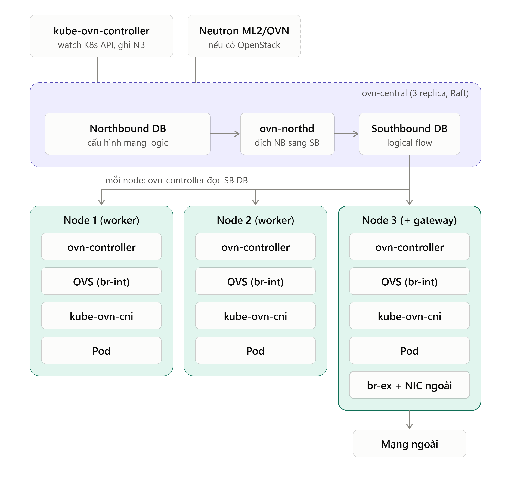
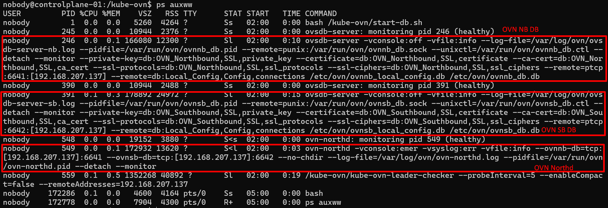

# KUBE OVN
- Hiểu đơn giản Kube OVN là OVN cài trên K8s

CNI = Container Network Interface, một chuẩn giao tiếp để Kubernetes/container runtime nhờ một hệ thống networking cấu hình mạng cho container/Pod.

Hiểu đơn giản:
- Kubernetes biết “tôi cần tạo Pod”, nhưng Kubernetes không muốn tự biết cách tạo veth, bridge, OVS, VXLAN, cấp IP...
- Nó giao phần đó cho CNI plugin.

```
              Kubernetes / Runtime
                       │
                       │ CNI standard
                       ↓
          ┌────────────┼─────────────┐
          │            │             │
       Calico        Cilium       Kube-OVN
```

- Nó là cái mà những cái khác cần để cắm vào cụm hiểu đơn giản như này: K8s ko CNI nó vẫn tồn tại bình thường, nó không chết chỉ là không có Network, Calico, Cilium hay KubeOVN cũng tồn tại độc lập thoải mái nó chỉ là một mô hình network. Giờ 2 thằng muốn kết hợp với nhau phải cần CNI.

- Phân biệt nó với CRI
```
Kubernetes
   │
   ├── CRI
   │    ↓
   │   Container Runtime
   │   containerd / CRI-O
   │
   └── CNI
        ↓
       Networking
```

## 1. Kube OVN triển khai làm CNI cho cả cụm OpenStack
- OVN được triển khai bình thường bằng Kube-OVN, còn phía OpenStack sửa cấu hình Neutron để kết nối vào cùng OVN DB, và OpenStack cần networking-ovn làm backend cho Neutron.

- Cụ thể:
  - Cài K8s + Kube-OVN như bình thường (ovn-central lo NB/SB DB).
  - Cài Neutron (ví dụ bằng OpenStack-Helm) với ML2/OVN, cấu hình `ovn_nb_connection` và `ovn_sb_connection` trỏ tới Service của ovn-central trong Kube-OVN, không deploy chart OVN riêng của OpenStack-Helm.
  - Nếu Kube-OVN bật SSL thì Neutron cũng phải dùng kết nối `ssl:` và mount cert tương ứng. Genestack có PR xử lý đúng việc này: dùng kết nối ssl cho OVN NB/SB DB, đồng bộ secret kube-ovn-tls sang openstack/ovn-client-tls.
  - Tắt `neutron_sync_mode`. Genestack tắt nó vì chế độ này không hoạt động khi có CMS thứ hai trên cùng một OVN. Tính năng này vốn tự sửa DB cho khớp Neutron, nên nó sẽ xóa luôn đối tượng của Kube-OVN.

- Kết quả là OVN NB DB chứa đồng thời đối tượng của K8s (ví dụ logical router `ovn-cluster`, subnet join, ovn-default) và đối tượng của Neutron (prefix `neutron-<uuid>`). Cách này còn cho phép gom VPC/Subnet của hai bên lại để quản lý và kết nối.

- Vì sao không cài OVN thứ hai:

Mỗi node chỉ có một ovs-vswitchd, một br-int và một ovn-controller chạy tốt. Hai bộ OVN/OVS cùng tranh nhau trên một node sẽ xung đột. Nếu tách hẳn (OVN riêng cho OpenStack trên node riêng) thì được, nhưng khi đó VM của OpenStack và Pod K8s không cùng mạng logic và cài đặt sẽ trở nên phức tạp.



Nếu Neutron dùng chung OVN này thì trong sơ đồ chỉ có thêm ô Neutron nét đứt ghi vào cùng NB DB. Phần data plane bên dưới không đổi, VM của Nova chỉ là một loại port nữa cắm vào br-int. Vì vậy chuyện "hai bên dùng chung OVN" nghe phức tạp, nhưng cấu trúc thực chất chỉ là hai CMS cùng ghi vào một NB DB, và đó cũng là lý do có rủi ro ghi đè nhau mà mình nói ở trên.

không có "OVN của OpenStack" riêng. Phía OpenStack chỉ có Neutron (cụ thể là driver ML2/OVN), đóng vai một CMS giống kube-ovn-controller. OVN chỉ có một bộ duy nhất do Kube-OVN cài.

Luồng khi có thêm OpenStack:
```
K8s: Pod/Subnet  → kube-ovn-controller  ─┐
                                         ├→ NB DB → northd → SB DB → ovn-controller → OVS
OpenStack: Network/Port/Router → Neutron ┘
```
Với OVN, các đối tượng đó chỉ là logical switch, port, router, ACL trong NB DB. `ovn-controller` không phân biệt cái nào từ K8s, cái nào từ Neutron, đều biên dịch thành flow như nhau. Vì vậy hai bên dùng chung tầng thực thi, và cũng có thể được nối với nhau qua logical router nếu muốn.

## 2. Quy tắc cấu hình
- Cắm VM vào OVS: Ghi NB DB chỉ tạo port logic. Ở node compute vẫn cần Nova/libvirt cắm interface của VM vào br-int và gắn đúng ID (`iface-id`) để `ovn-controller` biết port vật lý ứng với port logic nào. Bên K8s việc này do `kube-ovn-cni` làm, bên OpenStack là do Nova/Neutron agent làm.
- Gateway và provider network: Đường ra ngoài của OpenStack (floating IP, provider network) cần cấu hình chassis gateway và bridge mapping riêng cho Neutron, tách với cách Kube-OVN cấu hình NAT cho Pod. Có thể tái sử dụng chung node gateway, nhưng cấu hình là hai chỗ khác nhau.
- Không giẫm chân nhau: Đây là rủi ro lớn nhất: hai controller cùng ghi một NB DB. Mỗi bên phải chỉ quản lý đối tượng của mình. Ví dụ, phải tắt `neutron_sync_mode` để Neutron không xóa đối tượng của Kube-OVN.
- Trùng dải IP. Subnet của K8s và của Neutron nằm chung một hạ tầng logic, nên quy hoạch dải IP tránh chồng nhau, trừ khi bạn chủ động tách VPC.

## 3. Offload Checksum
- Mỗi khi hệ điều hành gửi dữ liệu ra ngoài qua mạng (TCP/UDP/IP), gói tin cần phải có một giá trị kiểm tra lỗi gọi là Checksum.
  - Nếu tắt `tx-checksum` (Disabled / Off): CPU chính của máy tính/server phải tự tính toán chuỗi checksum này cho từng gói tin trước khi chuyển sang cho card mạng.
  - Nếu bật `tx-checksum` (Enabled / On): CPU sẽ bỏ qua bước tính toán này và đẩy thẳng gói tin thô cho card mạng. Card mạng cứng (Hardware NIC) sẽ tự tính checksum và đính vào gói tin trước khi phát ra dây cáp.
    - Kỹ thuật này gọi là TX Checksum Offload (đẩy bớt việc tính toán checksum gửi đi sang cho phần cứng).

### 3.1 Cách dùng lệnh `ethtool` với `tx-checksum`
- Kiểm tra trạng thái:
```bash
ethtool -k eth0
```
- chú ý đến:
```
bastion@bastion:~$ ethtool -k ens33
Features for ens33:
rx-checksumming: off
tx-checksumming: on
        tx-checksum-ipv4: off [fixed]
        tx-checksum-ip-generic: on
        tx-checksum-ipv6: off [fixed]
        tx-checksum-fcoe-crc: off [fixed]
        tx-checksum-sctp: off [fixed]
```
- `on`: card mạng đang đảm nhiệm việc tính checksum gửi đi (Offload đang bật)
- `[fixed]`: thông số cố định do driver hoặc phần cứng không cho phép thay đổi.
### 3.2 Bật tắt cấu hình
- Tắt TX Checksum Offload: ép CPU tự tính
```bash
sudo ethtool -K eth0 tx-checksumming off
# hoặc viết tắt:
sudo ethtool -K eth0 tx off
```
- Nên tắt khi:
  - Máy ảo (VM) / OpenStack / KVM / Docker / Linux Bridge: Đôi khi tính năng Checksum Offload trên card mạng ảo (veth, tap, br-ex) gây ra tình trạng gói tin bị hỏng checksum (sai/corrupted checksum) khiến phía nhận drop gói tin, gây rớt mạng hoặc mạng bị chậm bất thường.
  - Bắt gói tin bằng `tcpdump` / `Wireshark`: Khi bật offload, `tcpdump` bắt gói tin ở tầng kernel trước khi card mạng tính checksum, dẫn đến tcpdump báo lỗi "incorrect checksum". Tắt `tx-checksum` giúp kiểm tra chính xác checksum thực tế phát ra.
### 3.3 Bật giao cho Card mạng tính
```bash
sudo ethtool -K eth0 tx-checksumming on
# hoặc viết tắt:
sudo ethtool -K eth0 tx on
```
- Nên bật khi:
  - Giúp giảm tải CPU, tăng hiệu năng truyền nhận dữ liệu (throughput), đặc biệt là trên các server có lưu lượng mạng lớn (10Gbps+).


khi `kube-ovn-cni` khởi động, code chạy `ethtool -K genev_sys_6081 tx off` (tắt checksum của interface Geneve mặc định), và nếu lệnh lỗi thì chỉ ghi log chứ không làm hỏng pod. Từ v1.7 họ tắt tx checksum offload của tunnel Geneve để né một lỗi kernel liên quan double NAT, và người dùng nâng cấp từ bản cũ có thể bật lại.

Ý tưởng cơ bản: checksum là con số dùng để bên nhận kiểm tra gói có bị hỏng không. Với offload, kernel không tính mà đánh dấu "chỗ này để NIC tính sau". Cách này ổn khi gói đi thẳng, nhưng với overlay thì gói bị bọc thêm lớp Geneve/UDP, lại đi qua conntrack và NAT của Service. Nếu ở giữa có bước làm kernel/driver/NIC hiểu sai chỗ cần tính, checksum ra sai và bên nhận drop gói.

## 4. Cần phân biệt rõ dải mạng mình có thể tạo
### 4.1 Dải Tunnel
Dải tunnel là dải mà các node gói traffic overlay (Geneve, UDP 6081) gửi cho nhau. Pod-to-Pod giữa các node và VM-to-VM giữa các compute đều đi qua đây.

Pod và VM dùng chung được vì cả hai chỉ là port cắm vào cùng br-int do cùng một ovn-controller quản lý, nên cùng đi ra một tunnel endpoint (IP tunnel của node). Về vật lý là chung đường, nhưng về logic vẫn cô lập vì mỗi logical switch có tunnel key riêng trong header Geneve, nên traffic của Pod và VM không lẫn vào nhau.

### 4.2 Dải mgmt
Dải mgmt không chỉ để quản trị người dùng. Nó còn chở control traffic của OVN: `ovn-controller` trên mỗi node kết nối tới SB DB, `kube-ovn-controller` và Neutron kết nối tới NB DB.

| Dải |	Chở gì |
|-----------|----------|
| Management |	SSH, K8s API, kubelet, kết nối tới NB/SB DB |
| Tunnel |	Geneve overlay: Pod-Pod và VM-VM (chung đường, khác logical switch)|
| External (thường có) |	Traffic ra ngoài qua gateway |

### 4.3 Hai tầng mạng phân biệt rõ
**Tầng Vật Lý**: dải mgmt và dải tunnel. Nó do OS cấu hình (netplan, NetworkManager...). Kube-OVN không quản trị phần này. Với Kube-OVN, đây chỉ là "đường đi có sẵn" để các node gửi gói UDP cho nhau.

**Tầng logic(overlay): dải riêng KubeOVN**: Ví dụ Pod CIDR `10.0.10.0/24` (mặc định thường là `10.16.0.0/16`), cùng dải join `100.64.0.0/16` và Service CIDR của K8s. Các dải này chỉ tồn tại bên trong OVN dưới dạng logical switch, không hề có trên card mạng vật lý nào.

Nó giống hệt cách bạn suy nghĩ về VxLan: (Outer L2)
```
Gói gốc của Pod:     src 10.0.10.5      → dst 10.0.10.9
        ↓ ovn-controller đóng gói Geneve
Gói thực sự ra dây:  src 192.168.207.11 → dst 192.168.207.12   (UDP 6081)
                     └── bên trong chứa gói gốc ở trên ──┘
```

## 5. Pod Kube OVN
- Các thành phần Kube-OVN chủ yếu giữ cấu hình và trạng thái mạng

### 5.1 `ovn-central` giữ database mạng
- Nó thường chứa:

| Tiến trình | Vai trò | Dữ liệu quản lý |
|---|---|---|
| Northbound DB — NB | Giữ thiết kế mạng mong muốn | Logical switch, router, port, ACL, NAT… |
| `ovn-northd` | Chuyển thiết kế thành luật mạng | Đọc NB, tạo dữ liệu cho SB |
| Southbound DB — SB | Giữ luật logic và trạng thái triển khai | Logical flows, chassis/node, vị trí các logical port |

Ví dụ NB mô tả “port này thuộc switch nào”; SB bổ sung thông tin để thực hiện, như port đang gắn với node nào. Đây là database cấu hình mạng, không chứa file hay nội dung database của ứng dụng.

Lưu ở đâu? NB/SB có file database, nhưng cơ chế lưu bền vững phụ thuộc volumes của deployment. Cần xem YAML để biết database có nằm trên host hay PVC và có giữ qua việc thay Pod không.

Nếu lab của bạn dùng shared OVN cho OpenStack, database này còn có thể chứa mạng logic do Neutron tạo, bên cạnh mạng do Kube-OVN quản lý.



### 5.2 `ovs-ovn` switch thực sự trên từng node
Áp dụng luật trên từng node, giữ cấu hình switch trên từng node, có 2 Node tương ứng với 2 Pod `ovs-ovn`

Thành phần này thường chạy theo DaemonSet: mỗi node một Pod. Bên trong có:
- `ovsdb-server`: giữ cấu hình OVS local.
-` ovs-vswitchd:` thực hiện chuyển tiếp traffic.
- `ovn-controller`: nhận thông tin từ SB và lập trình luật cho OVS.

| Dữ liệu | Ví dụ | Tính chất |
|---|---|---|
| Cấu hình OVS local | Bridge `br-int`, port, interface, external IDs | Trong database OVS local |
| Luật chuyển tiếp | OpenFlow/datapath flows | Trạng thái chạy, có thể được lập trình lại |
| Trạng thái kết nối | Conntrack nếu dùng | Trạng thái tạm |
| Socket | `db.sock` | Điểm giao tiếp với OVSDB, không phải file chứa cache mạng |

Ví dụ lệnh `ovs-vsctl`  kết nối tới OVSDB để đọc/sửa cấu hình switch. Gói tin đi xuyên qua switch; nó không được lưu thành file trong OVSDB.


### 5.3 `kube-ovn-controller` người quyết định cấu hình mạng Kubernetes

Nó theo dõi tài nguyên Kubernetes, cấp phát IP và cập nhật mạng logic trong OVN. Có thể hiểu là người nhận yêu cầu:
“Pod mới này thuộc subnet nào, nhận IP nào và cần chính sách mạng gì?”

Thông tin cấp phát được ghi vào Kubernetes, chẳng hạn annotations của Pod; controller cũng giữ cache/IPAM trong bộ nhớ và cập nhật OVN. Nó không phải nơi chứa file database NB/SB

Các annotations như:
```yaml
ovn.kubernetes.io/ip_address: 10.16.0.13
ovn.kubernetes.io/logical_switch: ovn-default
```
Đó là thông tin mạng nằm trong đối tượng Pod qua Kubernetes API; dữ liệu Kubernetes được lưu bởi etcd. Không phải nằm trong một PVC riêng của controller.

- `kube-ovn-cni`: tạo NIC và nối Pod vào switch của node
- `kube-ovn-pinger / monitor`: kiểm tra và xuất metrics

### 5.4 kube-ovn-cni: người nối mạng cho Pod trên node
Hai Pod
```
kube-ovn-cni-qqd9p
kube-ovn-cni-rh87m
```
Thành phần này thiết lập mạng local: tạo interface/veth, nối vào port OVS và cấu hình mạng cần thiết trên host.
```
eth0 bên trong Pod
        ↕
interface phía host
        ↕
port trên OVS
```
Nó làm việc với:
- CNI binary/config và socket phục vụ yêu cầu CNI
- Interface, route và luật mạng trên node
- Trạng thái xử lý logs

Đây chủ yếu là file công cụ/cấu hình và trạng thái mạng, không phải volume lưu dữ liệu người dùng. Các đường dẫn cụ thể có thể khác trên Talos so với Linux thông thường.

```
                    Kubernetes
                        │
                        │ CNI standard
                        ▼
        ┌───────────────┼────────────────┐
        │               │                │
     Kube-OVN         Calico           Cilium
        │               │                │
        ▼               ▼                ▼
 kube-ovn-cni      calico CNI       cilium CNI
   trên node         trên node         trên node
```

### 5.5 `kube-ovn-pinger`: kiểm tra mạng từ từng node
Pinger đo khả năng kết nối và chất lượng mạng, như độ trễ, kết quả ping và trạng thái thành phần trên node.

Nó giữ kết quả kiểm tra, bộ đếm và xuất metrics/logs; không phải database lưu lịch sử monitoring lâu dài. Nếu Prometheus thu thập metrics thì lịch sử nằm ở storage của Prometheus.

### 5.6 `kube-ovn-monitor`: quan sát OVN
Monitor thu thập trạng thái OVN và xuất metrics. 
- Pinger: “Kết nối thực tế có thông không?”
- Monitor: “Hệ thống OVN đang có trạng thái thế nào?”

Nó chủ yếu giữ trạng thái thu thập và metrics trong quá trình chạy, không thay thế NB/SB DB hay Prometheus.

`kube-ovn-pinger` nhìn từ góc độ “đường mạng có chạy thật không?”
`kube-ovn-monitor` nhìn từ góc độ “bên trong OVN đang ở trạng thái gì?”

```
        Kubernetes / Kube-OVN
                │
                │
        ┌───────┴────────┐
        │                │
     Pinger           Monitor
        │                │
        ↓                ↓
  Test đường mạng    Đọc trạng thái OVN
```
- Pinger = test traffic thật. Pinger giống như người lái xe thử trên đường.
- Monitor thì khác. Nó giống như nhân viên ngồi trong phòng điều hành nhìn dashboard hệ thống OVN. Monitor = nhìn sức khỏe bên trong hệ thống OVN.

## 6. Một vài lệnh dùng để check
```bash
ps auxww
ps -ww -p PID -o pid,args
```