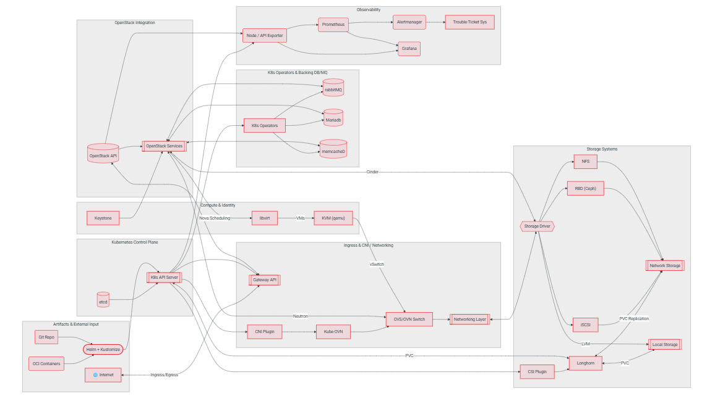

# Genestack Architecture



- **Artifacts & External Input**: Git Repo + OCI Containers đi vào Helm + Kustomize. Đây là cổng triển khai: Helm cài chart, Kustomize chỉnh thêm qua post-renderer. Từ đó mọi thứ đi vào K8s API Server.
- **Kubernetes Control Plane**: API Server + etcd, nơi tiếp nhận mọi YAML.
- **OpenStack Integration / Compute & Identity**: OpenStack Services (API), Keystone (xác thực), và chuỗi Nova → libvirt → KVM (qemu) chạy VM.
- **Ingress & CNI / Networking**: Gateway API (Envoy) đón traffic từ Internet, CNI Plugin → Kube-OVN → OVS/OVN Switch, nối Neutron với VM. Đúng phần chung OVN mà ta bàn đầu cuộc trò chuyện.
- **Storage Systems**: Longhorn, Ceph (RBD), NFS, iSCSI/LVM, qua CSI và Cinder.
- **Observability**: Exporter → Prometheus → Alertmanager/Grafana.
- K8s Operators & Backing DB/MQ: perator có giá trị nhất ở nơi có trạng thái. Một OpenStack service như Neutron hay Nova phần lớn là API stateless, dữ liệu thật nằm ở MariaDB và RabbitMQ.
  - "K8s Operators", tức các operator chạy trong cụm K8s
  - rabbitMQ, MariaDB, memcached, tức các dịch vụ nền mà OpenStack dựa vào, gọi là backing services
  - Mũi tên từ operator sang MariaDB và RabbitMQ nghĩa là "operator quản lý chúng". Mũi tên từ OpenStack Services sang cả ba nghĩa là "service OpenStack sử dụng chúng".

| Thành phần |	Vai trò trong OpenStack|
| MariaDB |	Nơi lưu trạng thái thật: mỗi service (Keystone, Nova, Neutron...) có database riêng ở đây |
| RabbitMQ |	"Đường dây nhắn tin" để các thành phần gọi nhau, ví dụ `nova-api` nhờ `nova-conductor`, rồi tới `nova-compute` |
| Memcached |	Bộ nhớ đệm (ví dụ cache token xác thực) để đỡ truy vấn DB |

- Luồng làm việc 3 tầng
```
Tầng 1: cài "người quản lý" (một lần)
   install-mariadb-operator.sh, kubectl apply -k rabbitmq-operator ...
   → operator chạy như Pod, đứng canh K8s API

Tầng 2: dựng "cụm" bằng cách nộp CR (một lần)
   CR MariaDB "mariadb-cluster" (3 replica)  → operator tạo 3 Pod, cấu hình Galera
   CR RabbitmqCluster "rabbitmq" (3 replica) → operator tạo StatefulSet, PVC, Service

Tầng 3: mỗi service OpenStack xin tài nguyên riêng (mỗi lần cài service)
   cài Neutron → Kustomize thêm CR Database/User (MariaDB) + User/Vhost (RabbitMQ)
              → operator tự tạo database "neutron", user "neutron", vhost cho Neutron
```

# Product Component Matrix

The following components are part of the initial product release
and largely deployed with Helm+Kustomize against the K8s API (v1.28 and up).

| Group      | Component             | Status   |
|------------|-----------------------|----------|
| Kubernetes | Kubernetes            | Included |
| Kubernetes | Kubernetes Dashboard  | Included |
| Kubernetes | Cert-Manager          | Included |
| Kubernetes | MetaLB (L2/L3)        | Included |
| Kubernetes | Core DNS              | Included |
| Kubernetes | Nginx Gateway API     | Removed  |
| Kubernetes | Kube-Proxy (IPVS)     | Included |
| Kubernetes | Calico                | Optional |
| Kubernetes | Kube-OVN              | Included |
| Kubernetes | Helm                  | Included |
| Kubernetes | Kustomize             | Included |
| OpenStack  | openVswitch (Helm)    | Optional |
| OpenStack  | mariaDB (Operator)    | Included |
| OpenStack  | rabbitMQ (Operator)   | Included |
| OpenStack  | memcacheD (Operator)  | Included |
| OpenStack  | Ceph Rook             | Optional |
| OpenStack  | iscsi/tgtd            | Included |
| OpenStack  | Aodh (Helm)           | Optional |
| OpenStack  | Ceilometer (Helm)     | Optional |
| OpenStack  | Keystone (Helm)       | Included |
| OpenStack  | Glance (Helm)         | Included |
| OpenStack  | Cinder (Helm)         | Included |
| OpenStack  | Nova (Helm)           | Included |
| OpenStack  | Neutron (Helm)        | Included |
| OpenStack  | Placement (Helm)      | Included |
| OpenStack  | Horizon (Helm)        | Included |
| OpenStack  | Skyline (Helm)        | Optional |
| OpenStack  | Heat (Helm)           | Included |
| OpenStack  | Designate (Helm)      | Optional |
| OpenStack  | Barbican (Helm)       | Included |
| OpenStack  | Octavia (Helm)        | Included |
| OpenStack  | Ironic (Helm)         | Optional |
| OpenStack  | Magnum (Helm)         | Optional |
| OpenStack  | Masakari (Helm)       | Optional |
| OpenStack  | Manila (Helm)         | Optional |
| OpenStack  | Cloudkitty (Helm)     | Optional |
| OpenStack  | Blazar (Helm)         | Optional |
| OpenStack  | Freezer (Helm)        | Optional |
| OpenStack  | Trove (Helm)          | Included |
| OpenStack  | metal3.io             | Planned  |
| OpenStack  | PostgreSQL (Operator) | Included |
| OpenStack  | Consul                | Planned  |

Initial monitoring components consists of the following projects

| Group      | Component          | Status   |
|------------|--------------------|----------|
| Kubernetes | Prometheus         | Included |
| Kubernetes | Alertmanager       | Included |
| Kubernetes | Grafana            | Included |
| Kubernetes | Node Exporter      | Included |
| Kubernetes | Kube State Metrics | Included |
| Kubernetes | redfish Exporter   | Included |
| OpenStack  | OpenStack Exporter | Included |
| OpenStack  | RabbitMQ Exporter  | Included |
| OpenStack  | Mysql Exporter     | Included |
| OpenStack  | memcacheD Exporter | Included |
| OpenStack  | Postgres Exporter  | Included |
| Kubernetes | Thanos             | Optional |