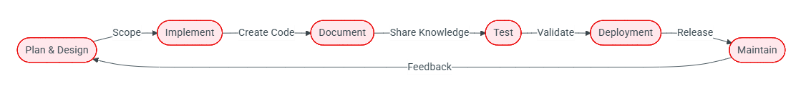

# Software Development Life Cycle (SDLC) 
Software Development Life Cycle is the process used to ensure high quality solutions are delivered in a predictable, repeatable fashion. The SDLC aims to produce outcomes that meet or exceed customer expectations while reaching completion within time and cost estimates.

- Đây là quy trình làm phần mềm từ lúc có ý tưởng đến lúc vận hành.

## 1. Scope
The scope phase is where new work is identified, based off the stated objective(liệt kê các việc cần làm), and the level of effort(ước lượng công sức mỗi việc.) determined. The plan portion of scope is where the work is assigned to various sprints(là chu kỳ làm việc ngắn) to ensure timely completion. This step is vital to ensure we are meeting stated goals for the business and the community.

Đây là bước quyết định làm gì và tốn bao nhiêu sức.

## 2. Implement (thực hiện)
In the implement phase, development teams use the requirements gathered in the scope phase to create code or process that meets the deliverable ask.

Nhóm phát triển lấy yêu cầu từ bước Scope để làm ra sản phẩm (deliverable là thứ phải giao). Chữ "code or process" nghĩa là sản phẩm có thể là code hoặc một quy trình.

Trong Genestack, "code" chính là những thứ ta đã đi qua: `script bin/install-*.sh`, values trong `base-helm-configs/`, Kustomize trong `base-kustomize/`, playbook Ansible. Theo CONTRIBUTING, commit phải theo Conventional Commits (tiền tố như `feat:`, `fix:`), được ký (signed), và nhỏ gọn theo từng thay đổi (atomic).

## 3. Documents
Documentation must reflect the current state of the codebase for any deployed application, service or process. If functionality has been added, removed, or changed the documentation is updated to reflect the change.

Quy tắc chính: tài liệu phải phản ánh đúng trạng thái hiện tại của code. Thêm, bỏ hay đổi tính năng thì sửa tài liệu theo. Trang gốc tóm lại là: đổi gì, thêm gì, xóa gì thì đều phải ghi lại.

Trong repo: thư mục `docs/` cùng `mkdocs.yml` tạo ra trang tài liệu, và workflow `mkdocs.yaml` tự xuất bản. Ngoài ra mọi commit thay đổi hành vi cũ phải kèm release note trong releasenotes/notes/ (công cụ reno tạo định dạng), và nếu thay đổi biến ảnh hưởng service thì phải nêu trong mục upgrade.

## 4. Test
Mục tiêu là chắc chắn sản phẩm không lỗi và đúng yêu cầu, làm qua 3 tầng:

The test phase is used to ensure that the deliverable is free from defects and meets the specified requirements. This is accomplished via a three-step or phased approach:
- Github pre-commit checks: các kiểm tra tự động chạy khi bạn commit hoặc mở pull request. `.pre-commit-config.yaml` của repo cho thấy chúng gồm kiểm tra định dạng commit, `shellcheck` (lỗi script bash), `yamllint` và `check-yaml` (lỗi YAML), `ansible-lint`, `black` (định dạng Python).
- Unit testing against development environment: chạy thử trên môi trường dev. Repo có các workflow `helm-*.yaml` và `kustomize-*.yaml` (như ta đã thấy) để thử render từng service, và `smoke-deploy-lab.yaml` để thử dựng một lab. `testing/` dựng VM thử bằng Heat.
- Functional checks using Rally against our Development and Staging environments: công cụ của OpenStack để chạy kịch bản kiểm tra chức năng và hiệu năng trên một cloud thật (ví dụ thử tạo VM, tạo network liên tục), chạy ở môi trường dev và staging.

## 5. Deployment (triển khai)
In the deployment phase, the development team deploys deliverables using a multi-environment deployment process. This ensures deliverables are tested through a staging environment for functionality and reliability before reaching production.

Dùng quy trình nhiều môi trường: dev → staging → production. Staging là môi trường giống production nhưng chưa phục vụ người dùng thật, để kiểm tra chức năng và độ ổn định trước khi lên production.

## 6. Maintain
Gồm ba việc: giám sát các môi trường, sửa lỗi, và xử lý vấn đề do khách hàng hoặc các bên liên quan phản ánh.

In the maintenance phase, the team focuses on monitoring the various environments, fixing bugs, and addressing any issues brought forth by customers or stakeholders.