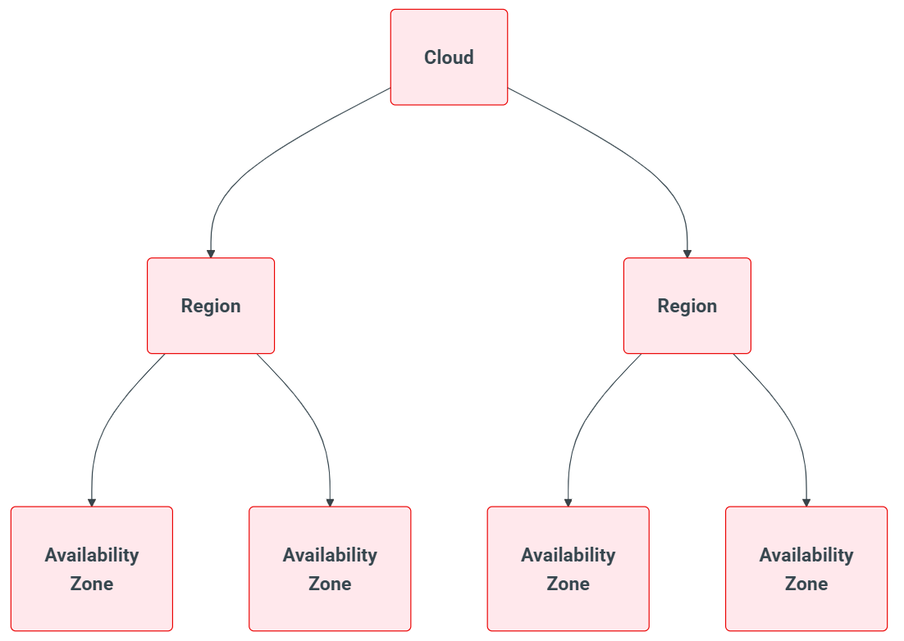

# Cloud Topology (Cấu trúc phân cấp)

Đoạn này nói về một câu hỏi thiết kế: khi hỏng thì hỏng đến đâu, và người dùng cloud né lỗi bằng cách nào?

When building a cloud, the design of the cloud will not only reflect the type of services you are looking to provide but also inform the way that users of your cloud work to accomplish their goals.

Availability is one of the key aspects of deploying applications in the cloud.

- **Availability (tính sẵn sàng)** là việc ứng dụng vẫn chạy được dù có sự cố. Muốn vậy nó phải chịu được lỗi.
- **Failure domain (vùng lỗi)** là phạm vi bị ảnh hưởng khi một thứ hỏng. Ví dụ một ổ cắm điện hỏng làm tắt cả một hàng tủ rack, thì "hàng rack đó" là một failure domain.
- Người xây cloud phải chia cloud thành các tầng có ranh giới rõ, để người dùng biết "đặt ứng dụng ở hai chỗ khác tầng này thì một chỗ hỏng chỗ kia vẫn sống".

At the highest level, a cloud is a unique set of services that operates completely independently. Một cloud là một bộ dịch vụ chạy hoàn toàn độc lập, không phụ thuộc cloud nào khác.
- Vận hành độc lập hoàn toàn, không phụ thuộc chéo
- Each cloud does not have to offer the same set of services as the others
- Cloud operations for one cloud is completely independent from the others
- Each cloud can be at a different software version or release from the others
- Nhược điểm: việc sao chép dữ liệu hoặc dịch vụ giữa các cloud là việc của người dùng, và dịch vụ dùng chung giữa nhiều cloud phải nằm bên ngoài chúng.

Regions can be defined as a high-level cloud construct where there is some sort of geographical separation of services.
- Quy mô tùy cloud: cloud lớn thì mỗi region là data center riêng, cloud nhỏ thì chỉ là phòng máy (data hall) riêng.
- Dù quy mô nào thì hạ tầng vận hành nên độc lập về điện, mạng, làm mát.
- Ngoài tách vật lý còn phải tách logic: storage, compute và các dịch vụ chạy workload của region này phải tự hoạt động được, không phụ thuộc region khác.
- Một số dịch vụ hỗ trợ có thể dùng chung giữa các region, nhưng nguyên tắc là mỗi region càng tự túc càng tốt.
- Mục đích: lỗi ở mức region phải bị khoanh lại, không lan sang region khác. Muốn chịu được lỗi region, người dùng tự deploy ứng dụng ở nhiều region.

Availability Zones are another logical grouping for sets of closely related resources and services.
- AZ là nhóm logic của các tài nguyên gần nhau. Ở cloud lớn có thể gồm nhiều data center, ở cloud nhỏ có thể chỉ là một phòng máy hoặc thậm chí một dãy rack.
- Đoạn văn nói thẳng: AZ khá tùy ý, về bản chất nó là cách gọi "failure domain" nghe nhẹ nhàng hơn. Nghĩa là không có chuẩn cứng, bạn tự quyết định ranh giới.
- Quy tắc: hai AZ không dùng chung lõi compute và storage. Mỗi AZ tự chạy được, và càng cách ly vật lý với AZ khác trong cùng region càng tốt.

