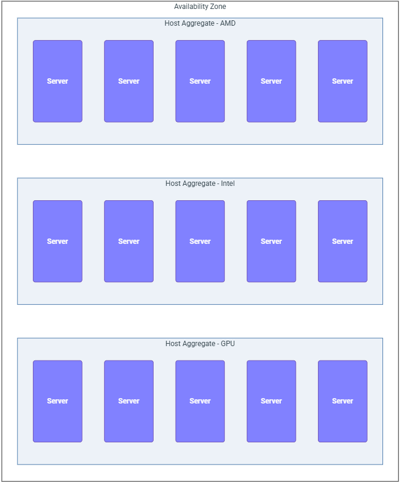

# Availability Zone
> **Region = một “cloud con” gần như tự vận hành.**

thì phần này chỉ cần thêm:

> **Availability Zone = cách chia một Region thành nhiều “failure domain” để một sự cố không đánh sập tất cả tài nguyên.**

**không có một định nghĩa vật lý cố định**: ở cloud lớn, AZ có thể là nhiều data center trong cùng khu vực; ở cloud nhỏ, AZ có thể chỉ là hai data hall hoặc thậm chí các rack khác nhau. Bản chất của nó là một **logical abstraction để biểu diễn failure domain**. Pasted text

---

# 1. Bản chất của Availability Zone là gì?

Đừng học AZ theo kiểu:

```text
AZ = Data Center
```

vì như vậy là sai bản chất.

Đúng hơn phải là:

```text
AZ = Failure Domain
```

Tức:

> **Một nhóm tài nguyên được thiết kế sao cho khi nhóm đó gặp sự cố, nhóm AZ khác không bị ảnh hưởng theo.**

Ví dụ một cloud nhỏ chỉ có một Data Center:

```text
              Data Center Hanoi
                     │
          ┌──────────┴──────────┐
          │                     │
        Hall A                Hall B
          │                     │
         AZ1                   AZ2
```

Trong trường hợp này:

```text
AZ1 ≠ một Data Center
AZ2 ≠ một Data Center
```

mà chỉ là hai **failure domain bên trong cùng Data Center**.

Cloud khác lại có thể thiết kế:

```text
                Region Hanoi
                    │
          ┌─────────┴──────────┐
          │                    │
      DC Hanoi-1           DC Hanoi-2
          │                    │
         AZ1                  AZ2
```

Vẫn hoàn toàn hợp lệ.

Thậm chí nhỏ hơn nữa:

```text
Data Hall
│
├── Rack Group A → AZ1
│
└── Rack Group B → AZ2
```

Cho nên câu cần nhớ là:

> **Region có thiên hướng gắn với vị trí địa lý lớn; AZ gắn với failure domain.**

---

# 2. Cloud → Region → AZ

Quan hệ đúng là:

```text
Cloud
│
├── Region Hanoi
│   │
│   ├── AZ1
│   └── AZ2
│
└── Region HCM
    │
    ├── AZ1
    └── AZ2
```

AZ luôn nằm **bên trong Region**.

Theo tài liệu, một Region thường có ít nhất hai AZ, lý tưởng là nhiều hơn. Các AZ nên độc lập về những thành phần có khả năng tạo failure như nguồn điện, cooling và networking, nhưng vẫn được nối với nhau bằng đường mạng băng thông cao, latency thấp. Pasted text

Điểm cân bằng rất hay ở đây là:

```text
AZ1  <──────────────>  AZ2
 ↑                        ↑
 đủ xa                  đủ gần
 để cùng một            để replication,
 sự cố không            failover vẫn nhanh
 đánh cả hai
```

Cloud provider tự định nghĩa thế nào là “in-Region”. Mục tiêu chỉ là **đủ tách biệt để giảm khả năng cùng bị một sự cố, nhưng đủ gần để giữ kết nối latency thấp**. Pasted text

Đây là câu rất đáng ghi:

> **Region autonomy = Region này chết không kéo Region khác chết.**  
> **AZ resilience = một phần của Region chết không kéo cả Region chết.**

---

# 3. AZ dùng để làm gì thực tế?

Giả sử bạn có:

```text
Region Hanoi

AZ1
├── compute01
├── network01
└── storage01

AZ2
├── compute02
├── network02
└── storage02
```

Bạn triển khai:

```text
Web01 → AZ1
Web02 → AZ2
```

Load Balancer:

```text
             User
              │
              ↓
         Load Balancer
          /          \
         /            \
      Web01           Web02
       AZ1             AZ2
```

Nếu AZ1 mất điện:

```text
AZ1 → DOWN
AZ2 → UP
```

thì:

```text
Web01 X
Web02 ✓
```

dịch vụ vẫn còn khả năng hoạt động.

Đây chính là lý do tài liệu nói workload có thể được phân tán qua nhiều AZ để đạt redundancy và resilience ngay **bên trong một Region**. Pasted text

---

# 4. Một điều cực kỳ quan trọng: AZ của Nova, Cinder và Neutron không tự nhiên là cùng một thứ

Đây có lẽ là đoạn dễ gây nhầm nhất.

Khi bạn thấy:

```text
AZ1
```

đừng mặc định rằng OpenStack có một object trung tâm kiểu:

```text
AZ1
├── Nova
├── Cinder
└── Neutron
```

Không hẳn.

Thực tế các service có cách định nghĩa AZ của riêng mình:

```text
Nova AZ
Cinder AZ
Neutron AZ
```

Cloud administrator phải quyết định:

```text
Các AZ này có cùng ý nghĩa?
```

hay:

```text
Mỗi service dùng AZ theo cách riêng?
```

**Availability Zone Scoping**. Nếu muốn AZ có ý nghĩa nhất quán toàn cloud, Nova/Cinder/Neutron nên dùng cùng tên. Nếu AZ của từng service có ý nghĩa khác nhau, đặt tên giống nhau lại dễ khiến user tưởng chúng tương ứng với nhau. Pasted text

Ví dụ thiết kế dễ hiểu:

```text
                   AZ1
          ┌─────────┼──────────┐
          │         │          │
      Nova AZ1  Cinder AZ1  Neutron AZ1
```

User hiểu:

> “Tôi chọn AZ1 thì compute, storage và networking đều cố gắng nằm trong failure domain AZ1.”

---

# 5. Nova Availability Zone

Đây là phần quan trọng nhất nếu bạn làm Compute.

Tài liệu mô tả Nova AZ gần giống một:

> **migration boundary**

Instance không được di chuyển từ AZ này sang AZ khác theo cách thay đổi AZ membership của host; nếu thay đổi Host Aggregate khiến instance đang chạy bị chuyển từ AZ này sang AZ khác, thao tác đó sẽ bị từ chối và administrator phải drain instance trước. Pasted text

Ví dụ:

```text
Nova

AZ1
├── compute01
└── compute02

AZ2
├── compute03
└── compute04
```

VM:

```text
VM01 → compute01 → AZ1
```

Bạn không nên tưởng tượng:

```text
VM01
 AZ1
  │
  └── live migration
          ↓
      compute03
        AZ2
```

như một migration bình thường trong cùng AZ.

AZ chính là một boundary mà Nova dùng để thể hiện sự phân tách đó.

---

# 6. Nhưng Nova AZ thực chất được tạo như thế nào?

Điểm này rất hay:

> **Nova Availability Zone không phải một object database độc lập.**

Nova tạo AZ thông qua **Host Aggregate + metadata**. Pasted text

Ví dụ ban đầu:

```text
Host Aggregate: aggregate-a

compute01
compute02
```

Sau đó aggregate được gắn metadata làm cho nó trở thành AZ:

```text
aggregate-a
     │
     ├── compute01
     ├── compute02
     │
     └── metadata
          ↓
         AZ1
```

Khi metadata phù hợp được thêm vào Host Aggregate, aggregate đó trở thành thứ user có thể nhìn thấy dưới dạng Availability Zone và có thể yêu cầu scheduler đặt instance vào tập host tương ứng. Pasted text

Cách nhớ:

```text
Host Aggregate
      +
AZ metadata
      =
Nova Availability Zone
```

---

# 7. Host Aggregate khác AZ ở đâu?

Đây cũng rất dễ nhầm.

Một compute host:

```text
compute01
```
có thể nằm trong nhiều Host Aggregate:



```text
compute01
├── aggregate-ssd
├── aggregate-intel
└── aggregate-high-memory
```

vì Host Aggregate có thể dùng để phân loại host theo nhiều tiêu chí.

Nhưng:

```text
compute01
```

chỉ có thể nằm trong **một Availability Zone**. Tài liệu cũng nói host mặc định vẫn nằm trong một default AZ ngay cả khi nó không thuộc Host Aggregate nào. Pasted text

Đây là mẹo nhớ rất tốt:

```text
Aggregate = tag/group host
AZ        = failure-domain identity
```

Do vậy:

```text
1 host → nhiều aggregates ✓
1 host → nhiều AZ        ✗
```

---

# 8. Nova AZ và Placement liên quan thế nào?

Bạn đã biết Nova scheduler hỏi **Placement** để biết tài nguyên compute nào có thể đáp ứng request.

Khi user nói:

```text
Create VM
AZ = AZ1
```

thì:

```text
User
 ↓
Nova API
 ↓
Nova Scheduler
 ↓
Placement
 ↓
chỉ xét resource thuộc AZ1
```

Theo đoạn tài liệu này, Placement cần có aggregate tương ứng với Nova Host Aggregate về membership và UUID để honor yêu cầu AZ; tài liệu ghi rằng từ OpenStack 28.0.0 Bobcat, đây là cơ chế dùng để schedule instance vào AZ. Pasted text

Bạn có thể hình dung:

```text
Nova Host Aggregate
     AZ1
      │
      │ mapping
      ↓
Placement Aggregate
      │
      ↓
compute01
compute02
```

Scheduler không đơn giản chỉ đọc một chuỗi `"AZ1"` rồi chọn đại host.

---

# 9. Cinder Availability Zone

Đến Cinder thì AZ có ý nghĩa:

> **failure domain của block storage.**

Ví dụ:

```text
Region Hanoi

AZ1
├── compute01
└── storage backend A

AZ2
├── compute02
└── storage backend B
```

Trong Cinder, AZ được thiết lập thông qua cấu hình trên các node chạy `cinder-volume`. Pasted text

Ví dụ ý tưởng:

```text
cinder-volume-01
storage_availability_zone = AZ1

cinder-volume-02
storage_availability_zone = AZ2
```

Khi user tạo volume:

```text
volume
AZ = AZ1
```

Cinder scheduler sẽ hướng nó về dịch vụ/storage thuộc AZ1.

---

# 10. Cinder AZ KHÔNG phải storage type

Đây là chỗ phải tách cực rõ.

Sai:

```text
AZ1 = SSD
AZ2 = HDD
```

Vì:

```text
AZ
```

trả lời:

> **Storage nằm ở failure domain nào?**

Còn:

```text
SSD / HDD / NVMe
performance / commodity
```

trả lời:

> **Storage có đặc tính/chất lượng gì?**

Tài liệu cảnh báo không được nhầm Availability Zone với storage type hoặc SLA; backend và kiến trúc storage có thể ảnh hưởng cách bạn tổ chức AZ, nhưng hai khái niệm không phải một. Pasted text

Cách nhớ:

```text
AZ          → WHERE?
Volume Type → WHAT?
```

Ví dụ:

```text
AZ1
├── SSD
└── HDD

AZ2
├── SSD
└── HDD
```

sẽ hợp lý hơn:

```text
AZ1 = SSD
AZ2 = HDD
```

---

# 11. Tại sao Nova AZ và Cinder AZ nên có cùng tên?

Đây là phần cực kỳ thực tế.

Giả sử Nova có:

```text
AZ1
AZ2
```

nhưng Cinder có:

```text
storage-a
storage-b
```

User chạy Boot from Volume:

```text
VM → AZ1
```

Nova quyết định:

```text
VM nằm AZ1
```

sau đó yêu cầu Cinder:

```text
Create boot volume in AZ1
```

Nhưng Cinder trả lời:

```text
AZ1?
Không tồn tại.
```

→ request có thể fail.

Tài liệu khuyến nghị tiêu chí và tên AZ của storage nên khớp với compute; đặc biệt Boot from Volume có thể thất bại khi Nova chọn một AZ mà Cinder không có AZ cùng tên. Pasted text

Kiến trúc đẹp:

```text
                  AZ1
             /           \
            /             \
      Nova AZ1         Cinder AZ1
         │                 │
    compute01          storage01
```

và:

```text
                  AZ2
             /           \
            /             \
      Nova AZ2         Cinder AZ2
         │                 │
    compute02          storage02
```

---

# 12. `allow_availability_zone_fallback=True` làm gì?

Tài liệu đưa ra cơ chế tránh request bị fail khi Cinder không tìm thấy AZ mà Nova yêu cầu:

```ini
[DEFAULT]
allow_availability_zone_fallback=True
```

Nếu AZ được yêu cầu không tồn tại trong Cinder, Cinder có thể fallback sang default/storage availability zone thay vì fail ngay. Pasted text

Hình dung:

```text
Nova:
Create volume in AZ1
        │
        ↓
Cinder:
Có AZ1 không?
        │
      Không
        │
        ↓
fallback enabled?
        │
       Yes
        ↓
default AZ
```

Nhưng cần hiểu đúng:

> fallback là cơ chế **tránh lỗi**, không có nghĩa thiết kế AZ lệch nhau là đẹp.

Nếu mục tiêu của bạn là HA thật sự theo failure domain thì Nova/Cinder vẫn nên được quy hoạch nhất quán.

---

# 13. Cinder multi-backend có nghĩa mỗi backend một AZ không?

Không.

Đây là một chi tiết khá quan trọng trong tài liệu.

Giả sử một `cinder-volume` service có:

```text
cinder-volume
├── backend SSD
├── backend HDD
└── backend NVMe
```

Bạn có thể cấu hình nhiều backend.

Nhưng AZ được xác định **theo cinder-volume service**, không phải mỗi backend một AZ.

Do đó cả ba backend có thể kế thừa cùng:

```text
AZ1
```

Tài liệu nói rõ nếu nhiều backend được khai báo trong cùng một `cinder.conf` cho cùng `cinder-volume`, chúng sẽ cùng kế thừa một Availability Zone. Pasted text

Tức:

```text
                cinder-volume
                     │
                    AZ1
          ┌──────────┼───────────┐
          │          │           │
         SSD        HDD         NVMe
```

chứ không tự động:

```text
SSD  → AZ1
HDD  → AZ2
NVMe → AZ3
```

---

# 14. Ceph và storage appliance thì sao?

Storage như Ceph có thể đã có cơ chế redundancy riêng:

```text
Ceph
├── replication
├── failure domain
├── CRUSH
└── node/rack awareness
```

Những cơ chế đó tồn tại **bên dưới OpenStack**.

Tài liệu lưu ý các third-party storage appliance hoặc software-defined storage như Ceph thường có redundancy riêng nằm ngoài OpenStack. Pasted text

Có thể hình dung hai lớp:

```text
OpenStack layer
    │
    └── Cinder AZ
            │
            ↓
Storage layer
    │
    └── Ceph replication / CRUSH
```

Hai thứ liên quan đến HA nhưng **không phải cùng một khái niệm**.

---

# 15. Nova + Cinder AZ: ba tình huống

Đây là phần tài liệu tổng kết khá thực dụng.

| Nova | Cinder | Kết quả |
|---|---|---|
| 1 AZ `nova` | 1 AZ `nova` | Default, đơn giản |
| `AZ1`, `AZ2` | `AZ1`, `AZ2` | Dễ dùng, nhất quán |
| Tên/số AZ khác nhau | Tên/số AZ khác nhau | User phải chỉ định cẩn thận, dễ gặp lỗi |

Tài liệu nói cấu hình mặc định OpenStack có một compute AZ và một Cinder AZ cùng tên `nova`. Khi nhiều Nova/Cinder AZ có cùng số lượng và tên tương ứng, các request dùng cùng AZ name thường hoạt động như mong đợi. Nếu số lượng hoặc tên khác nhau, user và deployment phải được cấu hình cẩn thận hơn, đặc biệt với volume attachment. Pasted text

Câu nên nhớ:

> **Nova quyết định VM ở đâu; Cinder quyết định volume ở đâu. Muốn HA theo cùng failure domain thì hai bên phải “nói cùng ngôn ngữ AZ”.**

---

# 16. Neutron Availability Zone

Đến Neutron, AZ lại có ý nghĩa hơi khác.

Nó không chủ yếu nói:

```text
VM nằm ở đâu?
```

mà nói:

> **Các network service quan trọng chạy trên nhóm network node nào / failure domain nào?**

Tài liệu mô tả Neutron AZ được xây dựng quanh các nhóm network nodes chạy core network services và được định nghĩa bằng attributes trên các network agents. Pasted text

Ví dụ:

```text
Region Hanoi

AZ1
└── network01
    ├── L3
    ├── DHCP
    └── Gateway

AZ2
└── network02
    ├── L3
    ├── DHCP
    └── Gateway
```

Nếu:

```text
network01 DOWN
```

thì HA resource có thể còn instance/service ở:

```text
network02
```

---

# 17. Neutron AZ giúp HA cái gì?

Theo tài liệu, Neutron AZ được dùng để tăng khả năng chịu lỗi cho các network service như router, L3 gateway, DHCP/IPAM và các dịch vụ networking khác bằng cách đặt các HA deployment vào những failure domain khác nhau. Pasted text

Ví dụ:

```text
               Router HA
              /         \
             /           \
      L3 Agent A       L3 Agent B
          AZ1              AZ2
```

Nếu:

```text
AZ1 DOWN
```

thì:

```text
L3 Agent A X
L3 Agent B ✓
```

Networking vẫn còn khả năng phục vụ.

Đây chính là một điểm rất quan trọng:

```text
Nova AZ     → compute failure domain
Cinder AZ   → storage failure domain
Neutron AZ  → network-service failure domain
```

Tên đều là “AZ”, nhưng mỗi service áp dụng nó vào **tài nguyên mà service đó quản lý**.

---

# 18. Neutron AZ với OVN

Đoạn tài liệu chỉ nói một điểm:

> Khi networking fabric là OVN, cần thêm cấu hình đặc biệt để enable Availability Zones.

Nó không mô tả cụ thể những cấu hình đó trong phần bạn gửi. Pasted text

Do đó ở đây chưa nên tự suy ra chi tiết OVN NB/SB, gateway chassis hay `availability-zones` config từ riêng tài liệu này.

Nhưng về concept vẫn là:

```text
OVN networking
      │
      ├── failure domain AZ1
      │
      └── failure domain AZ2
```

---

# 19. Keystone có cần riêng cho mỗi AZ không?

Không.

Đây là chỗ phải nối lại với phần Region trước.

AZ là:

```text
subset of Region
```

nên nhiều AZ trong cùng Region có thể sử dụng **Keystone ở cấp Region**:

```text
                Region Hanoi
                     │
                  Keystone
                     │
          ┌──────────┴──────────┐
          │                     │
         AZ1                   AZ2
```

Tài liệu nói rõ các service trong AZ có thể được phục vụ bởi Region-level Keystone deployment. Pasted text

Điều này không mâu thuẫn với phần multi-region bạn đọc trước đó. Phần trước nói Cloud nhiều Region có thể tổ chức identity chung/federated; còn ở đây chỉ nhấn mạnh:

> **Không cần dựng một Keystone cho mỗi AZ.**

---

# 20. Glance cũng có thể dùng chung giữa các AZ

Tương tự Keystone:

```text
                Region Hanoi
                     │
                   Glance
                     │
            Ubuntu Image
                     │
          ┌──────────┴──────────┐
          │                     │
        AZ1                    AZ2
```

Region-level Glance có thể phục vụ tất cả AZ trong cùng Region. Pasted text

Và điều này khá hợp lý:

```text
Nova AZ1 ─┐
          ├── Glance
Nova AZ2 ─┘
```

Không nhất thiết:

```text
Glance-AZ1
Glance-AZ2
```

---

# 21. Ghép Region + AZ lại thành một bức tranh

Đây là sơ đồ mình nghĩ dễ nhớ nhất:

```text
                         CLOUD
                           │
          ┌────────────────┴────────────────┐
          │                                 │
     REGION HANOI                       REGION HCM
          │                                 │
   Region services                     Region services
   Keystone / Glance                   Keystone / Glance
          │                                 │
     ┌────┴────┐                       ┌────┴────┐
     │         │                       │         │
    AZ1       AZ2                     AZ1       AZ2
     │         │                       │         │
     │         │                       │         │
 Compute   Compute                 Compute   Compute
 Storage   Storage                 Storage   Storage
 Network   Network                 Network   Network
```

Hai tầng failure khác nhau:

```text
Cloud
 │
 ├── Region failure boundary
 │
 │      Region Hanoi X
 │      Region HCM   ✓
 │
 └── AZ failure boundary
        Hanoi AZ1 X
        Hanoi AZ2 ✓
```

---

# 22. Một ví dụ thực tế hoàn chỉnh

Giả sử bạn thiết kế:

```text
Region Hanoi

AZ1
├── compute01
├── cinder-volume01
└── network01

AZ2
├── compute02
├── cinder-volume02
└── network02
```

Cùng dùng:

```text
Keystone Hanoi
Glance Hanoi
```

User deploy app:

```text
VM1 → AZ1
Volume1 → AZ1

VM2 → AZ2
Volume2 → AZ2
```

Network service HA:

```text
Router
├── network01 / AZ1
└── network02 / AZ2
```

Kiến trúc:

```text
                    Keystone
                       │
                     Glance
                       │
             REGION HANOI
                       │
          ┌────────────┴────────────┐
          │                         │
         AZ1                       AZ2
          │                         │
    ┌─────┼─────┐             ┌─────┼─────┐
    │     │     │             │     │     │
  Nova  Cinder Neutron      Nova  Cinder Neutron
    │     │     │             │     │     │
   VM1   Vol1 network01       VM2   Vol2 network02
```

Nếu AZ1 chết:

```text
compute01       X
cinder-volume01 X
network01       X

compute02        ✓
cinder-volume02  ✓
network02        ✓
```

Region chưa chết.

Đó chính là mục đích AZ.

---

# 23. Region và AZ

| | Region | Availability Zone |
|---|---|---|
| Phạm vi | Lớn | Nhỏ hơn |
| Quan hệ | Thuộc Cloud | Thuộc Region |
| Thường đại diện | Khu vực/site lớn | Failure domain |
| Nova | Nova riêng theo Region | Chia compute thành AZ |
| Neutron | Neutron riêng | Chia network service failure domain |
| Cinder | Cinder riêng | Chia storage failure domain |
| Keystone | Có thể cloud-wide/federated | Thường dùng Region-level |
| Glance | Có nhiều chiến lược | Có thể share trong Region |
| Network giữa chúng | WAN/VPN | High-bandwidth, low-latency |
| Mục tiêu | Region tự hoạt động | Chịu lỗi bên trong Region |

---

# 24. Key Words

Phần Region:

```text
Region = autonomous cloud site
```

Phần AZ:

```text
AZ = failure domain inside Region
```

Riêng OpenStack service:

```text
Nova AZ
   ↓
Where can my VM run?

Cinder AZ
   ↓
Where should my volume live?

Neutron AZ
   ↓
Where should HA network services run?
```

Và câu mình nghĩ đáng ghi nhất vào tài liệu:

> **Region chia Cloud để các site có thể tự vận hành. Availability Zone chia Region để một failure domain hỏng không làm cả Region ngừng hoạt động.**

Còn nếu cần nhớ implementation:

```text
Nova:
Host Aggregate + AZ metadata
          ↓
Availability Zone

Cinder:
cinder-volume
      ↓
storage_availability_zone

Neutron:
Network agents/nodes
      ↓
Availability Zone
```

Cuối cùng, nối cả hai bài **Region + Availability Zone** thành một tư duy duy nhất:

```text
                         CLOUD
                           │
              ┌────────────┴────────────┐
              │                         │
           REGION A                  REGION B
        tự vận hành được          tự vận hành được
              │                         │
        ┌─────┴─────┐             ┌─────┴─────┐
        │           │             │           │
       AZ1         AZ2           AZ1         AZ2
        │           │             │           │
     failure     failure       failure     failure
     domain      domain        domain      domain
```

**Cloud chịu lỗi theo 2 tầng: Region bảo vệ khỏi sự cố cấp site; AZ bảo vệ khỏi sự cố bên trong site/Region.** Pasted text

Flavor là “VM muốn gì”; Host Aggregate là “host nào có thứ đó”.