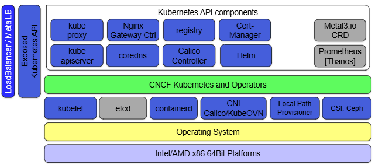

# Infrastructure Deployment Demo



The full scale Genestack infrastructure is bound to change over time, however, the idea is to keep things simple and transparent. The above graphic highlights how we deploy our environments and what the overall makeup of our platforms are expected to look like.

When you're building the cloud, many of the underlying infrastructure components have a deployment choice of `base` or `aio`.

- `base` creates a production-ready environment that ensures an HA system is deployed across the hardware available in your cloud.
- `aio` creates a minimal cloud environment which is suitable for test, which may have low resources.

Bức hình này mô tả **kiến trúc hạ tầng Kubernetes mà Genestack mong đợi/chạy trên đó**, theo kiểu xếp lớp từ **phần cứng → OS → Kubernetes core → các addon/operator → API & ingress/load balancer**.

```text
┌─────────────────────────────────────┐
│ LoadBalancer / MetalLB              │
│ Exposed Kubernetes API              │
├─────────────────────────────────────┤
│ Kubernetes API components/add-ons   │
│ kube-proxy, CoreDNS, Helm, ...      │
├─────────────────────────────────────┤
│ CNCF Kubernetes and Operators       │
├─────────────────────────────────────┤
│ kubelet / etcd / containerd / CNI   │
│ Local Path / CSI Ceph               │
├─────────────────────────────────────┤
│ Operating System                    │
├─────────────────────────────────────┤
│ Intel/AMD x86_64 hardware           │
└─────────────────────────────────────┘
```

## 1. Dưới cùng: phần cứng

```text
Intel/AMD x86 64 Bit Platforms
```

Đây đơn giản là máy vật lý hoặc VM chạy kiến trúc x86_64.

Ví dụ:

```text
Bare metal
hoặc
VM trên OpenStack / VMware
```

---

## 2. Operating System

```text
Operating System
```

Đây là OS của node Kubernetes.

Nếu đi nhánh Kubespray:

```text
Ubuntu
↓
Kubespray
↓
Kubernetes
```

Nếu đi nhánh Talos:

```text
Talos Linux
↓
Kubernetes
```

Nên hình này cố tình ghi generic là **Operating System**, vì phía trên mới là Kubernetes.

---

# 3. Lớp Kubernetes node/core
```text
kubelet
etcd
containerd
CNI Calico/KubeOVN
Local Path Provisioner
CSI: Ceph
```

Đây là các thành phần nền tảng để Kubernetes thực sự chạy.

### `kubelet`

Chạy trên từng node.

Nhiệm vụ:

```text
Kubernetes API
     ↓
kubelet
     ↓
container runtime
     ↓
Pod/container
```

Nó nhận yêu cầu kiểu:

> “Node này phải chạy Pod A, B, C”

rồi đảm bảo chúng tồn tại.

---

### `etcd`

Database trạng thái của Kubernetes.

Nó lưu:

```text
Pods
Nodes
Secrets
ConfigMaps
Deployments
Services
...
```

### `containerd`

Container runtime.

```text
kubelet
   ↓
containerd
   ↓
container
```

Nó là thằng thực sự pull image, start/stop container.

---

### `CNI Calico/KubeOVN`

Đây là networking cho Pod.

```text
Pod A
   ↓
CNI
   ↓
Pod B
```

CNI đảm nhiệm những thứ như:

```text
Pod IP
routing
overlay
network policy
```

Trong hình họ ghi:

```text
Calico / KubeOVN
```

nghĩa là có thể dùng một trong các CNI này.

Với lab Talos của bạn, bạn đang dùng **Kube-OVN**, nên ô này chính là phần rất quen. 

---

### `Local Path Provisioner`

Đây là storage provisioner đơn giản cho Kubernetes.

Khi PVC được tạo:

```text
PVC
 ↓
StorageClass
 ↓
Local Path Provisioner
 ↓
local disk trên node
```

Phù hợp cho:

```text
lab
dev
non-HA storage
```

Bạn cũng từng dùng `rancher/local-path-provisioner`, nên đúng là cùng khái niệm này. 

---

### `CSI: Ceph`

Đây là persistent storage kiểu distributed/production hơn.

```text
Pod
 ↓
PVC
 ↓
CSI
 ↓
Ceph
```

Nếu Local Path là:

```text
local disk
```

thì Ceph là:

```text
distributed storage cluster
```

và phù hợp với OpenStack hơn nhiều khi cần HA.

---

# 4. `CNCF Kubernetes and Operators`

Thanh xanh:

```text
CNCF Kubernetes and Operators
```

ý là phía trên core Kubernetes, Genestack dựa vào một hệ sinh thái operator/controller/addon để vận hành cluster.

Nó không phải một chương trình cụ thể.

Nó giống lớp logic:

```text
Kubernetes primitives
+
Operators
+
Controllers
+
CRDs
```

để quản lý các thành phần phức tạp.

---

# 5. Kubernetes API components

Phần phía trên có:

```text
kube proxy
Nginx Gateway Ctrl
registry
Cert-Manager

kube apiserver
coredns
Calico Controller
Helm
```

Đây là các service/addon của Kubernetes cluster.

---

### `kube-apiserver`

Đây là **cửa chính của Kubernetes**.

Khi bạn chạy:

```bash
kubectl get pods
```

thì:

```text
kubectl
  ↓
kube-apiserver :6443
  ↓
Kubernetes
```

---

### `kube-proxy`

Thường xử lý Service networking.

Ví dụ:

```text
Service IP
   ↓
kube-proxy rules
   ↓
Pod
```

Tùy CNI/implementation, vai trò thực tế có thể thay đổi hoặc được thay thế.

---

### `CoreDNS`

DNS nội bộ Kubernetes.

Ví dụ Pod truy cập:

```text
keystone-api.openstack.svc.cluster.local
```

CoreDNS resolve tên đó ra Service IP.

---

### `Nginx Gateway Ctrl`

Gateway/Ingress controller.

Nó nhận traffic từ ngoài vào cluster:

```text
User
 ↓
Gateway/Ingress
 ↓
Service
 ↓
Pod
```

---

### `registry`

Container image registry.

Dùng để lưu:

```text
Docker/OCI images
```

Ví dụ:

```text
nova image
neutron image
keystone image
```

để cluster pull về chạy.

---

### `Cert-Manager`

Tự động quản lý TLS certificate.

Ví dụ:

```text
skyline.example.com
keystone.example.com
```

Cert-manager có thể:

```text
request cert
renew cert
manage Secret
```

và kết hợp Let's Encrypt.

---

### `Calico Controller`

Nếu dùng Calico thì đây là controller quản lý networking/policy của Calico.

Nếu dùng Kube-OVN thì đương nhiên stack controller sẽ khác.

Hình này là kiểu architecture tổng quát nên họ vẽ Calico controller.

---

### `Helm`

Helm là package manager của Kubernetes.

Genestack dùng Helm để triển khai rất nhiều component.

Ví dụ:

```text
Helm chart
   ↓
Deployment
Service
ConfigMap
Secret
DaemonSet
...
```

---

# 6. MetalLB

Bên phải có:

```text
Metal3.io CRD
Prometheus [Thanos]
```

và bên trái:

```text
LoadBalancer / MetalLB
```

### MetalLB

Nếu Kubernetes chạy bare metal/private cloud, bạn không có AWS ELB hay OpenStack Octavia tự động cho mỗi `Service type=LoadBalancer`.

MetalLB làm:

```text
Service type LoadBalancer
        ↓
MetalLB
        ↓
IP từ pool
```

Ví dụ:

```text
192.168.100.50
```

được cấp làm VIP.

Trong Genestack lab bạn vừa đọc, họ nói:

```text
VIP address internally ... within MetalLB
```

thì chính là phần này.

---

# 7. `Exposed Kubernetes API`

Thanh dọc bên trái:

```text
Exposed Kubernetes API
```

nghĩa là Kubernetes API được expose ra ngoài cluster để admin/tool truy cập.

Ví dụ:

```text
Laptop/Bastion
    ↓
https://controller:6443
    ↓
kube-apiserver
```

Nên `kubectl` mới điều khiển cluster từ bên ngoài được.

---

# 8. `LoadBalancer / MetalLB`

Thanh ngoài cùng:

```text
LoadBalancer / MetalLB
```

nghĩa là các service cần public/internal VIP được expose qua LB.

Ví dụ:

```text
Keystone
Skyline
Glance
Nova API
```

có thể đi theo:

```text
Client
  ↓
VIP / LoadBalancer
  ↓
Gateway
  ↓
Kubernetes Service
  ↓
Pod
```

---

# 9. `Metal3.io CRD`

`Metal3` thường dùng cho bare-metal lifecycle/provisioning.

Nó đem khái niệm kiểu:

```text
BareMetalHost CRD
```

vào Kubernetes.

Ví dụ Kubernetes có thể quản lý:

```text
physical server provisioning
BMC/IPMI/Redfish
PXE provisioning
```

Không phải mọi lab đều cần nó.

---

# 10. Prometheus / Thanos

Đây là monitoring.

```text
Kubernetes/OpenStack components
        ↓
metrics
        ↓
Prometheus
        ↓
Thanos
```

Prometheus thu metrics.

Thanos thường bổ sung:

```text
long-term storage
HA
global query
multi-cluster
```

---

# Toàn bộ hình này thực ra muốn nói gì?

Nó đang nói:

> **Genestack không chạy trực tiếp trên Linux. Nó cần một Kubernetes platform hoàn chỉnh bên dưới, có compute runtime, CNI, storage, DNS, certificates, load balancing, monitoring...**

Có thể diễn giải thành:

```text
Hardware
   ↓
OS
   ↓
containerd + kubelet + etcd
   ↓
CNI + CSI
   ↓
Kubernetes
   ↓
DNS / Cert / Gateway / Helm / LB / Monitoring
   ↓
Genestack
   ↓
OpenStack
```

Và điều đáng chú ý là **hình này gần như mô tả phần nền mà bạn đang tự dựng trước khi cài OpenStack-Helm**:

```text
Talos
 ↓
Kubernetes
 ↓
Kube-OVN
 ↓
Local Path
 ↓
Helm
 ↓
OpenStack-Helm
```

Nó chỉ là một architecture tổng quát hơn, thêm MetalLB, Cert-Manager, Prometheus, Ceph, gateway/controller... vào cho gần một platform hoàn chỉnh hơn.