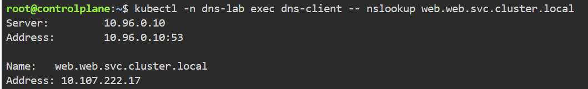
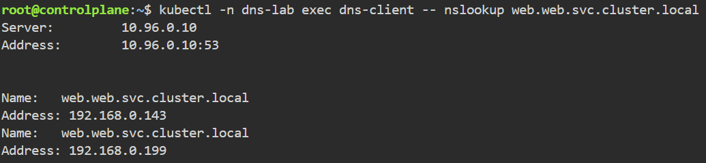

### 1. In the namespace named `012963bd` , create a pod named `az1-pod` which uses the `busybox:1.28` image. This pod should use node affinity, and prefer during scheduling to be placed on the node with the label `availability-zone=zone1` with a weight of 80. Also, have that same pod prefer to be scheduled to a node with the label availability-zone=zone2 with a weight of 20.

> NOTE: Make sure the container remains in a running state. Ensure that the pod is scheduled to the controlplane node.

```bash
kubectl create namespace 012963bd
kubectl get namespace 
```
```bash
kubectl get nodes -A
```
```bash
kubectl label node controlplane availability-zone=zone1 --overwrite
kubectl label node node01 availability-zone=zone2 --overwrite
```
```bash
echo <<'EOF_MANIFEST' > az1-pod.yaml
apiVersion: v1
kind: Pod
metadata:
    name: az1-pod
    namespace: 012963bd
spec:
    affinity:
        nodeaffinity:
            preferredDuringSchedulingIgnoredDuringExecution:
            - weight: 80
              preference:
                matchExpressions:
                - key: availability-zone
                  operator: In
                  values:
                  - zone1
            - weight: 20
              preference:
                matchExpressions:
                - key: availability-zone
                  operator: In
                  values:
                  - zone2
    containers:
    - name: main
      image: busybox:1.28
      command: ["sh","-c","sleep 3600"]
    restartPolicy: Never
EOF_MANIFEST
```

### 2. Create a expose nodeport port=8080 targetport=8080:
```bash
kubectl expose deployment java-hello --port=8080 --targetport=8080 --type=NodePort 
kubectl expose deploy custom-nginx --port=80 --type=NodePort --name=<thenameofthenewlycreatedobject>
```

## 3. Explain affinity
```bash
kubectl explain pod.spec.affinity.nodeAffinity --recursive
```
- `--recursive`: nghĩa là đi sâu xuống tất cả các field con.

## 4. Create a pod named redis-pod that uses the image redis:7 and exposes port 6379 . Use the command redis-server /redis-master/redis.conf to store redis configuration data and store this in an emptyDir volume. Mount the redis-config configmap data to the pod for use within the container.

```bash
kubectl run redis-pod --image=redis:7 --port 6379 --command 'redis-server' '/redis-master/redis.conf' --dry-run=client -o yaml > redis-pod.yaml
```
```yaml
apiVersion: v1
kind: Pod
metadata:
  name: redis-pod
spec:
  initContainers:
  - name: init-redis-config
    image: busybox:1.36
    command:
    - sh
    - -c
    - |
      set -e
      cat <<EOF >/redis-master/redis.conf
      maxmemory $(cat /configmap/maxmemory)
      maxmemory-policy $(cat /configmap/maxmemory-policy)
      EOF
    volumeMounts:
    - name: redis-config
      mountPath: /redis-master
    - name: redis-config-map
      mountPath: /configmap
      readOnly: true
  containers:
  - name: redis
    image: redis:7
    command:
    - redis-server
    - /redis-master/redis.conf
    ports:
    - containerPort: 6379
    volumeMounts:
    - name: redis-config
      mountPath: /redis-master
    - name: redis-data
      mountPath: /redis-data
  volumes:
  - name: redis-config-map
    configMap:
      name: redis-config
  - name: redis-config
    emptyDir: {}
  - name: redis-data
    emptyDir: {}
```

## 5. Update deployment 
```bash
kubectl set 
```
## 6. Delete all pod but keep ns intact
```bash
kubectl delete pods --all
```

## 7. List all pods in the session283884 namespace sorted by restart count in descending order.
```bash
kubectl -n session283884 get pods --sort-by=.status.containerStatuses[0].restartCount
```

## 8. Command
- Cu phap:
```bash
--command -- <command> <arg1> <arg2> ...
```
- Vi du
```bash
kubectl run sleeper -n session283884 --image=busybox --command -- sh -c "sleep 3600"
```

## 9. Create a pod in the session283884 namespace with a preStop lifecycle hook that sleeps for 10 seconds before termination. Use image nginx .
```yaml
apiVersion: v1
kind: Pod
metadata:
  name: prestop
spec:
  containers:
  - name: nginx
    image: nginx
    lifecycle:
      preStop:
        exec:
          command: ["sleep", "10"]
```
## 10. add labels
```bash
kubectl label pod nginx app=web tier=frontend
kubectl label node nginx app=web tier=frontend
```

## 11. List all pods in session283884 namespace grouped by node they are scheduled on.
```bash
kubectl get po -n .... --sort-by=.spec.nodeName
```

## 12. Create a one-time Job
```bash
kubectl -n session283884 create job oneshot --image=busybox -- command -- sh -c "echo Hello CKAD"
```

```yaml
apiVersion: batch/v1
kind: Job
metadata:
  name: countdown
spec:
  template:
    metadata:
      name: countdown
    spec:
      containers:
      - name: counter
        image: centos: 7
        command:
        - sh
        - -c
        - "for i in 9 8 7 6 5 4 3 2 1; do echo $i ; done"
      restartPolicy: Never
```

## 13. Secret as env vars
```yaml
apiVersion: v1
kind: Pod
metadata:
  name: pod1
spec:
  containers:
  - name: containers
    image: nginx
    env:
    - name: vuive1
      valueFrom:
        secretKeyRef:
          name: db-secret
          key: ref1
```
```yaml
apiVersion: v1
kind: Pod
metadata:
  name: limited
  namespace: testckad
spec:
  containers:
  - name: nginx
    image: nginx
    resources:
      requests:
        memory: "64Mi"
        CPU: "100m"
      limits:
        memory: "128Mi"
        CPU: "200m"
```

## 14. ReadinessProbe
```yaml
apiVersion: v1
kind: Pod
metadata:
  name: nginx-ready
  namespace: session283884
spec:
  containers:
  - name: nginxcontainer
    image: nginx
    readinessProbe:
      httpGet:
        path: /
        port: 80
      initialDelaySeconds: 3
      periodSeconds: 10
      successThreshold: 3
```

## 15. Forward Port
```bash
kubectl port-forward pod/nginx-pf 8080:80
```

## 16. Attach ephemeral container for debug
- Container busybox nay chi ton tai tam thoi de minh test, debug thoi no khong ton tai vinh vien ~~
```bash
debug -it nginx --image=busybox --target=nginx
```
```
kubectl debug
    ↓
thêm ephemeral container
    ↓
debug
    ↓
exit
    ↓
ephemeral container terminated
    ↓
không restart
```

## 17. Xem tong so container trong 1 Pod
```bash
kubectl get pod nginx -o jsonpath='{.spec.containers[*].name}'
```

## 18. Update config Map or rotate Secret
Tạo 1 configMap:
```bash
kubectl -n session283884 create secret generic db-pass --from-literal=password=oldpass
```
- Mount vào trong Pod
- Rotate
```bash
kubectl -n session283884 create secret generic db-pass --from-literal=password=newpass -o yaml --dry-run=client | kubectl apply -f -
```

## 19. Set Default CPU/Memory Limits
```yaml
apiVersion: v1
kind: LimitRange
metadat:
  ...
spec:
  limits:
  - type: Container
    default:
      cpu: 200m
      memory: 128Mi
    defaultRequest:
      cpu: 100m
      memory: 64Mi
```
- Truong default va defaultRequest khong the dung type:Pod
```yaml
apiVersion: v1
kind: LimitRange
metadata:
  name: limit-range
spec:
  limits:
  - type: Pod
    max:
      memory: 512Mi
      cpu: 1
```

## 20. ServiceAccount
ServiceAccount (viết tắt là SA) trong Kubernetes là một tài nguyên dùng để cấp danh tính (identity) và quyền truy cập cho ứng dụng/Pod khi nó cần tương tác với Kubernetes API Server.

User Account (Tài khoản người dùng): Dành cho con người (Developer, Admin, DevOps) đăng nhập để quản lý cluster (thường qua kubectl).

ServiceAccount (Tài khoản dịch vụ): Dành cho phần mềm / Pod / Container đang chạy bên trong cluster (ví dụ: Nginx Ingress, CI/CD runner, Prometheus...).
- ServiceAccount = "Thẻ căn cước" của Pod/Ứng dụng trong Kubernetes.

``bash
kubectl -n session283884 create serviceaccount build-bot
```

```yaml
apiVersion: v1
kind: Pod
metadata:
  name: podcreate
spec:
  serviceAccountName: build-bot
  containers:
  - name: vuive
    image: busybox
    command:
    - sh
    - -c
    - sleep 3600
```

## 21. Role and RoleBinding
```bash
kubectl -n session283884 create role pod-reader --verb=get,list,watch --resource=pods
kubectl -n session283884 create rolebinding read-pods-binding --role=pod-reader --serviceaccount=session283884:build-bot
```

### Create a Role in the session283884 namespace that restricts deleting pods and test access with `kubectl auth can-i` .
```bash
kubectl -n session283884 create role no-delete-pods --verb=get,list --resource=pods
```
```bash
kubectl -n session283884 create rolebinding deny-delete-binding --role=no-delete-pods --serviceaccount=session283884:build-bot
```
```bash
kubectl -n session283884 auth can-i delete pods --as=system:serviceaccount:session283884:build-bot
```

### 22. Drop Linux Capabilities
```bash
apiVersion: v1
kind: Pod
metadata:
  name: test
  namespace: session283884
spec:
  containers:
  - name: nginx
    image: nginx
    securityContext:
      capabilites:
        drop: "All"
```

### 23. PodSecurity Restricted Namespace
```bash
kubectl label ns session283884 pod-security.kubernetes.io/enforce=restricted
```
```yaml
apiVersion: v1
kind: Pod
metadata:
  name: sajdk
  namespace: session283884
spec:
  containers:
  - name: jdasd
    image: nginx
    securityContext:
      privileged: true
```

### 24. Deny All Ingress
```yaml
apiVersion: v1
kind: Namespace
metadata:
  name: payments
---
apiVersion: apps/v1
kind: Deployment
metadata:
  name: api
  namespace: payments
spec:
  replicas: 2
  selector:
    matchLabels:
      app: api
  template:
    metadata:
      labels:
        app: api
    spec:
      containers:
      - name: nginx
        image: nginx:1.25
        ports:
        - containerPort: 80
---
apiVersion: v1
kind: Service
metadata:
  name: api
  namespace: payments
spec:
  selector:
    app: api
  ports
  - port: 80
    targetPort: 80
---
apiVersion: apps/v1
kind: Deployment
metadata:
  name: worker
  namespace: payments
spec:
  replicas: 1
  selector:
    matchLabels:
      app: worker
  template:
    metadata:
      labels:
        app: worker
    specs:
      containers:
      - name: busybox
        image: busybox:1.36
        command:
        - sh
        - -c
        - sleep 3600
```

## 25. AllowNameSpace Traffic
```yaml
apiVersion: v1
kind: NetworkPolicy
metadata:
  name: allow-namespace-traffic
  namespace: allow-ns
spec:
  podSelector:
    matchLabels:
      app=web
  policyTypes:
  - Ingress
  ingress:
  - from:
    - namespaceSelector:
        matchLabels:
          access: granted
    ports:
    - protocol: TCP
      port: 80
```

Allow Label-Based Traffic
```yaml
apiVersion: networking.k8s.io/v1
kind: NetworkPolicy
metadata:
  name: allow-label-traffic
  namespace: testckad
spec:
  podSelector:
    matchLabels:
      app: web
  policyTypes:
  - Ingress
  ingress:
  - from:
    - podSelector:
        matchLabels:
          access: granted
    ports:
    - protocol: TCP
      port: 80
```

```yaml
apiVersion: networking.k8s.io/v1
kind: NetworkPolicy
metadata:
  name: allow-only-port
  namespace: allow-port
spec:
  podSelector:
    matchLabels:
      app: api
  policyTypes:
  - Ingress
  ingress:
    ports:
    - port: 80
      protocol: TCP 
    from: 
    - podSelector: {} 
```
> **Lưu ý**: 
-  `from`: danh sách nguồn được phép
- `podSelector: {}`: mọi Pod trong Namespace hiện tại
- Nếu xóa 2 dòng cuối này đi nghĩa là mọi traffic từ bất kỳ nguồn nào. Còn ghi như này nghĩa là chỉ traffic trong Namespace.

```yaml
apiVersion: networking.k8s.io/v1
kind: NetworkPolicy
metadata:
  name: block-egress
  namespace: block-egress
spec:
  podSelector:
    matchLabels:
      app: api
  policyTypes:
  - Ingress
  - Egress
  ingress:
  - ports:
    - protocol: TCP
      port: 80
    from:
    - podSelector: {}
  egress: []
```

## 26. Headless Service 
- Service không có ClusterIP
- Nó dùng khi bạn không muốn Kubernetes đưa cho mình một IP đại diện, mà muốn client nhìn thấy trực tiếp IP của các Pod phía sau Service.
- Ví dụ:

```yaml
apiVersion: v1
kind: StatefulSet
metadata:
  name: web
  namespace: stateful-demo
spec:
  serviceName: web
  replicas: 3
  seletor:
    matchLabels:
      app: web
  template:
    metadata:
      labels:
        app: web
    spec:
      serviceAccountName: web-sa
      containers:
      - name: nginx
        image: nginx:1.25
        ports
        - containerPort: 80
```

```yaml
apiVersion: v1
kind: Service
metadata:
  name: api
spec:
  clusterIP: None
  selector:
    app: api
  ports:
    - port: 80
```

## 27. Test DNS Resolution
```bash
kubectl create namespace dns-lab
kubectl create namespace web
```
```yaml
apiVersion: v1
kind: Pod
metadata:
  name: dns-client
  namespace: dns-lab
spec:
  containers:
  - name: dns-lab
    image: busybox:1.36
    command:
    - sh
    - -c
    - sleep 3600
---
apiVersion: v1
kind: Service
metadata:
  name: web
  namespace: web
spec:
  selector:
    app: web
  ports:
  - port: 80
    targetPort: 80
```
- Test
```bash
kubectl -n dns-lab exec dns-client -- nslookup web
```
- Fail because namespace different
```bash
kubectl -n dns-lab exec dns-client --nslookup web.web.svc.cluster.local
```


- Convert to headless service and resolve pod
```bash
kubectl -n web delete service web
kubectl -n web expose deployment web --name=web --port=80 --cluster-ip=None
```
- Test:
```bash
kubectl -n dns-lab exec dns-client -- nslookup web.web.svc.cluster.local
```


## 28. ExternalName Service
```yaml
apiVersion: v1
kind: Service
metadata:
  name: external-search
  namespace: externalname-demo
spec:
  type: ExternalName
  externalName: www.google.com
```

## 29. Create an Ingress named `web-ingress` that routes `web.example.com` to a service named `web`
```yaml
apiVersion: networking.k8s.io/v1
kind: Ingress
metadata:
  name: web-ingress
  namespace: ingress-host-routing
spec:
  ingressClassName: nginx
  rules:
  - host: web.example.com
    http:
      paths:
      - path: /
        pathType: Prefix
        backend:
          service:
            name: web
            port:
              number: 80
```
```bash
kubectl -n ingress-host-routing get ingress web-ingress
```
```bash
NODE_IP=$(kubectl get nodes -o jsonpath='{range .items[*]}{.status.addresses[?(@.type=="InternalIP")].address}{"\n"}{end}')
curl -I -H 'Host: web.example.com' http://$NODE_IP:30000/
```

## 30. Ingress with TLS
- Create a cert.
```bash
openssl req -x509 -nodes -days 365 -newkey rsa:2048 -keyout tls.key -out tls.crt \
  -subj "/CN=tls.example.com/O=Example Org"
```
- Create secret for cert.
```bash
kubectl -n ingress-tls create secret tls tls-secret --cert=tls.crt --key=tls.key
```
```bash
kubectl -n ingress-tls create deploy web --image=nginx:1.25 --port=80
kubectl -n ingress-tls expose deploy web --port=80 --target-port=80
cat <<'EOF2' | kubectl apply -f -
apiVersion: networking.k8s.io/v1
kind: Ingress
metadata:
  name: web-ingress
  namespace: ingress-tls
spec:
  ingressClassName: nginx
  tls:
  - hosts:
    - tls.example.com
    secretName: tls-secret
  rules:
  - host: tls.example.com
    http:
      paths:
      - path: /
        pathType: Prefix
        backend:
          service:
            name: web
            port:
              number: 80
EOF2
```
```bash
kubectl -n ingress-tls get ingress web-ingress -o yaml | sed -n '1,40p'
```
- Test
```bash
NODE_IP=$(kubectl get nodes -o jsonpath='{range .items[*]}{.status.addresses[?(@.type=="InternalIP")].address}{"\n"}{end}')
curl -kI -H 'Host: tls.example.com' https://$NODE_IP:30443/
```

## 31. Ingress Install
```bash
# apply the official manifest
kubectl apply -f https://raw.githubusercontent.com/kubernetes/ingress-nginx/main/deploy/static/provider/cloud/deploy.yaml
```
```bash
# wait for the controller pod to be ready
kubectl -n ingress-nginx rollout status deploy/ingress-nginx-controller --timeout=180s
```
```bash
# list controller pods
kubectl -n ingress-nginx get pods -l app.kubernetes.io/component=controller
```
```bash
# inspect the service exposing the controller
kubectl -n ingress-nginx get svc ingress-nginx-controller
```
Note: In the Killercoda environment the EXTERNAL-IP column displays <pending> permanently, because there is no external load balancer available. Use the NodePort listed in the service instead when you need to access the controller.
```bash
# change the service type to NodePort so it is reachable
kubectl -n ingress-nginx patch svc ingress-nginx-controller -p '{"spec":{"type":"NodePort","ports":[{"name":"http","port":80,"protocol":"TCP","targetPort":80,"nodePort":30000},{"name":"https","port":443,"protocol":"TCP","targetPort":443,"nodePort":30443}]}}'
```
```bash
# confirm the NodePort that was allocated
kubectl -n ingress-nginx get svc ingress-nginx-controller -o wide
```
```bash
# just the INTERNAL-IP column for quick reference
NODE_IP=$(kubectl get nodes -o jsonpath='{range .items[*]}{.status.addresses[?(@.type=="InternalIP")].address}{"\n"}{end}')
```
```bash
# sample backend to exercise the controller
kubectl create deploy demo --image=nginx:1.25 --port=80
kubectl expose deploy demo --port=80 --target-port=80
cat <<'EOF' | kubectl apply -f -
apiVersion: networking.k8s.io/v1
kind: Ingress
metadata:
  name: demo
  namespace: default
spec:
  ingressClassName: nginx
  rules:
  - host: demo.local
    http:
      paths:
      - path: /
        pathType: Prefix
        backend:
          service:
            name: demo
            port:
              number: 80
EOF
```
```bash
# hit the ingress with the Host header
curl -I -H 'Host: demo.local' http://$NODE_IP:30
```

## 32. Canary Ingress
```bash
# Solution commands for canary-ingress
cat <<'EOF' | kubectl apply -f -
apiVersion: v1
kind: Namespace
metadata:
  name: canary-ingress
---
apiVersion: apps/v1
kind: Deployment
metadata:
  name: web
  namespace: canary-ingress
spec:
  replicas: 2
  selector:
    matchLabels:
      app: web
  template:
    metadata:
      labels:
        app: web
    spec:
      containers:
      - name: echo
        image: hashicorp/http-echo:0.2.3
        args:
        - "-text=web"
        ports:
        - containerPort: 5678
---
apiVersion: apps/v1
kind: Deployment
metadata:
  name: web-v2
  namespace: canary-ingress
spec:
  replicas: 1
  selector:
    matchLabels:
      app: web-v2
  template:
    metadata:
      labels:
        app: web-v2
    spec:
      containers:
      - name: echo
        image: hashicorp/http-echo:0.2.3
        args:
        - "-text=web-v2"
        ports:
        - containerPort: 5678
---
apiVersion: v1
kind: Service
metadata:
  name: web
  namespace: canary-ingress
spec:
  selector:
    app: web
  ports:
  - port: 80
    targetPort: 5678
---
apiVersion: v1
kind: Service
metadata:
  name: web-v2
  namespace: canary-ingress
spec:
  selector:
    app: web-v2
  ports:
  - port: 80
    targetPort: 5678
EOF
```
```bash
# primary ingress sending 100% of traffic to web
cat <<'EOF' | kubectl apply -f -
apiVersion: networking.k8s.io/v1
kind: Ingress
metadata:
  name: web
  namespace: canary-ingress
  annotations:
    nginx.ingress.kubernetes.io/rewrite-target: /
spec:
  ingressClassName: nginx
  rules:
  - host: canary.local
    http:
      paths:
      - path: /
        pathType: Prefix
        backend:
          service:
            name: web
            port:
              number: 80
EOF
```
```bash
# canary ingress sending 10% of traffic to web-v2
cat <<'EOF' | kubectl apply -f -
apiVersion: networking.k8s.io/v1
kind: Ingress
metadata:
  name: web-canary
  namespace: canary-ingress
  annotations:
    nginx.ingress.kubernetes.io/canary: "true"
    nginx.ingress.kubernetes.io/canary-weight: "10"
spec:
  ingressClassName: nginx
  rules:
  - host: canary.local
    http:
      paths:
      - path: /
        pathType: Prefix
        backend:
          service:
            name: web-v2
            port:
              number: 80
EOF
```
```bash
# busybox client to probe ingress responses
kubectl -n canary-ingress run curl --image=busybox:1.36 --restart=Never --command -- sh -c "while true; do wget -qO- http://canary.local && sleep 1; done"
```
```bash
# stream several responses to observe ~90/10 split
kubectl -n canary-ingress logs -f curl
```

## 33. Ingress Path Rewriting
```bash
kubectl create namespace ingress-path-rewrite
kubectl -n ingress-path-rewrite create deploy web --image=nginx:1.25 --port=80
kubectl -n ingress-path-rewrite expose deploy web --port=80 --target-port=80
```
```bash
cat <<'EOF2' | kubectl apply -f -
apiVersion: networking.k8s.io/v1
kind: Ingress
metadata:
  name: web-ingress
  namespace: ingress-path-rewrite
  annotations:
    nginx.ingress.kubernetes.io/rewrite-target: /
spec:
  ingressClassName: nginx
  rules:
  - host: rewrite.example.com
    http:
      paths:
      - path: /app
        pathType: Prefix
        backend:
          service:
            name: web
            port:
              number: 80
EOF2
```
```bash
kubectl -n ingress-path-rewrite get ingress web-ingress
```
```bash
# just the INTERNAL-IP column for quick reference
NODE_IP=$(kubectl get nodes -o jsonpath='{range .items[*]}{.status.addresses[?(@.type=="InternalIP")].address}{"\n"}{end}')
curl -I -H 'Host: rewrite.example.com' http://$NODE_IP:30000/app
```