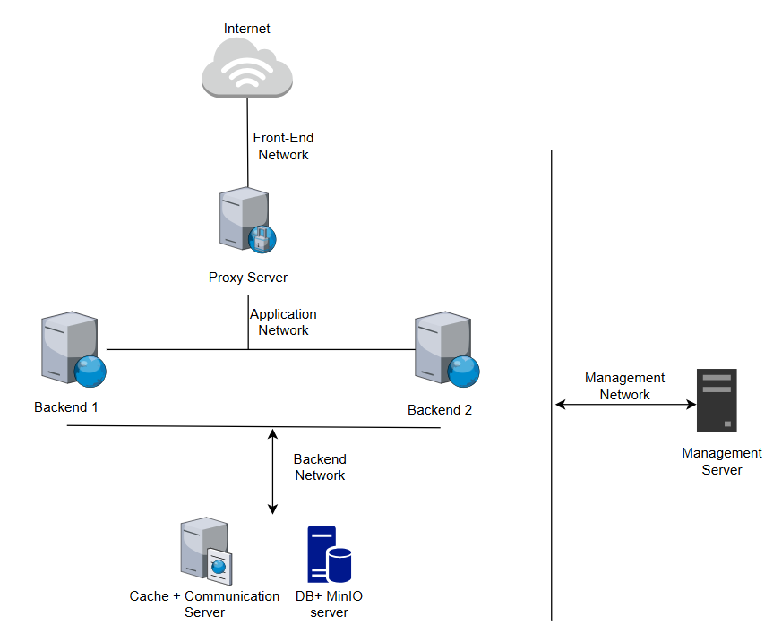

# Kiến Trúc Triển Khai Hệ Thống Flasky

## 1. Mô Hình Triển Khai (Deployment Model)

Tổng số lượng: **6 VMs** 

| VM / Thành phần | Số lượng | Mô tả chức năng |
| --- | --- | --- |
| **Load Balancer & Gateway** | 1 | Cân bằng tải, tiếp nhận và điều hướng traffic |
| **Backend** | 2 | Chạy ứng dụng web, xử lý logic, giảm tắc nghẽn traffic |
| **Database** | 1 | Lưu trữ dữ liệu hệ thống *(Lưu ý: Môi trường Production thực tế cần 1 Database Cluster)* |
| **Management & Ops Server** | 1 | Tích hợp các dịch vụ nền tảng và vận hành hệ thống: • **Cache & Queue:** Quản lý cache (Redis) & Giao tiếp bất đồng bộ (RabbitMQ)  • **Backup Script:** Tự động sao lưu dữ liệu, phòng chống sự cố | 
| **Monitoring:** | 1 | Theo dõi, giám sát & quản lý tài nguyên hệ thống  • **CI/CD:** Tự động hóa đóng gói, kiểm thử & triển khai phần mềm |

## 2. Cấu Hình Hệ Điều Hành (OS Configurations)

Các tham số cấu hình chung dưới đây được áp dụng đồng bộ cho các máy trong hệ thống.

| Thông số / Service        | Cấu hình áp dụng                                                 |
| ------------------------- | ---------------------------------------------------------------- |
| **Hệ điều hành (OS)**     | Ubuntu Server 22.04.5 LTS (Jammy Jellyfish)                      |
| **Timezone**              | Asia/Ho_Chi_Minh (UTC+7)                                         |
| **Time Synchronization**  | Chrony                                                           |
| **Locale**                | C.UTF-8                                                          |
| **Hostname**              | Theo vai trò của từng máy (proxy, app01, app02, db, monitor,...) |
| **DNS Server**            | 8.8.8.8                                                          |
| **SSH Server**            | OpenSSH Server                                                   |
| **Firewall**              | Iptables                                                         |
| **Swap**                  | Disable                                                          |
| **System Update**         | apt update && apt upgrade (Update mới nhất ngày 20/07/2026)      |
| **Docker**         | docker cli, docker engine bản 29.6.0-1~ubuntu.22.04~jammy, containerd.io, docker-buildx-plugin, docker-compose-plugin                                      |

## 3. Những phần mềm cài đặt trên từng máy
### 3.1 Load Balancer
- HA Proxy 
- Openssh client
### 3.2 Web1+2
- Nginx
- Openssh client
### 3.3 DB+MinIO
- Openssh cli
Database
- MariaDB

Backend Storage 1 trong 2 phương án dưới đây:

- NFS Share:
- MinIO
### 3.4 Redis
- Openssh cli
- Redis: lưu cache
### 3.5 Monitor quản lý 
- Prometheus
- Grafana
- Loki
- Zabbix(lựa chọn thay thế)
- Openssh Server

## 4. Network

| Services | IP Subnet | 
|----------|-----------|
| Public - Frontend | 10.0.10.0/24 | 
| Application | 10.0.20.0/24 | 
| Backend/Data | 10.0.30.0/24 | 
| Management | 10.0.40.0/24 |

Lý do phải chia Subnet: 
- Đảm bảo security, đường truyền của Flask server tới database không ai ngoài Flask và Server thấy được.
- Giảm broadcast domain, đặc biệt khi mạng lớn.
- QoS ưu tiên traffic
- Tối ưu vận hành
---

## 5. VM desin

| **VM** | **IP**|  **Memory**| **Processors** | **Hard Disk( bao gồm cả OS)** |
|---|----|----|---|--|
| LB | NIC 1: 10.0.10.10 - NIC 2: 10.0.20.19 - NIC 3: 10.0.40.36 | 2GB | 2 | 20GB (1 ổ sda) | 
| web1 | NIC 1: 10.0.20.20 - NIC 2: 10.0.30.28 - NIC 3: 10.0.40.37 | 2GB | 2 | 20GB (1 ổ sda)  |
| web2 | NIC 1: 10.0.20.21 - NIC 2: 10.0.30.29 - NIC 3: 10.0.40.38| 2GB | 2 | 20GB (1 ổ sda) |
| db | NIC 1: 10.0.30.30 - NIC 2: 10.0.40.39 | 2GB | 2 | 20GB (1 ổ sda) |
| Monitor | NIC 1: 10.0.40.40 | 3GB | 2 | 20GB (1 ổ sda) |

## 6. Port Matrix

LB:

| Source   | Destination | Port | Sử dụng cho   |
| -------- | ----------- | ---- | ------------- |
| Internet | HAProxy     | 443  | HTTPS         |
| HAProxy  | Flask       | 5000 | Reverse Proxy |
| Flask    | MariaDB     | 3306 | Database      |
| Flask    | Redis       | 6379 | Cache         |
| Monitor  | LB          |  22  | SSH           |

Web1 + 2:

| Source   | Destination | Port | Sử dụng cho   |
| -------- | ----------- | ---- | ------------- |
| HAProxy  | Flask       | 5000 | Reverse Proxy |
| Flask    | MariaDB  | 3306 | Database         |
| Flask    | Redis       | 6379 | Cache         |
| Flask    | RabbitMQ    | 5672 | Queue         |
| Monitor  | LB          |  22  | SSH           |

DB+MinIO Server:

| Source   | Destination | Port | Sử dụng cho   |
| -------- | ----------- | ---- | ------------- |
| Flask    | MariaDB  | 3306 | Database         |
| Monitor  | LB          |  22  | SSH           |
| Flask    | MinIO       | 9000 | Flask gọi API |
| Monitor    | MinIO       | 9001 | Quan trị MinIO |

Monitor:

| Source   | Destination | Port | Sử dụng cho   |
| -------- | ----------- | ---- | ------------- |
| Monitor  | LB          |  22  | SSH           |

